# 用 Spark 实现朴素贝叶斯分类器

> 原文：<https://medium.com/geekculture/naive-bayes-classifier-with-spark-561ff322d8?source=collection_archive---------6----------------------->

本文将通过一个很棒的例子引导您了解朴素贝叶斯分类器的基本实现。

> 本文包括了朴素贝叶斯分类器的一个基本实现，以及一个很好的例子，有助于更好地理解朴素贝叶斯分类器的理论和应用。


Photo by [Matt Buck](https://www.flickr.com/photos/mattbuck007/) on [Flickr](https://www.flickr.com/)

**朴素贝叶斯算法**

> 朴素贝叶斯算法是一种监督学习算法，它基于贝叶斯定理，用于解决分类问题。

**贝叶斯定理**

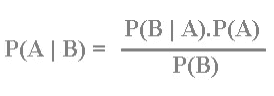

Naïve BayesEquation

*   a、B:事件
*   P(A)，P(B):A 和 B 的独立概率
*   P(A|B)是后验概率:给定事件 B 已经发生，事件 A 发生的概率。
*   P(B|A)是似然概率:给定事件 A 已经发生，事件 B 发生的概率。

**朴素贝叶斯分类器假设所有的特征都是互不相关的。一个特征的存在与否不影响任何其他特征的存在与否。**

# 朴素贝叶斯分类器示例

让我们通过这个例子来更好地理解朴素贝叶斯分类器。

假设我们有一个被盗车辆的数据集，如下所示。使用这个数据集，我们必须能够根据特定的品牌、颜色和时间来分类汽车是否被盗。

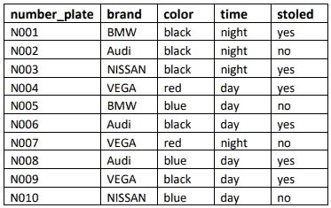

Dataset

让我们找出白天蓝色的 VEGA 车，能不能被偷。

> **我们假设所有的品牌、颜色和时间特征都是彼此不相关的**

让我们创建频率表和可能性表。

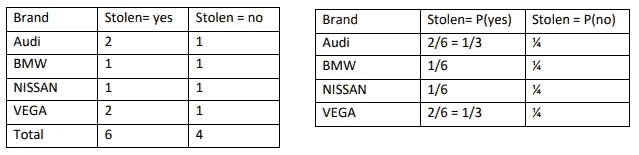

Frequency Table and Likelihood Table for Brand

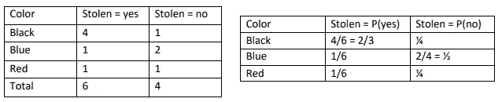

Frequency Table and Likelihood Table for Color

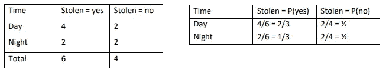

Frequency Table and Likelihood Table for Time

*   p(是)= 3/5
*   p(否)= 2/5

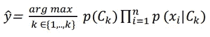

这里，

*   x =织女星，蓝色，白天
*   y =是，否

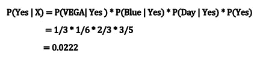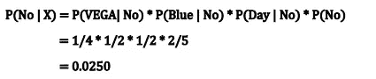

**0.0250 > 0.0222 *因此，这被归类为未被盗的“否”类。***

**这暗示蓝色织女星车在白天不会被盗。**

# **朴素贝叶斯分类器实现**

> Spark 自带 Python、Java、Scala 等支持语言。这里我们将使用 pyspark 来实现。

[**数据集**](https://www.kaggle.com/lasindudemel/vehicle-stolen-dataset) **:** 数据集是关于汽车被盗场景的，其属性为车牌、品牌、颜色、时间和被盗状态(数据集与上述示例的数据集相同)。

**步骤**中的朴素贝叶斯分类器实现

> 为了更好地理解，让我们一步一步地看代码，看看每一步的特定输出。

```
from pyspark.sql import SparkSession 
from pyspark.sql.functions import * 
from pyspark.ml import Pipeline 
from pyspark.ml.feature import VectorAssembler 
from pyspark.ml.feature import StringIndexer 
from pyspark.ml.classification import NaiveBayes 
from pyspark.ml.evaluation import MulticlassClassificationEvaluator# Read data from the vehicle_stolen_dataset.csv 
vehicle_data = pd.read_csv(“./vehicle_stolen_dataset.csv”, header=None) #Sets the Spark master URL to run locally. 
spark = SparkSession.builder.master("local[*]").getOrCreate() #Create DataFrame 
vehicle_df = spark.createDataFrame(vehicle_data) vehicle_df.show(5)
```

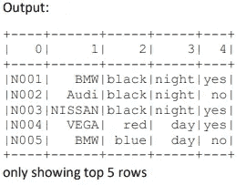

> 重命名列

```
 vehicle_df = vehicle_df.select(col("0").alias("number_plate"),  col("1").alias("brand"),  
col("2").alias("color"),  
col("3").alias("time"),  
col("4").alias("stoled"))
```

> 将标签的字符串列映射到标签索引的 ML 列。

```
indexers = [
StringIndexer(inputCol="brand", outputCol = "brand_index"),  
StringIndexer(inputCol="color", outputCol = "color_index"),  StringIndexer(inputCol="time", outputCol = "time_index"),  StringIndexer(inputCol="stoled", outputCol = "label")]pipeline = Pipeline(stages=indexers) #Fitting a model to the input dataset. 
indexed_vehicle_df = ipeline.fit(vehicle_df).transform(vehicle_df) indexed_vehicle_df.show(5,False) 
#We have given False for turn off default truncation 
```

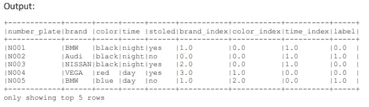

> 将列转换为特征

```
vectorAssembler = VectorAssembler(inputCols = [“brand_index”, “color_index”, “tim e_index”],outputCol = “features”) vindexed_vehicle_df = ectorAssembler.transform(indexed_vehicle_df) vindexed_vehicle_df.show(5, False)
```

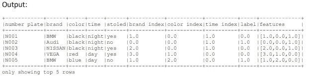

> 用于培训和测试的拆分

```
splits = vindexed_vehicle_df.randomSplit([0.6,0.4], 42) 
# optional value 42 is seed for sampling 
train_df = splits[0] 
test_df = splits[1]
```

> 应用朴素贝叶斯分类器

```
nb = NaiveBayes(modelType=”multinomial”)
```

> 训练模型

```
nbmodel = nb.fit(train_df)
```

> 让我们用测试数据来预测。

```
predictions_df = nbmodel.transform(test_df)
predictions_df.show(5, True)
```

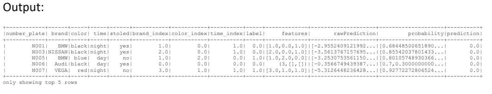

> 计算测试集的准确度

```
evaluator = MulticlassClassificationEvaluator(labelCol="label", predictionCol="pr ediction", metricName="accuracy") 
nbaccuracy = evaluator.evaluate(predictions_df) 
print("Test accuracy = " + str(nbaccuracy))
```

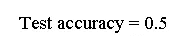

Final Output

# 结论

> 我的朴素贝叶斯分类器实现是为了更好地理解实现基础和理论，在为现实世界场景开发时，它需要许多改进和修改。

感谢您的阅读！快乐编码..

*你也可以找到完整的:*

*   *Colab 笔记本* [***此处***](https://colab.research.google.com/drive/18EcEjqhKp4WDG2LAeZAUtlu5igs969SA?usp=sharing)
*   *数据集* [***此处***](https://www.kaggle.com/lasindudemel/vehicle-stolen-dataset)