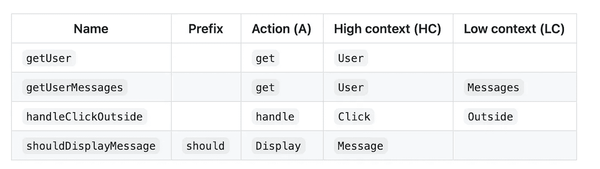

# 命名规则:计算机科学中最难的事情之一

> 原文：<https://medium.com/geekculture/naming-rules-one-of-the-hard-things-in-computer-science-643dba6a0e36?source=collection_archive---------9----------------------->


> 计算机科学中只有两个难题:缓存失效和命名事物 [菲尔·卡尔顿](https://www.defprogramming.com/quotes-by/phil-karlton/)

在[计算机编程](https://en.wikipedia.org/wiki/Computer_programming)中，**命名约定**是一组规则，用于选择用于[标识符](https://en.wikipedia.org/wiki/Identifier)的字符序列，这些标识符表示[变量](https://en.wikipedia.org/wiki/Variable_(computer_science))、[类型](https://en.wikipedia.org/wiki/Data_type)、[功能](https://en.wikipedia.org/wiki/Subroutine)以及[源代码](https://en.wikipedia.org/wiki/Source_code)和[文档](https://en.wikipedia.org/wiki/Software_documentation)中的其他实体。

使用命名约定的原因(相对于允许[程序员](https://en.wikipedia.org/wiki/Programmer)选择任何字符序列)包括以下几点:

*   减少阅读和理解源代码所需的工作量；[【1】](https://en.wikipedia.org/wiki/Naming_convention_(programming)#cite_note-1)
*   使代码评审能够关注比争论语法和命名标准更重要的问题。
*   使代码质量评审工具能够将他们的报告主要集中在语法和风格偏好之外的重要问题上。

命名惯例的选择可能是一个非常有争议的问题，每个党派的支持者都认为他们的是最好的，其他的是次等的。通俗地说，这是一个[教条](https://en.wikipedia.org/wiki/Dogma)的问题。[【2】](https://en.wikipedia.org/wiki/Naming_convention_(programming)#cite_note-2)很多公司也建立了自己的一套惯例。

# 潜在好处

采用命名约定可以获得的一些潜在好处包括:

*   提供关于标识符用途的附加信息(即[元数据](https://en.wikipedia.org/wiki/Metadata));
*   帮助在开发团队中正式化期望并促进一致性；
*   支持使用自动化[重构](https://en.wikipedia.org/wiki/Refactoring)或搜索和替换工具，将出错的可能性降至最低；
*   在可能含糊不清的情况下提高清晰度；
*   增强工作产品的美学和专业外观(例如，不允许过长的名称、滑稽或“可爱”的名称或缩写)；
*   帮助避免当不同组织的工作产品被组合时可能发生的“命名冲突”(参见:[命名空间](https://en.wikipedia.org/wiki/Namespaces))；
*   提供有意义的数据，用于需要提交程序源代码和所有相关文件的项目移交；
*   为了在长时间间隔后代码重用的情况下提供更好的理解。

# 挑战

命名惯例的选择(以及强制执行的程度)通常是一个有争议的问题，支持者认为他们的观点是最好的，而其他人的观点是次等的。此外，即使有了已知的和定义良好的命名约定，一些组织也可能无法始终如一地遵守它们，从而导致不一致和混乱。如果命名约定规则内部不一致、任意、难以记忆，或者被认为负担大于益处，这些挑战可能会加剧。

# 可读性

精心选择的标识符使开发者和分析师更容易理解系统正在做什么，以及如何修复或扩展[源代码](https://en.wikipedia.org/wiki/Source_code)以适应新的需求。

比如，虽然

```
a = b * c;
```

[在语法上](https://en.wikipedia.org/wiki/Syntax_(programming_languages))是否正确，其目的不明显。与之形成对比的是:

```
weekly_pay = hours_worked * hourly_pay_rate;
```

这暗示了源代码的意图和含义，至少对于熟悉语句上下文的人来说是这样。

实验表明，识别风格影响回忆和准确性，熟悉风格加快回忆。

给事物命名很难。这张表试图使它更容易。虽然这些建议可以应用于任何编程语言，但我将在实践中使用 JavaScript 来说明它们。

# 英语

用英语命名你的变量和函数。

```
/* Bad */
const primerNombre = 'Gustavo'
const amigos = ['Kate', 'John']/* Good */
const firstName = 'Gustavo'
const friends = ['Kate', 'John']
```

> *不管喜欢与否，英语是编程中的主导语言:所有编程语言的语法都是用英语编写的，还有无数的文档和教育材料。通过用英语编写代码，你可以极大地增加代码的内聚性。*

# 命名约定

选择一个命名约定并遵循它。可以是`camelCase`、`PascalCase`、`snake_case`，也可以是别的，只要保持一致就行。许多编程语言在命名约定方面都有自己的传统；查看您的语言的文档或研究 Github 上一些流行的库！

```
/* Bad */
const page_count = 5
const shouldUpdate = true/* Good */
const pageCount = 5
const shouldUpdate = true/* Good as well */
const page_count = 5
const should_update = true
```

# 科学与发展

名称必须是简短的*、*、*直观的、*和*描述性的*:

*   短。一个名字不能花太长时间来打字，因此，记住；
*   直觉。一个名字必须读起来自然，尽可能接近普通语言；
*   描述性的。名称必须以最有效的方式反映它所做/拥有的东西。

```
/* Bad */
const a = 5 // "a" could mean anything
const isPaginatable = a > 10 // "Paginatable" sounds extremely unnatural
const shouldPaginatize = a > 10 // Made up verbs are so much fun!/* Good */
const postCount = 5
const hasPagination = postCount > 10
const shouldPaginate = postCount > 10 // alternatively
```

# 避免收缩

不要使用缩写。它们只会降低代码的可读性。找到一个简短的、描述性的名字可能很难，但缩写不是不这样做的借口。

```
/* Bad */
const onItmClk = () => {}/* Good */
const onItemClick = () => {}
```

# 避免上下文重复

名称不应与定义它的上下文重复。如果不降低名称的可读性，请总是从名称中删除上下文。

```
class MenuItem {
  /* Method name duplicates the context (which is "MenuItem") */
  handleMenuItemClick = (event) => { ... } /* Reads nicely as `MenuItem.handleClick()` */
  handleClick = (event) => { ... }
}
```

# 反映预期的结果

名称应该反映预期的结果。

```
/* Bad */
const isEnabled = itemCount > 3
return <Button disabled={!isEnabled} />/* Good */
const isDisabled = itemCount <= 3
return <Button disabled={isDisabled} />
```

# 命名功能

# A/HC/LC 模式

命名函数时有一个有用的模式可以遵循:

```
prefix? + action (A) + high context (HC) + low context? (LC)
```

看看这个模式是如何应用在下表中的。

高上下文(HC)低上下文(LC)



[https://github.com/kettanaito/naming-cheatsheet#naming-cheatsheet](https://github.com/kettanaito/naming-cheatsheet#naming-cheatsheet)

> 注意:上下文的顺序会影响变量的含义。例如， `*shouldUpdateComponent*` *表示*你*即将更新一个组件，而* `*shouldComponentUpdate*` *告诉你*组件*将自行更新，你不过是在控制它何时该更新。换句话说，高语境强调变量的意义。*

# 行动

函数名的动词部分。负责描述*功能*的最重要部分。

# `get`

立即访问数据(即内部数据的快速获取器)。

```
function getFruitCount() {
  return this.fruits.length
}
```

# `set`

以声明的方式设置变量，值为`A`到值`B`。

```
let fruits = 0function setFruits(nextFruits) {
  fruits = nextFruits
}setFruits(5)
console.log(fruits) // 5
```

# `reset`

将变量设置回其初始值或状态。

```
const initialFruits = 5
let fruits = initialFruits
setFruits(10)
console.log(fruits) // 10function resetFruits() {
  fruits = initialFruits
}resetFruits()
console.log(fruits) // 5
```

# `fetch`

请求一些数据，这需要一些不确定的时间(即异步请求)。

```
function fetchPosts(postCount) {
  return fetch('https://api.dev/posts', {...})
}
```

# `remove`

从某处的移除某物*。*

例如，如果您在搜索页面上有一个选择的过滤器集合，从集合中删除其中一个是`removeFilter`，而不是`deleteFilter`(这也是您在英语中自然会说的):

```
function removeFilter(filterName, filters) {
  return filters.filter((name) => name !== filterName)
}const selectedFilters = ['price', 'availability', 'size']
removeFilter('price', selectedFilters)
```

# `delete`

从存在的领域中彻底抹去一些东西。

假设你是一个内容编辑，有一个臭名昭著的帖子你想去掉。一旦你点击一个闪亮的“删除文章”按钮，CMS 执行一个`deletePost`动作，而不是`removePost`。

```
function deletePost(id) {
  return database.find({ id }).delete()
}
```

# `compose`

从现有数据创建新数据。主要适用于字符串、对象或函数。

```
function composePageUrl(pageName, pageId) {
  return (pageName.toLowerCase() + '-' + pageId)
}
```

# `handle`

处理一个动作。通常在命名回调方法时使用。

```
function handleLinkClick() {
  console.log('Clicked a link!')
}link.addEventListener('click', handleLinkClick)
```

# 语境

函数在其上运行的域。

功能通常是对*某事*的动作。说明它的可操作域是什么，或者至少是预期的数据类型是很重要的。

```
/* A pure function operating with primitives */
function filter(list, predicate) {
  return list.filter(predicate)
}/* Function operating exactly on posts */
function getRecentPosts(posts) {
  return filter(posts, (post) => post.date === Date.now())
}
```

> *一些语言特定的假设可能允许省略上下文。比如在 JavaScript 中，常见的有* `*filter*` *对数组进行操作。添加显式的* `*filterArray*` *就没有必要了。*

# 前缀

前缀增强了变量的含义。它很少用在函数名中。

# `is`

描述当前上下文的特征或状态(通常是`boolean`)。

```
const color = 'blue'
const isBlue = color === 'blue' // characteristic
const isPresent = true // stateif (isBlue && isPresent) {
  console.log('Blue is present!')
}
```

# `has`

描述当前上下文是否拥有某个值或状态(通常是`boolean`)。

```
/* Bad */
const isProductsExist = productsCount > 0
const areProductsPresent = productsCount > 0/* Good */
const hasProducts = productsCount > 0
```

# `should`

反映了一个肯定的条件语句(通常是`boolean`)和一个特定的动作。

```
function shouldUpdateUrl(url, expectedUrl) {
  return url !== expectedUrl
}
```

# `min` / `max`

表示最小值或最大值。描述边界或限制时使用。

```
/**
 * Renders a random amount of posts within
 * the given min/max boundaries.
 */
function renderPosts(posts, minPosts, maxPosts) {
  return posts.slice(0, randomBetween(minPosts, maxPosts))
}
```

# `prev` / `next`

指示当前上下文中变量的上一个或下一个状态。描述状态转换时使用。

```
function fetchPosts() {
  const prevPosts = this.state.posts const fetchedPosts = fetch('...')
  const nextPosts = concat(prevPosts, fetchedPosts) this.setState({ posts: nextPosts })
}
```

# 单数和复数

像前缀一样，变量名可以是单数或复数，这取决于它们是保存单个值还是多个值。

```
/* Bad */
const friends = 'Bob'
const friend = ['Bob', 'Tony', 'Tanya']/* Good */
const friend = 'Bob'
const friends = ['Bob', 'Tony', 'Tanya']
```

# 感谢:

*   [https://www . def programming . com/quotes-tagged-with/computer-science/](https://www.defprogramming.com/quotes-tagged-with/computer-science/)
*   [http://www.cs.loyola.edu/~binkley/papers/icpc09-clouds.pdf](http://www.cs.loyola.edu/~binkley/papers/icpc09-clouds.pdf)
*   [https://github . com/kettanaito/naming-cheat sheet # naming-cheat sheet](https://github.com/kettanaito/naming-cheatsheet#naming-cheatsheet)
*   [https://en . Wikipedia . org/wiki/Naming _ conventi on _(编程)](https://en.wikipedia.org/wiki/Naming_convention_(programming))