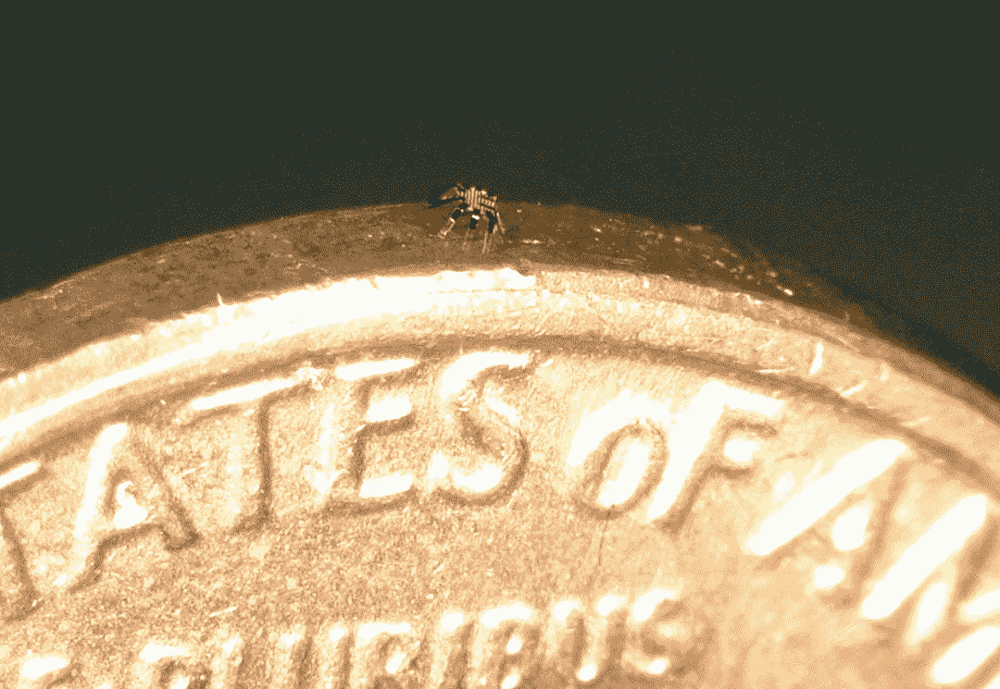

# 在血管中工作的纳米机器人已经有了原型

> 原文：<https://medium.com/geekculture/nanobots-working-in-blood-vessels-have-a-prototype-e8fbe1af777b?source=collection_archive---------6----------------------->

> 这个机器人比蚂蚁的头还小，但它已经可以自主工作了。

在对未来科技的展望中，除了虚拟世界、基因工程和核聚变，人们还想象可以在血管中运行的纳米机器人，帮助你治疗疾病。科学家在这个领域面临的挑战不亚于其他目标，但今天，一个…