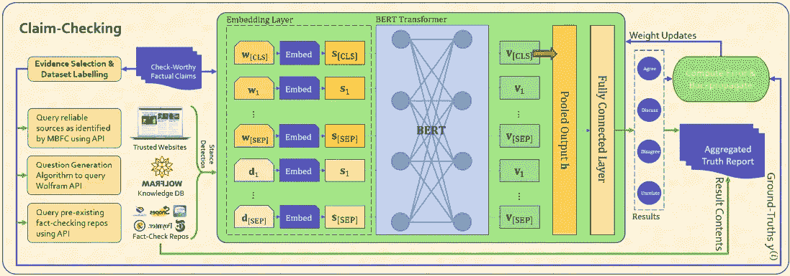
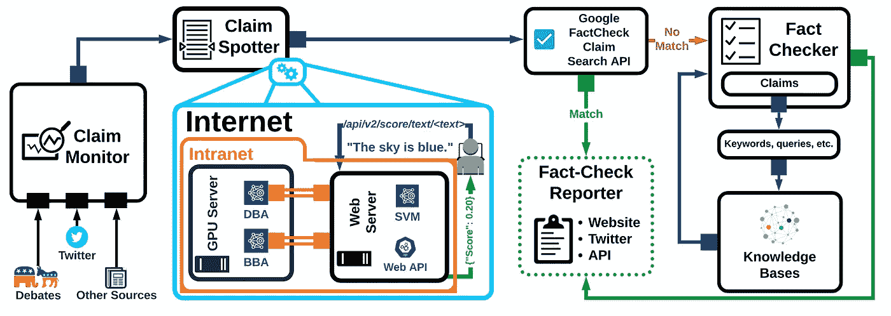
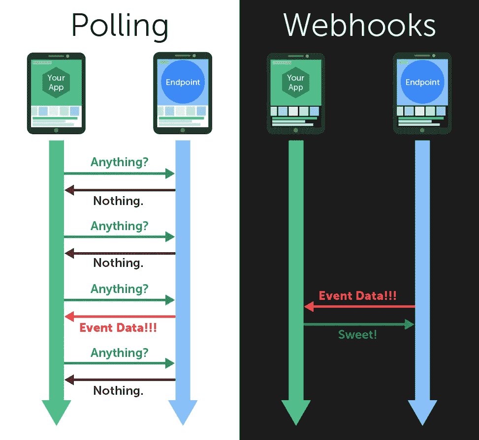
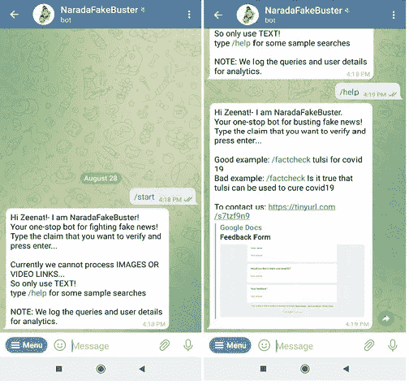

# NaradaFakeBuster:打击假新闻

> 原文：<https://medium.com/geekculture/naradafakebuster-fighting-fake-news-7bd6ac6ebbd?source=collection_archive---------14----------------------->

## 我如何使用 Google & AWS Lambda 构建一个事实检查机器人

1.  **简介**

尽管假新闻已经存在了几十年，但社交媒体的爆发已经带来了大量数据的混乱。每个人都可以自由访问，他们发布的内容没有过滤，很难选择什么该相信，什么不该相信。核实这些新闻的事实对做出明智的决定很重要。

NaradaFakeBuster 是一个为事实检查开发的电报机器人，它接受短语或文章标题，并在数据库中运行它们，以检查事实检查是否已经完成。NaradaFakeBuster 使用 AWS Lambda 函数作为其后端。lambda 函数调用 API 来验证事实，它还在 elasticsearch 索引中记录查询和用户分析，因为查询被记录到一个 bot 中，python notebook 用于检查 elasticsearch 索引。AWS 让创建和部署聊天机器人变得更加容易，有了 AWS Lambda，你可以在五分钟内创建聊天机器人。

**2。现有架构**

核实索赔

一些被用作灵感的类似工作包括 VERiCLAIM，这是一个自动事实检查系统，它使用了 NLP 和证据检索方法的最新技术。



Claim-checking framework as provided by the authors

(b) CLAIMBUSTER 框架

另一个是名为 ClaimBuster 的自动化实时事实检查。ClaimBuster 项目最初是作为一个人工智能模型开发的，可以自动检测值得检查的索赔，但现在已经成为一个成熟的自动化事实检查系统。



Claim Buster Framework

上面是一个系统图，描述了当前框架，浅蓝色框中突出显示了索赔定位组件。

**3。NARADA-FAKEBUSTER BOT 架构**

lambda 函数中的 **NaradaFakeBuster** 的架构是一个模块化的类型，在其中解析文本以提取所需的信息。用户在 telegram bot 上输入值，它调用 webhook，这是 lambda 的 API 端点。文本被传递给 lambda 函数，该函数被进一步解析并用于调用 google check API，从 API 获得的输出被解析并被发送回前端以显示在屏幕上。所有输入查询和用户分析都存储在 elasticsearch 索引中。然后可以查询来自 elasticsearch index 的数据来获得用户分析。

(a)网络挂钩与轮询

API 集成应该足够高效，以便应用程序之间的数据共享为用户提供巨大的价值。在轮询方法中，我们以预定的频率发送对新事件的请求(特别是创建、检索和删除事件，这些事件表示数据的变化),并等待端点响应。如果端点没有响应，则没有新事件可共享。与轮询类似，webhooks 为您的应用程序提供了一种从端点消费新事件数据的方式。然而，不是发送新事件的重复请求，而是为端点提供一个 URL，通常在应用程序监视的端点 UI 中。每当 endpoint 应用程序中发生新事件时，它会将事件数据发布到您指定的 URL，实时更新您的应用程序。最初这个机器人是用一种轮询方法创建的，后来它被改成了 web-hook 方法，因为它们更有效。在轮询中，数据总是过时的，例如，如果轮询频率设置为每 6 小时一次，则返回的事件可能在这 6 小时的间隙中的任何时间发生，而在 web-hook 中，事件会立即发布到受监控的 URL，应用程序会立即更新新数据。Zapier 发现超过 98.5%的投票都被浪费了。相比之下，webhooks 只在有*新数据要发送的时候才传输数据，这使得它们 100%有效。这意味着轮询平均比 webhooks 多产生 66 倍的服务器负载。这浪费了很多时间，如果您为每个 API 调用付费，那就是浪费了很多钱。为了把我们从所有的损失中拯救出来，我们使用了网钩法**。***



Polling vs Web-hooks

(b)利用 API 网关建立网络挂钩

亚马逊 API Gateway 上有一个功能叫做 stage variables。阶段变量的作用类似于环境变量，可用于为每个部署阶段更改 API 网关方法的行为；例如，可以根据 API 运行的阶段到达不同的后端。环境变量很有用，因为它们允许您通过更改 API 密钥、端点、令牌或服务用来区分环境的任何东西来更改您的环境使用哪个第三方服务环境。API Gateway 可以在不调用支持 Lambda 函数的情况下阻止不正确的请求，这样可以节省 Lambda 调用成本，还可以从 Lambda 函数中卸载请求验证。可以从阶段设置控制台启用指标，所有日志记录都以两种形式完成:执行日志和访问日志。从每条消息中捕获的元数据存储在 elasticsearch 索引中。有了 AWS 无服务器平台，你可以构建一个独立运行的 Webhook，你不必担心监控和管理它。对于 NaradaFakeBuster，webhook 是使用 AWS Lambda 和 API Gateway 创建的。

为了将 API 网关 URL 设置为 telegram bot 的网络挂钩，我们在浏览器窗口上运行以下命令:

```
[https://api.telegram.org/](https://api.telegram.org/)<bot-token>/setWebHook?url=<api endpoint>
```

**4。发展问题**

在开发 bot 时，我面临以下两个问题。回想起来，这似乎无关紧要。但找到一个合适的解决方案确实花了一些时间。我希望它能帮助阅读这篇博客的人

1.  *谷歌 protobuf 错误*
2.  和；*连接池错误*

(1) Google protobuf 错误

这个错误是因为 lambda 函数不能识别 google 包。当您运行下面的命令来安装我们的 *requirements.txt* 文件中给出的包时。它会引发一个 *disutils 错误&一个 protobuf 错误*

```
python3 -m pip install - target=./ - user - upgrade - force-reinstall -r requirements.txt
```

> 原因是上面的命令安装了具有以下文件夹结构的库

```
python3 -m pip install — t . protobuf
```

# #文件夹结构如下:

```
NaradaMod2
|
|--google
|    |--cloud
|    |    |--bigquery
|    | 
|    |--google
|    |    |--protobuf-xxxx
```

##移动了 protobuf 文件夹。所以最终的结构如下:

```
NaradaMod2
|
|--google
|    |--cloud
|    |    |--bigquery
|    | 
|    |--protobuf-xxxx
|    |
```

解决这个问题花了相当长的时间。答案并不直观。但一旦解决，似乎就简单了。

(2)连接池错误

lambda 函数引发了连接池错误。在检查云观察日志时，似乎这个错误是因为 ES url 指向一个它没有访问权限的集群！

**5。代码演练**

lambda 函数中的主要代码块是 *lambda 处理程序。*每当该功能被触发时，这是入口点…

lambda 处理器:

(1)提取文本消息

(2)检查它是否是机器人命令之一(*像帮助*)。如果是，它将提供必要的响应

(3)如果没有，它对命令运行 factcheck 并打印输出

我们使用以下软件包:

```
googleapiclient.discovery - this is used to construct a request object to the Google fact-check API endpoint
elasticsearch - helper package for accessing ElasticSearch clusternodes
logging - used for tracking software logs
```

像 API 令牌这样的系统变量存储为环境变量，不属于代码的一部分。这使我们能够通过 CI/CD 流程以安全的方式存储它们，而不会意外暴露它们。

可以通过调用 get-env 函数来访问这些变量

```
os.getenv("TELEGRAM_TOKEN")
```

以下代码为 factcheck API 构建了一个资源

```
#API token for factcheck API
apiToken = os.getenv('GCP_FACTCHECK_TOKEN')# Build the factcheck API service as a global var
service = build('factchecktools', 'v1alpha1', developerKey = apiToken)resource = service.claims()
```

*checkCommand* 功能检查所有消息，包括当用户按下电报机器人上的 **START** 时。

“***/启动*** ”命令为用户提供了一个介绍性的信息。

***/help*** ”提供了关于用法的附加帮助。

" ***/factcheck*** "后跟一个字符串启动 *factcheck* 功能。



snapshots from bot screen

***factcheck*** 函数接收用户编写的文本以检查事实。它保存消息并运行 google API，如果它是一个非空字符串，它调用 saveFactCheck 函数，运行 try 块搜索数据库。如果搜索时出现错误，它会向用户发送一个响应。如果机器人无法在其数据库中找到事实，它会要求您尝试使用另一个字符串。如果机器人发现你的事实搜索索赔，它会显示所有的网址。

**6。结论**

用来自可信来源的可靠信息来核实事实可能是对抗错误信息传播的最佳方式。通过仔细检查你在社交媒体或在线文章中看到的说法，你可以验证它是否属实。

NaradaFakeBuster 是事实核查领域中的一种智能方法，它使用无服务器功能，使我们能够节省成本，同时确保一致的可扩展性能。该机器人本质上是模块化的，因此可以很容易地部署为 twitter、reddit 或 linkedin 等其他社交媒体机器人的后端。