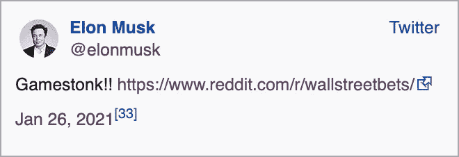
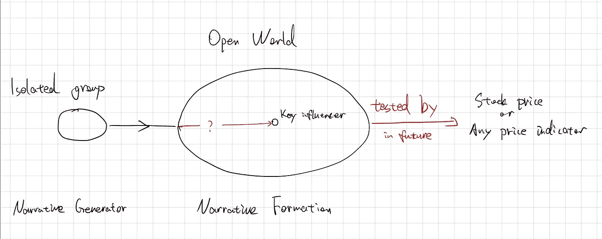

# 叙事经济学与拟议的计算模型

> 原文：<https://medium.com/geekculture/narrative-economics-with-a-proposed-computation-model-d7c20e654a97?source=collection_archive---------28----------------------->

这篇文章是为了介绍《叙事经济学》这本书，并记录我对如何建模的一些想法(因为这仍然是一个悬而未决的问题)。

Photo by [Andrew Kliatskyi](https://unsplash.com/@kirp?utm_source=unsplash&utm_medium=referral&utm_content=creditCopyText) on [Unsplash](https://unsplash.com/t/textures-patterns?utm_source=unsplash&utm_medium=referral&utm_content=creditCopyText)

> “一个人总是讲故事的人，他生活在自己的故事和他人的故事之中，他通过这些故事看到发生在自己身上的一切；他努力过着自己的生活，就像在讲述自己的生活一样。”
> 
> ——罗伯特·J·希勒，《叙事经济学:故事如何传播并推动重大经济事件》

《叙事经济学》是我自 2019 年出版以来读过的最有趣的书。自 2019 年以来，我们已经发生了几起对未来产生深远影响的重大事件，包括新冠肺炎疫情、2020 年美国总统大选和加密货币的激增。书中讨论了这些事件的许多特征。这似乎是一个伟大的时间来介绍这本书的轮廓(如果不是一个理论)。

## 什么是叙事？

“叙事”一词反映了《牛津英语词典》中给出的一个特定的现代含义:“用来对一个社会、一个时期等进行解释或论证的故事或陈述。”书中的一个例子是，20 世纪下半叶的叙述将自由市场描述为“有效的”，因此不受政府行动的影响。

我的理解是，一个故事由一群人持有，可能会持续数年。一个人只能支持或反对一个叙述，而一个叙述对一个想法/概念/观点表现出一定的态度。一句话，叙事是一个聚合的信念。

## 哪些故事会像病毒一样传播？

很难量化病毒式叙事背后的原因。很明显，作为一个人，心理计算是否相信一个故事几乎是不可能的。

作者认为，在传播过程中，故事可以变异成一种或多或少具有传染性的形式，其中包含一定的随机性。在我看来，尽管过程中的变异是难以处理的，但随着自然语言处理的最新进展，这种传染性是可以量化的。通过计算单词向量和社交网络图的向量表示之间的距离，可以量化单词/文章被一群人接受的可能性。

## 七个关键命题

作者提出了关于叙事经济学的七个命题，以解释历史上重要的叙事和识别新的叙事。我在下面引用它们作为参考。

这些仅仅是基于对例子的推理而形成的，但它对如何将 NLP 技术与这个主题相结合很有见地。例如，在命题 6 中，作者提到歌曲“大家早上好”类似于“祝你生日快乐”，具有完全相同的旋律和非常相似的词，但它远不如后一首歌有名。某些观察表明，当对叙事的形成进行建模时，应该包括什么样的特征。

> 1.流行病有快有慢，有大有小。流行病的时间表和规模可能会有很大差异。
> 2。重要的经济叙事可能只占大众话题的很小一部分。叙事可能很少被听到，但在经济上仍然很重要。
> 3。叙事星座比任何一个叙事都更有影响力。星座很重要。
> 4。叙事的经济影响可能会随着时间而变化。随着故事的发展，细节的变化很重要。
> 5。真相不足以阻止虚假的叙述。真相很重要，但前提是它显而易见。
> 6。经济叙事的蔓延建立在重复的机会之上。强化很重要。
> 7。经济叙事依赖于人类的兴趣、身份和爱国主义。人类利益、身份和爱国主义至关重要。

## 故事传播的一个例子:游戏停止短挤压

[https://en.wikipedia.org/wiki/GameStop_short_squeeze#Losses_by_retail_investors](https://en.wikipedia.org/wiki/GameStop_short_squeeze#Losses_by_retail_investors)

2021 年 1 月，美国视频游戏零售商 GameStop(纽约证券交易所代码:GME)的股票和其他证券出现了卖空，给某些对冲基金造成了重大财务后果，并给卖空者带来了巨大损失。

GameStop 上的做空是由 Reddit 用户在“r/wallstreetbets”子编辑上发起的，然后由商业巨头 Elon Musk 的推特“Gamestonk！!"——指的是当时越来越受欢迎的[“stonks”迷因](https://en.wikipedia.org/wiki/Meme_Man)——以及“r/wallstreetbets”子编辑的链接。马斯克的推文发布后，股价短暂飙升至 200 多美元。截至 2021 年 1 月 28 日，GameStop 的历史最高盘中股价为 483.00 美元(是 9 个月前 2020 年 4 月达到的 2.57 美元低点的近 190 倍)。subreddits 的用户表现得不理性，坚信他们可以通过购买股票获得高回报并惩罚做空者。

这一事件很有趣，因为它几乎触及了叙事经济学中提到的许多元素:采用了一个具有感染力的词“GameStonk”，一个关键影响者的参与。

## GameStop 模型

我在为将来的讨论建立一个模型。

*   孤立群体

一群具有充分的社会交往并持有共同信念的人被定义为孤立群体。subreddit 是一个孤立的群体，这个群体中的所有人在交流和信仰分享方面都有密切的关系。这是真实复杂世界的简化版，在这里你可以与其他人交谈/看到/听到/互动。

*   开放世界

开放的世界由所有人组成，在快速变化的环境中有各种可能的叙述。开放世界中的人们不像孤立群体中的人们那样频繁地相互交流。关键影响者就像埃隆·马斯克，他对人们的行为有很大的影响。他每天都会注意到很多故事，但只有当他觉得有趣时才会分享。

在开放世界的其他地方，人们和关键影响者做同样的事情，但是他们的声音更小。开放世界的人和孤立群体的人的区别在于，前者同时相信和怀疑到一定程度，而后者宗教性地相信一个叙事。

如果得到关键影响者的确认，开放世界中的人们可能会做出昂贵的决定(比如非理性地购买股票)。

*   开放世界的配置

首先，开放世界的熵高于孤立群体。有必要引入一个“遗忘因子”，让开放世界中的叙事“死亡”。应该有一个标量值或向量来记录叙述中的信任程度。

第二，在开放的世界中，一个人是否接受一种叙事，必须是概率性的，而且必须是量化的。它可以基于一个人的社会结构特征(可以通过 node2vec 技术矢量化)。

此外，开放世界是一个动态图，其中的链接关系会随着时间的推移而变化。

## 其他相关概念

意见形成/意见动态

意见形成过程是关于个人在形成态度时如何处理信息。态度被定义为个人对某个对象的总体评价，带有某种程度的喜欢或不喜欢。例如，给定一只股票，投资者的总体态度是什么？

## 参考

 [## 叙事经济学

### 在一个互联网巨魔农场试图影响外国选举的世界里，我们能忽视……的力量吗

press.princeton.edu](https://press.princeton.edu/books/hardcover/9780691182292/narrative-economics) 

奥尔波特，华盛顿，1933 年。1.态度。*术语*，第 219 页

模拟在线社区的社会网络:模拟作为社会性设计的一种方法

[https://en . Wikipedia . org/wiki/GameStop _ short _ squeeze # loss _ by _ retail _ investors](https://en.wikipedia.org/wiki/GameStop_short_squeeze#Losses_by_retail_investors)