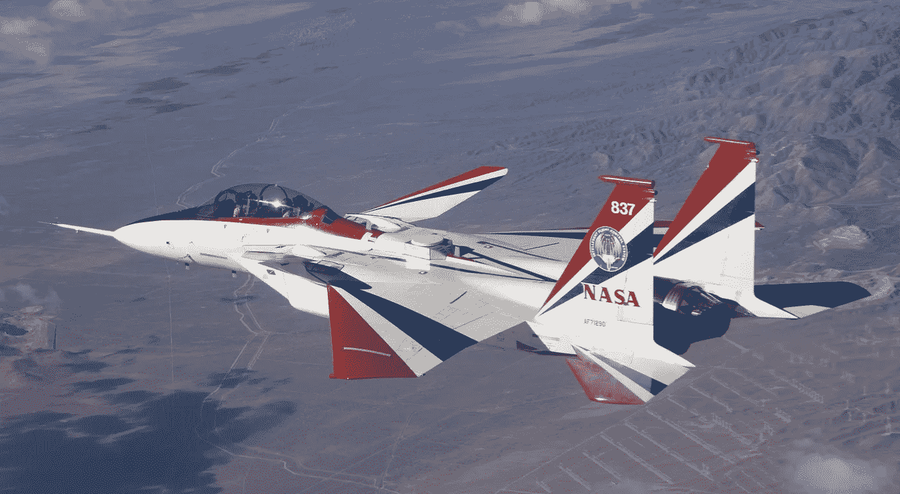

# 美国宇航局的智能飞行控制系统

> 原文：<https://medium.com/geekculture/nasas-intelligent-flight-control-system-5dac0a3d3837?source=collection_archive---------4----------------------->

## 人工智能如何帮助美国宇航局改进现代飞行控制系统

NASA’s NF-15B showing the canards added to the original F-15 structure. New range safety and range user system antennas for the [ECANS](https://www.nasa.gov/centers/dryden/multimedia/imagegallery/F-15b_SBRDC-ECANS/ED07-0055-1.html) project can be seen just behind and to the left of the cockpit on NASA’s NF-15B research aircraft. Photo credits [NASA](http://www.dfrc.nasa.gov/Gallery/Photo/F-15B_SBRDC-ECANS/HTML/ED07-0026-14.html), Lori Losey

在本世纪初，从 1999 年到 2008 年，[美国宇航局德莱顿飞行研究中心](https://www.nasa.gov/about/highlights/FS-001-DFRC.html)启动了一个新的研究项目，研究人工智能(AI)的应用，以减少飞行控制失败后飞行员的工作量。