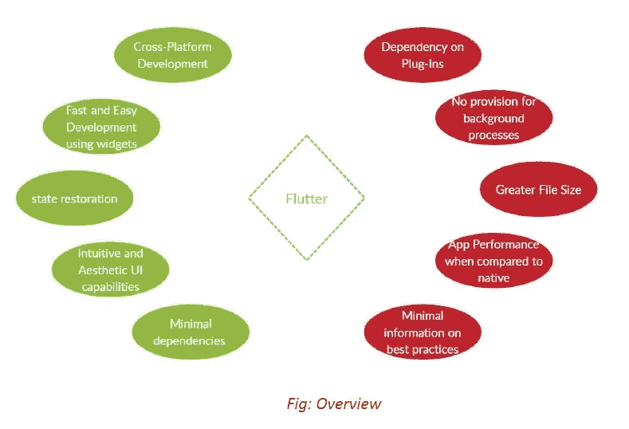

# 原生 Android 还是 Flutter？应用程序开发的答案

> 原文：<https://medium.com/geekculture/native-android-or-flutter-the-answer-for-app-development-a856aef51a9c?source=collection_archive---------16----------------------->

原生 Android 应用程序是针对 Android 的平台特定的应用程序，它利用特定的编程语言 Java 进行开发。这实际上已经控制了应用程序开发，并且是应用程序开发的原始和最受欢迎的方法，完全控制了市场。在 Flutter 出现之前，默认情况下，这是每个初涉应用开发的开发者都会走的路。

Flutter 是 Google 基于 Dart 编程语言的跨平台移动框架。它是一个移动应用 SDK，帮助开发人员和设计人员为 iOS 和 Android 构建现代移动应用。自 2017 年提出概念以来，Flutter 席卷了开发圈。在这篇文章中，我试图找出让 Flutter 成为历史悠久、久经考验的原生应用强有力竞争对手的原因。

## 是什么让 Flutter 有吸引力？

*   Flutter 最吸引人的功能是其承诺的**跨平台
    开发**:IOS 和 Android 应用程序都可以开发，不像
    本地开发，你需要熟悉针对每个平台的完全
    不同的应用程序开发栈——Android 和
    IOS。
*   颤振给予了**快速和容易开发**的诱人优势。
    Flutter 已经为几乎每项任务**预建了小部件**，这使得将通用模块和结构整合到你的应用
    中变得极其
    简单。因此，你可以用相对较少的时间构建一个具有**多种
    功能和视图的应用。**
*   Flutter 还可以帮助你简单快速地构建漂亮的用户界面。它提供了构建美观、直观的用户界面的模块，如果你考虑到在原生 Android 中做同样的事情的基础，这些模块看起来比原生 Android 好得多。
*   让经验丰富的原生 android 开发人员感到烦恼，也让新手感到困惑的一件事是，原生 Android 模块之间广泛的依赖性和兼容性变化会引发模糊的错误。另一方面， **Flutter 减少了依赖关系的复杂性，并使兼容性引起的冲突成为一种罕见的情况**。
*   使用颤振的另一个主要优点是它**完全负责恢复状态。**不需要像在
    原生 Android 中那样编写大量的状态管理用例。
*   有**可扩展动作的规定**；你想在应用程序中加入的任何功能都可以很容易地实现，而且会很直观地适应。

## 什么仍然是原生 Android 的重要性的基础？

*   Flutter 充分利用插件来包含各种
    功能。例如，为了构建一个带有蓝牙
    模块的应用程序，您需要导入相应的插件。
    的问题是，这些**插件需要本地开发者来构建**。由于
    只要 Flutter 开发者社区保持强大，它可能不会
    造成问题；但是如果社区开始缩小，插件的数量减少，那么仅仅用 Flutter 来整合某些功能几乎是不可能的。
*   Flutter 应用程序的**文件大小**被发现**明显高于
    原生 Android，这可能会导致 google play 商店应用程序必须遵循的空间
    限制的问题。**
*   Flutter 还没有对后台进程做出规定；
    服务是原生功能。
*   除非你是一名经验丰富的 Flutter 开发者，能够构建优化的应用程序，否则 **Flutter 应用程序在 CPU 和内存使用上**会更加困难，并且**无法发现和恢复内存泄漏**。
*   这就产生了一个问题，因为作为一项新技术，**没有足够的关于颤振发展的最佳实践的信息**。

# 总之，

这绝对是一笔不错的投资——在未来的版本中，肯定会包含更多的功能；使用 Flutter 来开发具有通用功能的应用程序是非常理想的，它的界面非常棒。例如，简单的应用程序，如内部公司应用程序、本地企业应用程序、内部大学应用程序等。可以使用 Flutter 快速有效地构建。

**Native** 将在您需要独特的功能和复杂的应用程序时帮助您，为您提供完全定制的灵活性。

# 参考

*   [https://flutter.dev/docs](https://flutter.dev/docs)
*   [https://developer.android.com/docs](https://developer.android.com/docs)