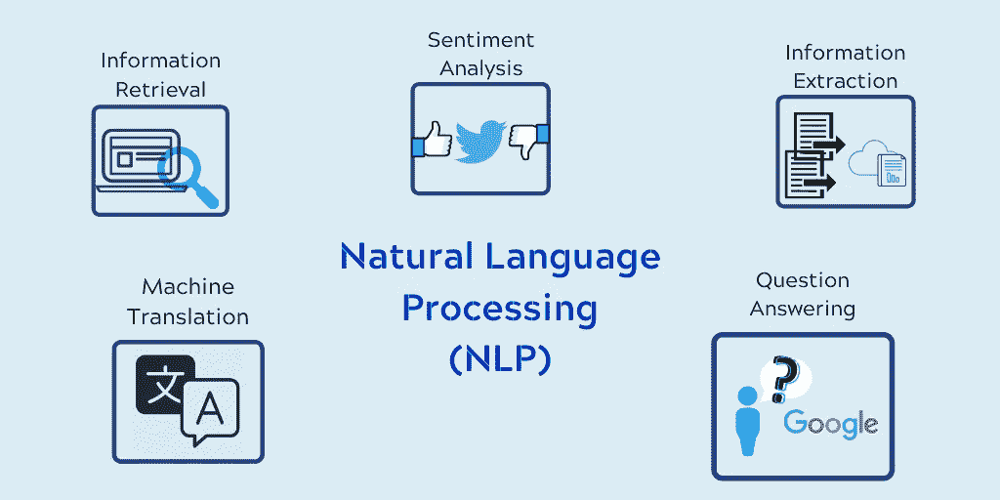
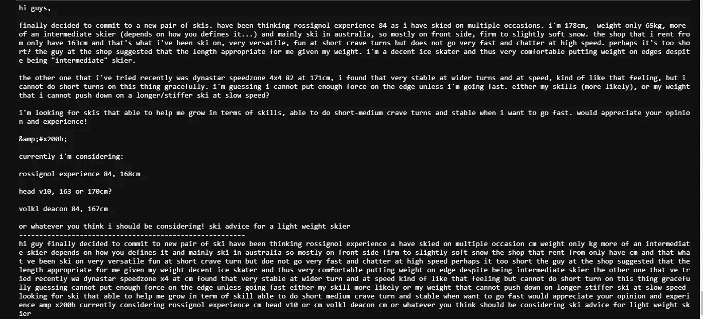
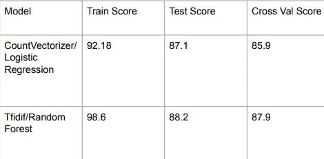
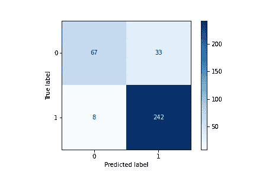
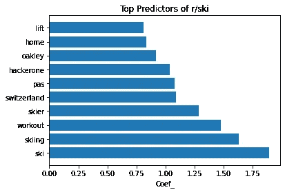
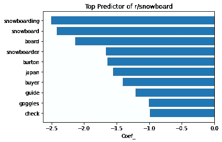

# 使用分类模型的自然语言处理

> 原文：<https://medium.com/geekculture/natural-learning-processing-nlp-using-classification-model-a0d59ae09d48?source=collection_archive---------16----------------------->



什么是自然语言处理或 NLP？首先要解释的是，我们人类能够阅读、理解和收集语言的含义。然而，为了让机器执行所有这些动作，它需要“NLP”来让计算机像我们一样理解语言。

NLP 有许多应用程序，例如为听力有困难的人提供的语音到文本服务，我们每天在消息中使用的文本到语音服务，我们讨厌交流的聊天机器人，除非它能解决我们的问题，以及翻译服务。

为了让机器发挥 NLP 的魔力，我们需要对数据进行预处理。记号化是一种方法，我们可以用它来删除所有的空格或特殊字符，以及许多其他使用正则表达式的东西。

```
tokenizer = RegexpTokenizer(r'\w+')
```

上面的代码是一个正则表达式的例子，它将挑选出字母数字字符序列作为标记，并丢弃其他所有内容。预处理的下一部分是词汇化/词干化。这个过程会缩短单词，这样我们就可以组合同一个单词的相似形式。简单来说，它将返回单词的基本/字典形式。


另一个预处理步骤是删除所有常见的英语单词，如“我”、“我”、“我们”等。我们可以把停用词定义为几乎没有任何意义的词。以下是英语停用词列表:


为了练习和展示我从 NLP 中学到的新技能，我有一个项目是使用分类模型预测帖子来自哪个子目录。该项目预测帖子来自哪个子编辑，我选择了滑雪和滑雪板子编辑，以查看该模型如何在两个类似的子编辑主题之间进行预测:

**使用自然语言处理预测子网格:**

我的项目的问题陈述是:

“一家滑雪场希望使用分类模型找出帖子来自哪个子编辑区，并查看每个子编辑区中频繁使用的是什么类型的单词。”

数据是从 Reddit 上收集的，我是用来自 https://api.pushshift.io/reddit/search/submission[的 pushshift 的 API 收集的。之后，我使用请求库，它允许我从不同的子编辑中提取帖子。然后，我用。json 将数据格式化到字典中，并将其转换成用于建模的数据框架。](https://api.pushshift.io/reddit/search/submission)

**EDA 和数据清洗:**在这个数据集中，有很多我不需要的不必要的列。因此，我将这些列过滤为三列“subreddit**”**:告诉我们它来自哪个 subred dit，“self text**”**:文章的文本，“title**”**:文章标题。之后，我删除了所有来自 API 的重复帖子，并将 selftext 和 title 合并到一个列中，以便模型更好地预测。然后，我将滑雪和滑雪板子编辑列转换为二进制列。

**预处理**:正如我之前解释的，为了在模型中获得更好的结果，我们需要预处理文本。我使用 RegExp Tokenizer: ('[a-z]\w+'):它只返回小写字母，没有任何标点符号或特殊字母。我还对文本进行了词汇化，以便使文本规范化，不包含任何派生单词。下面的图片展示了预处理步骤将如何删除所有的空白和一些出现在文本中该行之前的特殊字符。



**建模**:在对数据进行预处理后，我决定使用带有 CountVectorizer 的逻辑回归和带有 TfidfVectorizer 的随机森林模型来预测帖子来自哪个子编辑。

CountVectorizer:将文本转换为在整个文本中出现的每个单词的计数的向量。

TfidfVectorizer: Tfidf 代表词频逆文档频率，它将文本转换为特征向量，旨在更好地定义一个单词对文档的重要性，同时还考虑到与同一语料库中其他文档的关系。

逻辑回归:对通过/失败、赢/输或滑雪/滑雪板的某个类别或事件的概率进行建模。

随机森林:它在数据集的各种自举子样本上拟合多个决策树分类器，并使用投票来提高预测精度和控制过拟合。



训练分数:模型如何符合训练数据

测试分数:模型如何推广到新数据

交叉价值分数:评估模型的有效性



Confusion Matrix for the Model

我们能够准确预测 100 个滑雪板柱子中的 67 个和 250 个滑雪板柱子中的 242 个。该模型能够比滑雪板柱子更好地预测滑雪板柱子，因为其灵敏度约为 89%,因为其最小化了假阴性，而精度约为 67%,因为其最小化了假阳性。



正如你所看到的，所有预测滑雪帖子的热门词汇都与滑雪有关，其中一些非常有趣。因为 pas 是滑雪巡逻队中医疗专业人员的专用词。瑞士以在野外滑雪而闻名。Hackerone 是一个奇怪的词，因为它是一家公司，其首席执行官是一个狂热的滑雪爱好者。



对于滑雪板，伯顿是一个词，因为杰克伯顿刚刚去世，因为他做了这么多的滑雪板，使之成为奥运会批准的运动。日本有滑雪板爱好者喜爱的最好的地形公园和度假村之一。

该模型能够准确预测 88%的帖子。为了改进模型，我可以更深入地研究更多的特征工程，并使数据更加平衡。另一种方法是删除所有的词，如滑雪，滑雪板，滑雪。然而，这可能会使精确度下降很多。

如果你想看看这个项目，下面是 Github 的链接。

[https://github.com/tw1270/Web-APIs-and-Predicting-Subreddit](https://github.com/tw1270/Web-APIs-and-Predicting-Subreddit)

[](https://www.linkedin.com/in/tenzin-wangdu/) [## 丹津·王度-大会数据科学研究员| LinkedIn

### 我是一名数据科学家，拥有数学学士学位。我有使用 Python、SQL 和 Tableau 的项目工作经验…

www.linkedin.com](https://www.linkedin.com/in/tenzin-wangdu/)