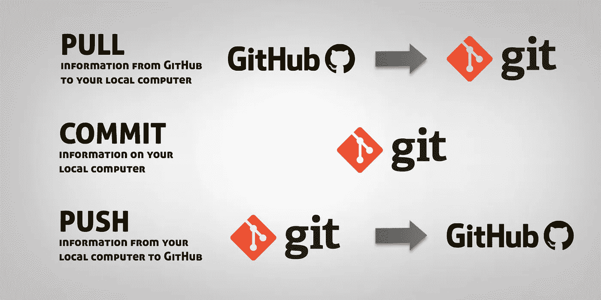

# 使用 GitHub 和 Unity3D 导航 Git 终端

> 原文：<https://medium.com/geekculture/navigating-the-git-terminal-with-github-and-unity3d-6011a5838b5?source=collection_archive---------16----------------------->

现在我们已经在本地机器上安装了 GitHub 帐户和 Git，我们准备导航到 Unity 项目文件夹。只需几个简单的命令，我们就可以轻松到达我们需要去的地方。

您可以在 Git Bash 窗口的左上角看到您当前在计算机中的位置。这将在您浏览文件夹时更新。把这想成…