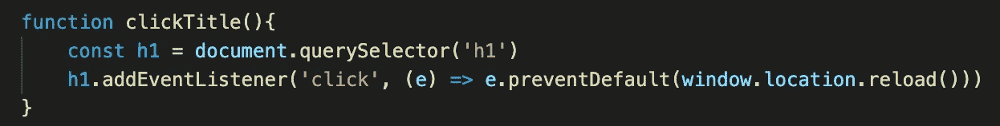

# 在单页应用程序(SPA)中导航到“主页”

> 原文：<https://medium.com/geekculture/navigating-to-the-home-page-in-a-single-page-application-spa-5276d3f858dc?source=collection_archive---------27----------------------->


Photo by [Luke Stackpoole](https://unsplash.com/@withluke?utm_source=medium&utm_medium=referral) on [Unsplash](https://unsplash.com?utm_source=medium&utm_medium=referral)

决定重访一个古老的温泉项目。一切正常。单击一个项目，它会调出与之相关的图像和数据。单击另一个项目，它会被与该链接相关联的新图像和数据所替换，依此类推。困扰我的一件事是我不能返回‘主页’；最初看到的主页。

因为是 SPA，所以只有一个 url 路径。点击链接和其他东西不会把你带到一个新的页面。它只是替换一页上的内容。所以，也没有点击浏览器上的“后退”按钮。

回到“主页”的能力并不重要，但这可能会在未来发生变化，这取决于我可能会在那里放什么信息。或者，可以放在那里。而且，我只是想拥有一个完整的圈子，能够像大多数设计良好的网站所能做到的那样，返回到那个“主页”,从而感到安定。

## 寻找答案

这个 SPA 前端使用普通的 JavaScript，后端使用 Ruby。为了加载所有内容，我在开始时调用了两个函数，它们获取所有数据并使其开始运行。这很有趣，就像战略性地建立多米诺骨牌..一个功能带动其他功能。设置事件回调和按钮。

不管怎样，我做了一些研究，建议使用 pushstate 和 popstate 进入历史，手动放入你想去的主页。我不知道为什么这个问题会出现这么多，因为我有一个没有任何历史可以操纵的水疗中心。根据浏览器显示，所有事情都发生在一个页面上。

另一个搜索结果建议将我所有的可点击项目链接到一个 URL 路径。理论上听起来很棒。如果我希望用户能够用特定的图像和数据为特定的路线添加书签，这可能是一个长期的好做法。

我想要的功能非常简单，我现在不想弄乱路线。我只是想能够点击我的标志在顶部，并再次显示'主页'。简单。

然后，我认为我很聪明，构建了一个函数，这个函数将重新调用最初的两个函数，这两个函数将获取所有数据并再次设置所有内容。我想我得到了一个 CORS 错误？它不喜欢同一页面上的点击请求已经在 SPA 中的数据和图像。所以它标记了它。

这让我开始思考。我不想制作路线和路径，这样我就可以建立一个复杂的系统来跟踪历史或可以直接导航到的独特页面。我基本上只是想要一个页面刷新，所以一切都回到原来的状态。这是我希望我能意外触发它的时刻之一。

在查找如何在 SPA 中触发页面刷新时，我发现了另一个复杂的解决方案，其中每 5 分钟就会有一个函数检查 manifest.json 文件中的“last-modified”时间戳是否与 localstorage 中存储的内容相匹配。如果是这样，当用户离开并改变路线时，它刷新页面。这很棒，但是比我现在想要的简单的水疗要复杂。

有用的一点:

```
window.location.reload( )
```

到目前为止，我已经在 window.history 上看到了很多，但没有在“位置”上看到。根据 [**W3 Schools**](https://www.w3schools.com/js/js_window_location.asp) 的说法，它是一个“可用于获取当前页面地址(URL)并将浏览器重定向到新页面”的对象



window.location.reload( ) used in a simple function

## 未来用途

所有这些挖掘只是为了让一小段代码工作。编码的乐趣！💻

至少我在这个过程中学到了一些其他的东西，这些东西对未来的复杂项目是有用的。

还有，有一个一直困扰我的 bug‘window . location . reload()’或许可以修复。每当我编辑一个项目并保存更改时，项目名称会被添加到我已显示的列表的底部，同时显示的还有已经存在的原始项目。如果点击了错误的按钮，就会抛出一个错误。也许，如果我能在保存更改时强制刷新，一切都会如我所愿。

## 其他资源

[](https://blog.pshrmn.com/how-single-page-applications-work/) [## 博客. pshrmn

### blog.pshrmn 浏览器 API 如何启用单页应用程序的概述 2018 M04 11 单页应用程序(SPA)…

blog.pshrmn.com](https://blog.pshrmn.com/how-single-page-applications-work/) [](https://www.fieldexit.com/forum/display?threadid=208) [## 在单页应用程序(SPA)网站上使用后退和前进按钮-FieldExit.com

### 最近 BVSTools 上线了他们的移动/响应网站。我们此时决定将其设置为单个…

www.fieldexit.com](https://www.fieldexit.com/forum/display?threadid=208) [](https://frontendjournal.com/html5-pushstate-and-single-page-apps/) [## HTML5 推送状态和单页应用程序-前端主控

### 想象一下你有一个单页应用程序的情况。你开始摆弄它，经过一些动作后，你…

frontendjournal.com](https://frontendjournal.com/html5-pushstate-and-single-page-apps/) [](https://love2dev.com/blog/5-single-page-app-best-practices/) [## 5 单页应用程序(SPA)最佳实践

### 客户对客户端应用程序体验有很高的期望。关于本地人之间的争论已经写了很多…

love2dev.com](https://love2dev.com/blog/5-single-page-app-best-practices/) [](https://www.kotive.com/product-updates/how-to-refresh-a-single-page-application/) [## 如何刷新单页应用程序(SPA)

### Kotive web 应用程序每 5 分钟向服务器发送一次脉冲，以检查应用程序的任何新版本是否已在…

www.kotive.com](https://www.kotive.com/product-updates/how-to-refresh-a-single-page-application/) [](https://developer.mozilla.org/en-US/docs/Web/API/Window/location) [## window . location-Web API | MDN

### Window.location 只读属性返回一个包含文档当前位置信息的对象…

developer.mozilla.org](https://developer.mozilla.org/en-US/docs/Web/API/Window/location)