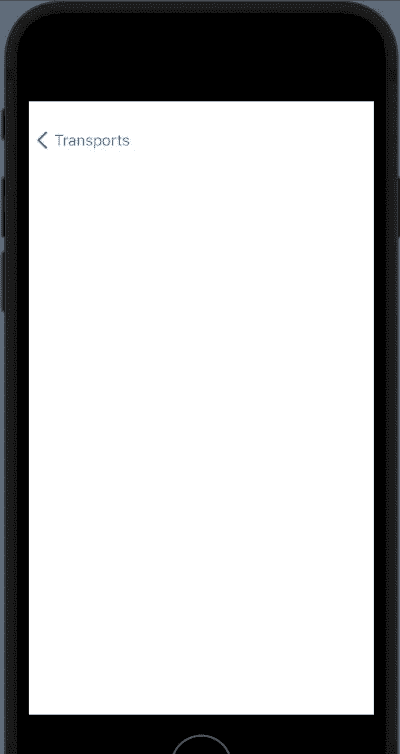
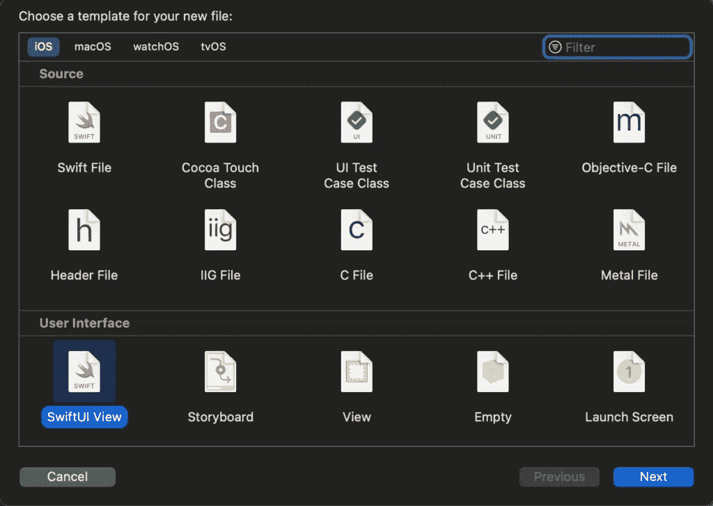
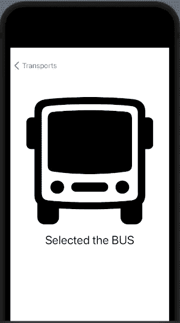
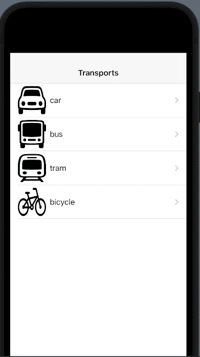
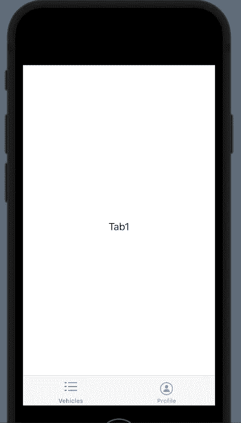
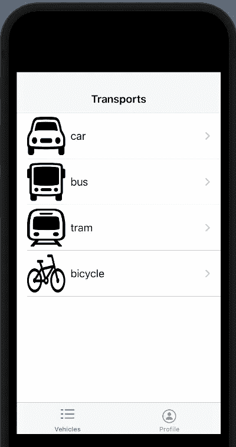

# SwiftUI 中的导航

> 原文：<https://medium.com/geekculture/navigation-in-swiftui-997ecd943f8d?source=collection_archive---------16----------------------->


在之前的帖子中，我们已经看到了 SwiftUI 的基础。现在是开始构建更复杂的东西的时候了，如何用*导航条*和*标签视图*在我们的应用中实现导航。

# 导航栏

从上一个帖子的代码开始(【https://nicoladefilippo.com/list-in-swiftui/】):

```
struct Vehicle: Identifiable {
    var id = UUID()
    var name: String
    var image: String
}

struct ContentView: View {
    @State var vehicles = [Vehicle(name: "car", image: "car"),
                    Vehicle(name: "bus", image: "bus"),
                    Vehicle(name: "tram", image: "tram"),
                    Vehicle(name: "bicycle", image: "bicycle")]

    var body: some View {
        List {
            ForEach(vehicles) { vehicle in
                RowView(vehicle: vehicle)
            }
            .onDelete { (indexSet) in
                self.vehicles.remove(atOffsets: indexSet)
            }
        }
    }
}

struct RowView: View {
    var vehicle: Vehicle
    var body: some View {
        HStack {
            Image(systemName: vehicle.image)
                .resizable()
                .frame(width: 60, height: 60)
            Text(vehicle.name)
        }
    }
}
```

我们想要点击一行并跳到一个新的视图。

第一步是添加 NavigationView:

```
var body: some View {
        NavigationView {
            List {
                ForEach(vehicles) { vehicle in
                    NavigationLink(destination: EmptyView()) {
                        RowView(vehicle: vehicle)
                    }
                }
                .onDelete { (indexSet) in
                    self.vehicles.remove(atOffsets: indexSet)
                }
            }.navigationTitle("Transports")
        }
    }
```

在*导航视图*中，我们插入上例中的列表。要向 NavigationView 添加标题，必须使用 *navigationTitle* 功能。

要跳转到另一个视图，我们必须使用导航链接。在本文中，我们插入了 *RowView* (我们希望单击要跳转的行)以及我们如何使用 *EmptyView* 的目的地，这是一个空白的默认视图，所以如果我们点击任何一行:



我们想要一个不是空的视图，而是显示一些东西的视图。

让我们去创建一个视图。首先，从文件菜单中选择新文件声音，然后:



从对话框中选择 SwiftUI 视图，并将其命名为*车辆视图*。

用车辆视图替换空视图:

```
NavigationLink(destination: VehicleView()) {
                        RowView(vehicle: vehicle)
                    }
```

现在点击列表，你跳转到新的视图，你会看到“你好，世界”。

要显示所选行的信息，请在中更改车辆视图的代码:

```
import SwiftUI

struct VehicleView: View {
    var vehicle: Vehicle
    var body: some View {
        VStack(spacing: 20) {
            Image(systemName: vehicle.image)
                .resizable()
                .frame(width: 300, height: 300)
            Text("Selected the \(vehicle.name.uppercased())")
                .font(.title)
            Spacer()
        }
    }
}
struct VehicleView_Previews: PreviewProvider {
    static var previews: some View {
        VehicleView(vehicle: Vehicle(name: "car", image: "car"))
    }
}
```

在视图中，定义了一个 Vehicle type 的 var，我们假设它包含了传递的行，并显示了在 VStack 中如何定义的信息(参见关于 v stack[https://nicoladefilippo.com/layout-in-swiftui/](https://nicoladefilippo.com/layout-in-swiftui/)的帖子)。请注意，在 VehicleView_Previews 中，我们经过一辆车，这是一个默认视图，仅用于预览(当您在不运行代码的情况下“设计”视图时，这很有帮助)。

要完成导航，我们还必须更改内容视图:

```
NavigationLink(destination: VehicleView(vehicle: vehicle)) {
                        RowView(vehicle: vehicle)
                    }
```

你可以看到我们如何通过车辆查看车辆。如果一切正常，如果你搭公车，你应该有:



可以把酒吧的名字放在中间吗？当然，用 navigationBarTitle 替换 navigationTitle，方法如下:

```
var body: some View {
        NavigationView {
            List {
                ForEach(vehicles) { vehicle in
                    NavigationLink(destination: VehicleView(vehicle: vehicle)) {
                        RowView(vehicle: vehicle)
                    }
                }
                .onDelete { (indexSet) in
                    self.vehicles.remove(atOffsets: indexSet)
                }
            }.navigationBarTitle("Transports", displayMode: .inline)
        }
    }
```

注意 displayMode 设置为. inline。



# 选项卡视图

现在看看如何定义 TabView:

```
struct ContentView: View {
    var body: some View {
        TabView {
            Text("Tab1") // View First Tab
                .tabItem {  Label("Vehicles", systemImage: "list.dash")}

            Text("Tab2") // View Second Tab
                .tabItem {  Label("Profile", systemImage: "person.circle")}
        }  
    }
}
```

神奇的词是 *TabView* 。在本文中，我们插入了带有相对*选项卡*的视图。视图是我们在选项卡中看到的，选项卡是我们在选项卡栏中看到的。



现在要创建更复杂的东西，我们可以使用 navigationview 示例中的代码。

首先，创建一个 VehiclesView 视图(注意复数)。

```
import SwiftUI

struct Vehicle: Identifiable {
    var id = UUID()
    var name: String
    var image: String
}

struct VehiclesView: View {
    @State var vehicles = [Vehicle(name: "car", image: "car"),
                    Vehicle(name: "bus", image: "bus"),
                    Vehicle(name: "tram", image: "tram"),
                    Vehicle(name: "bicycle", image: "bicycle")]

    var body: some View {
        NavigationView {
            List {
                ForEach(vehicles) { vehicle in
                    NavigationLink(destination: VehicleView(vehicle: vehicle)) {
                        RowView(vehicle: vehicle)
                    }
                }
                .onDelete { (indexSet) in
                    self.vehicles.remove(atOffsets: indexSet)
                }
            }.navigationBarTitle("Transports", displayMode: .inline)
        }
    }
}

struct RowView: View {
    var vehicle: Vehicle
    var body: some View {
        HStack {
            Image(systemName: vehicle.image)
                .resizable()
                .frame(width: 60, height: 60)
            Text(vehicle.name)
        }
    }
}

struct VehiclesView_Previews: PreviewProvider {
    static var previews: some View {
        VehiclesView()
    }
}
```

然后，像 NavigationView 示例中那样创建一个 VehicleView，然后更改 TabView:

```
struct ContentView: View {
    var body: some View {
        TabView {
            VehiclesView() // View First Tab
                .tabItem {  Label("Vehicles", systemImage: "list.dash")}

            Text("Tab2") // View Second Tab
                .tabItem {  Label("Profile", systemImage: "person.circle")}
        }   
    }
}
```

现在，在第一个选项卡中，我们有一个导航视图，我们可以在第一个选项卡中导航。



作为练习，您可以创建一个个人资料页面。

注意:英语不是我的母语，所以我对一些错误感到抱歉。如果你能纠正我，我将不胜感激。

*原载于 2021 年 5 月 11 日*[](https://nicoladefilippo.com/navigation-in-swiftui/)**。**