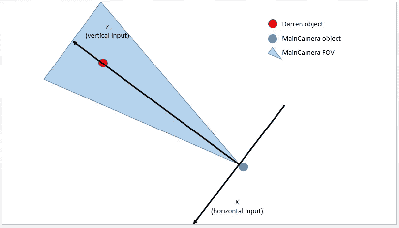
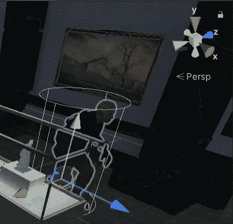

# 通过键盘移动导航代理

> 原文：<https://medium.com/geekculture/navmeshagent-movement-via-keyboard-8ea09fcb4e17?source=collection_archive---------12----------------------->

**目标**:通过 WASD 轴实现玩家运动

现在游戏差不多准备好了，我把它交给了我的一个密友，他和我一样对游戏充满热情。我们讨论了主要和次要的问题以及如何解决它们，但是从教程制作者的角度来看，有一个问题特别有趣。

他问我为什么没有可能通过经典的 **WASD** 方向键**T10 来移动达伦。事实上，我们没有理由不实现这样一个特性。所以尽管有一种方法可以让这成为可能。**

幸运的是，Unity 提供了一种收集默认输入的简单方法:`Input.GetAxis("AxisName")`方法允许检测箭头，以及 WASD 键，按下并模拟一种类似的**行为。根据按压时间的不同，浮动值的范围从最小值到最大值，0 为非按压值。我们甚至可以在播放器设置中调整达到这些值的速度。**

因此，在 *PlayerInput* 脚本中，我们可以通过鼠标点击获得这些值。

我必须检查零值的原因是，当按键未被按下时忽略轴，这是因为左击检测存在干扰。通过这种方式，我成功地在两个方向上移动了达伦，这很好，因为 WASD 更精确，而老鼠更舒服。

我还在 *PlayerMovement* 脚本中写了一个重载方法`Move(float, float)`，当两个轴都有非零值时就会执行。

`Direction()`不是一个真正的方法，让我们说它是评估 vector3 的东西。我只是需要这个视图来解释运动是如何发生的:由于`transform.Translate(..)`和`_agent.Move(..)`似乎只是滑动了达伦而没有影响其 navmesh 代理速度属性，我不得不使用一些我确信会有效的东西——记住速度会触发行走和空闲动画。所以我设置了一个新的代理目的地，它是当前位置加上一个位移。

这里有一点几何思维:如何评估这个 vector3？
首先，我们可以说 y 分量必须为 0，这也是因为代理绑定到地面，非零值最终将是无用的。然后，我们可以从达伦的对象中寻找线索。

它的前进方向由 z 分量决定。如果我们想将 axis 绑定到与 Darren 相关的方向，就必须考虑到这一点。这样，例如，按 W 应该总是向前移动 Darren，即使这实际上意味着向屏幕的底部移动，而按 D 意味着向他的右边移动 Darren，这可能是我们的左边...我在这里说的是，这种运动的选择强烈依赖于相机，即如果它面对达伦或看着他的背，这对于玩家来说有点奇怪或违反直觉。

> 如果我们选择拿着相机(越过肩膀)从后面跟踪达伦，或者使用第一人称视角，这就不再奇怪了。

相反，我们应该坚持一个更直观的行为:向上意味着向上，向右意味着向右，所以方向指的是相机的角度。

由于主摄像头**总是**看着达伦，我们可以分辨出两个方向:一个是将摄像头连接到达伦，另一个是第一个的法线。后者可以以这样或那样的方式指向，但是因为 Unity reference 是右手的，所以我们正在构建的也应该是右手的。根据[右手法则](https://en.wikipedia.org/wiki/Right-hand_rule)，你在图片中看到的是正确的 x 轴方向。现在我们只需要将水平和垂直输入正确地投射到这些轴上。

第一个相当简单:相机到达伦线只是位置之间的差异，它是**归一化**(幅度设置为 1)，并乘以垂直输入。

第二个需要更多一点的代数知识:为了得到正确的 x 方向，我使用了在相机到达伦线和-y 方向之间执行[叉积](https://en.wikipedia.org/wiki/Cross_product)的技巧。根据[右手法则](https://en.wikipedia.org/wiki/Right-hand_rule)，负号对于获得正确的 x(否则将是-x)是必要的。

我们现在可以在一个简单的矢量和**中使用这些矢量来评估位移。最终位移也有一个比例因子，这是为了得到和左键点击一样快的移动而进行的实验结果。**