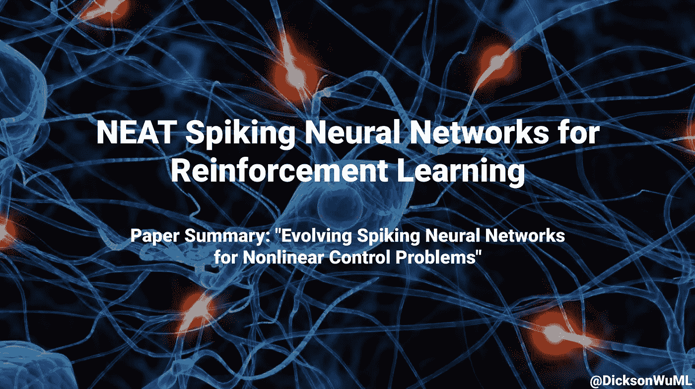

# 用于强化学习的整齐脉冲神经网络

> 原文：<https://medium.com/geekculture/neat-spiking-neural-networks-for-reinforcement-learning-3a606d4aadcd?source=collection_archive---------4----------------------->

## 论文摘要:“非线性控制问题的进化脉冲神经网络”

> 论文作者:邱焕能、马修·加勒特、、斯瑞纳莎·阿纳瓦蒂

# 摘要:

脉冲神经网络(SNN)最近吸引了很多注意力——但是很多…