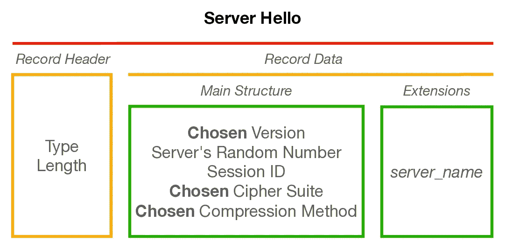
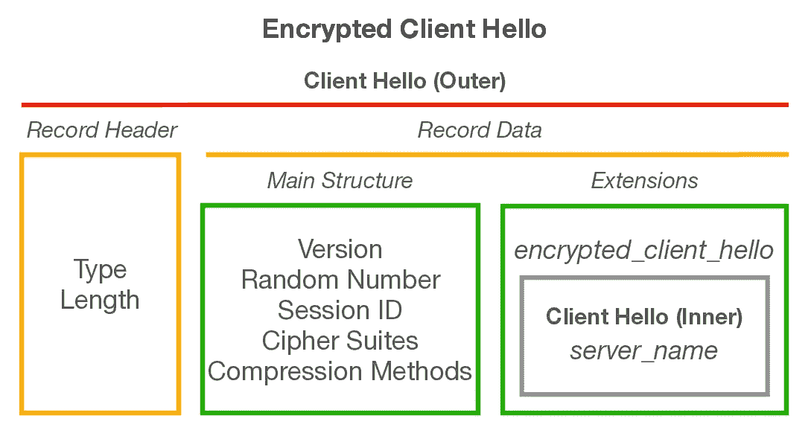

# HTTPS 加密中 TLS 参数的协商

> 原文：<https://medium.com/geekculture/negotiation-of-tls-parameters-for-https-encryption-1217833b3ffa?source=collection_archive---------8----------------------->

## [第 0 根安全网络(0SNet)](https://www.0snet.com)

## 泄露的信息以及保护这些信息的努力

Photo by [Vincent van Zalinge](https://unsplash.com/@vincentvanzalinge?utm_source=medium&utm_medium=referral) on [Unsplash](https://unsplash.com?utm_source=medium&utm_medium=referral)

B 浏览网页原本是不安全的，因为这会让窃听者看到用户到底在做什么。由于使用传输层安全性(TLS)来加密所有 web 流量，这已不再可能。但是，在数据加密之前，客户端和服务器会以 Hello 消息的形式协商加密参数。

建立安全会话的初始协商以明文形式进行。它包含一个握手机制，由客户端发送一个 Hello 消息( **ClientHello** )和服务器发送一个 Hello 响应( **ServerHello** )。

TLS 协议的一些基础知识(**版本 1.2** ) —

*   客户端和服务器以记录的形式交换数据
*   记录可以是以下四种类型之一:**报警**、**握手**、**申请数据、**或**更改密码**

# 客户你好

ClientHello 消息属于**握手**记录类型，是协议中的第一条消息。下面显示了消息的一个示例格式，

该消息包括协议版本、客户端的随机数、会话标识符、接受的密码和压缩方法。可选地，可以存在扩展，例如向服务器提供网站域名的*服务器名*扩展。

请注意，由于消息是纯文本的，窃听者有可能解析 *server_name* 扩展名并知道用户连接到哪个站点。最近，有人重新尝试以加密客户端 Hello (ECH)的形式对此进行加密，本文稍后将对此进行讨论。

# 服务器你好

作为对 **ClientHello** 的响应，服务器发送 **ServerHello** 消息，

此消息通知客户端所选择的协议版本(例如:TLS 1.2)、从客户端提供的密码列表中选择的密码(例如:TLS _ ECD he _ RSA _ WITH _ AES _ 256 _ GCM _ sha 384)、服务器的随机数及其支持的扩展。

在 Hello 消息之后，服务器立即按顺序发出 3 个附加消息，分别是**服务器证书**、**服务器密钥交换、**和**服务器 Hello 完成**。第一条消息提供服务器的证书供客户端验证，而第二条消息包含密钥交换参数以生成临时密钥，该密钥最终用于创建最终的加密密钥，最后一条消息只是一条信令消息。

请注意，所有这些仍然是纯文本。这些消息中有检测中间人篡改的机制。然而，窃听者仍然知道所使用的密码和由服务器提供的证书，该证书可能包含个人信息，例如，证书是发给谁的。

# 加密

最后，客户端处理服务器的 Hello 消息，并将其部分密钥交换参数作为**客户端密钥交换**消息发送。现在，客户端和服务器都可以生成临时秘密。用它创建一组相同的密钥来加密和解密应用程序数据。

双方发送**改变密码**消息作为切换到加密数据传输的信号。该消息之后的所有记录将用新建立的密钥完全加密。

值得注意的是，在发送**客户端密钥交换**消息之前，客户端使用可信根证书数据库验证服务器的证书。这样做是为了确保充当服务器的端点(与其协商加密参数)是合法的。

# TLS 版本 1.3

该协议的新版本有重大变化，将在单独的文章中讨论，其中之一是服务器证书的加密。这只是为了防止被动监控，如协议的[安全属性中所述。](https://tools.ietf.org/html/rfc8446#page-143)

> **端点身份的保护:**应该保护服务器的身份(证书)免受被动攻击者的攻击。应该保护客户端的身份免受被动和主动攻击者的攻击。

该协议引入了新的消息 **EncryptedExtensions** 来保护服务器发送的扩展中的信息。然而，这并不能保护 **ClientHello** 中的扩展，比如 *server_name* ，它们继续保持纯文本格式。

# 加密客户端 Hello

一个正在进行的工作规范为 TLS 1.3 定义了一个新的扩展加密客户端 Hello，它对 *server_name* 的内容以及 **ClientHello** 消息中的其他敏感扩展进行加密。虽然这可以确保 TLS 上的通信完全保密，但仍有可能通过其他渠道推断出一些信息，例如纯文本 DNS 查询。

该规范不遗余力地实现其目标。它使用一个 **ClientHelloOuter** 结构，这是实际的 **ClientHello** 消息，带有 *encrypted_client_hello* 扩展，扩展数据包含*encrypted***client hello inner**结构和相关的加密参数。

**ClientHelloInner** 是理解 *encrypted_client_hello* 扩展的服务器将要使用的 **ClientHello** 消息。它最终将在 *server_name* 扩展中包含网站的域名，从而保护其免受被动监控。

为保护通过 TLS 传输的信息，已经开展了大量的工作。然而，仍有几个方面需要努力，以确保通信的完全保密性。这是否有可能还不得而知。就像他们说的，人类是安全上最薄弱的一环。

## 参考资料:

1.  **TLS 1.2** ，[https://tools.ietf.org/html/rfc5246#page-36](https://tools.ietf.org/html/rfc5246#page-36)
2.  **TLS 1.3** ，[https://tools.ietf.org/html/rfc8446#page-143](https://tools.ietf.org/html/rfc8446#page-143)
3.  **ECH** ，[https://tools . IETF . org/html/draft-IETF-TLS-esni-09 # section-10.1](https://tools.ietf.org/html/draft-ietf-tls-esni-09#section-10.1)

*在第 0 根，我们提供解决方案* [*第 0 根安全网络— 0SNet*](https://www.0snet.com/) *使用 TLS 客户端证书保护组织的内部 web 应用。看看我们的产品吧，它很容易部署，可以在*[*AWS*](https://0snet.info/#install.aws)*、* [*、GCP*](https://0snet.info/#install.gcp) *和*[*Azure*](https://0snet.info/#install.azu)*上找到。*