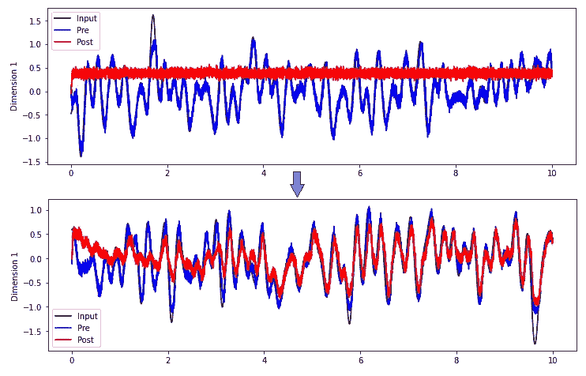

# Nengo:使用 Python 示例使用 PES 规则生成信号

> 原文：<https://medium.com/geekculture/nengo-generating-signals-with-pes-rule-with-python-example-bd6082ed29c1?source=collection_archive---------24----------------------->

## PES 用于最小化输出信号中的误差

The PES rule for the signals. A photo by Author

在这篇文章中，我们将讨论有和没有规定的错误灵敏度(PES)规则的信号监督学习。PES 减少了信号中的误差，并准确地学习输入。