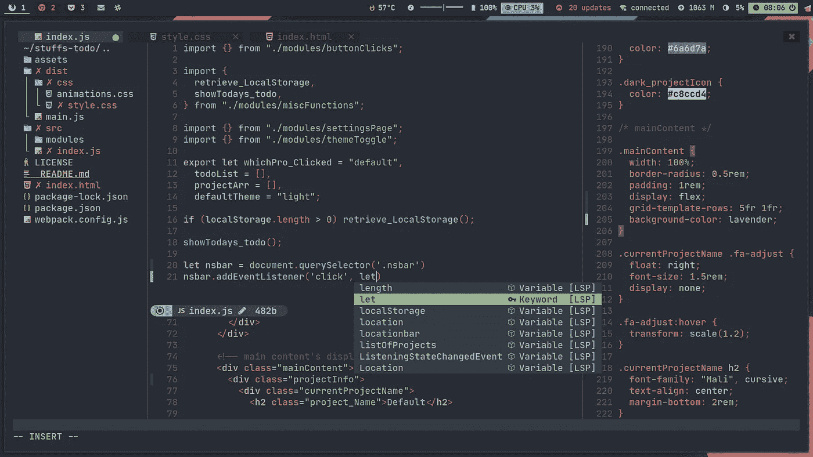

# 面向初学者的 Neovim 配置

> 原文：<https://medium.com/geekculture/neovim-configuration-for-beginners-b2116dbbde84?source=collection_archive---------0----------------------->


如果您可能认为 vim 是一个陈旧过时的文本编辑器，具有很高的学习曲线和有限的功能，那么您就大错特错了。

Vim 是一个非常快速、跨平台、免费、开源、可定制、可扩展的流行文本编辑器，许多人都在使用它。一旦你开始使用它，你会讨厌所有其他的文本编辑器。

现在我们来谈谈 [**Neovim**](https://neovim.io/) ，它是 [**Vim**](https://wiki.archlinux.org/title/Vim) 的一个分支，旨在改进代码库，允许更容易地实现 API，改进用户体验，以及插件实现。比起 vim 我更喜欢 Neovim。



尽管默认情况下 neovim 是一个非常好的工具，但是它缺少一些特性，比如代码补全。我们将通过位于~/的配置文件来修复这些问题。 *config/nvim/init.vim*

```
set nocompatible            " disable compatibility to old-time vi
set showmatch               " show matching 
set ignorecase              " case insensitive 
set mouse=v                 " middle-click paste with 
set hlsearch                " highlight search 
set incsearch               " incremental search
set tabstop=4               " number of columns occupied by a tab 
set softtabstop=4           " see multiple spaces as tabstops so <BS> does the right thing
set expandtab               " converts tabs to white space
set shiftwidth=4            " width for autoindents
set autoindent              " indent a new line the same amount as the line just typed
set number                  " add line numbers
set wildmode=longest,list   " get bash-like tab completions
set cc=80                  " set an 80 column border for good coding style
filetype plugin indent on   "allow auto-indenting depending on file type
syntax on                   " syntax highlighting
set mouse=a                 " enable mouse click
set clipboard=unnamedplus   " using system clipboard
filetype plugin on
set cursorline              " highlight current cursorline
set ttyfast                 " Speed up scrolling in Vim
" set spell                 " enable spell check (may need to download language package)
" set noswapfile            " disable creating swap file
" set backupdir=~/.cache/vim " Directory to store backup files.
```

将这些文件添加到 init.vim 中。Neovim 和 vim 使用 vimscript 作为配置文件。不考虑注释语句(")，每行的作用不言自明。但是我不推荐使用注释命令，因为我喜欢它们的默认行为。拥有一个交换文件对我来说似乎是安全的。我不想改变交换文件的位置(默认情况下是当前目录)。

现在真正的游戏是在使用插件的时候开始的。使用插件管理器是管理插件的最好方法(我真的推荐 vimplug 作为插件管理器，我会使用 vimplug 来安装插件)。

```
call plug#begin(“~/.vim/plugged”)
 “ Plugin Section
 Plug 'dracula/vim'
 Plug 'ryanoasis/vim-devicons'
 Plug 'SirVer/ultisnips'
 Plug 'honza/vim-snippets'
 Plug 'scrooloose/nerdtree'
 Plug 'preservim/nerdcommenter'
 Plug 'mhinz/vim-startify'
 Plug 'neoclide/coc.nvim', {'branch': 'release'}
call plug#end()
```

将上面一行添加到 init.vim 中，在命令模式下运行`PlugInstall`安装上面的插件。想更新插件的时候可以运行`PlugUpdate`。

*   德古拉——一个非常好的主题
*   nerdcommenter 注释掉行的简单方法
*   nerdtree——neovim 的文件浏览器(netrw 是 neo vim 的默认设置)
*   vim-devicon—对 nerdtree 的 devicon 支持
*   ultisnips —片段引擎
*   vim-snippets——代码片段的集合
*   vim-startify——一个非常方便的起始页，有很多定制
*   COC——一个快速代码完成引擎

通过一些额外的键绑定和一些定制，这些是真正的宝石。

```
“ color schemes
 if (has(“termguicolors”))
 set termguicolors
 endif
 syntax enable
 “ colorscheme evening
colorscheme dracula" open new split panes to right and below
set splitright
set splitbelow
```

现在，把上面的线也加上。现在让我们添加一些按键。

```
" move line or visually selected block - alt+j/k
inoremap <A-j> <Esc>:m .+1<CR>==gi
inoremap <A-k> <Esc>:m .-2<CR>==gi
vnoremap <A-j> :m '>+1<CR>gv=gv
vnoremap <A-k> :m '<-2<CR>gv=gv" move split panes to left/bottom/top/right
 nnoremap <A-h> <C-W>H
 nnoremap <A-j> <C-W>J
 nnoremap <A-k> <C-W>K
 nnoremap <A-l> <C-W>L" move between panes to left/bottom/top/right
 nnoremap <C-h> <C-w>h
 nnoremap <C-j> <C-w>j
 nnoremap <C-k> <C-w>k
 nnoremap <C-l> <C-w>l

" Press i to enter insert mode, and ii to exit insert mode.
:inoremap ii <Esc>
:inoremap jk <Esc>
:inoremap kj <Esc>
:vnoremap jk <Esc>
:vnoremap kj <Esc>
```

这里，

*   inoremap:在插入模式下映射键
*   nnoremap:在正常模式下映射键
*   vnoremap:在可视模式下映射键
*   <c>:代表控制键</c>
*   : Alt 键

现在让我们再添加一些

```
" open file in a text by placing text and gf
nnoremap gf :vert winc f<cr>" copies filepath to clipboard by pressing yf
:nnoremap <silent> yf :let @+=expand('%:p')<CR>
" copies pwd to clipboard: command yd
:nnoremap <silent> yd :let @+=expand('%:p:h')<CR>" Vim jump to the last position when reopening a file
if has("autocmd")
  au BufReadPost * if line("'\"") > 0 && line("'\"") <= line("$")
    \| exe "normal! g'\"" | endif
endif
```

你可能会从中发现一些有趣的东西。au (autocommand)，它有助于在 vim 启动时运行命令(实际上是在创建缓冲区时)

如果您想了解更多关于 vim 的信息，只需使用:help name。尽管我使用的是 neovim，但所有这些也适用于 vim。对于 vim，配置文件将是`~/.vimrc`,而不是`~/.config/nvim/init,vim`。

暂时就这样了。我知道我错过了很多我想说的东西，我会把这些都放在以后的文章里。neovim 有很多可能的功能，如何设置取决于你自己。