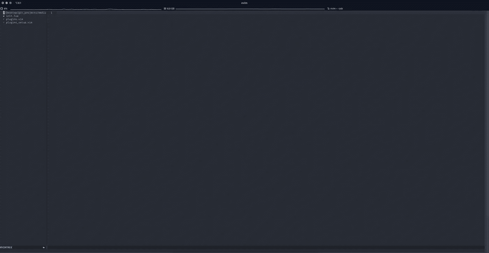
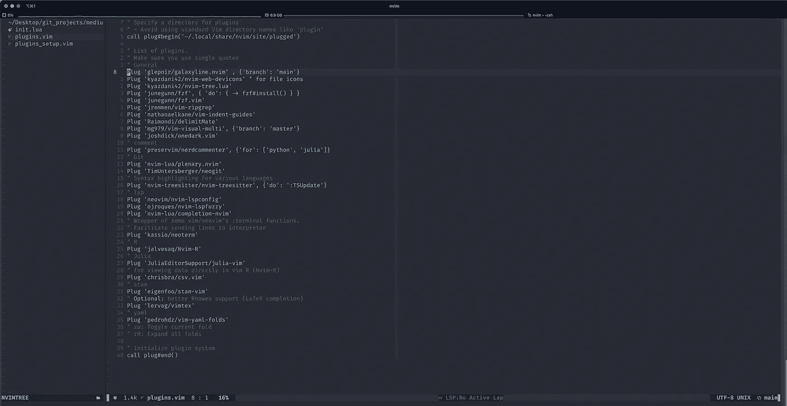
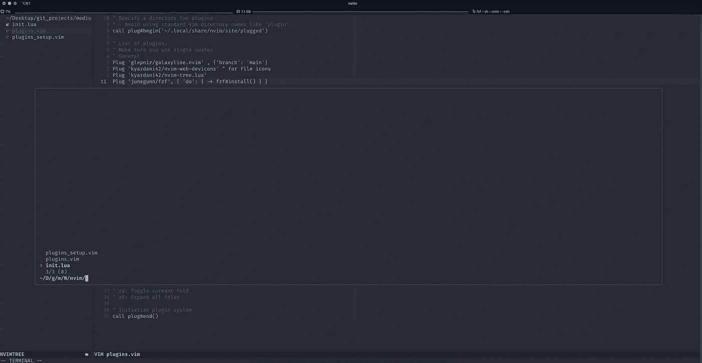
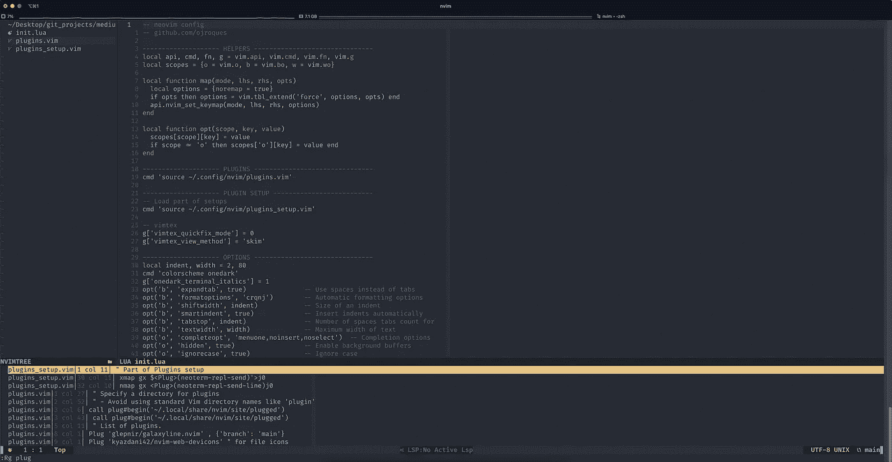
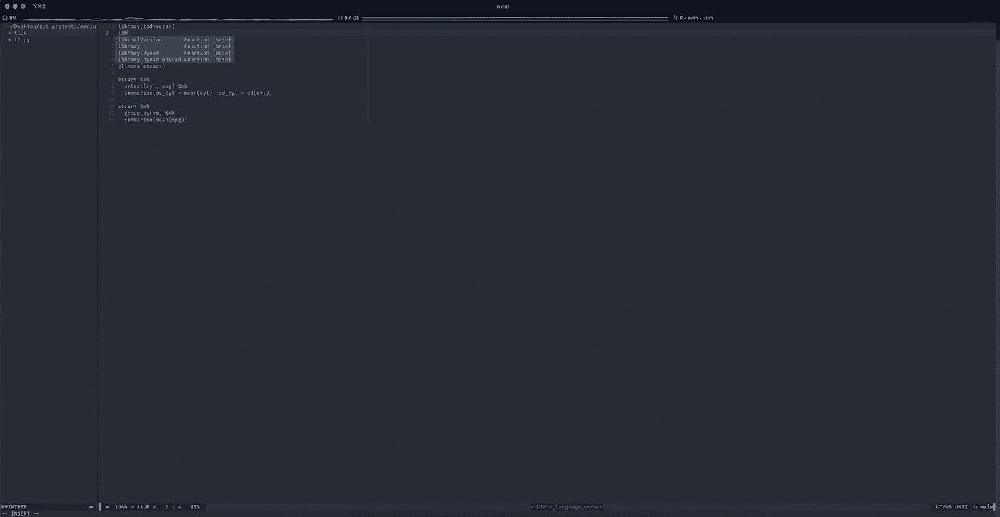
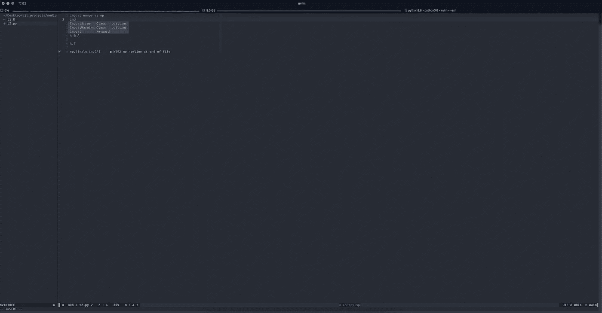
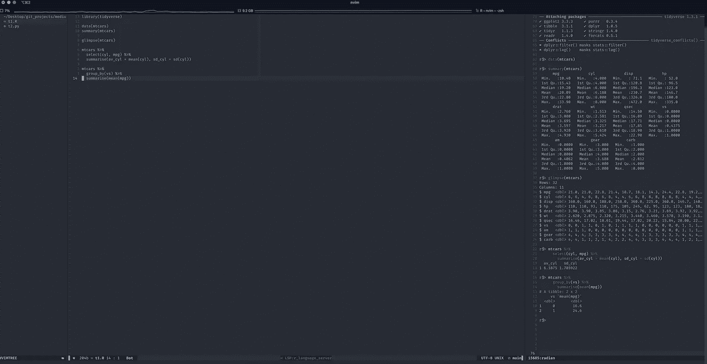
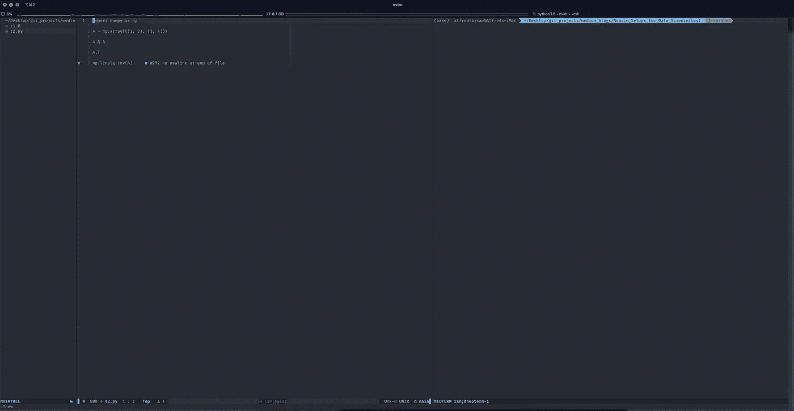
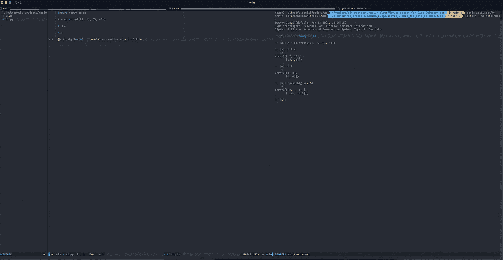

# 用于数据科学的 Neovim 设置

> 原文：<https://medium.com/geekculture/neovim-setups-for-data-science-5ea251e3735f?source=collection_archive---------1----------------------->


这是我毕业后的第一篇博客，所以就用我 2019 年在旅游时拍的一张我最喜欢的照片——石来贴标签吧。"生活就像一盒巧克力，你永远不知道你会得到什么."它准确地描述了我过去的经历。本科时，我对经济学和博弈论非常着迷，但我决定在商学院攻读市场营销博士学位。当我尝试在学术界准备职业生涯时，我爱上了微观计量经济学和机器学习，并下定决心在行业而不是大学探索商业战略和消费者行为之间的互动。我也喜欢分享，所以近年来我和年轻人讨论我的经验和发现(我也是！)在大学里。我应该早点开始写，现在我有机会了。

这篇文章介绍了用于数据科学的 Neovim 设置。

数据科学家需要编程。然而，我们对编程的关注与其他开发者不同，例如全栈、前端、工程师等等。，因为我们有不同于其他开发人员的特殊工作流程。例如，数据科学家通常有两个主要任务:一个是数据清理和预处理，另一个是为模型训练建立管道。因此，数据科学家通常需要特定于这些任务的相关语言，其中 R 和 Python 是最常见的选择。有时，如果真正关心的是速度瓶颈，也需要其他低级语言，如 cpp 和 fortran。如今，Julia 似乎是多语言的潜在解决方案，我已经对其早期版本进行了几次测试。然而，预计在未来，Julia 将在数据科学领域占据独一无二的主导地位，但从长远来看，Julia 也很有可能与 R 和 Python 共存。因此，数据科学家通常需要为项目操作特定的语言，所以除了一般开发人员的编辑器设置参考外，数据科学的编辑器设置参考也是必要的。

为什么用 neovim 作为我的第一个编辑器？首先，(neo)vim 键绑定是编程的迷人特征，尤其是在效率方面。诚然,( neo)vim 近乎垂直的学习曲线主要是由于它复杂的按键绑定。然而，熟悉基本部分就足以以有效的方式编辑文件(避免鼠标)。其次，多种语言自然是总编辑器支持的，像 neovim。由于日常工作不可避免地包括多种语言，理想情况下，数据科学家可以在整个项目中坚持相同的编辑模式(例如，按键绑定)。另一方面，neovim 可以很容易地扩展，以适应使用插件的多种语言的编程需求。有些 ide 是为特定语言设计的，比如 Rstudio 和 Pycharm。频繁地在不同的编辑器之间切换以适应不同的设置，似乎不太方便。因此，neovim 可以轻松满足数据科学家的需求。第三，原始的 neovim 比现代的电子编辑器更受欢迎，尤其是在速度和流畅度方面。坦率地说，基于电子的编辑器，如 Atom 和 VScode，都是跨平台的，也支持多种语言。此外，这类编辑器的插件社区通常很受欢迎，GUI 的设计通常也很漂亮。然而，基于电子的应用程序通常运行缓慢，延迟问题有些严重。其他家伙似乎也有类似的感受，比如[*Vim 如何在我的机器上杀死 Atom 和 vs code*](/@aswinmohanme/how-vim-killed-atom-and-vscode-723a68ad59dc)和 [*为什么我还在用 Vim*](/commitlog/why-i-still-use-vim-67afd76b4db6) 。

# 用于参考的 Neovim 设置

本节将介绍关键插件和相关设置。你也可以在 Github 中查看我的完整设置文件:[https://Github . com/AlfredSAM/medium _ blogs/tree/main/neo vim _ Setups _ for _ Data _ Science/nvim](https://github.com/AlfredSAM/medium_blogs/tree/main/Neovim_Setups_for_Data_Science/nvim)。感谢 Olivier Roques 的推荐，我可以有基本的模板来构建这些文件。

首先可以介绍几个准备步骤。首先需要安装最新版本的 neovim。观众可能会注意到，在这篇文章中推荐的是 neovim，而不是 vim。实际上，neovim 是改进的 vim，在 vim 的各种变体中非常流行。neovim 的夜间开发版本是 0.5，它带来了相对较大的变化和好处，所以我也介绍了这种 0.5 版本的设置。0.5 版本最大的变化之一是内置了 Lua。因此，你可以发现我当前的主文件是 [init.lua](https://github.com/AlfredSAM/medium_blogs/blob/main/Neovim_Setups_for_Data_Science/nvim/init.lua) ，而不是早期版本中使用的`init.vim`。然而，并不是我现在使用的所有插件都是用 Lua 重写的，所以我需要保留一些仍然使用 Vimscripts 的设置。基本的逻辑是，[init . lua](https://github.com/AlfredSAM/medium_blogs/blob/main/Neovim_Setups_for_Data_Science/nvim/init.lua)sources[plugins . vim](https://github.com/AlfredSAM/medium_blogs/blob/main/Neovim_Setups_for_Data_Science/nvim/plugins.vim)用于插件的安装， [plugins_setup.vim](https://github.com/AlfredSAM/medium_blogs/blob/main/Neovim_Setups_for_Data_Science/nvim/plugins_setup.vim) 用于使用 Vimscripts 设置部分插件，然后使用 Lua 设置其他东西。首先，我们需要安装 0.5 版本的 neovim。我工作和娱乐都用 Mac。在[家酿](https://brew.sh/)的帮助下，人们可以很容易地得到这样的最新版本:

```
$brew install --HEAD neovim
```

对于 linux 用户来说，从源代码安装是通常的方式。对于 windows 用户，建议使用 WSL2，从源代码安装应该不成问题。顺便说一句，这里介绍的设置可以很容易地移植到 Linux/Unix 系统，即使我只使用 Mac。安装后，只需检查，你就会看到

```
$nvim --versionNVIM v0.5.0-dev+nightly-139-gd16e9d8ed
Build type: Release
LuaJIT 2.1.0-beta3
```

如上所示，需要插件，然后需要选择插件的管理工具。目前我仍然使用经典工具 [vim-plugin](https://github.com/junegunn/vim-plug) ，对于 neovim，只需在终端或 Iterm2 中输入以下内容:

```
sh -c 'curl -fLo "${XDG_DATA_HOME:-$HOME/.local/share}"/nvim/site/autoload/plug.vim --create-dirs \
       https://raw.githubusercontent.com/junegunn/vim-plug/master/plug.vim'
```

在安装了 0.5 版本的 neovim 和 [vim-plugin](https://github.com/junegunn/vim-plug) 之后，你可以简单地将整个文件夹[https://github . com/AlfredSAM/medium _ blogs/tree/main/neo vim _ Setups _ for _ Data _ Science/nvim](https://github.com/AlfredSAM/medium_blogs/tree/main/Neovim_Setups_for_Data_Science/nvim)复制到 repository ~/.config 下

```
nvim
```

才能进入 app。当一个人第一次进入 neovim 时，可能会发现一些错误，基本上是因为缺少插件。所以只需点击`enter`跳过错误进入欢迎屏幕，然后输入

```
:PlugInstall
```

然后等待安装完成。现在退出(:q！)并重新输入 neovim，您将看到以下截图:



Open nvim and see NvimTree is on the left

当你打开某个目录下的 neovim 时，这是一个干净的打开，你可以在左边找到 [NvimTree](https://github.com/kyazdani42/nvim-tree.lua) 来导航文件。在剩下的部分中，介绍了几个典型的插件。

## 用于编辑的常规设置

```
Plug 'glepnir/galaxyline.nvim' , {'branch': 'main'}
Plug 'kyazdani42/nvim-web-devicons' " for file icons
Plug 'kyazdani42/nvim-tree.lua'
```



[NvimTree](https://github.com/kyazdani42/nvim-tree.lua) 是左侧窗口的轻量级文件浏览器， [galaxyline](https://github.com/glepnir/galaxyline.nvim) 是 statusline 插件，在活动缓冲区的同一窗口底部显示文件的基本信息。都是用 Lua 写的，速度超快。另一方面， [nvim-web-devicons](https://github.com/kyazdani42/nvim-web-devicons) 是为 neovim 中的文件添加图标的插件。实际上它不是必须的，但是用起来很好。然而，图标的正确显示是基于[书呆子字体](https://www.nerdfonts.com/)。现在我用的是[https://github . com/home brew/home brew-cask-fonts/tree/master/Casks](https://github.com/Homebrew/homebrew-cask-fonts/tree/master/Casks)中的 [font-fira-code-nerd-font](https://github.com/Homebrew/homebrew-cask-fonts/blob/master/Casks/font-fira-code-nerd-font.rb) ，可以支持图标和连字，让代码好看。一般来说，除了 [NvimTree](https://github.com/kyazdani42/nvim-tree.lua) 之外，文件导航也需要一种更智能的方式。 [fzf.vim](https://github.com/junegunn/fzf.vim) 可以根据文件名帮助查找文件，而 [vim-ripgrep](https://github.com/jremmen/vim-ripgrep) 可以根据文件内的代码片段帮助查找文件。

```
Plug 'junegunn/fzf', { 'do': { -> fzf#install() } }
Plug 'junegunn/fzf.vim'
Plug 'jremmen/vim-ripgrep'
```



:FZF



:Rg

另外两个插件用于缩进标记(方便 Python 编码)和括号的自动补全:

```
Plug 'nathanaelkane/vim-indent-guides'
Plug 'Raimondi/delimitMate'
```

最后但同样重要的是， [vim-visual-multi](https://github.com/mg979/vim-visual-multi) 试图模仿关于使用多个光标的操作的升华文本的关键特征。可以查一下关于用法的文件:[https://github.com/mg979/vim-visual-multi/wiki](https://github.com/mg979/vim-visual-multi/wiki)

```
Plug 'mg979/vim-visual-multi', {'branch': 'master'}
```

## 饭桶

数据科学家通常依靠 git 进行编码历史管理。因此，方便的 git 命令通常会有所帮助。Neogit 是用 Lua 编写的 neovim 的 Magit 克隆，值得一试。

```
Plug 'nvim-lua/plenary.nvim'
Plug 'TimUntersberger/neogit'
```

## 语法突出显示

从 neovim 的 0.5 版本开始，引入了一个全新的强大的语法高亮工具 [nvim-treesitter](https://github.com/nvim-treesitter/nvim-treesitter) 。你可以在这里查看支持的语言。这种插件，以及关于一般编辑设置的插件，可以使 neovim 在现代编辑器中具有竞争力，尤其是那些基于电子的编辑器。


Traditional highlighting (left) vs Treesitter-based highlighting (right). Source: [https://github.com/nvim-treesitter/nvim-treesitter/blob/master/assets/example-cpp.png](https://github.com/nvim-treesitter/nvim-treesitter/blob/master/assets/example-cpp.png)

```
Plug 'nvim-treesitter/nvim-treesitter', {'do': ':TSUpdate'}
```

每次当一个人更新这个插件时，你可以注意到所有语言的解析器的信息也会一个接一个地更新，显示在状态栏下。因此，只需等待完成，然后重新启动 neovim 以使更新生效。

## 语言服务器协议(LSP)集成

目前 R、Python、Julia 为了方便编辑都提供了自己的包给，这些包都与语言服务器协议(LSP)有关: [languageserver](https://cran.r-project.org/web/packages/languageserver/index.html) 、 [python-lsp-server](https://github.com/python-lsp/python-lsp-server) 、 [LanguageServer.jl](https://github.com/julia-vscode/LanguageServer.jl) 。有了 LSP 的支持，编辑器可以提供一些特性，比如诊断、自动完成和连续提示，甚至自动格式化。一般来说，仍然需要安装与特定语言的 LSP 相关的相应插件，以使编辑器使用 LSP 的功能。从 0.5 版本开始，neovim 有内置的语言服务器客户端来支持多种语言的 LSP。我们只需要安装以下插件，然后对使用的特定语言进行简单设置。

```
Plug 'neovim/nvim-lspconfig'
Plug 'ojroques/nvim-lspfuzzy'
Plug 'nvim-lua/completion-nvim'
```

目前我主要使用 R、Python 和 Julia，所以只为它们做设置。

```
-------------------- LSP -----------------------------------
local lsp = require('lspconfig')
local lspfuzzy = require('lspfuzzy')
for ls, cfg in pairs({
  bashls = {},
  ccls = {},
  jsonls = {},
  julials = {on_attach=require'completion'.on_attach},
  r_language_server = {on_attach=require'completion'.on_attach},
  pylsp = {root_dir = lsp.util.root_pattern('.git', fn.getcwd()), on_attach=require'completion'.on_attach},
}) do lsp[ls].setup(cfg) end
lspfuzzy.setup {}
map('n', '<space>,', '<cmd>lua vim.lsp.diagnostic.goto_prev()<CR>')
map('n', '<space>;', '<cmd>lua vim.lsp.diagnostic.goto_next()<CR>')
map('n', '<space>d', '<cmd>lua vim.lsp.buf.definition()<CR>')
map('n', '<space>f', '<cmd>lua vim.lsp.buf.formatting()<CR>')
map('n', '<space>h', '<cmd>lua vim.lsp.buf.hover()<CR>')
map('n', '<space>m', '<cmd>lua vim.lsp.buf.rename()<CR>')
map('n', '<space>r', '<cmd>lua vim.lsp.buf.references()<CR>')
map('n', '<space>s', '<cmd>lua vim.lsp.buf.document_symbol()<CR>')
```



R-lsp



Python-lsp

## 数据科学家的互动模式

Neovim 可以为数据科学家提供交互模式。区分数据科学家和其他开发人员的一个特征是，数据科学家在编码时大多依赖交互模式。这并不意味着其他开发人员不需要尝试运行代码进行测试和调试。数据科学家通常需要在每个方面处理数据，因此棘手的问题不是代码在语法方面是否正确，而是需要检查基于数据的计算或可视化结果。这也是触发另一个用于数据科学的 [Jupyter](https://jupyter.org/) 的电子编辑器的基本原因，该编辑器以交互方式显示代码块和相应的结果。然而，就像其他基于电子的编辑器一样， [Jupyter](https://jupyter.org/) 也受到性能问题的困扰，所以我只将其用于教学。在 neovim 中，插件可用于将代码发送到相应的控制台来运行。首先， [Nvim-R](https://github.com/jalvesaq/Nvim-R) 是 R 文件的经典和流行插件。有了这个插件，人们可以很容易地将 R 代码发送到 R 控制台来运行和检查结果。你可以查看[文档](https://github.com/jamespeapen/Nvim-R/wiki)的用法，发现 neovim 可以在这个插件的帮助下在大多数方面表现得像 Rstudio 一样。

```
Plug 'jalvesaq/Nvim-R'
```



Nvim-R

就 Python 和 Julia 而言，实现交互模式的另一种方法是首选。交互模式的基本部分只是发送代码到相应的控制台，所以如果一些插件可以提供简单的方法来创建缓冲区之间的连接，那么问题就解决了。另一方面，neovim 中的终端对于 shell 命令也很有用，包括打开某些语言控制台的命令(例如`ipython`)，所以理想的插件应该便于向终端发送代码。因此，我遇到以下情况

```
Plug 'kassio/neoterm'
```



Python file and Neoterm



Python files and send codes to ipython console opened in Neoterm

# 结束语和未来展望

在这篇文章中，我们将与您分享 neovim 的数据科学设置。总的来说，我尽量提供数据科学日常工作所需的最小插件集供您参考，任何人都可以根据自己的需求修改安装文件。这里也可以提出几点意见。首先，使用 neovim 的效率取决于编辑器的质量和对 vim 键绑定的熟悉程度。因此，练习总是有助于记忆按键，但 vim 之旅的开始是最痛苦的。但是，许多资源可以提供帮助，例如，`vimtutor`是 Mac/Linux/Unix 系统中的基础教程。另一方面，你也可以检查上述插件的文档以及文件夹中的参考设置，并检查特定插件的当前按键设计。其次，neovim 的所有设置都在`nvim`文件夹中，因此 neovim 的可移植性在实践中也是有益的。例如，可以打开 git 存储库来保存`nvim`文件夹，然后为不同的机器进行相同的设置。另一方面，现在强大的服务器可用于模型训练，并且通常一些没有 GUI 的 Linux 系统是服务器的常用操作系统。neovim 的可移植性可以表明远程工作的优势，只需将相关文件复制到服务器进行设置即可。当远程工作时，人们只需`ssh`到服务器，并在服务器中使用远程 neovim 作为多种语言的 ide。

这里还需要说明两个问题。一个是讨论基于 neovim 的夜间开发版本，这意味着设置可能需要在未来根据 Lua 编写的新构建的包进行修改。另一个原因是 neovim 本质上是命令行程序，因此它不能很好地使用某些功能。比如在 Mac 上用 neovim 打开一些文件的时候我一开始只能用终端或者 Iterm2 导航到指定的储存库。简单地点击文件用 neovim 打开并不容易。另一方面，目前 Emacs 中的[组织模式](https://orgmode.org/)也很受欢迎，除了传统的减价之外，还可以用于笔记。然而，neovim/vim 中的[组织模式](https://orgmode.org/)插件并不令人满意，可能需要命令行之外的高级功能。为了弥补这些或其他潜在的问题，sublime text 是另一个最受欢迎的编辑器。另一篇介绍面向数据科学的 sublime 文本设置的文章正在撰写中。

# 参考

*   [阿斯温·莫汉。*Vim 如何杀死我机器上的 Atom 和 vs code*。](/@aswinmohanme/how-vim-killed-atom-and-vscode-723a68ad59dc)
*   [卡斯帕拜尔。*为什么我还在用 Vim* 。](/commitlog/why-i-still-use-vim-67afd76b4db6)
*   奥利维尔·罗克斯。 *Neovim 0.5 特性及切换到* `[*init.lua*](https://medium.com/p/5ea251e3735f/edit)`