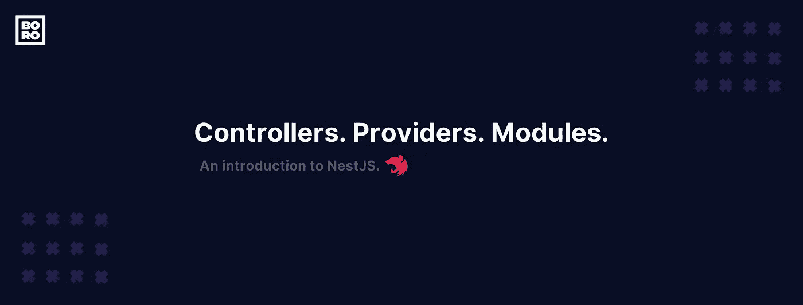
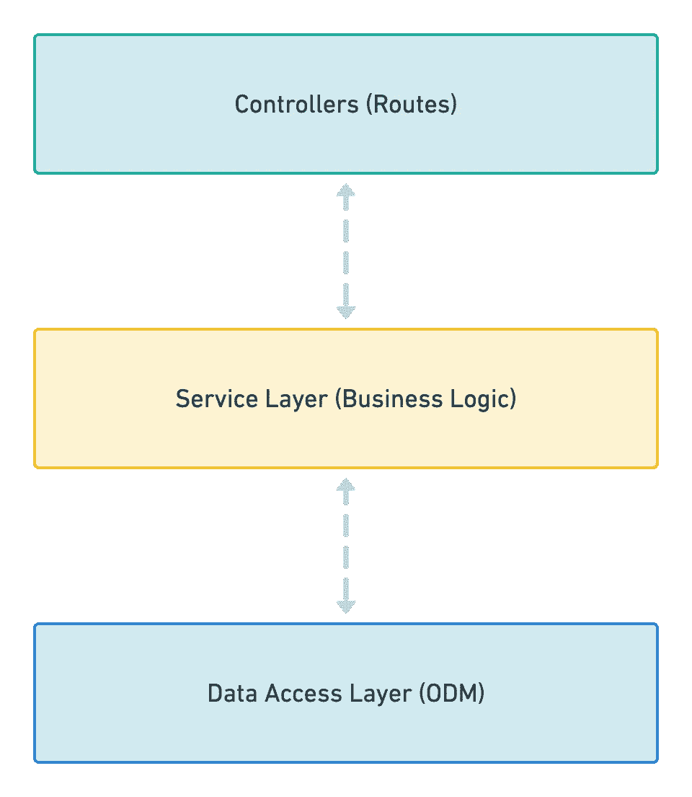
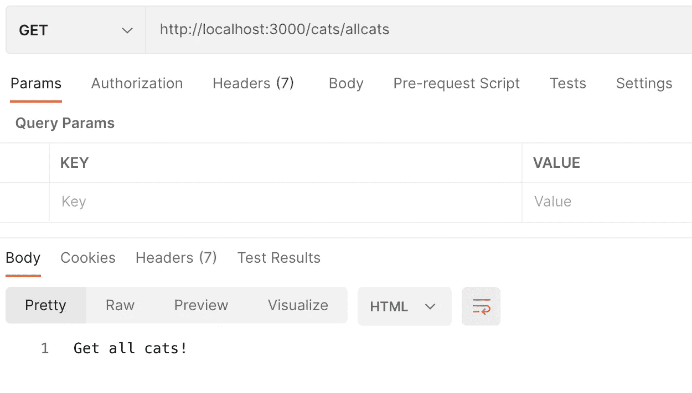

# Nest.js —架构模式、控制器、提供者和模块。

> 原文：<https://medium.com/geekculture/nest-js-architectural-pattern-controllers-providers-and-modules-406d9b192a3a?source=collection_archive---------1----------------------->



# 引言。

> Nest (NestJS)是一个用于构建高效、可伸缩的 Node.js 服务器端应用的框架。它使用渐进式 JavaScript，用 TypeScript 构建并完全支持 TypeScript。——[*NestJS Docs*](https://docs.nestjs.com/)

本质上，NestJS 是 Node 之上的一个层，它拥有强大的方法和实现，可以帮助我们快速、轻松地编写服务器端应用程序。Nest 非常方便地满足您的所有需求。它是高度可定制的，默认情况下使用 Express，但也可以选择配置为使用 Fastify！

# 既然我们有 Node.js，为什么我们还需要 Nest.js？

*   Nest 在 Node 之上提供了一个抽象层，这意味着它现在可以利用 Node 的功能，并公开超级 API 以获得更好的性能和效率。
*   开发者喜欢特性，当你知道你有更多的特性时，你就不能否认这一点。Nest.js 就是这种情况。您现在可以访问大量第三方模块，这些模块可以加快您的开发过程。
*   我相信这完全不是对后端模式的背离。我们仍然在编写相同类型的代码，非常相似的结构，但是增加了一层健壮性。
*   NestJS 也是高度可配置的 ORM(如 TypeORM ),我们可以利用它来处理数据库。这再次意味着您还拥有很棒的 TypeORM 特性，比如 Active Record 和 Data Mapper 模式，您现在可以轻松地利用它们。活动记录模式可以帮助您获得简单性，而数据映射器模式可以帮助您的代码更易于维护。
*   另外要补充的一点是，Nest 承认它的架构很大程度上受到了 Angular 框架的启发。在需要的时候进行毫不费力的测试总是一个好主意，也是一种有效维护代码库的方法。Nest 正好能满足您的需求。一个急需的结构！

# Nest.js 倾向于三层架构。

当我们谈论建立一个稳固的架构时，我们最关心的是如何隔离应用程序的不同部分，以便有意义的部分能够共存。遵循架构模式据说可以帮助解决您可能正在编写的意大利面条式代码。

例如:考虑下面的流程图，我们认识到控制器和服务层一起工作来执行一个逻辑，但完全是两回事。控制器本质上处理应用程序的路由。一个控制器可能有几个不同的路由，这完全取决于路由机制来控制哪个控制器接收什么请求。但是，如果您将所有的业务逻辑都转储到控制器中，会怎么样呢？如果用户尚未注册，可以注册一个新用户，或者只在控制器中执行验证检查。

那毕竟没有太大意义。如果你只有一个小的应用程序，这可能不会有太大的不同。但是当应用程序增长时，您必须注册更多的控制器和路由，并且必须编写更多的业务逻辑，这就是事情似乎失去控制并且肯定不可维护的地方。



Fig: 3-layer architecture.

1.**控制器:**控制器的唯一目的是接收应用程序的请求并处理路由。

2.**服务层:**这部分块应该只包含业务逻辑。例如，确定如何创建、存储和更新数据的所有 CRUD 操作和方法。

3.**数据访问层:**这一层负责并提供访问存储在某种持久存储中的数据的逻辑。例如像猫鼬这样的 ODM。

# 项目目录结构。

一旦您使用它的 CLI 搭建了一个新的 NestJS 项目，它会给您一些样板文件作为开始。这些是您通常会用到的核心文件。目录结构如下所示:

```
src
| — app.controller.spec.ts
| — app.controller.ts
| — app.module.ts
| — app.service.ts
| — main.ts
```

***app . Controller . ts:***包含所有应用程序路径的控制器文件。

***app . controller . spec . ts:***这个文件有助于编写控制器的单元测试。

***app . module . ts:***模块文件本质上是把你应用的所有控制器和提供者捆绑在一起。

***app . service . ts:***服务会包含执行某个操作的方法。例如:注册新用户。

***main . ts:****应用的入口文件会取你的模块 bundle，使用 Nest 提供的 NestFactory 创建一个 app 实例。*

*你马上就会知道有一个你需要遵循的特定结构。这有助于开发人员编写干净、可伸缩和可维护的代码。*

# *让我们看一些代码。*

*让我们创建一个服务文件并导出一个名为 CatsService 的类，该类将实现一些方法，我们可以在控制器文件中导入和利用这些方法。*

*这里我们导出了一个名为`CatsService`的类，并定义了三种不同的方法。我们还使用了装饰器`@Injectable()`。装饰器附加元数据，并将一个类标记为可以作为依赖项提供和注入。因为我们已经将这个类作为依赖项注入，所以让我们在控制器内部使用它来检索猫。*

*在控制器文件中，我们导入了 CatsService，并在构造函数中实例化了服务。CatsService 依赖是通过类构造函数注入的(依赖注入)。这将公开我们在 CatsService 中定义的所有不同的方法。我们现在可以用控制器找回猫了。*

> **依赖是一个类执行其功能所需的服务或对象。依赖注入，或称 DI，是一种设计模式，在这种模式中，类从外部源请求依赖，而不是创建它们。——*[](https://angular.io/guide/dependency-injection)*

**在这里，decorator **@Get()** 接受一个参数(被修饰的方法，在本例中是 getCats 和 getOneCat)并返回增加了功能的相同函数(或者在本例中是一个返回值，在本例中是一个字符串)。**

**另外， **@Get()** decorator 接受一个路径名，我们可以利用它来请求一个特定的路由。例如，对 **/cats/allCats** 的请求将调用方法 **getCats** 并返回所有的猫。**

## **向端点发出请求**

**让我们向刚刚定义的端点 **getAllCats** 发出请求，看看我们得到了什么返回。**

****

**Fig: POSTMAN GET response**

**正如我们所知，返回的结果是预期的。从技术上讲，这是我们将在 Nest 中经常看到的模式。我们有一个服务文件，它将实现我们应用程序的所有方法/逻辑，而控制器文件将负责使用适当的路由从服务返回结果。**

**上面的模块文件将我们所有的控制器和提供者/服务捆绑在一起，并导出一个类，可以导入该类来实例化我们的应用程序。每个应用程序至少有一个根模块。Nest 使用这个根模块来创建应用程序图——Nest 用来解析模块和依赖关系的内部数据结构。**

**我们还可以创建多个特性模块，帮助我们组织与特定特性相关的代码。所有的特性模块都可以导入到根应用模型中。为了演示，我们上面只有一个根模块(本例中是`cats.module.ts`文件)。**

**主文件在创建我们刚刚创建的模块(CatsModule)时为我们引导一个嵌套应用程序。主文件是我们应用程序的入口点。为了创建 Nest 应用程序实例，Nest 使用核心 NestFactory 类。NestFactory 公开了允许创建应用程序实例的静态方法。**

**我们找到了。我们有一个简单的 NestJS 应用程序，它很好地描述了 NestJS 遵循的最佳实践和模式，以及它如何帮助构建可伸缩、可维护和可测试的代码。我希望对 NestJS 的介绍非常简单，能够帮助您理解在 NestJS 中协同工作的块和块。**

# **参考**

*   **NestJS [文档](https://docs.nestjs.com/)。**
*   **Node.js 项目[架构](https://dev.to/santypk4/bulletproof-node-js-project-architecture-4epf)。**