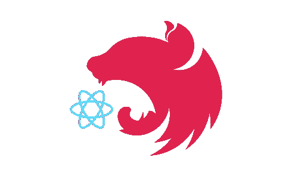

# 一个 MVC Repo 中的 NestJS + React (Next.js ),用于快速原型开发

> 原文：<https://medium.com/geekculture/nestjs-react-next-js-in-one-mvc-repo-for-rapid-prototyping-faed42a194ca?source=collection_archive---------2----------------------->

NestJS 正在解决后端架构的问题。再加上在前端普遍选择 React，你会发现全栈 JS 现在处于一个非常好的位置。我们能否将这些结合到一个易于使用的 MVC 架构中，以实现快速原型开发？

TLDR；是啊！在[nestjs-starter repo](https://github.com/thisismydesign/nestjs-starter)中，我在 Typescript 中将 NestJS 和 Next.js 结合在一起，用 GraphQL 连接(当然是端到端类型！)，在单个 MVC repo(不是多个项目的 monorepo)中，增加了一些功能，比如通过 Passport 和 Cognito 进行身份验证。

本文涵盖了 NestJS + Next.js 集成。

为什么是单一的 MVC 回购？轻量级基础设施！1 次回购，1 次部署，无需同步。服务于 API 的同一后端也可以服务于前端。当然，后端和前端代码和配置需要在回购中很好地分离，并且在未来需要时可以分离到自己的回购中。Typescript 和 ESLint 对此提供了很大的支持。

为什么是 Next.js？这是领先的 React 框架。比使用 create-react-app 更容易配置。CSR、SSR 和静态页面的选项。SSR 尤其适合在同一台主机上使用 Nest API。(也有整合 Nest 与和 [plain React](/swlh/serve-a-create-react-app-application-on-with-nest-js-for-better-seo-and-social-sharing-7093a71d3fc3) 的资源。)

前端优先还是后端优先？可以选择托管 Nest via Next 或者 Next via Nest(我知道，这些名字...).如果您有一个 Nest 部署，那么您可以将它用作下一个[定制服务器](https://nextjs.org/docs/advanced-features/custom-server)。请注意，虽然“定制服务器将删除重要的性能优化，如无服务器功能和自动静态优化。”另一方面，如果您有下一个部署，您可以使用[无服务器函数](https://vercel.com/docs/serverless-functions/introduction)和[动态 API 路由](https://nextjs.org/docs/api-routes/dynamic-api-routes)来运行 Nest。这可能会限制 Nest 应用程序的可伸缩性、托管选项和整体结构。所以在这个例子中，我决定托管一个 Nest 应用程序，并通过它提供 Next。([这里有一个反过来的尝试](https://github.com/Skn0tt/nextjs-nestjs-integration-example)。)

说了这么多，只剩下实现了。

快速搜索会让我们进入 [nest-next](https://github.com/kyle-mccarthy/nest-next) ，但是如果你在这里结束，你可能会像我一样遇到问题( [1](https://github.com/kyle-mccarthy/nest-next/issues/75) ， [2](https://github.com/kyle-mccarthy/nest-next/issues/76) )或者发现它没有很好地解决后端和前端的分离:强制`pages`文件夹位置[在结构](https://github.com/kyle-mccarthy/nest-next/tree/1356c625399e5a1b47f0259b5f11b00f31e45680#viewspages-folder)的顶部，或者他们的[自定义](https://github.com/kyle-mccarthy/nest-next/tree/1356c625399e5a1b47f0259b5f11b00f31e45680#tsconfigjson) `[tsconfig](https://github.com/kyle-mccarthy/nest-next/tree/1356c625399e5a1b47f0259b5f11b00f31e45680#tsconfigjson)` [设置](https://github.com/kyle-mccarthy/nest-next/tree/1356c625399e5a1b47f0259b5f11b00f31e45680#tsconfigjson)。你会发现，你可以通过指定你喜欢的任何文件夹来解决分离问题，并且为下一个应用服务的代码足够简单，你不必将其隐藏在复杂而固执己见的库中。

其他尝试包括:

*   1、[本条](/real-dev-engineering/next-nest-working-together-199bd45c1bcc)以缺码为例
*   2、[这个有希望的方案](https://javascript.plainenglish.io/render-next-js-with-nestjs-did-i-just-made-next-js-better-aa294d8d2c67)，最终被[改写](https://github.com/nestjs/graphql/issues/1485) `[/graphql](https://github.com/nestjs/graphql/issues/1485)` [路线](https://github.com/nestjs/graphql/issues/1485)
*   3、[本视频](https://www.youtube.com/watch?v=vHLY2-ZCOiI)与[相关的回购](https://github.com/kelvin-mai/nest-next-example)解释了一个旧版本的`nest-next`
*   4，[这个鲜为人知但很棒的解决方案](https://dev.to/saltyshiomix/an-introduction-of-the-integration-library-with-nestjs-and-next-js-29f1)和[相关库](https://github.com/saltyshiomix/nestpress/blob/master/packages/next/README.md)，再次将一些相当简单的东西隐藏到一个固执己见的库中

我下面的解决方案结合了 2 和 4。我使用一个完全由我控制的 15 行服务，而不是一个库。

回购:[https://github.com/thisismydesign/nestjs-starter](https://github.com/thisismydesign/nestjs-starter)

相关 PR:[https://github . com/thisismydesign/nestjs-starter/pull/2/files](https://github.com/thisismydesign/nestjs-starter/pull/2/files)

# 第一步，安装

# 第二步，查看模块

正如您在视图服务中看到的，我们显式地创建了一个 Next.js 服务器。您可以提供自定义配置和目录。我选择了`src/client`和`src/server`文件夹。你的下一页将会在`src/client/pages.`

您还会注意到控制器中的两个特定路径，`@Get('home')`用于单个页面，`@Get('_next*')`用于资产。无论主模块中的导入顺序如何，当前定义的一个全包路由[会覆盖](https://github.com/nestjs/graphql/issues/1485) `[/graphql](https://github.com/nestjs/graphql/issues/1485)` [端点](https://github.com/nestjs/graphql/issues/1485)。如果你使用它，你需要显式地定义页面。页面的处理程序将是相同的。

您也可以使用安全措施，例如管理来自 Nest 的认证。

# 第 3 步，下一页🎉

在`src/client/pages/home.tsx`

您还可以使用 SSR 和 Next 的`getServerSideProps`来查询您的 API。

# 步骤 4，文件夹结构

将服务器代码移动到`src/server`并添加进一步的配置以使文件夹结构工作:

# 步骤 5，集成测试(可选)

如果你在你的应用模块上运行[集成测试](https://docs.nestjs.com/fundamentals/testing#end-to-end-testing)，在那里导入`ViewModule`会使测试失败。我创建了一个顶层`ServerModule`结合`AppModule`视图`ViewModule`作为入口模块:[https://github . com/thisismydesign/nestjs-starter/pull/2/commits/aff 04 b4a 537 AFB 6 D3 bb 4 F3 d 6 af 6 e 7d 867 E8 a 84](https://github.com/thisismydesign/nestjs-starter/pull/2/commits/aff04b4a537afb6d3bb4f3a4d6af6e7d867e8a84)

最后，您有了一个部署就绪的应用程序，可以快速构建后端和前端。你会发现更多关于页面、后端数据查询和回购中其他特性的例子:[https://github.com/thisismydesign/nestjs-starter](https://github.com/thisismydesign/nestjs-starter)