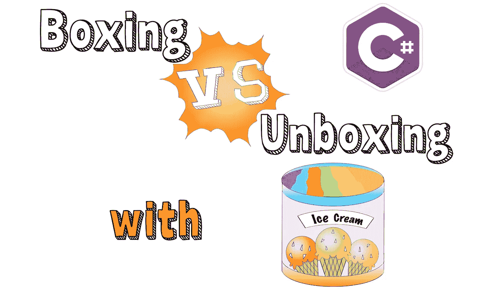

# 。网络拳击 vs 假人拆箱

> 原文：<https://medium.com/geekculture/net-boxing-vs-unboxing-for-dummies-9e644de73e65?source=collection_archive---------5----------------------->

## 记忆宫殿是一种强大的技术，可以帮助程序员记住概念，永远不会把它们弄乱。

©Mihai Sandu

装箱和拆箱仍然是 C#编程的基础。在调用函数、创建对象、面试等等的时候，你会碰到它们。它们在美国无处不在。网络空间，所以坚实的理解…