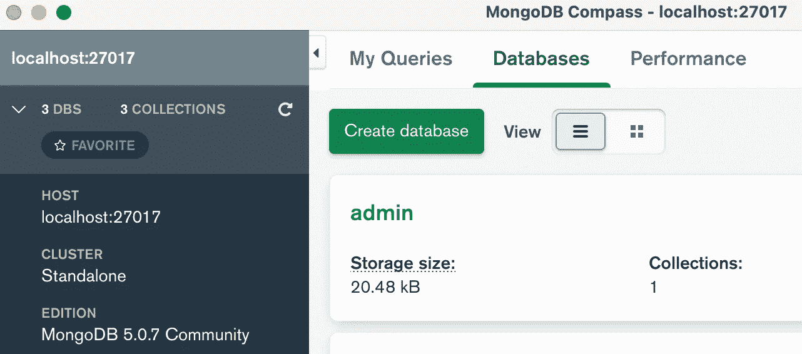
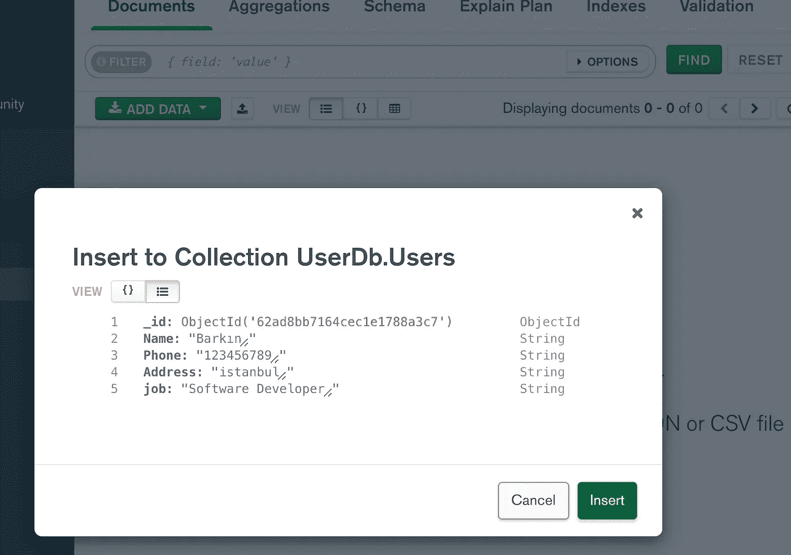
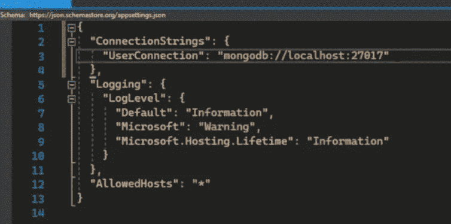
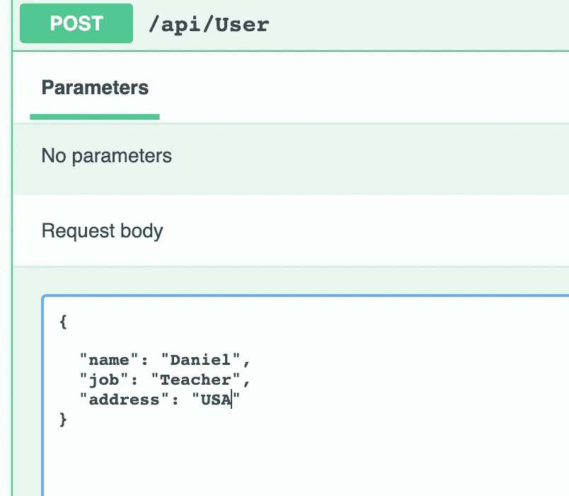
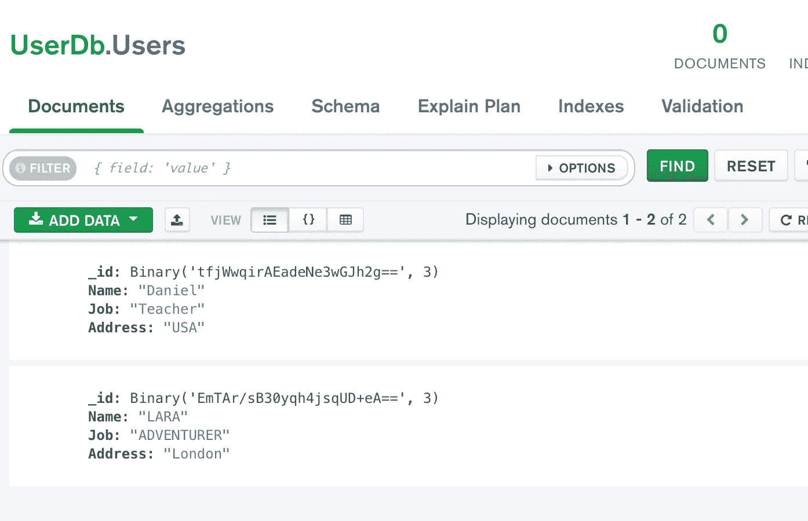
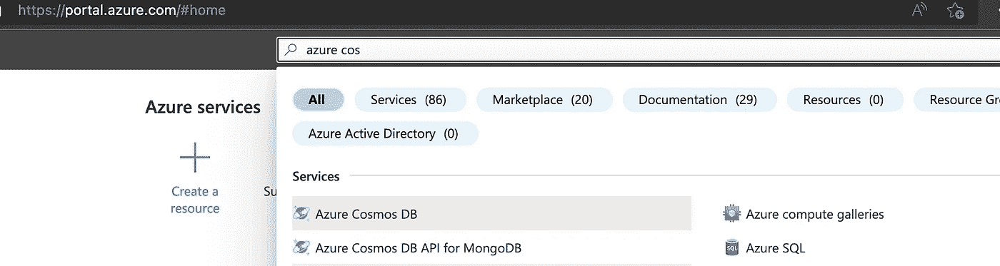
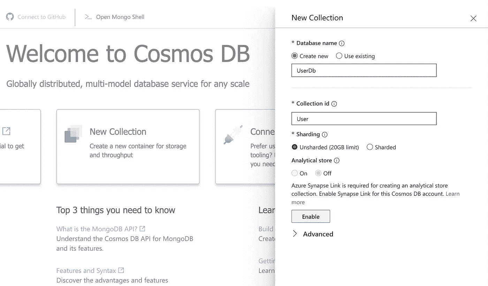

# Net Core 6，带有 MongoDb 和 Azure Cosmos，用于 Mongo- MacOS

> 原文：<https://medium.com/geekculture/net-core-6-with-mongodb-and-azure-cosmos-for-mongo-macos-b7b3448bba73?source=collection_archive---------13----------------------->

[https://www.pexels.com/](https://www.pexels.com/)

让我们从 MongoDB 的定义开始

MongoDB 是一个 NoSQL 数据库，我们也可以说是非关系数据库

关系数据库

有表、列、行，甚至表和实体之间的关系。并使用结构化查询语言或 SQL

非关系数据库

它没有行和列的表格模式。基于数据结构，如文档和集合。

对于本文的主题，我们就不深入 Mongo DB 了。但是我们将创建一个 restful API，然后我们将编写一些 CRUD 操作。最后，我们将在应用程序中使用 Azure Mongo DB。

因为没有足够的源代码，我们将从安装 MongoDB 到 MacOs 开始

对于安装，我们将使用自制。所以要先装家酿。

我们需要在 macos 终端上运行这个命令

/bin/bash-c " $(curl-fsSL https://raw . githubusercontent . com/home brew/install/HEAD/install . sh)"

安装完成后。我们可以开始安装 MongoDB 了。所以我们可以从官方页面开始按照这些步骤来做。安装完成后，我们需要在本地计算机上运行 MongoDB。

要创建 MongoDB，我们需要一个额外的工具。也就是 MongoDB 罗盘。可以从其[页面](https://www.mongodb.com/try/download/compass)下载。

如果我们能打开 MongoDB 指南针，就会有连接按钮。点击这个按钮后，它将连接我们的本地 MongoDB。

我们应该单击 CreateDatabase 按钮。然后它会询问数据库名和集合名。对于这个例子，我将创建 UserDb 和 Users 集合。

然后我们需要选择我们创建的数据库。我们会看到我们的收藏。使用添加数据按钮。我们可以打开插入文档屏幕。

但是因为我们将使用 rest API 来提供我们的数据库，所以我们可以删除数据。

要在我们的项目中使用 MongoDB，我们需要安装 MongoDb。NuGet 的驱动程序包。

然后，我们需要打开 AppSettings 文件，我们应该创建 ConnectionString。您可以从指南针应用程序中了解您的端口号。您的邮政编号必须与您的端口号相同。

我们将创建一个服务来处理 CRUD 操作。

但在此之前，我们可以看看如何查询 MongoDB

**GetAllUsers**:Find(u =>true)。ToListAsync()；
**getuser byid**:Find(u =>u . id = = id)。FirstOrDefaultAsync()；
**AddUser**:insertone async(用户)；
update user:ReplaceOneAsync(u =>u . id = = id，user)；
**DeleteUser:**DeleteOneAsync(u =>u . id = = id)；

有了这些信息，我们可以创建用户服务

现在我们可以从控制器使用这个服务。

现在我们可以试着运行这个项目。

很容易不是吗？

现在让我们在 Azure Cosmos 中使用 mongo。为什么是宇宙？因为 cosmos 不是 SQL，它可以和 MongoDB 一起工作。

从 Azure 门户搜索 azure cosmos，然后选择 Azure Cosmos DB API for MongoDB

然后单击创建，然后选择无服务器选项，因为它更便宜

创建需要一些时间。创建过程完成后，转到资源，然后选择数据资源管理器。从该页面中选择新建收藏。设置数据库名和表名，然后创建一个 ok 按钮。

从侧面，菜单选择位于设置部分的连接字符串。

从设置中复制主连接字符串。并将我们之前编写的连接字符串更改为 appSettings 文件。

如果你再次运行这个项目。您将在 azure cosmos DB 数据浏览器中看到数据！

而这就是本文的结尾！

祝你有美好的一天…