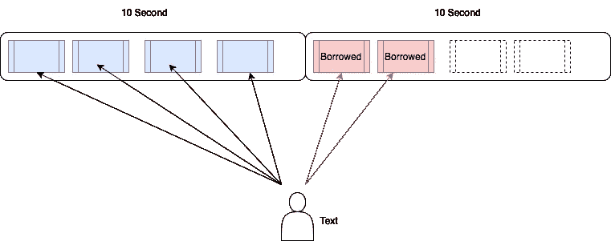
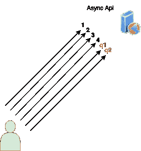

# 网络核心 7 速率限制

> 原文：<https://medium.com/geekculture/net-core-7-rate-limiting-2e80bb777439?source=collection_archive---------1----------------------->

保护对我们的应用很重要。为此，我们使用认证或一些其他保护机制。但是这些都不足以保护我们的应用。我们需要控制请求。为此，我们一直在使用一些第三方库。但是。网芯 7，它变了。因为速率限制现在是可能的。网络 7

让我们想想；

我们有一个 API，它可以在一秒钟内处理 1000 个请求。如果有人连续发送请求会发生什么？API 无法处理其他用户的请求。

通过*速率限制*，我们可以控制请求。我们可以做得更多。让我们看看


[https://devblogs.microsoft.com/](https://devblogs.microsoft.com/)

这将是一个基本的 API 项目。但是我们将使用所有请求限制中间件及其描述。

有四种算法

## **固定窗户**

固定窗口是一种基本算法。它使用固定的时间。在此期间，它处理策略中定义的限额。

```
 builder.Services.AddRateLimiter(options =>
{
    options.AddFixedWindowLimiter("Fixed", opt =>
    {
        opt.Window = TimeSpan.FromSeconds(10);
        opt.PermitLimit = 4;
        opt.QueueLimit = 2;
        opt.QueueProcessingOrder = QueueProcessingOrder.OldestFirst;

    });
});
```

*窗口*:时间范围。
*PermitLimit* :请求限制
*QueueLimit* :借用限制(将定义)
*QueueProcessingOrder*:哪个请求先被处理

我需要解释一下排队限制。



在前 10 秒，用户发送 6 个请求。但是限制是 4 个。我们又收到了两个队列请求。API 将处理 4 个请求，然后在 10 秒后再处理 2 个。

要使用速率限制，请在控制器或操作顶部启用速率限制

```
 [Route("API/[controller]")]
    [ApiController]
    [EnableRateLimiting("Fixed")]
    public class ApiController: ControllerBase
    {
        [HttpGet]
        public IActionResult Get()
        {
            return Ok("Good Request");
        }
    }
```

## 推拉窗

它类似于固定窗口。但是在滑动窗口中，时间被分成多个时间段。

```
builder.Services.AddRateLimiter(options =>
{
    options.AddSlidingWindowLimiter("Sliding", opt =>
    {
        opt.Window = TimeSpan.FromSeconds(10);
        opt.PermitLimit = 4;
        opt.QueueLimit = 2;
        opt.QueueProcessingOrder = QueueProcessingOrder.OldestFirst;
        opt.SegmentsPerWindow = 2;

    });
});
```

SegmentsPerWindow:段大小之后的借用限制。我们有 4 个请求，2 个来自第二部分

## 令牌桶

它几乎和推拉窗一样。不同之处在于该算法创建了令牌。并且补充周期将过期的令牌添加回该周期

```
builder.Services.AddRateLimiter(options =>
{
    options.AddTokenBucketLimiter("Token", opt =>
    {
        opt.TokenLimit =4;
        opt.QueueLimit = 2;
        opt.QueueProcessingOrder = QueueProcessingOrder.OldestFirst;
        opt.ReplenishmentPeriod = TimeSpan.FromSeconds(10);
        opt.TokensPerPeriod = 4;
        opt.AutoReplenishment = true;

    });
});
```

## 并发限制器

该算法用于控制异步请求。

```
builder.Services.AddRateLimiter(options =>
{
    options.AddConcurrencyLimiter("Concurrency", opt =>
    {
        opt.PermitLimit = 10;
        opt.QueueLimit = 2;
        opt.QueueProcessingOrder = QueueProcessingOrder.OldestFirst;

    });
});
```

控制器代码

```
 [HttpGet("[action]")]
        public async Task<IActionResult> GetAsync()
        {
            await Task.Delay(10000);
            return Ok("Async Request");
        }
```

并发异步调用有一个允许限制。和队列的队列限制。对于我们的示例，将有 10 个实时连接。在第一次响应之后，它将从队列中获取请求。



## `EnableRateLimiting and DisableRateLimiting`

如果要禁用某项操作的速率限制。或者想让你需要使用这些属性。或者你可以分配不同类型的算法。标签可以用在控制器或动作上。

## 弹出时

On rejected 可用于记录超出操作。

```
builder.Services.AddRateLimiter(options =>
{
    options.AddConcurrencyLimiter("Concurrency", opt =>
    {
        opt.PermitLimit = 10;
        opt.QueueLimit = 2;
        opt.QueueProcessingOrder = QueueProcessingOrder.OldestFirst;

    });

    options.OnRejected = (context, CancellationToken) =>
    {
        //log operations
        return new();
    };
});
```

这些是速率限制的基本用途。这是非常有用的。net 开发人员。为了保护我们的 API，我们需要使用它们。我会继续分享新的东西。带缓存的 Net Core 7 系列。

[](https://github.com/barkinkizilkaya/RateLimiting) [## GitHub-barkinkizilkaya/速率限制

### 此时您不能执行该操作。您已使用另一个标签页或窗口登录。您已在另一个选项卡中注销，或者…

github.com](https://github.com/barkinkizilkaya/RateLimiting)