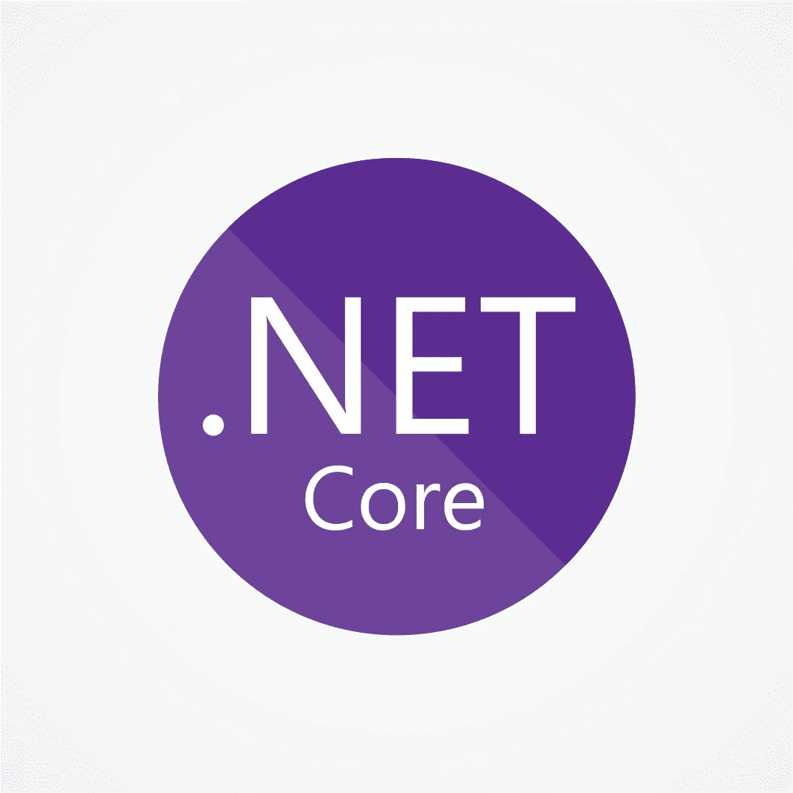
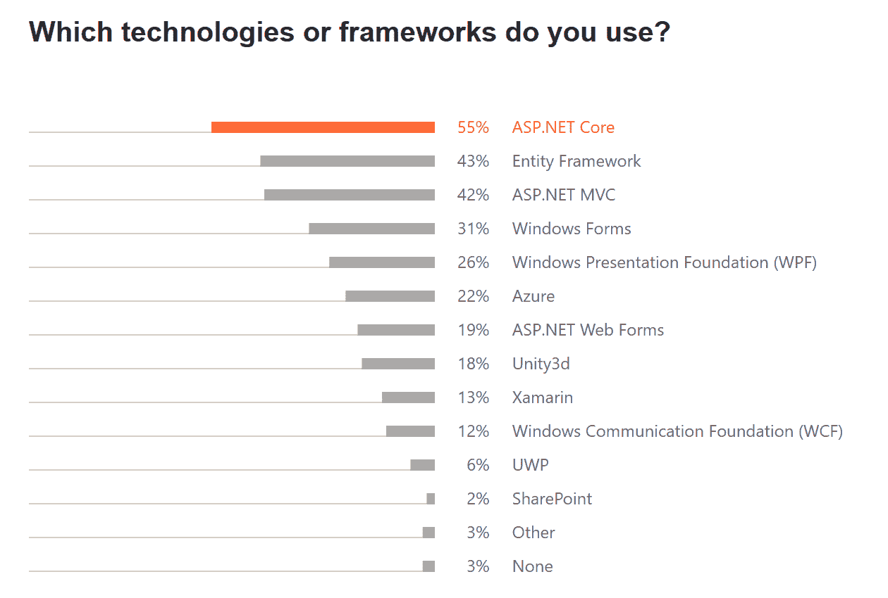

# 。净核心收益:为什么它在 2022 年最受欢迎

> 原文：<https://medium.com/geekculture/net-core-benefits-why-it-is-the-most-desirable-in-2022-73a90d7ab2a6?source=collection_archive---------9----------------------->

。NET 技术已经被大大小小的公司所采用，包括超过 90%的财富 500 强公司。英寸 Net 技术。Net core 是。Net framework，旨在为开发人员提供面向多个平台的能力，以及通过 Azure 函数支持微服务和无服务器架构。随着微服务和云成为当前的主要趋势，这使得。Net core 是 web 开发的一个非常重要的方面。这里是一个. Net 核心使用统计数据。微软技术公司。

[Source](https://blog.jetbrains.com/dotnet/2020/06/16/developer-ecosystem-2020-key-trends-c/)

正在寻求将云集成到其 web 应用程序中的有效 web 表现的企业必须尝试。Net core 到他们的技术堆栈中。本指南在。净核心收益将帮助您了解为什么它是 2022 年您的企业最理想的选择。

# 什么是。网芯？

在我们讨论……的好处之前。Net core，让我们多看看什么是。网芯。

它是一个开源的跨平台框架，帮助开发人员为 web 和移动设备构建应用程序。它是由微软开发的，作为其专有软件平台如 Windows Forms 和 Windows Presentation Foundation(WPF)的替代软件。它通过其语言集成查询(LINQ)功能支持 C#、F#和 Visual Basic 编程语言以及其他语言。

如果你正在寻找一个平台，可以帮助你创建不同的操作系统，如 Linux 或 Mac OS X 应用程序，然后。Net core 可能是您的最佳选择。它比它的前身有许多好处。Net framework，与。2015 年发布的. Net framework 4.6 版本。

> **的好处。Net core 以及为什么它最受企业欢迎:**

1.  **上开源**

。NET 成为微软的产品已经有一段时间了，但截至 2016 年 6 月，他们已经在麻省理工学院的许可下开放了所有的开发以开源。那是什么意思？首先，这意味着微软或社区成员做出的任何改进都可以立即应用；不需要等待补丁周期(例如)结束，也不需要根据他人的时间表等待更长的交付时间。开源产品(尤其是由这样一家大公司支持的产品)的可用访问级别非常令人兴奋，并且确实预示着一个惊人的未来。更好的是，想象一下你现在能用它做什么。你以前不能做的网…是的，我们想加入！

## 2.关于移民

。NET Core 受益于不再被 Windows 和。NET 框架约束。通过消除这些障碍，开发人员可以探索更适合他们需求的不同语言。因为微软的领导层已经承诺。NET 开源技术，如。NET 原生和。NET Standard clear，例如，你可以期待 C#开发人员开始利用其他平台，如 Linux 和 macOS 默认情况下在这些新框架上是可行的——给他们更多的权力！

鉴于其跨平台的特性和与现有代码库协同工作的能力，随着跨平台开发的加速，你也可以期待像 Mono 这样的项目在未来几年再次获得牵引力。

## **3。关于性能**

有什么好的？网芯？是性能。NetCore 的轻量级和模块化结构使其成为物联网设备、移动应用和 web 应用的绝佳选择(因为它比传统的 web 框架消耗更少的资源)。它还利用高性能的实时(JIT)编译器来快速执行您的代码。

由于 NetCore 的轻量级和模块化特性，它也是处理微服务以及微控制器或嵌入式系统的优秀平台。该框架提供了对多种平台的支持，如 Linux、Mac OSX、Windows。NET 微框架，甚至 Android 和 iOS 平台通过 Mono。由于其跨平台的性质，组织可以通过 [**雇用微软开发人员**](https://www.appsdevpro.com/hire-developers/hire-microsoft-developers.html) 部署适用于所有设备的应用程序来节省开发成本——从而接触到各种设备类型的更多客户。

## 4.关于连通性

在当今时代，数据隐私和安全非常重要，尤其是因为个人数字媒体已经变得越来越重要。云提供了一种存储个人信息的方式，这种方式不会牺牲你保护敏感材料免受窥探的能力；使用基于云的系统意味着你的数据不会存储在连接到一个潜在易受攻击的物理位置或计算机的服务器上。

Net core 为我们的 web 应用程序开发服务提供了价格合理的最佳连接。

## 5.关于安全

。NET 提供了许多安全特性，使其成为企业开发的一个有吸引力的平台，包括代码访问安全性和对 Windows 身份验证的支持等等。这些框架还强制执行强密码规则，防止暴力破解尝试或使用可预测的或字典中的单词作为密码。

也就是说。NET 并非没有弱点；最近围绕 WannaCry 恶意软件攻击的事件表明，在保护其网络和系统免受攻击时，每个人——即使是微软——都必须保持警惕，无论他们的软件设计得多么好。

## 6.关于缩放

其中之一。NET Core 的主要好处在于能够支持从小到大的 web 和云应用。如果你愿意。NET，您可以放心地成长，因为您知道随着需求的发展，您将拥有可靠的工具来大规模维护您的代码。你不必扔掉你现有的代码和 [**雇佣。Net 开发者**](https://www.appsdevpro.com/hire-developers/hire-asp-dotnet-developers.html) 当你的公司成长的时候，你可以从头开始或者花钱在一个新的语言或者平台上——你可以继续使用。NET Core，并随着时间的推移获得它的所有好处。

当更多的开发人员参与进来时，无论他们是远程工作还是在内部工作，如果每个人都使用一种一致的编码方法，事情会变得更容易——这也适用于各种语言！

## 7.论稳定与支持

微软已经发誓要支持。NET 核心，提供任何其他平台都无法比拟的稳定性。Microsoft 将向发送更新。微软开发部门的项目管理主管斯科特·亨特说，微软每 6 个月就会在 Windows、Linux 和 macOS 上运行一次。因此，如果你打算招聘网站开发人员。Net 开发，确保他们得到微软团队的良好支持。

此外，微软表示，它将在 2026 年前为每个新版本的所有早期版本提供支持和安全补丁——无论它们来自哪个开发分支(主要或次要)。快速移动的目标并不能让人对关键应用程序在未来仍能按预期运行充满信心。NET core 的广泛支持正是如此。

如果一个 Windows 更新破坏了某些东西，你可以打赌会有一个旧版本可以继续完美地工作。

## 8.论质量

作为一名开发人员，高质量的软件对你的成功至关重要，而构建高质量的软件需要开发人员不断学习和提高他们的技能。与。NET Core，您将可以访问比以前更多的代码，因此您可以构建错误更少、性能更好的高质量应用程序。

质量是生产效率和成本节约的重要组成部分——但前提是您的应用程序从第一天起就构建成可高效扩展的。构建于开源技术之上。NET Core 允许您访问比以往更多的库，这样您就可以专注于使您的应用程序独一无二的东西，而不是自己重新发明每一个轮子。

## 9.关于构建趋势应用程序

。NET Core 帮助制造了。NET 易于使用，应用速度快，由于这些特点，C#仍然是当今最顶尖的编程语言之一。由于其异步架构完美地利用了多核处理器，因此它对于轻松构建响应性应用以及 web 和移动应用的轻量级服务也非常有帮助。而且，随着越来越多的公司将其基础设施转移到云计算。NET 技术对于处理高度可伸缩的 web 应用程序变得至关重要，这些应用程序需要可靠和有效的伸缩机制。

建立在。NET Core 允许组织从已经采用的一系列云供应商那里获得许多好处。NET Core 作为原生平台。

## 其他。核心净收益

的最大好处。NET Core 和 C#(总的来说)是微软已经使用这些技术十多年了，并且对它们了如指掌，这意味着它们是稳定的、安全的，并且被已经使用了更长时间的开发人员不断改进。当您需要添加功能或修复问题时，有一个大型社区可以帮助您找出如何做到这一点，同时让您的代码库尽可能安全。

对于任何其他语言或框架，您将从零开始，没有稳定性或安全性的保证；当事物因漏洞而崩溃或被入侵时——这是不可避免的——你将被迫自己处理这些问题。

# 结论

。NET Core 为企业提供了众多的特性和优势，使其成为选择开发平台的首选。它使跨平台工作更简单、更快速，并支持多种编程语言和其他技术改进。因此，如果你打算开发 web 应用程序，那么你应该 [**招聘。net 开发者**现在的](https://www.appsdevpro.com/hire-developers/hire-asp-dotnet-developers.html)。在未来的时间里，随着微软更频繁的发布。NET 将在 web 开发公司中扮演越来越重要的角色，这些公司更喜欢产品开发的最佳实践，而不是为单个应用程序设计的定制方法。

因此，组织应该开始评估。尽可能早地采用 NET Core 及其成本和投资，以便就技术集成的未来规划做出最佳决策。