# [.ASP 中的依赖注入。网络核心——“古老而珍贵”

> 原文：<https://medium.com/geekculture/net-core-dependency-injection-in-asp-net-core-7fdf5e1cc200?source=collection_archive---------0----------------------->

Photo by [Toby Christopher](https://unsplash.com/@tobychristopher?utm_source=medium&utm_medium=referral) on [Unsplash](https://unsplash.com?utm_source=medium&utm_medium=referral)

在这篇文章中，我们将会谈到依赖反转原理( **DIP** )、控制反转( **IoC** )和依赖注入( **DI** )。然后尝试创建一个简单的带有内置特性的 **DI** 实现。NET 内核的不同方式(控制器构造器注入、控制器方法注入和视图注入)。

> **注意**:如果你已经理解了什么是依赖反转原则(DIP)、控制反转(Ioc)和依赖注入(DI)，那么你可以随意绕过这些部分。

# 从属倒置原则

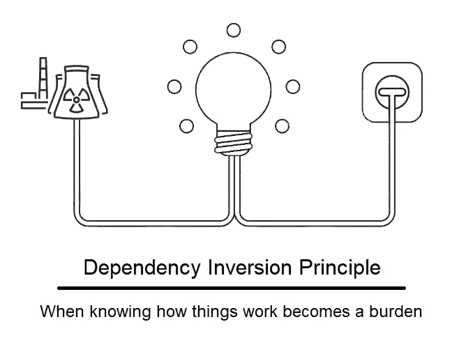

image source: internet

依存倒置原则是 SOLI **D** 缩写中的“ **D** ”。罗伯特·C·马丁在 90 年代引入了 DIP。[此处](https://drive.google.com/file/d/0BwhCYaYDn8EgMjdlMWIzNGUtZTQ0NC00ZjQ5LTkwYzQtZjRhMDRlNTQ3ZGMz/view)为原文。

DIP 是一个指导我们编写松散类的软件设计。根据维基上 **DIP** 的定义:

*   高层模块不应该依赖低层模块。两者都应该依赖于抽象。
*   抽象不应该依赖于细节。细节应该依赖于抽象。

让我给你一个例子来描述以上的定义。让我们想象一下，您需要编写一个函数，允许系统在最终用户完成一个订单时向他们发送一封电子邮件。应该创建 2 个类，一个用于订购，一个用于发送电子邮件。

figure 1: SendingEmail and Ordering class

乍一看，代码逻辑没有问题，因为一旦最终用户完成订单，就会触发“发送”功能。然而，它违反了 **DIP** ，因为 **Ordering** 类依赖于 SendingEmail 类，而 SendingEmail 类不是一个抽象——它是一个具体的类。但是这里的问题是什么呢？如果业务团队提出新的要求，要求您必须更改通信类型，使用短信而不是电子邮件，会发生什么情况？

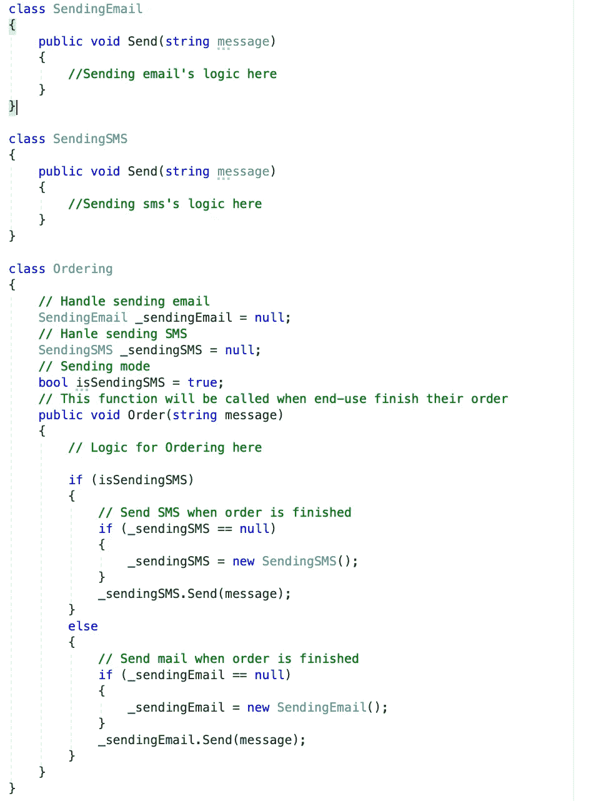

figure 2: Adding more SendingSMS class

因此，您必须创建更多的 **SendingSMS** 类，并在 **Ordering** 类中声明它的一个实例。最后，使用“IF ELSE”语句来决定是使用短信还是使用电子邮件。但更糟糕的是，除了电子邮件和短信，你还有更多选择。这意味着你必须在排序类中声明更多新的具体类的实例。

**DIP** 说我们需要以这样一种方式解耦系统，即更高级别的模块(在这种情况下是**排序**)将依赖抽象并使用它而不是具体的类。抽象将被映射到执行代码逻辑的实际具体类。(您可以在接下来的章节中看到)

# 控制反转(IoC)

控制反转( **IoC** )是帮助我们使高层模块依赖于抽象而不是低层模块的具体实现的技术。换句话说，它有助于实现(依赖倒置原则— **DIP** )。让我们带着上面展示的示例回来，实现 **IoC** 。

首先，我们需要创建一个抽象，这个抽象是更高级的— **Ordering** 类所依赖的。

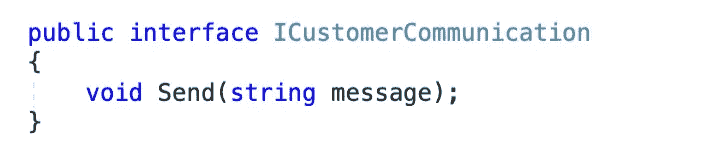

figure 3: ICustomerCommunication interface — an abstraction

然后更新“ **SendingEmail** ”和“ **SendingSMS** ”类从 **ICustomerCommunication** 接口继承。

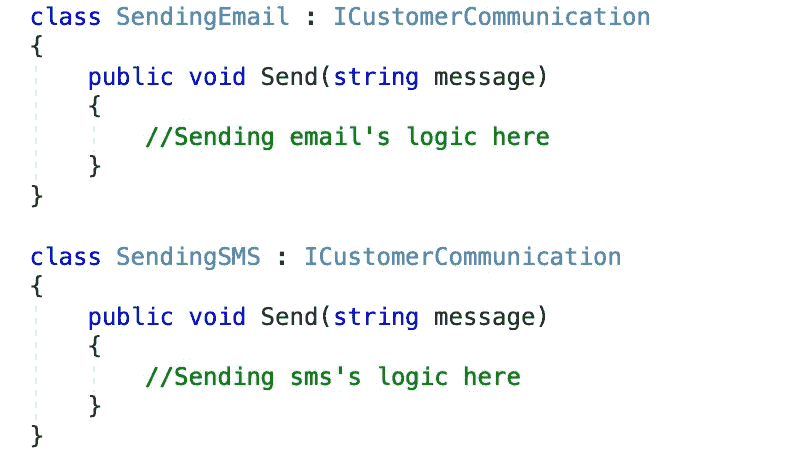

figure 4: Update SendingEmail and SendingSMS class

现在让我们更改更高级别的模块— **Ordering** 类来使用这个抽象，而不是更低级别的具体类。

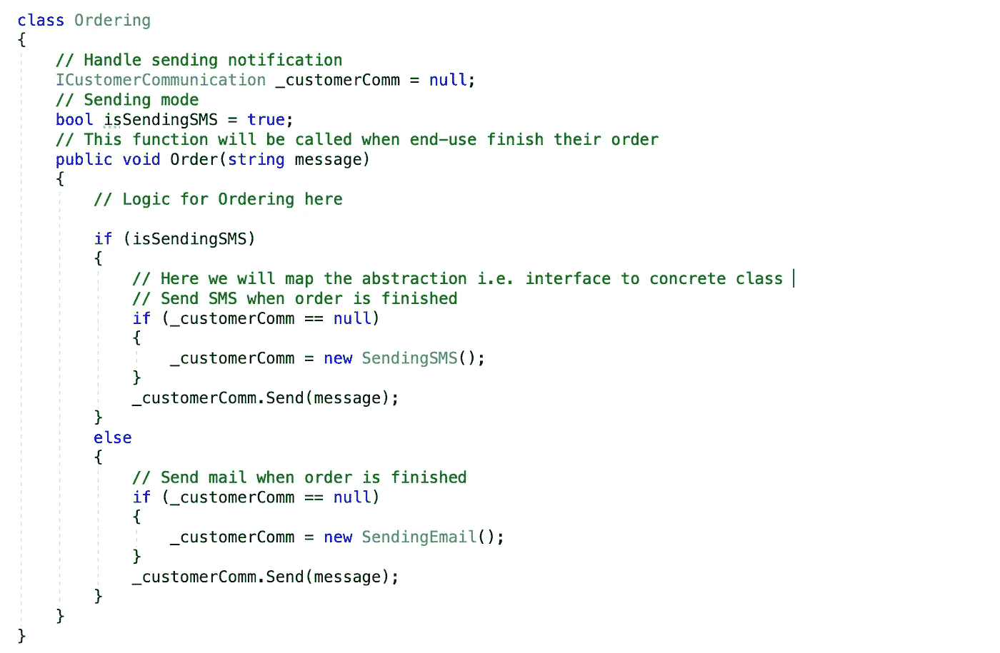

figure 5: Update higher-level class

最后，设计看起来像这样:

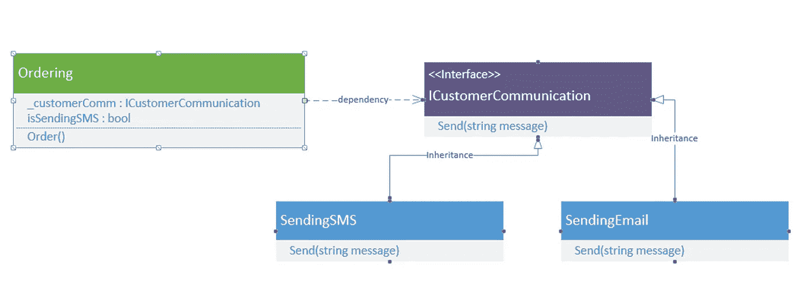

figure 6: UML Diagram

因此，我们在这里所做的是，我们已经颠倒了控制，以符合**下降**。现在，我们的高层模块只依赖于抽象，而不是低层的具体实现，这正是 **DIP** 所说的。

# 依赖注入

尽管在我们的例子中我们已经实现了 IoC，并且排序类依赖于抽象。但是我们仍然在**排序**类(一个更高级别的模块)中使用具体的类。这阻止了我们在类之间完全解耦。

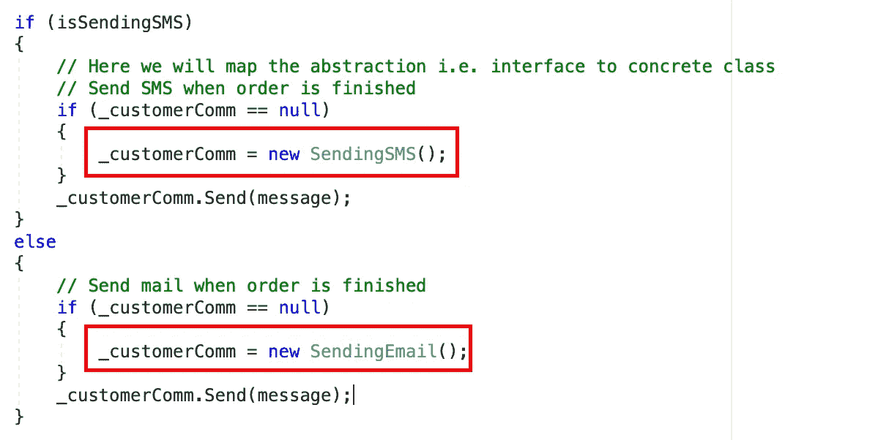

figure 7: concrete classes in Ordering class

这就是为什么 **DI** 来图！

**DI** 主要用于将具体实现注入到使用抽象的类中(即 **ICustomerCommunication** 接口)。 **DI** 的主要思想是减少类之间的耦合，将抽象和具体实现的绑定移出依赖类。我们可以用三种方式实现 **DI** :

*   **构造函数注入**
*   **法注射**
*   **属性注入**

1.  **构造函数注入**

使用这种方法，我们将把具体类的对象传递给依赖类的构造函数，并把它分配给正在使用的接口。

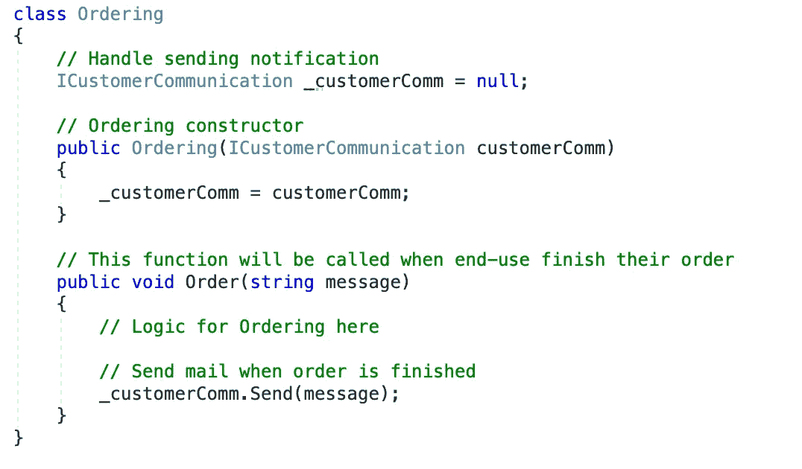

figure 8: Constructor Injection

在上面的代码中，构造函数将获取具体的类对象，并将其绑定到接口句柄。如果我们需要将 **SendingSMS** 的具体实现传递给这个类，我们需要做的就是声明一个 **SendingSMS** 类的实例，然后将它传递给 **Ordering** 的构造函数，如下所示:

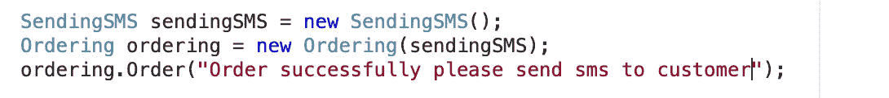

figure 9: using Constructor Injection

2.**方法注射**

通过使用构造函数注入，我们将不得不使用具体类的实例——在 Ordering 类的生命周期中，要么是 **SendingSMS** 要么是 **SendingEmail** 类。现在，如果我们想在每次调用方法时传递具体类的实例，我们必须使用**方法注入**方法。

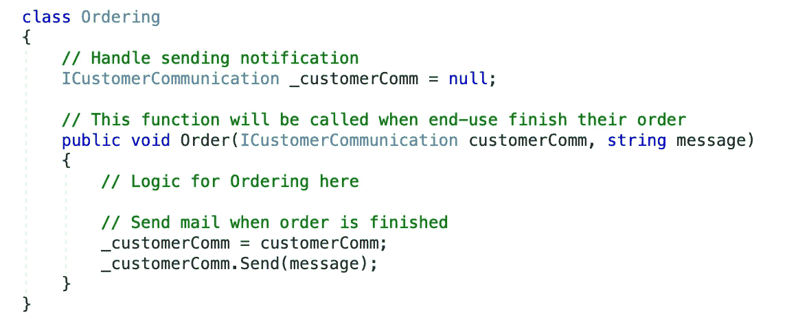

figure 10: Method Injection

并且我们将使用**方法注入**如下:

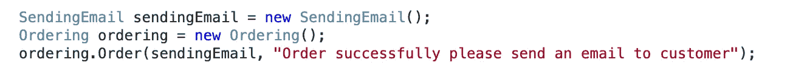

figure 11: Using Method Injection

3.**物业注入**

现在我们已经知道，依赖类将在整个生命周期中使用一个具体类，使用**构造函数注入**方法，而**方法注入**将只影响“方法”级别。但是如果具体类的选择和方法的调用的责任在不同的地方呢？在这种情况下，我们需要注入资产。

使用这种方法，我们通过依赖类公开的 **setter 属性**传递具体类的对象。

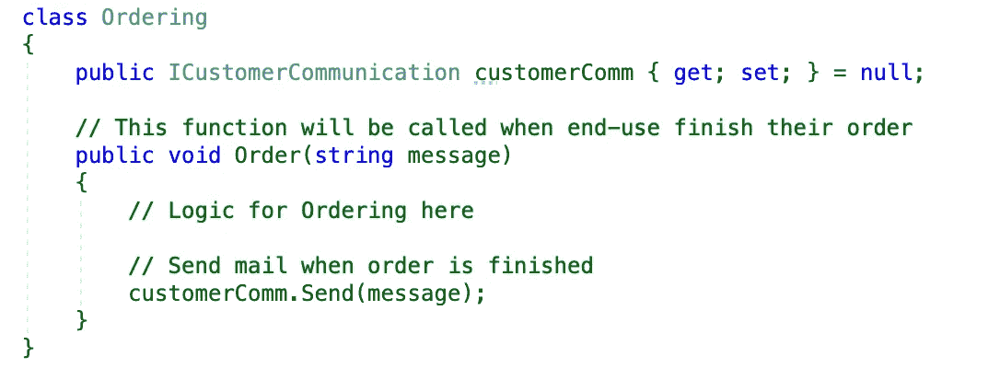

figure 12: Property Injection

我们将使用下面的**属性注入**:

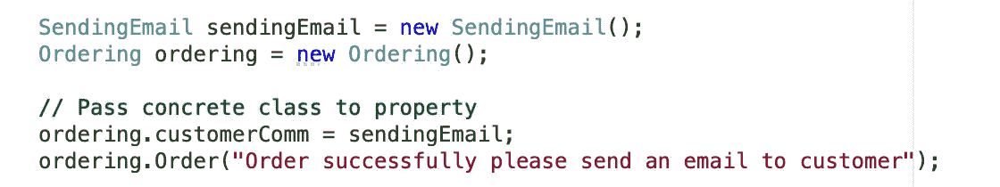

figure 13: User property injection

**构造函数注入**是实现 DI 时最常用的方法。如果我们需要在每个方法调用上传递不同的依赖，那么我们使用**方法注入**。**属性注入**使用频率较低。

这时，如果你是初学者，你可以了解一下 **DIP** 、 **IoC** 和 **DI** 。在下一节中，我们将使用的内置特性实现 **DI** 。网芯。

# ASP 中的依赖注入。网络核心

Photo by [Anton Nazaretian](https://unsplash.com/@anton_nazaretian?utm_source=medium&utm_medium=referral) on [Unsplash](https://unsplash.com?utm_source=medium&utm_medium=referral)

这是 ASP 中的内置功能。网芯。这不仅支持中间件，还支持控制器、视图和模型。ASP.net 核心提供两种类型的服务容器:**框架服务**和**应用服务**。框架服务是由 ASP.net 核心提供的服务，例如 **ILogger** 。**应用服务**是根据我们的需求创建的定制服务。

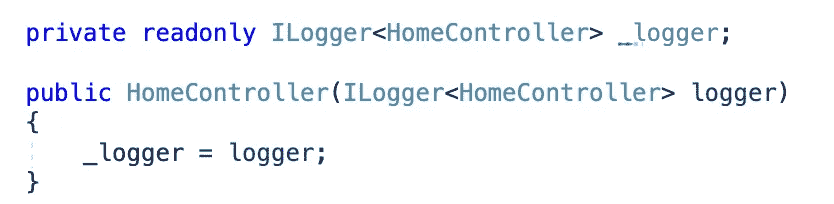

figure 14: Framework services — ILogger

## 控制器中的依赖注入

ASP。Net Core 内置了对基于构造函数的依赖关系的支持。控制器所需的依赖关系只是在构造函数中向控制器添加一个服务类型。ASP。Net Core 将识别服务类型并尝试解析该类型。我们来做个样品吧！

首先，我们将创建一个名为“ **WelcomeMessage** 的具体接口，它继承了“**iwelcomemamessage**接口——一个抽象。

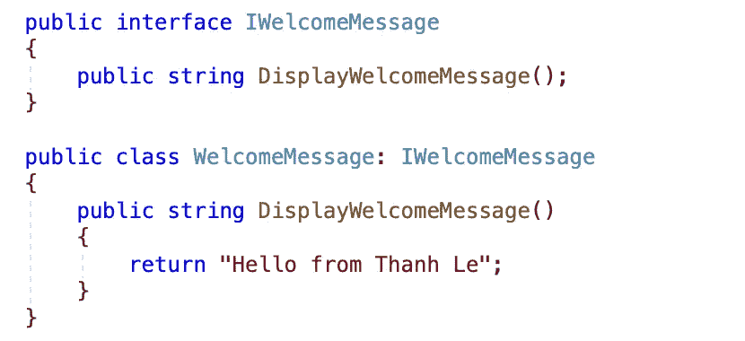

figure 15: IWelcomeMessage interface and WelcomeMessage class

现在我们需要将这个服务添加到服务容器中，这样当控制器被请求服务时，它就可以使用了。我们可以在 startup 类的 **ConfigureServices** 方法中将服务添加到服务容器中。有三种不同生命选项可用:**瞬态**、**作用域**和**单例**(我们稍后将返回这些选项)。

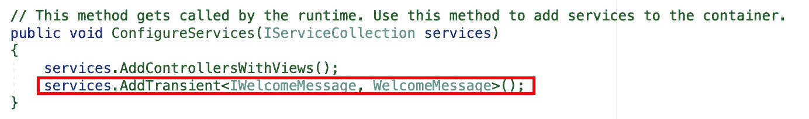

figure 16: Update ConfigureServices in Startup.cs

最后一步，通过构造函数将服务注入控制器。

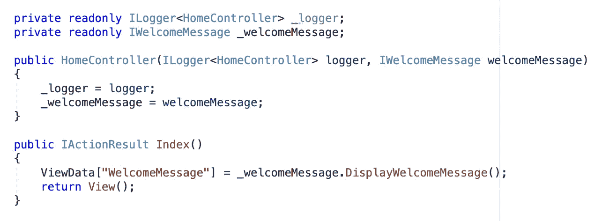

figure 17: DI in Controller

结果如下:

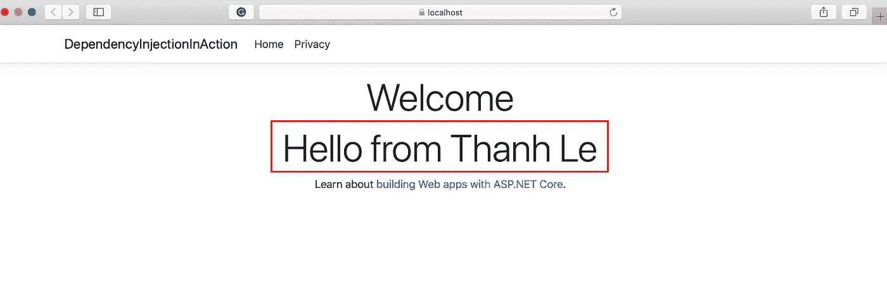

figure 18: DI result

请确保在启动类的 **ConfigureServices** 方法中注册 DI，否则会出现以下错误:

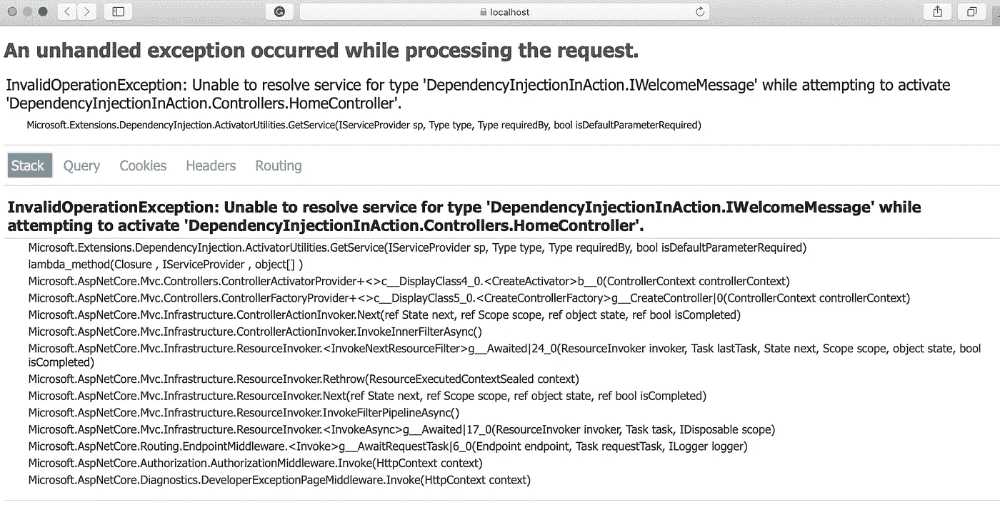

figure 19: DI error

## 在控制器方法/动作中注入依赖——方法注入

ASP。Net Core 允许我们使用“ **FromServices** ”属性将依赖注入到特定的动作中。这个属性告诉 ASP。Net 核心框架的参数应该从服务容器中检索。

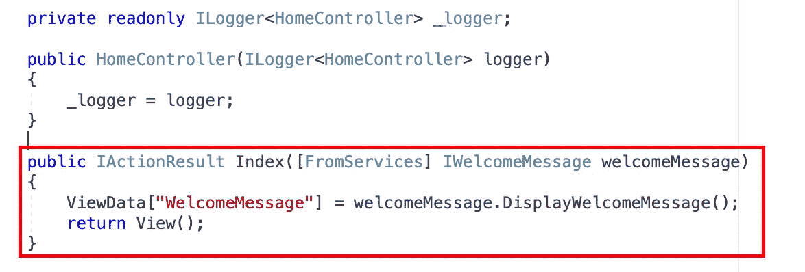

figure 20: Method injection

结果还是一样

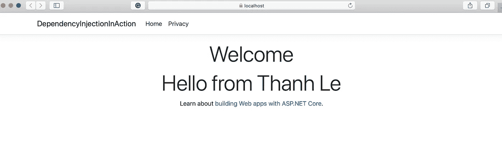

figure 21: Method Injection result

> 注意:ASP 不支持属性注入。网络核心

## 手动注入服务

在这种方法中，服务不作为参数注入控制器构造函数或控制器动作中。使用" **HttpContext 的方法" **GetService** "。RequestServices** "属性，我们可以获得用服务容器配置的依赖服务。

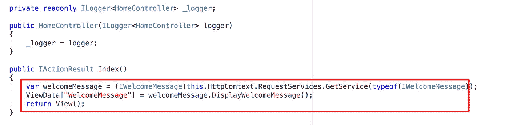

figure 21: Inject service manually

## 将服务注入视图

ASP。Net Core 也可以将依赖注入到视图中。这对于注入与视图相关服务(如“本地化”)非常有用。我们可以使用@inject 指令将服务依赖注入到视图中。

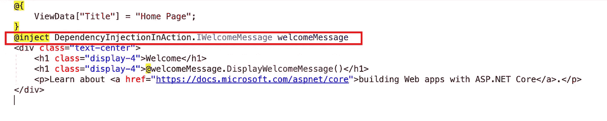

figure 22: Inject service to View

**视图注入**可以用来填充下拉列表等 UI 元素。公共下拉列表，这样的国家下拉列表可以从服务中填充。从服务中呈现这些东西是 ASP。网芯。或者，我们可以使用 ViewBag 和 ViewData 来填充下拉列表。指令 **@inject** 也用于覆盖注入的服务。例如，我们使用 Html 助手服务来呈现 Html 标签，如下拉列表、文本框等。我们可以使用 **@inject** 指令用我们自己的服务替换这个服务。

# 使用寿命

Photo by [Chris Lawton](https://unsplash.com/@chrislawton?utm_source=medium&utm_medium=referral) on [Unsplash](https://unsplash.com?utm_source=medium&utm_medium=referral)

ASP。Net Core 允许我们指定注册服务的生存期。服务实例根据指定的生命周期自动被释放。所以我们不关心清理这个依赖，它会照顾由 ASP。Net 核心框架。有三种类型的生命周期。

## 一个

在整个应用程序生命周期中，应用程序将创建并共享服务的单个实例。可以使用 **IServiceCollection** 的 **AddSingleton** 方法将服务添加为单一服务。ASP。Net Core 在注册时创建服务实例，随后的请求使用这个服务实例。

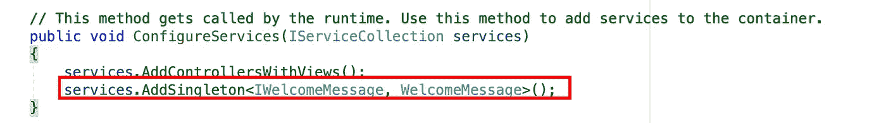

figure 23: Singleton lifetime

## 审视

ASP。Net Core 将为应用程序的每个请求创建和共享一个服务实例。这意味着每个请求只有一个可用的服务实例。它将为每个新请求创建一个新实例。可以使用**configure services(Startup**class**)**中 **IServiceCollection** 的 **AddScoped** 方法将服务添加为作用域。

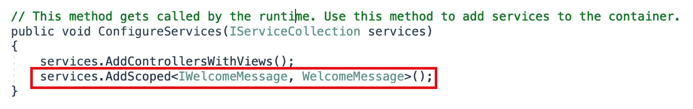

figure 24: Scoped lifetime

## 短暂的

ASP。Net Core 会在每次我们请求时为应用程序创建并共享一个服务实例。可以使用 **IServiceCollection** 的 **AddTransient** 方法将服务添加为 **Transient** 。这个生存期可以用于无状态服务。这是添加轻量级服务的一种方式。

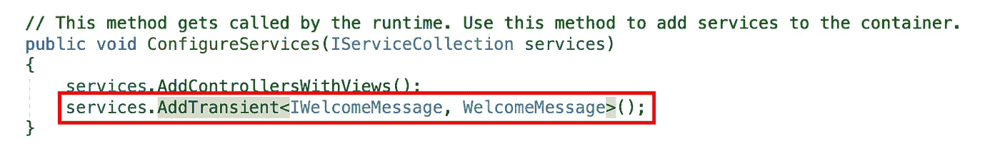

figure 25: Transient lifetime

# 结论

依赖注入是软件开发中最重要的设计模式之一。这将帮助我们创建一个松散耦合的应用程序，从而提供更大的灵活性、可维护性、可测试性和可重用性。利用 ASP 中的内置特性。我们可以很容易地将 T21 应用到我的应用程序中。

# 参考

 [## ASP.NET 核心中的依赖注入

### ASP.NET 核心支持依赖注入(DI)软件设计模式，这是一个…

docs.microsoft.com](https://docs.microsoft.com/en-us/aspnet/core/fundamentals/dependency-injection?view=aspnetcore-3.1)  [## 596dip.pdf

### 依赖性倒置

edrive.google.com](https://drive.google.com/file/d/0BwhCYaYDn8EgMjdlMWIzNGUtZTQ0NC00ZjQ5LTkwYzQtZjRhMDRlNTQ3ZGMz/view)  [## 从属倒置原则

### 在面向对象设计中，依赖倒置原则是软件模块解耦的一种具体形式。当…

en.wikipedia.org](https://en.wikipedia.org/wiki/Dependency_inversion_principle)