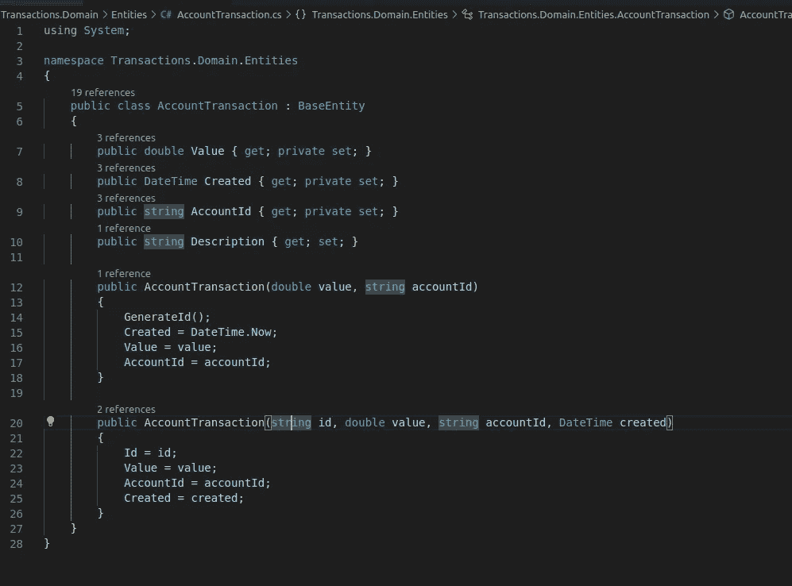
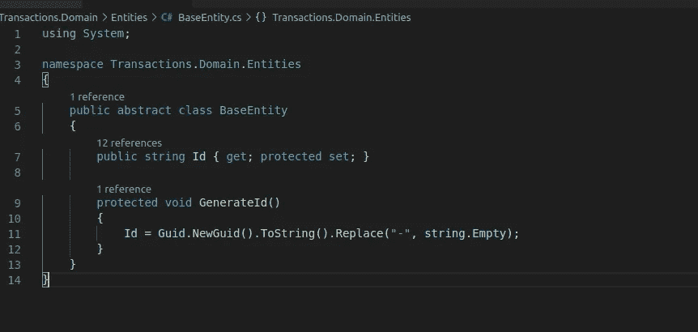
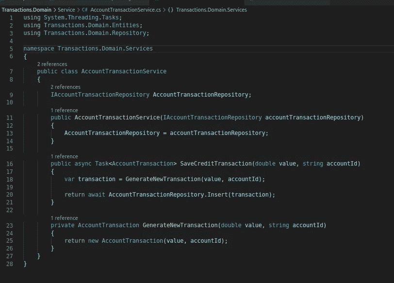
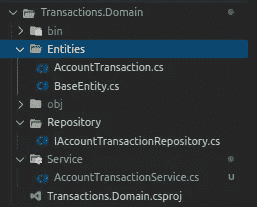

# 第一步是。使用 NUnit 和 NSubstitute 的 NET Core 测试:干净的六边形方法(第 1 部分)

> 原文：<https://medium.com/geekculture/net-core-testing-using-nunit-and-nsubstitute-a-clean-hexagonal-approach-part-1-5a2acec7f492?source=collection_archive---------2----------------------->


Image credit: [https://unsplash.com/@mitchel3uo](https://unsplash.com/@mitchel3uo)

> *“可以在没有 UI、数据库、Web 服务器或任何其他外部元素的情况下测试业务规则”。*

上面的引语是罗伯特·c·马丁，也就是鲍勃大叔，在他亲切、令人惊讶、伟大的[博客 Clean Coder](https://blog.cleancoder.com/uncle-bob/2012/08/13/the-clean-architecture.html) 中写的。

这是否意味着我们可以实现项目的所有业务规则，并在添加数据库、API 或类似的东西之前测试所有规则？

当然有！

我们的领域层(或者用例，或者业务，名称由您决定，取决于您在这一部分中的方法)应该实现系统上的所有业务规则，而不依赖于其他层。事实上，这一层必须是其他层所依赖的那一层。

换句话说，包含业务规则的层必须不了解数据库以及任何其他外部端口，即外部服务或缓存服务。外层依赖于内层。而不是相反。

这就是[依赖倒置原则](https://clean-code-developer.com/weitere-infos/solid/)，它允许我们在这种情况下做我们想做的事情:解耦我们软件的模块。

我在本文中的目标是展示如何实现一个带有数据库层接口的小型领域层。之后，我们将使用 NUnit 和 Nsubstitute 创建一个测试项目来模拟我们的数据库。这样，您甚至可以在选择数据库之前模拟返回数据，实现和测试业务规则。

在这篇文章中，我创建了一个名为 Transactions 的项目。域和名为 TransactionsMs.sln 的解决方案。

```
dotnet new sln --name TransactionMsdotnet new classlib --framework netstandard2.1 --name Transactions.Domaindotnet sln Transactions.sln add Transactions.Domain/
```

让我们从创建我们的域层开始，它将包含我们所有的业务逻辑。我创建了一个 AccountTransaction 类，这是我在这里创建的用例的主要实体。



The AccountTransaction class



BaseEntity class

在我们的领域层内部，我们有到存储库的接口。在[六角形结构](/thecodefountain/a-quick-introduction-to-hexagonal-architecture-484358c038b8)术语中，它将是一个输出或辅助端口。领域层不能依赖于存储库层，存储库层是基础设施层的一部分。


Interface for the Repository, the domain port to the external (database) world

之后，AccountTransactionUseCases 类用于与我们的存储库层通信。



The service class

这个类具有业务逻辑。它可以包含验证、实体实例的创建、与输出端口的通信等。在这种情况下，我们有对接口的调用，这将是最近注入的。

这是我们目前的结构:



正如您所看到的，域层不知道任何关于存储库实现层的事情。这就是我们的目标。

毕竟，寓意是:让实现细节远离您的业务逻辑！这包括数据库、API 或控制台应用程序项目和测试套件，我们将在下一部分将它们包含到我们的解决方案中。

第二集也是最后一集见。