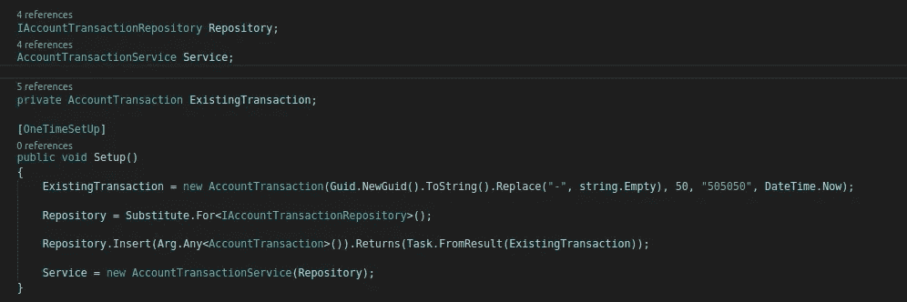
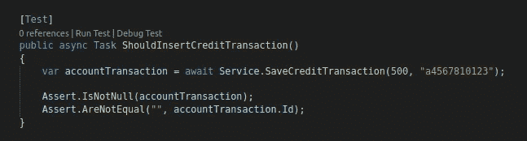
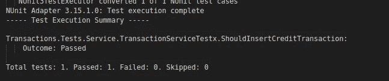

# 第一步是。使用 NUnit 和 NSubstitute 的 NET Core 测试(第二部分和最后一部分)

> 原文：<https://medium.com/geekculture/net-core-testing-using-nunit-and-nsubstitute-a-clean-hexagonal-approach-second-and-last-part-1dc2aafc1ad7?source=collection_archive---------2----------------------->


Photo credit: [https://unsplash.com/@_louisreed](https://unsplash.com/@_louisreed)

这篇文章是这篇文章的延续，在这篇文章中，我创建了具有域层和基础设施(在这个例子中是存储库)层接口的解决方案。

我们的下一步是通过运行以下命令来创建我们的测试项目。我们正在创建一个 NUnit 测试项目，并将其包含在解决方案中。

```
dotnet new nunit --framework netstandard2.1 --name Transactions.Testsdotnet sln Transactions.sln add Transactions.Domain/
```

现在让我们用下面的命令安装 NSubstitute。

```
dotnet add package NSubstitute
```

正如在上一篇文章中看到的，我们没有存储库层的实现(只有接口)，所以我们将使用 NSubstitute 来模拟它。

到目前为止，我们的 IAccountTransactionRepository 接口只有一个方法，即 Insert 方法。因为我们要测试我们的 AccountTransactionsService 类行为，所以要模拟这个方法的返回。

我创建了一个名为 TransactionServiceTest 的测试类，用一个 Setup 方法来测试我们的服务类的方法，当我们运行 test 命令时，它将会运行。



The Setup method

在这个方法中，存储库接口将被注入一个模拟替代。除此之外，Insert 方法被一个模拟值所取代。这允许我们测试服务行为，而无需真正实现存储库类。

注意，我使用了一个参数。任何<t>方法作为参数。这表明当通过为 AccountTransaction 参数传递任何值来调用 Insert 方法时，将使用指定的返回。也有可能为测试不同的行为创造不同的回报。</t>

现在，测试方法。



The test method with assertions

这个测试方法调用 SaveCreditTransaction 方法并做出断言，验证正确(或不正确)的返回值。

现在让我们运行`dotnet test`看看会发生什么。



嗯，果然奏效了！

这里的寓意是:我们所有实现业务规则的组件都可以被测试，而基础设施层的行为是完全模拟的。

仅此而已。感谢阅读。

希望对你有用。