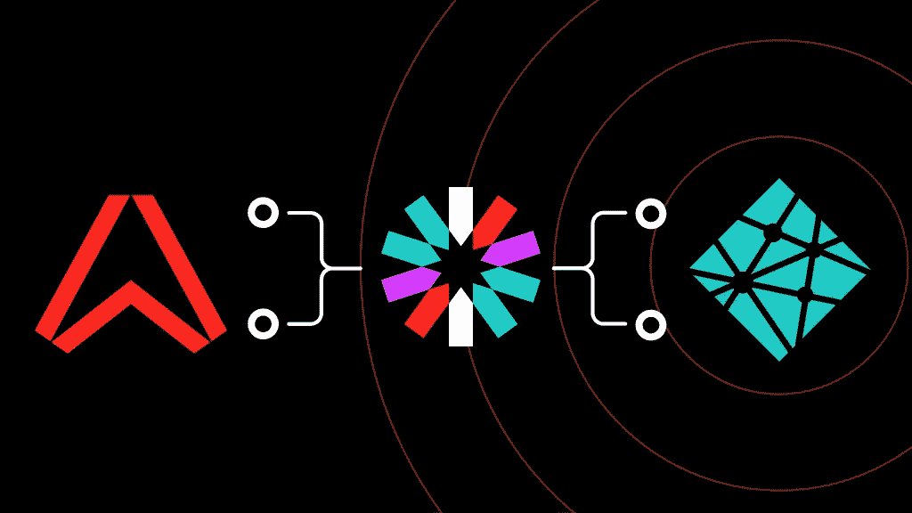
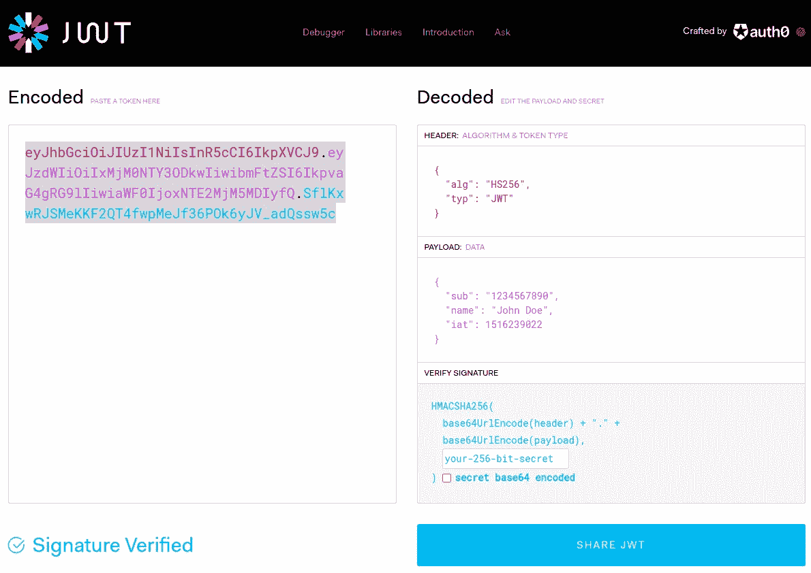
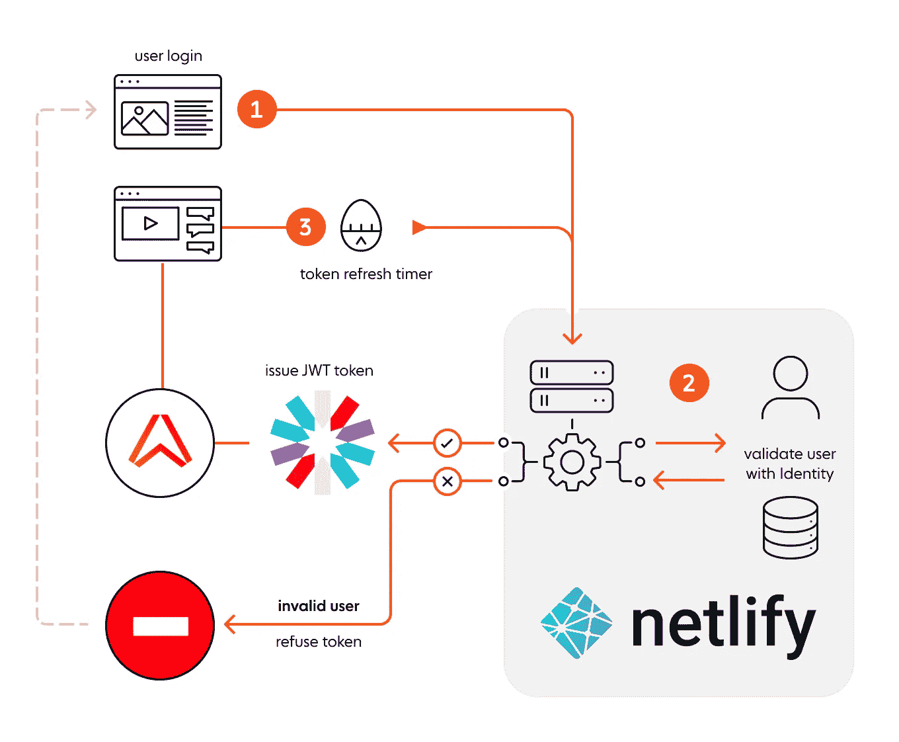
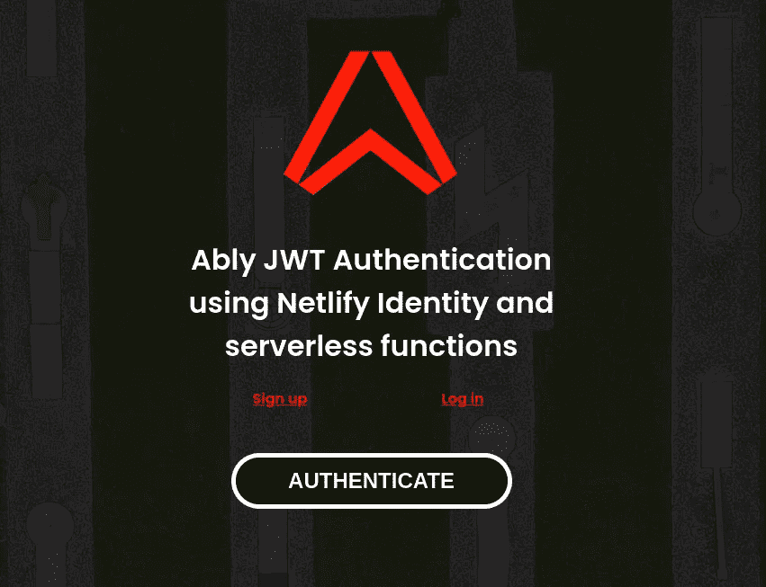
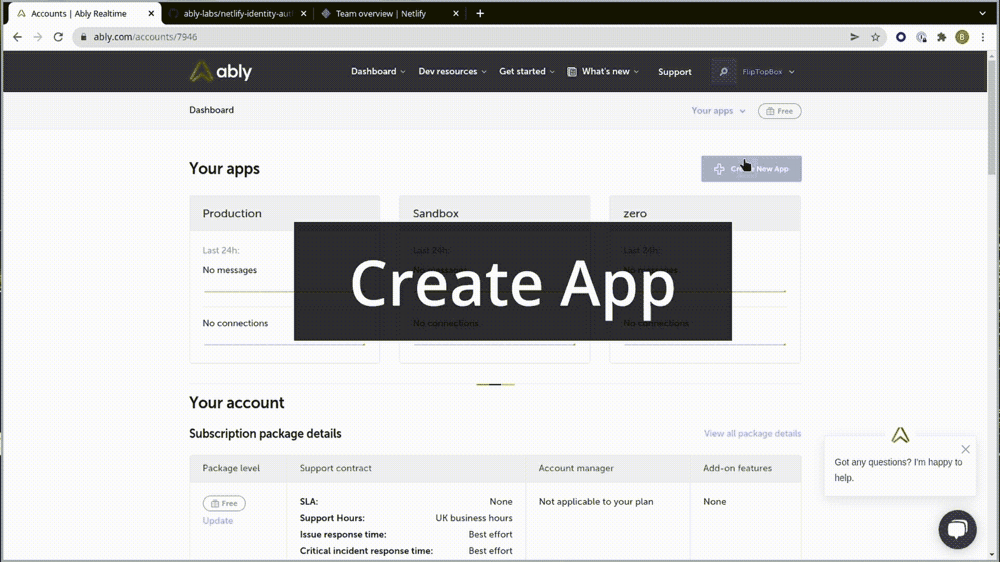
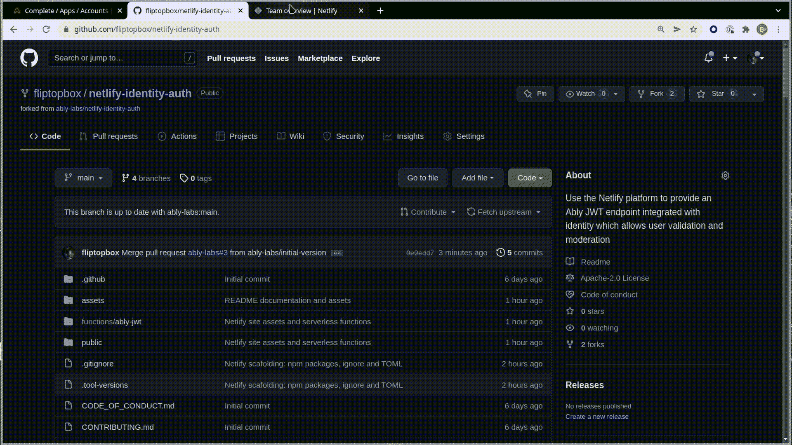
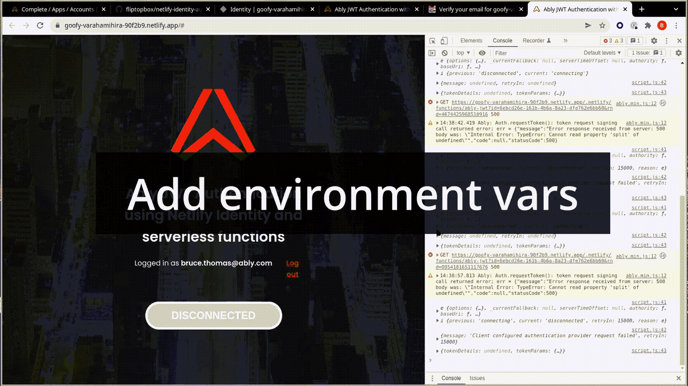
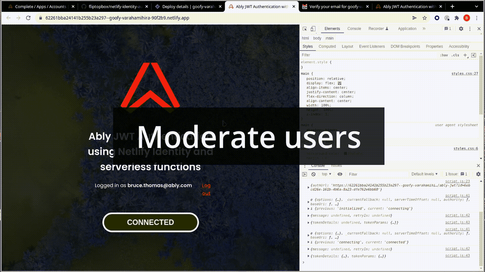
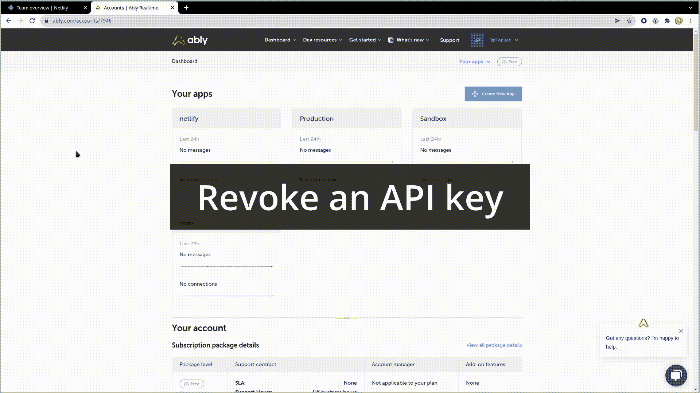

# 网络身份巧妙地保护应用程序免受黑客攻击

> 原文：<https://medium.com/geekculture/netlify-identity-protects-ably-apps-from-hackers-f1a9291231f6?source=collection_archive---------20----------------------->



Authentication server with JWT and Netlify Identity

几周前，我在 Slack 的内部支持频道上看到了这条消息，这让我很恼火。所以我停下来看了看，因为我们最不希望的就是顾客被利用。

客户已回复 703762824 票据名称:xxxxxxxxxxxxxxxx-API 密钥安全漏洞优先级:票据描述:由于……指示的安全报告而产生的票据，联系客户，让他们知道并采取行动，因为他们的 API 密钥暴露在 Wayback 机器中，并且仍然有效。

互联网上有人厚颜无耻地从你的账户上揩油，用光你的每月配额。更重要的是:你可能不知道它正在发生。

# 如何确保你的应用程序被黑客攻击

登录 Ably，复制你的应用程序的 API 密钥并粘贴到你的代码中，就像这样:

```
const ably = new Ably.Realtime('aBCdeFg.ABcDEfG:abc123def456...789xyz');
```

然后将这一行代码提交到 git 存储库，将其部署到生产环境中，wayback 机器会将其冻结在琥珀中。就这么简单。它会在那里等待，直到一个热切的小哈比人在黑暗中找到它。您宝贵的 sssss API 密钥将会落入他人之手。

幸运的是，在 Ably，我们监控认证密钥泄漏并联系客户。

基本认证就像一个猫扑——任何一只老猫都可以进入你的房子。令牌认证就像那些有芯片阅读器的人一样:只有符合芯片编程的 VIP 客人名单的酷猫才能通过 flap 测试并进入。

# 使用网络功能保护您的应用

本文向您展示了如何毫不费力地设置令牌认证。我们将使用一个 [Netlify 函数](https://docs.netlify.com/functions/overview/)创建一个端点，让您可以这样做。

```
const authUrl = ".netlify/functions/ably-jwt?id={user-id}";
const ably = new Ably.Realtime({ authUrl });
```

这看起来很棒，哪里都没有 API，但是是什么阻止了互联网上的人获取认证 URL 并在其他地方使用它呢？没什么能阻止他们。令牌认证将隐藏 API 密钥，但仅此还不够。

我们还需要一种只向合法用户发放令牌的方法。这就是 Netfliy 的用武之地，我们可以将他们的[身份服务](https://docs.netlify.com/visitor-access/identity/)与无服务器功能结合使用，这包括在免费层计划中(本文撰写时)。

# TL；速度三角形定位法(dead reckoning)

如果你只是想了解如何建立自己的 Netlify 应用程序，而不需要所有的解释，那就去看看 [ably-labs Github repo](https://github.com/ably-labs/netlify-identity-auth) ，这里的 README 是这篇文章的浓缩版。

**提醒**:你会需要这些平台上的账号:[巧妙地](https://ably.com/sign-up)、 [Github](https://github.com) 和 [Netlify](https://app.netlify.com/signup?ably-realtime) 。

如果你只对经历实现步骤感兴趣，那就往下跳 [**好了好了，够了……出货吧！**](#okay-okay-enough-lets-ship-it)

# 什么是“巧妙地”JWT 代币？

> JSON Web Token (JWT)是一个开放标准( [RFC 7519](https://tools.ietf.org/html/rfc7519) )，它定义了一种紧凑且独立的方式，以 JSON 对象的形式在各方之间安全地传输信息。

*(摘自*[*https://jwt.io/introduction/*](https://jwt.io/introduction/)*)*

通常，编码的 JWT 令牌如下所示:



*试试看这里*[*https://jwt.io/*](https://jwt.io/)*—民间制作于* [*auth0*](https://auth0.com/)

令牌认证是安全的，原因有二:JWT 令牌是数字签名的，并且定期过期。此外，每当令牌刷新时，您可以监控谁在使用您的应用程序。当 JWT 过期时，用户将通过您的验证服务器进行路由，您可以选择是否重新颁发他们的令牌。

一个干练的 JWT 严格地说并不是一个干练地构造的，而是一个被构造成与干练地兼容的 JWT。如果你想详细了解它是如何工作的，我们的[最佳实践指南](https://ably.com/documentation/best-practice-guide)将涵盖一切。

# Netlify 无服务器功能和身份工作流

在我们的示例应用程序中，新用户需要注册并确认他们的电子邮件地址来激活自己，然后才能登录。登录时，我们用网络身份验证他们，并检查他们是否被标记为**禁止**。坏演员是不会得到 JWT 代币的。合法用户被颁发一个令牌，以便进行身份验证，并且 auth URL 中包含他们唯一的 id。



(1)用户登录(2)检查用户身份-有效用户获得 JWT 令牌并继续使用应用程序，无效用户被拒绝(3)使用令牌，等待其过期，然后重复。

网络身份允许我们通过编辑与用户帐户相关联的元数据来管理用户。标记一个坏演员就是通过 Netlify 仪表板给他们分配一个角色。

# 作为无服务器功能的 JWT 令牌

我们的 JWT 端点的关键部分是这个代码片段。不管你使用什么平台，这部分都是一样的。这是 Ably JWT 令牌的剖析，它不同于标准的 JWT，因为我们需要在数据有效载荷中添加额外的键/值。

```
function generateAblyJWT(props) {
  const { apiKey, clientId, capability, ttlSeconds } = props; const [appId, keyId, keySecret] = apiKey.split(/[\.\:]/g);
  const keyName = `${appId}.${keyId}`; const typ = "JWT"; // type
  const alg = "HS256"; // algorithm sha256
  const kid = keyName; // appId + keyId const currentTime = Math.floor(Date.now() / 1000);
  const iat = currentTime; // initiated at (seconds)
  const exp = currentTime + ttlSeconds; // expire after const header = { typ, alg, kid };
  const claims = {
    iat,
    exp,
    "x-ably-capability": capability,
    "x-ably-clientId": clientId,
  }; const base64Header = encryptObject(header);
  const base64Claims = encryptObject(claims); const token = `${base64Header}.${base64Claims}`;
  const signature = b64(SHA256(token, keySecret)); const jwt = `${token}.${signature}`; console.log({ header, claims, signature, jwt });
  return jwt;
}
```

`generateAblyJWT`函数与您通读 Ably 文档中关于[认证方法](https://ably.com/documentation/core-features/authentication#ably-jwt)的函数几乎相同。我们选择 Netlify 作为本文的平台，但是同样的想法可以应用于任何公开无服务器端点的平台。例如，你可以用一个 [**Cloudflare** 函数](https://developers.cloudflare.com/pages/platform/functions)，一个 [**Runkit** 端点](https://runkit.com/home#endpoint)，或者一个 [**Heroku** dyno](https://www.heroku.com/) 来做同样的事情...等等。本质上，您可以使用任何在响应有效负载交付后“唤醒”、运行代码并进入休眠状态的服务。

# 使用网络身份验证我们的用户

下一个函数负责两件事。首先，它是端点本身，所以我们的认证 URL 将执行这个功能。其次，它与[网络身份](https://docs.netlify.com/visitor-access/identity/)连接，以验证调用端点的用户是否可信。

我想请你注意下面突出显示的代码行。这是我们将用来获取具有该 id 的用户的 Netlify 端点。 **id** 的值来自 querystring，我们用它“烘焙”成我们的 Ably JWT，作为`clientId`属性。这意味着 Ably 和 Netlify 在它们各自的审计日志中将有相同的 id 。

Netlify Identity 的优点在于，一旦激活它，端点处理程序中的第二个参数就会有一个填充的用户上下文对象，这就是我们将前端客户端与底层后端连接起来的方式。

```
const axios = require("axios");
const generateAblyJWT = require("./generate-ably-jwt.js");exports.handler = async function (event, context) {
  const { queryStringParameters } = event;
  const { id } = queryStringParameters || {};
  const { clientContext } = context || {}; console.log({ queryStringParameters });
  console.log({ clientContext }); const { identity } = context.clientContext || {};
  const { token, url } = identity || {}; const userUrl = `${url}/admin/users/${id}`;  <<<<<<<<<<
  const Authorization = `Bearer ${token}`; console.log({ identity, id, token, url, userUrl, Authorization }); let response; /* We Use client context and querystring ID value
    to check the user exists by retrieving their
    User Identity object. Then we inspect that accounts metadata for role flags,
    which are added via the Identity dashboard,
    if it contains "Banned" we do not reissue the token */ await axios
    .get(userUrl, { headers: { Authorization } })
    .then(({ data }) => {
      console.log("Success! User identity", data); const banned = /^banned/i;
      const { roles = [] } = data.app_metadata;
      const reject = roles.some((item) => banned.test(item)); // delegate the error message to the catch clause.
      if (reject) throw new Error(`User with id [${id}] has been banned`); const settings = {
        clientId: id,
        apiKey: process.env.ABLY_APIKEY,
        capability: process.env.ABLY_CAPABILITY,
        ttlSeconds: Number(process.env.ABLY_TTLSECONDS),
      }; response = {
        statusCode: 200,
        body: generateAblyJWT(settings),
        headers: { "Content-Type": "application/jwt" },
      };
    })
    .catch((error) => {
      console.log("Failed to get user!");
      response = {
        statusCode: 500,
        body: `Internal Error: ${error}`,
        headers: { "Content-Type": "text/plain" },
      };
    }); console.log("response payload", response);
  return response;
};
```

导出的处理函数是 [Netlify 的《hello world》教程](https://docs.netlify.com/functions/build-with-javascript/)的修改版。唯一的主要变化是:它与 Identity 集成在一起，并且返回(又名 response)具有标题“Content-Type: application/jwt ”,示例主体最初是(JSON object ),现在是一个字符串。

除了这两个主要函数之外，还有额外的样板代码来加载加密库， [CryptoJS](https://www.npmjs.com/package/cryptojs) 。哦，确保**到期时间**被转换为数字()。如果有任何不正确的地方，实时网络将提供一个诊断错误信息。

# 前端设置的摘要



执行注册、登录和密码提醒操作的模态弹出窗口由一个 **div** 和一个来自 Netlify: [Identity 小部件](https://identity.netlify.com/v1/netlify-identity-widget.js)的 JavaScript 控制。

```
<main>
  <div>
    <a href="https://ably.com/" target="_blank">
      </a>
    <h1>
      Ably JWT Authentication <br />
      using Netlify Identity and <br />
      serverless functions
    </h1> <div data-netlify-identity-menu></div> <<<<<<<<<<< <span class="container">
      <button onclick="go(this)">authenticate</button>
      <strong class="message"></strong>
    </span>
  </div>
</main>
```

并且**认证**按钮执行该功能…

```
function go(el) {
  /*
    get the user id from localstorage.
    This is only created once the user logs in
  */
  const user = localStorage.getItem("gotrue.user") || null; if (!user) {
    showMessage("Can't access user ID, please log in first.");
    return null;
  } /*
     Add the User's identity ID to the authURL
     to ensure the Ably token refresh has that credential
     we are binding the authURL and the user
  */ const { id } = JSON.parse(user);
  const { origin } = window.location;
  const authUrl = `${origin}/.netlify/functions/ably-jwt?id=${id}`; console.log({ authUrl }); window.ably = new Ably.Realtime({ authUrl });
  window.ably.connection.on(handleConnection(el));
}
```

URL 再次突出显示。这个值加上用户的 ID 用于将客户端连接到 Ably realtime。发生这种情况时，根据环境变量中设置的 TTL 值，开始倒计时。当它过期时，URL(现在存储在 Ably realtime 中)将用于请求更新的令牌。

# 好了，好了，够了…出货吧！

# 准备

我们需要做的第一件事是准备各自的平台。在这里，我们[登录到我们的 Ably 帐户](https://ably.com/login)并创建一个新的应用程序，稍后我们将需要 API 密钥。然后我们把回购从 Ably Labs 转到你自己的仓库。我们需要这样做，以便 Netlify 可以在下一步中导入我们的项目。



# 部署和设置网络服务

现在我们可以将源代码从 Github 导入 Netlify，并部署应用程序。当应用程序启动并运行时，我们会遇到一些需要纠正的错误。当我们解决这些问题时，你将会对网络生活的工作原理有更多的了解。



为了调节谁被允许使用我们的应用程序，我们需要一个用户注册过程。Netlify 提供了一个非常好的小部件来创建用户，让他们登录，甚至发送密码提醒。此外，您可以使用 SSO 登录服务，如 Google、Github 等。对于这个项目，我用基本的电子邮件注册。在开始注册之前，您需要在仪表板中激活 Netlify 身份服务。

用户只有在确认了他们的电子邮件地址后才被认为是有效的。如果您愿意，可以绕过这种完整性检查。用户完成确认后，您将看到该身份出现在控制面板中，并且您将能够编辑他们的元数据。

所以我们注册了一个用户，并使用他们的凭证登录，但是当我们尝试连接到 Ably realtime 时，仍然会看到一个错误。这是因为我们没有添加 API 键。

# 添加环境变量

我们通过添加环境变量、重新部署应用程序和测试用户帐户的有效性来完成这个过程。在这一阶段，您应该最终看到 authenticate 按钮变成绿色，这表明该用户获得了一个 JWT 令牌，并成功连接到 Ably realtime 网络。



**Key****Type****Description**ABLY _ API Key String 您 Ably App 的 App ABLY _ CAPABILITY String 或 Null JSON string of permissions 例如`{"channel-name":["subscribe"]}` ABLY_TTLSECONDS 数刷新率以秒为单位例如 3600 (60sec)

**能力**与 Ably APP 权限相关。

您可能希望将操作限制为只订阅。要细化权限，请参考我们的文档:[功能说明](https://ably.com/documentation/core-features/authentication#capabilities-explained)。在本例中，`{"channel-name": ["subscribe", "publish"]}`表示状态频道拥有*发布*和*订阅*权限。

这个演示应用程序不使用通道，它的目的是测试身份验证，但是 JWT 需要在生成 JWT 时分配该值。

# 用户审核

在最后一部分中，我们将假设我们的主用户不再受欢迎，在 Identity 部分编辑他们的元数据，并在 role 属性中添加“Banned”。从那时起，我们的应用程序将拒绝向该特定用户重新发布 JWT。



# 结论

现在，您对 Ably 的内部工作有了更多的了解，我们的团队积极地检查 API 密钥泄漏。外部标志确实会弹出来，如果有些东西看起来很奇怪，或者有潜在的危险，我们就会伸出援手。我们非常重视安全性，无论怎样推荐令牌认证都不为过。

在本文中，我们介绍了如何使用 Netlify 的免费层产品设置身份验证服务器，如何与身份服务集成，并展示了身份验证端点是多么简单。安全和适度控制确实值得努力。

有了 Netlify，整个开发者体验都很顺畅，从入职到链接 Github、导入项目和部署到生产。我唯一的慢下来的地方是将仪表板设置(UI 值)转移到 netlify.toml 中，以确保使用这个 repo 的任何人都能获得同样简单的体验。

TOML 引导加载我的默认值，它标识了函数的位置和网站文件的位置。还有一个小问题。弄清楚如何为响应头创建应用程序/jwt 内容类型。最初我使用的是纯文本(这就是 JWT 字符串)，但在这种情况下，标题必须将类型标识为“JWT”。

最后，我想说一下这个演示的开发过程。大部分工作都是使用 Netlify CLI 完成的，这是一款优秀的开发工具。它完美地模拟了无服务器环境，但是使用 Identify 要求您在线完成开发。我发现了一个关于提供给端点处理程序的上下文对象的错误，它总是缺少用户上下文。这一点在关于身份的 Netlify 文档中得到了强调，他们清楚地表明身份需要 HTTPS，但是我错过了这一点，一天的大部分时间里我都闷闷不乐。(脸红)看文档！

# 清理和拆卸

当您完成演示时，请确保通过密钥撤销或删除应用程序来安全地删除它。？

在最后这张 GIF 中，我们讨论了三件事:撤销一个 API 密钥(如果你已经受到威胁),这保留了应用程序，但破坏了密钥。完全删除应用程序，这将永久破坏与该应用程序相关的所有内容，最后是如何删除 Netlify 实例。



# 简单地说

巧妙地提供 API 来实现应用程序中实时特性的[发布/订阅](https://ably.com/topic/pub-sub)消息。您还可以获得现成的全球分布式可扩展基础架构，以及一套服务。

这些功能包括像[出席](https://ably.com/documentation/core-features/presence)？其中显示了各种参与者的在线/离线状态、[在间歇性网络问题的情况下自动重新连接和恢复消息](https://knowledge.ably.com/connection-state-recovery)、[消息排序和保证交付](https://ably.com/four-pillars-of-dependability#integrity)，以及[与第三方 API](https://ably.com/integrations)集成的简单方法。能够启用发布/订阅消息，主要通过 [WebSockets](https://ably.com/topic/websockets) 。

[通道](https://ably.com/documentation/core-features/channels)的概念允许您对数据进行分类，并决定哪些组件可以访问哪些通道。您还可以为这些通道上的各种参与者指定[功能](https://ably.com/documentation/core-features/authentication#capabilities-explained)，如仅发布、仅订阅、消息历史等。

[了解更多关于 Ably 平台的信息](https://ably.com/)

# 限制暴露的工具

[**gitguardian**](https://www.gitguardian.com/) 对你的源代码保密。它扫描您的源代码，以实时检测 API 密钥、密码、证书、加密密钥和其他敏感数据

[**GitHub Actions**](https://github.blog/changelog/2020-12-15-github-actions-environments-environment-protection-rules-and-environment-secrets-beta/)—对环境保护规则和环境秘密(beta)非常有用

[**GitHub Secret Scanning Partners**](https://docs.github.com/en/code-security/secret-scanning/secret-scanning-partners)—列出支持的机密以及 GitHub 与之合作的合作伙伴，以防止对意外提交的机密进行欺诈性使用。

[**全局。gitignore**](https://git-scm.com/docs/gitignore) —项目。gitignore 文件是众所周知的，鲜为人知的更重要的`.gitignore`文件可以在您的机器上建立并应用到您跟踪的每个 git 存储库中。`git config --global core.excludesfile ~/.gitignore_global`

JSON web token[](https://jwt.io/)**(JWT)和测试工具。**