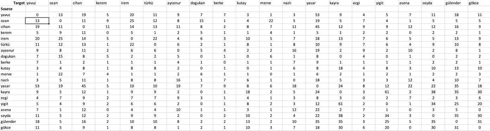
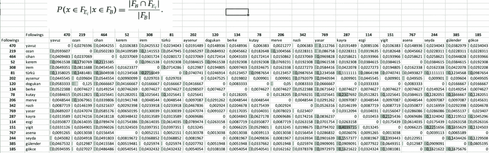
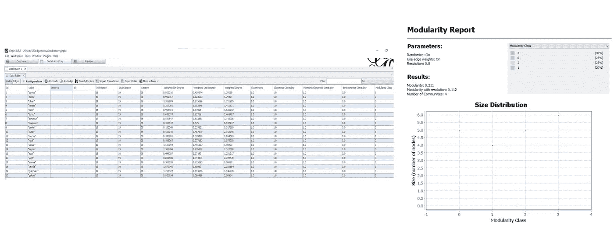
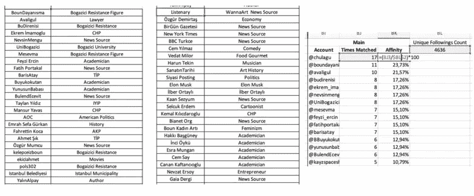
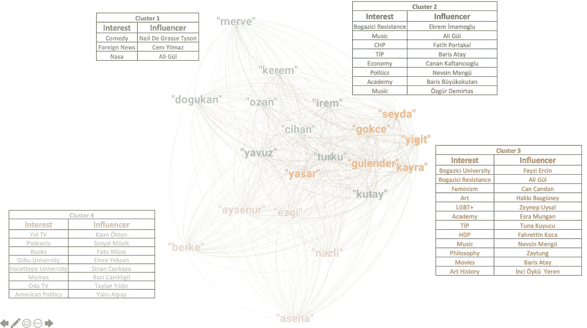

# 以下是来自 Twitter 的 Gephi 网络分析

> 原文：<https://medium.com/geekculture/network-analysis-with-gephi-from-twitter-followings-8284fb396ef9?source=collection_archive---------33----------------------->

知道 Twitter 的关注是兴趣的重要指标，我决定从 Twitter 上收集我的 15 个朋友和四个随机的人的关注。我有意收集我朋友的不同片段。通过这种方式，我希望在输出完成时有效性未被检查的情况下获得一些见解。

在下面，你可以看到被关注的账户的数量是相互匹配的。

这些数字稍后将在源-目标关系中提供我的权重值。为了使时间匹配的数量和它的总次数标准化，我决定使用 Jaccard 和余弦相似度。权重用这些索引归一化，我计划创建 20 个节点 190 边的无向图。

从 20 个节点的 190 边图开始，我意识到一个双边网络更适合我们的情况。因为匹配的数量很大程度上取决于源节点的关注总数，所以我决定继续使用 cnd-prob。使用 cnd-prob，我生成了 20 个节点 380 边有向图权重，这些权重后来形成了我们的网络。

下面您可以看到通过 cnd-prob 生成的值。

实际上，这里棘手的部分是将您的数据调整为 Gephi 格式。在对数据进行预处理之后，我继续通过 Gehpi 进行一些统计，并通过模块化算法计算集群。下面你可以看到数据实验室和模块化算法的结果。

有了结果后，我继续检查匹配的账户，看看哪些账户在集群内部和集群之间是匹配的。从这 20 个人中形成了 4636 个独特的追随者，并且这些账户在聚类中被匹配了 803 次。此外，134 个帐户已经彼此匹配，即使用户在不同的群中。这些帐户需要进一步分析，因为这些帐户揭示了集群之间的共性。

知道这些客户是感兴趣的重要指标后，我决定标记其中的一些客户，这样我就可以在宏观层面和稍后的集群设置中对它们进行分析。下面你可以看到亲缘关系和一些标签。

定义了有影响力的账户和兴趣后，我继续绘制我的图表，然后将这些聚类与其标记的兴趣进行匹配。下面你可以看到这个项目的总体结果。

我想和我的朋友们分享一些我的个人经验，来阐明这些细分市场的外观。第 4 类似乎主要由我家乡的朋友组成；布尔萨，我也知道第一组的人是亲密的朋友，甚至在大学之前就认识了，他们都来自阿达纳，除了我。也许我也应该透露一下多古康和我的室友情况。看起来我和多古坎没有我和欧赞、亚武兹和 i̇rem.那么多的共同兴趣然而，由于其他的联系，我们仍然出现在同一个星团里。嗯，这是值得研究的。谁知道呢，也许我应该换个室友。:)

在第二组中，i̇rem 和图尔库也是室友，我也希望再次强调，这些人是从我的亲密网络中收集的，因此可以理解几乎所有节点都以某种方式连接在一起。这里的大多数人来自我在博阿济齐大学的朋友，我想一些随机关注我的人也在博阿济齐大学学习或毕业。

希望你读这篇文章的时候觉得有趣。显然，这个项目有许多改进的地方。对于那些愿意贡献和进一步发展这个项目的人，请随时通过 chulagu@gmail.com 与我联系

我还要感谢 Ayberk Akgün、Ece Kayan、Yavuzhan Yavuz、Kerem Uslular、Ahmet Gürhan 在整个项目中给予的鼓励和支持！