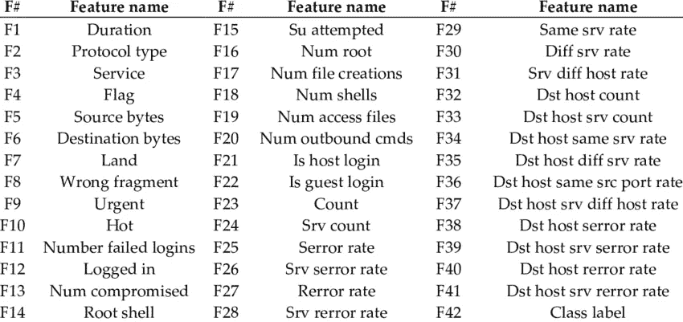
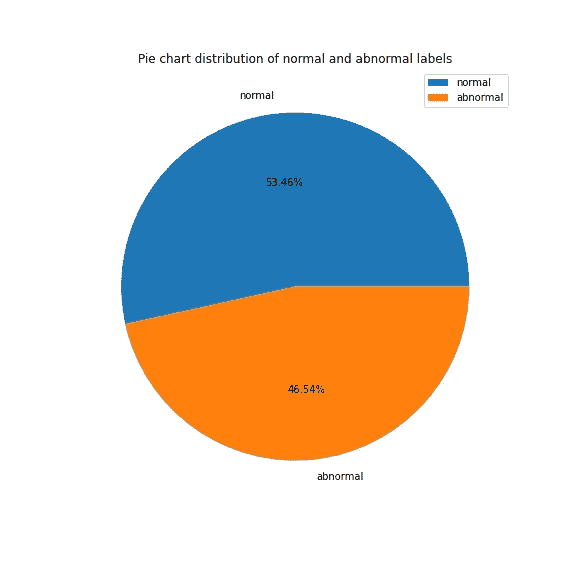
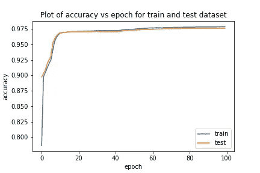
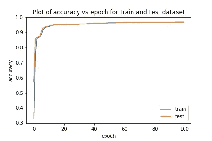
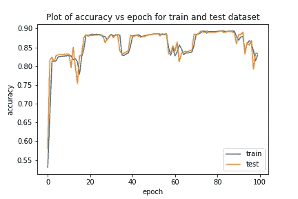
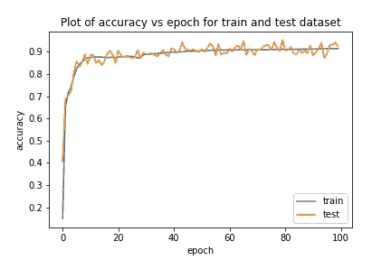
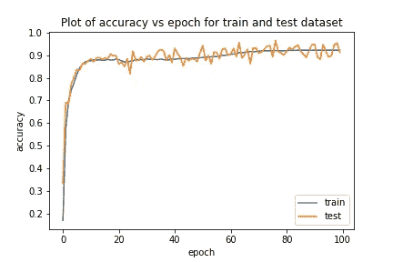

# 基于深度学习的网络入侵检测

> 原文：<https://medium.com/geekculture/network-intrusion-detection-using-deep-learning-bcc91e9b999d?source=collection_archive---------3----------------------->

松散地基于研究论文 [**一种新颖的统计分析和自动编码器驱动的智能入侵检测方法**](https://doi.org/10.1016/j.neucom.2019.11.016)

Features of NSL-KDD Dataset, Image Source — [https://www.researchgate.net/figure/List-of-features-of-NSL-KDD-dataset_tbl1_325709588](https://www.researchgate.net/figure/List-of-features-of-NSL-KDD-dataset_tbl1_325709588)

# 资料组

本项目使用加拿大网络安全研究所的**NSL-KDD 数据集(原始 **KDD 杯 1999 数据(KDD99)** 的更新版本)。**

# **使用的机器学习模型**

*   **线性支持向量机 **(LSVM)****
*   **二次支持向量机 **(QSVM)****
*   **k 近邻 **(KNN)****
*   **线性判别分析 **(LDA)****
*   **二次判别分析 **(QDA)****
*   **多层感知器 **(MLP)****
*   **长短期记忆 **(LSTM)****
*   **自动编码器 **(AE)****

# **数据预处理**

*   **你可以在这里找到 [**数据预处理的完整脚本**](https://github.com/abhinav-bhardwaj/Network-Intrusion-Detection-Using-Machine-Learning/blob/master/Data_Preprocessing_NSL_KDD.ipynb)**

## ****数据规范化****

*   **数据集有 43 个属性，属性'**难度级别**被删除。**
*   **使用**标准缩放器**缩放数据帧的 38 个数字列。**
*   **样本`x`的标准分数计算为: *z = (x — u) / s***

**其中 u 是训练样本的平均值，如果`with_mean=False`为 0，`s`是训练样本的标准差，如果`with_std=False`为 1。**

## ****一键编码****

*   **使用 **pd.get_dummies()** 对分类列“ **protocol_type** ”、“ **service** ”、“ **flag** ”进行一次热编码。**
*   ****分类数据帧**在一次热编码后有 84 个属性。**

## **二元分类**

*   **为二进制分类创建数据帧的副本。**
*   **攻击标签(**标签**属性)分为两类:**正常**和**异常**。**
*   ****标签**使用 **LabelEncoder()** 编码，编码后的标签保存在 **intrusion** 中。**
*   **标签是一个热编码。**

****

## **多类分类**

*   **为多类分类创建数据帧的副本。**
*   **攻击标签(**标签**属性)分为五类:**正常**、 **U2R** 、 **R2L** 、**探针**、 **Dos** 。**
*   ****标签**使用 **LabelEncoder()** 进行编码，编码后的标签保存在**入侵**中。**
*   ****标签**为单热编码。**

****

## **特征抽出**

*   **' **bin_data** '属性个数— 45**
*   **'**多数据**'的属性个数— 48**
*   **使用'**皮尔逊相关系数**'选择' **bin_data** '和' **multi_data** '的属性。**
*   **选择与目标属性'**入侵**'相关系数**大于 0.5** 的属性。**
*   **9 个属性' **count** '、 **srv_serror_rate** '、 **serror_rate** '、 **dst_host_serror_rate** '、**dst _ host _ SRV _ serror _ rate**'、 **logged_in** '、 **dst_host_same_srv_rate** '、'。**
*   **特征选择和连接**分类数据帧** — 97 后的 **bin_data** 的属性个数**
*   **特征选择和连接**分类数据框**后的 **multi_data** 的属性个数— 100**

## ****分割数据集****

*   **将数据集分为 **75 %用于训练**和 **25 %用于测试**。**
*   **从 97 个属性中选择 93 个属性，以排除用于二进制分类的目标属性(编码的、一次热编码的、原始的)**
*   ****入侵**属性被选为目标属性。**
*   **从 100 个属性中选择 93 个属性，以排除用于多类分类的目标属性(编码的、一热编码的、原始的)。**

## **线性支持向量机(LSVM)**

*   **二元分类准确率— **96.69 %****
*   **多类分类准确率— **95.24 %****
*   **使用的内核类型— **线性****
*   **`SVC(C=1.0, break_ties=False, cache_size=200, class_weight=None, coef0=0.0, decision_function_shape='ovr', degree=3, gamma='auto', kernel='linear', max_iter=-1, probability=False, random_state=None, shrinking=True, tol=0.001, verbose=False)`**

****二进制分类****

****多级分类****

## ****二次支持向量机****

*   **二元分类准确率— **95.71 %****
*   **多类分类准确率— **92.86 %****
*   **使用的内核类型— **Poly****
*   **`SVC(C=1.0, break_ties=False, cache_size=200, class_weight=None, coef0=0.0, decision_function_shape='ovr', degree=3, gamma='auto', kernel='poly', max_iter=-1, probability=False, random_state=None, shrinking=True, tol=0.001, verbose=False)`**

****二元分类****

****多级分类****

## **k-最近邻分类器(KNN)**

*   **二元分类准确率— **98.55 %****
*   **多类分类准确率— **98.29 %****
*   **邻居数量— **5****
*   **重量— **统一****
*   **`KNeighborsClassifier(algorithm='auto', leaf_size=30, metric='minkowski', metric_params=None, n_jobs=None, n_neighbors=5, p=2,weights='uniform')`**

****二元分类****

****多级分类****

## **线性判别分析(LDA)**

*   **二元分类准确率— **96.70 %****
*   **多类分类准确率— **93.19 %****
*   **使用的求解器— **svd(奇异值分解)****
*   **`LinearDiscriminantAnalysis(n_components=None, priors=None, shrinkage=None,solver='svd', store_covariance=False, tol=0.0001)`**

****二元分类****

****多级分类****

## **二次判别分析(QDA)**

*   **二元分类准确率— **68.79 %****
*   **多类分类准确率— **44.96 %****
*   **`QuadraticDiscriminantAnalysis(priors=None, reg_param=0.0, store_covariance=False, tol=0.0001)`**

****二元分类****

****多级分类****

## **多层感知器(MLP)**

****二元分类****

****

**MLP Binary Classification Accuracy**

*   **二元分类准确率— **97.79 %****
*   ****输入层**与 **93 输入尺寸****
*   ****1 隐藏层**具有 **50 神经元**和 **relu 激活**功能**
*   ****输出层**具有 **1 神经元**和**乙状结肠激活**功能**
*   **损失— **二元 _ 交叉熵****
*   **优化器— **亚当****
*   **批量大小— **5000****
*   **纪元— **100****

****多级分类****

****

**MLP Multi-class Classification Accuracy**

*   **多类分类准确率— **96.92 %****
*   ****输入层**带 **93 输入尺寸****
*   ****1 个隐藏层**具有 **50 个神经元**和 **relu 激活**功能**
*   ****输出层**具有 **5 个神经元**和 **softmax 激活**功能**
*   **损失— **分类 _ 交叉熵****
*   **优化器— **亚当****
*   **批量大小— **5000****
*   **纪元— **100****

## **长短期记忆(LSTM)**

****

**LSTM Binary Classification Accuracy**

*   **二元分类准确率— **83.05 %****
*   ****输入层**与 **93 输入尺寸****
*   ****LSTM 层**带有 **50 个编码单元****
*   ****输出层**具有 **1 神经元**和**乙状结肠激活**功能**
*   **损失— **二元交叉熵****
*   **优化器— **亚当****
*   **批量大小— **5000****
*   **纪元— **100****

## **基于自动编码器的分类器**

****二元分类****

****

**Autoencoder Binary Classification Accuracy**

*   **二元分类准确率— **92.26 %****
*   ****输入图层****
*   ****编码层**带有 **50 个编码单元****
*   ****输出层**和**解码层** r 具有 **softmax 激活**功能**
*   **损失— **均方误差****
*   **优化器— **亚当****
*   **批量大小— **500****
*   **纪元— **100****

****多级分类****

****

**Autoencoder Multi-class Classification Accuracy**

*   **多类分类准确率— **91.22 %****

## **从哪里获得完整的代码？**

** [## abhinav-bhardwaj/网络入侵检测使用机器学习

### 松散地基于研究论文一个新的统计分析和自动编码器驱动的智能入侵检测…

github.com](https://github.com/abhinav-bhardwaj/Network-Intrusion-Detection-Using-Machine-Learning) 

# 引文

*   Cosimo Ieracitano，Ahsan Adeel，Francesco Carlo Morabito，Amir Hussain，一种新颖的统计分析和自动编码器驱动的智能入侵检测方法，神经计算(2019)，DOI:[https://doi.org/10.1016/j.neucom.2019.11.016](https://doi.org/10.1016/j.neucom.2019.11.016)
*   来自加拿大网络安全研究所的 NSL-KDD 数据集(1999 年 KDD 杯原始数据(KDD99)的更新版本)[https://www.unb.ca/cic/datasets/nsl.html](https://www.unb.ca/cic/datasets/nsl.html)**