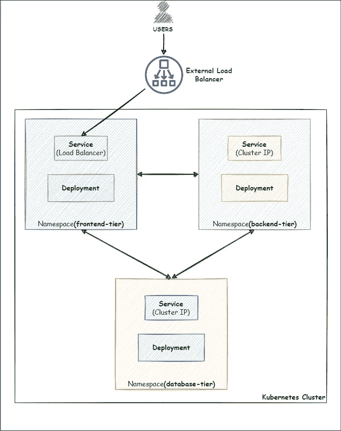
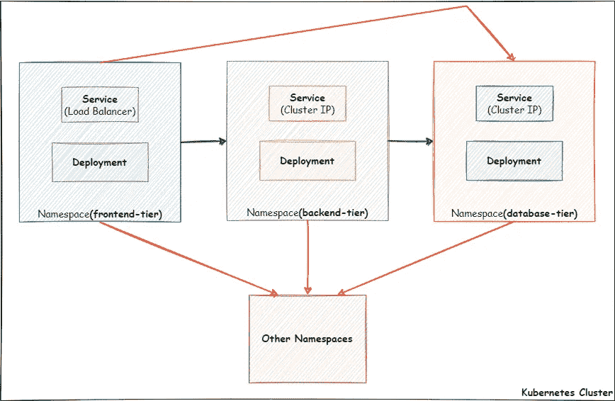
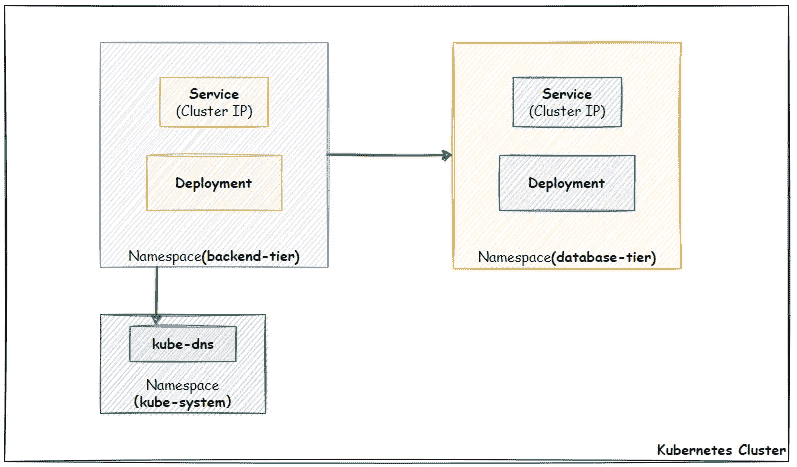
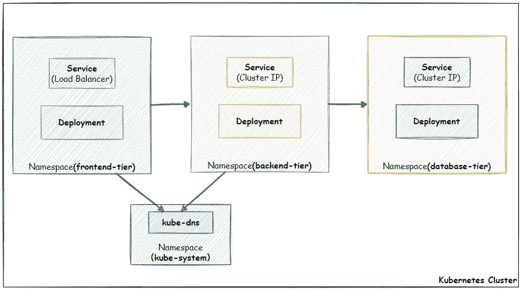
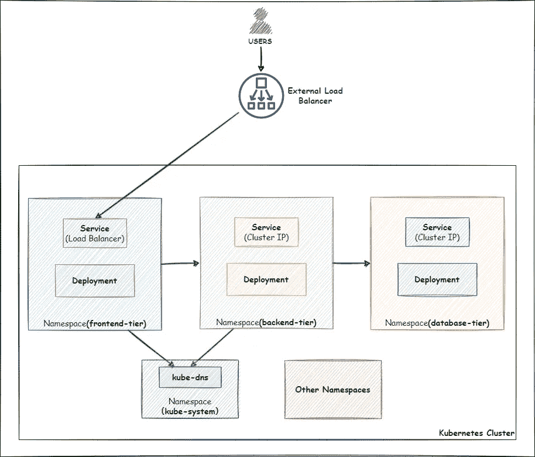
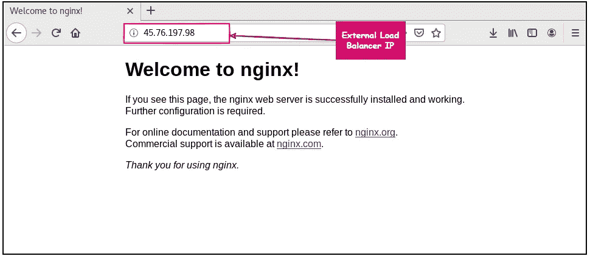

# 确保 Kubernetes 集群上工作负载安全的网络策略

> 原文：<https://medium.com/geekculture/network-policy-to-secure-workloads-on-kubernetes-cluster-99017698c748?source=collection_archive---------5----------------------->

## 使用网络策略保护您的单/多租户集群

Photo by [Miłosz Klinowski](https://unsplash.com/es/@speedoshots?utm_source=medium&utm_medium=referral) on [Unsplash](https://unsplash.com?utm_source=medium&utm_medium=referral)

在 **Kubernetes** 集群配置中，任何名称空间中的任何服务都是可访问的。因此，默认情况下，pod 对所有流量开放。

我们可以基于命名空间或单元定义网络策略，以保护集群的工作负载。假设在一个多租户集群中，根据项目、团队或组织来分离工作负载可以通过网络策略来实现。

## 方案

假设我们必须使用 Kubernetes 名称空间构建一个**三层架构**。我们的应用程序将分三层部署。这三层将是**前端层、后端层、**和**数据库层*。***

**●前端层**将面向公众。前端层内的应用程序将使用****负载平衡器**服务公开，这就是为什么前端层将由外部负载平衡器的 DNS 或 IP 地址访问。**

****●后端层**将包含与应用逻辑相关的工作负载。这一层将包含所有的应用程序逻辑。**

****●数据库层**将包含与数据库相关的工作负载。**

**正如我们所知，默认情况下，每个名称空间都可以向/从其他名称空间发送流量。因此，在不应用任何网络策略的情况下，我们的 3 层体系结构将类似于下图:**

****

**让我们如上所示配置我们的 3 层架构。我们将创建三个新的名称空间。然后在名称空间中，我们将部署*部署*和*服务。***

**为了简单起见，我们将使用***nginx****映像来部署*部署*下的 pod。***

## ***1.配置新的命名空间***

***创建新的命名空间并为每个命名空间添加标签，以便网络策略可以应用到所需的命名空间。***

## ***2.部署部署和服务***

## ***2.1 数据库层***

## ***2.2 后端层***

## ***2.3 前端层***

***我们已经公开了使用负载平衡器服务的前端层。使用负载平衡器服务的**外部 IP** ，用户将能够访问驻留在前端层的应用。***

## ***3.危险人物***

## ***3.1 问题***

***目前，没有网络策略应用于 pod 或命名空间。因此，集群中的所有单元都可以相互通信。但是我们的 Kubernetes 集群可以是多租户集群，或者可能有其他敏感的工作负载在集群上运行。结果，如果任何攻击者以某种方式获得了对**前端层**的访问权，那么他就可以直接访问**数据库层**或者集群中的任何其他名称空间。这是一个巨大的安全风险。***

## *****3.2 补救措施:*****

***为了克服安全风险，我们可以使用网络策略。使用适当的网络策略，我们可以**将**前端层、**后端层、**和**数据库层**与集群中的其他名称空间隔离开来。除此之外，我们还可以将**数据库层**的 ***入口*** 流量限制到**后端层**。此外，将后端层的 ***入口*** 流量仅限于**前端层**。结果，如果任何攻击者以某种方式访问了**前端层，**就不能直接访问**数据库层**或任何其他名称空间。为了更好地理解，请参见下图:***

******

## ***4.应用网络策略***

## ***4.1 数据库层***

*****●默认拒绝所有入口和所有出口流量** 我们可以为命名空间创建一个“默认”策略，通过在该命名空间中创建以下网络策略来阻止所有 ***入口*** 和 ***出口*** 流量。***

***应用上述策略后，**数据库层**现在与集群中的其他名称空间隔离开来。***

*****●允许来自后端层** 的进入现在，我们将对**数据库绑定** r 应用另一个策略，以便它只能允许来自**后端层**的 ***进入*** 流量。***

## ***4.2 后端层***

*****●默认拒绝所有入口和所有出口流量** 与**数据库层**类似，我们将应用一个网络策略将**后端层**与其他名称空间隔离开来。***

*****●允许流出流量到数据库层** 在 [**数据库层**](#4b0a) 中，我们只允许来自**后端层**的 ***流入*** 流量。但是在上一步中，我们拒绝了所有进出**后端层的流量。**因此，尽管**数据库层**允许来自后端层的 ***入站*** 流量，但**后端层**现在无法发送 ***出站*** 流量。为了在**后端层**和**数据库层**之间创建成功的通信，我们必须允许从**后端层**到**数据库层的出口流量。*****

***此外，由于我们使用**服务**来访问 pod，我们必须允许另一个 ***出口*** 规则来解析**服务**的 DNS。在 Kubernetes 集群中，DNS 服务器作为 kube-system 名称空间中的一组 pod 运行。所以我们必须允许 ***出口*** 流量到达 kube-system 名称空间。但是我们不允许 ***egress*** 流量在整个 **kube-system** 名称空间上传输；我们将允许包含**“kube-DNS”**等级的 pod。这样，**后端层**中的 pod 可以解析**服务**的 DNS。***

***使用以下网络策略允许从**后端层**到**数据库层**的 ***出口*** 流量，以及 kube-system 名称空间的**端口 53** 上的 ***出口*** :***

***完成上述步骤后，我们处于以下阶段:见图:***

******

***从上图中我们可以看到，**后端层**可以将 ***出口*** 流量发送到数据库层。但是目前，****后端层**不允许任何 ***进入*** 流量。*****

*******●允许来自前端层** 的流入流量我们可以对**后端层**应用一个网络策略，以便它只能允许来自**前端层**的*流入流量。******

******这样，我们就处于这样一个位置，即****后端层**将允许 ***从**前端层**传入*** 流量，并将流量传出到**数据库层。**********

## ****4.3 前端层****

******●默认拒绝所有入口和所有出口流量** 与前面的两层类似，我们将应用一个网络策略来拒绝来自任何地方的所有 ***入口*** 和**出口**流量。****

******●允许后端层** 的流出流量，因为我们已经拒绝了所有 ***流入*** 和 ***流出*** 流入/流出**前端层的流量。**为了将流量发送到**后端层**，我们必须允许 ***出口*** 流量到达****后端层**以及 **kube-system** 名称空间，以解析**服务**的 DNS，正如我们前面讨论的 。******

******完成上述步骤后，我们处于以下阶段:见图:******

************

********●允许来自互联网** 的进入流量，因为**前端层**中的应用程序正在使用负载均衡器**服务**公开。因此，请求将来自外部负载平衡器的 IP 地址。由于我们使用负载平衡器的外部 IP 拒绝来自任何地方的 ***流入*** 流量，我们将无法访问驻留在**前端层**中的应用。为了解决这个问题，我们必须应用一个网络策略，它将允许 ***流量从任何地方进入*** 流量，但不允许来自 pod 的私有 IP 地址的流量进入。通过这样做，我们可以限制来自驻留在其他名称空间中的 pod 的任何流量。******

******至此，我们已经应用了**保护**和**隔离**Kubernetes 工作负载所需的所有可能网络策略。为了更好地理解我们到目前为止所做的工作，请看下图:******

************

## ******5.测试和验证******

******现在，让我们测试并验证所有网络策略是否都已应用或是否正常工作。******

******●首先，让我们尝试使用负载平衡器**服务**的**外部 IP** 访问我们的应用程序。******

************

******在上图中，我们可以看到负载均衡器**服务**的外部 IP 可以访问驻留在**前端层**的应用程序。******

******●让我们深入位于**前端层**的 pod，并尝试访问位于**后端层**和**数据库层**的服务******

******●类似地，我们还可以深入驻留在**后端层**中的 pod，观察网络策略是否正常工作。******

******●最后，深入位于**数据库层**的 pod，观察网络策略如何运行:******

******在上面的演示中，我们可以看到应用于相应名称空间的网络策略运行正常。******

> ******如果你觉得这篇文章有帮助，请**不要忘记点击**拍拍**和**跟随**按钮来帮助我写更多这样的文章。
> ***谢谢🖤***********

# ****👉所有关于 Kubernetes 的文章—****

****

[Md 沙米姆](/@shamimice03?source=post_page-----99017698c748--------------------------------)**** 

## ****关于 Kubernetes 的所有文章****

****[View list](/@shamimice03/list/all-articles-on-kubernetes-7ae1a0f96f3b?source=post_page-----99017698c748--------------------------------)********24 stories****************************

## ****参考****

****[https://kubernetes . io/docs/concepts/services-networking/network-policies/](https://kubernetes.io/docs/concepts/services-networking/network-policies/)****

****[https://stack overflow . com/questions/65424614/kubernetes-network policies-blocking-DNS](https://stackoverflow.com/questions/65424614/kubernetes-networkpolicies-blocking-dns)****