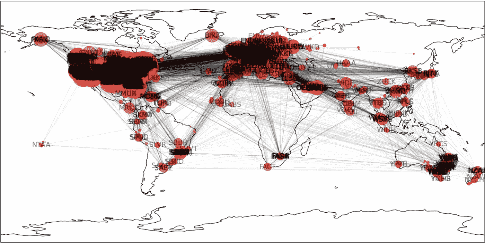

# 使用 NetworkX 和 Cartopy 实现网络可视化

> 原文：<https://medium.com/geekculture/network-visualization-using-networkx-and-cartopy-a9a8a53440b9?source=collection_archive---------19----------------------->

使用 NetworkX 和 Cartopy 的空中交通可视化——疫情以前与现在。

Air Traffic Visualization

# 概观

由于目前的疫情，航空和旅游业受到严重影响，仍然没有改善的迹象。在这篇文章中，让我们用空中交通数据来比较疫情之前和现在的空中交通。