# 网络:为什么同一个系统可以连接谷歌，却不能连接脸书

> 原文：<https://medium.com/geekculture/networking-same-system-can-able-to-ping-google-but-not-to-facebook-62e6303511d8?source=collection_archive---------15----------------------->

## 路由表内部的神奇变化💻🌐💻

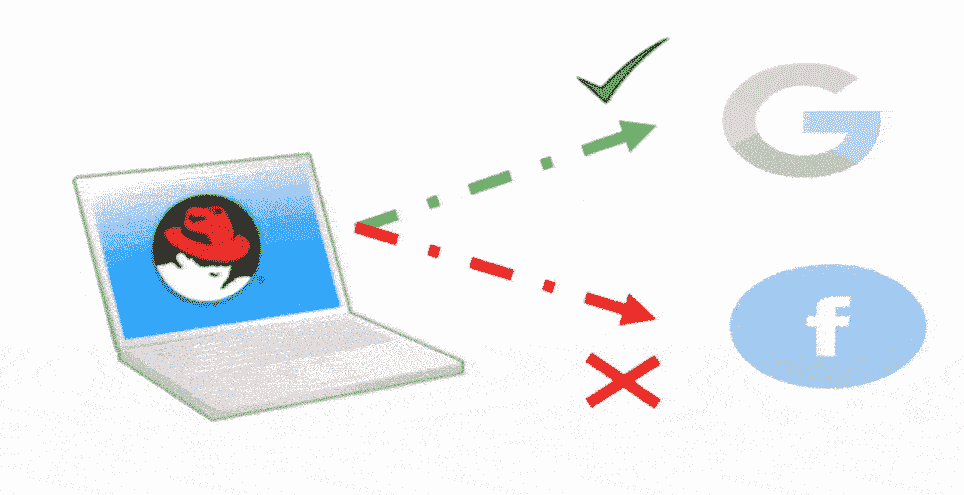

> C ***创建一个设置，这样你可以 ping 谷歌，但不能从同一个系统 ping 脸书***

在本文中，我们将只通过在网络内部操纵**路由表**，而不使用任何**防火墙**或任何**安全**概念，来创建上述神奇的设置。

# **什么是网络？？**🌐


source from google

> **联网是在信息系统中通过共享介质在节点之间传输和交换数据的实践**。

因此，让我们了解一些重要的**网络术语，这将有助于我们更好地理解设置:-**

*   **乒:**

Ping 是一个命令行实用程序，几乎可以在任何具有网络连接的操作系统上使用，它可以测试联网设备是否可以到达。

*   **IP 地址:**

IP(互联网协议)地址是网络硬件的唯一地址。它有助于将您的计算机连接到网络上和世界各地的其他设备。

*   **网卡(NIC):**

网络接口控制器是将计算机连接到计算机网络的计算机硬件组件。

*   **开关:**

交换机连接网络(如 LAN)中的设备，并在这些设备之间来回转发数据包。

*   **路由器:**

路由器是一种在两个或多个分组交换计算机网络之间传递信息的设备

*   **路由表:**

路由表是一组规则，其中包含将数据包沿最佳路径转发到目的地所需的信息。

*   **网络掩码(Genmask):**

网络掩码由 32 位掩码组成，用于将 IP 地址划分为子网，并指定网络的可用主机。

*   **网关:**

网络网关连接两个不同的网络，因此一个网络上的设备可以与另一个网络上的设备通信。

*   **数据包:**

为了在两个系统之间建立通信以共享信息，它首先创建数据包并将它们发送到目的系统。

> 创建到达目的地的数据包的秘密以规则(IP 范围)的形式写在路由表中。

# **先决条件**:

→您的操作系统中应该有互联网连接。

**那么，现在让我们开始在 RHEL 上逐步实施设置-**

**步骤 1:检查 Linux 中的所有路由(路由表)**

命令:

```
**route -n**
```

输出:

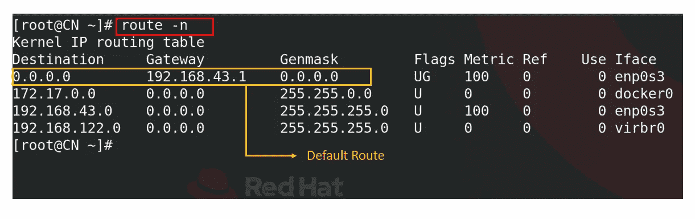

我们可以看到，第一条规则显示，目的地 0.0.0.0 和网络掩码 0.0.0 的默认路由始终是 0.0.0，这意味着对于全球所有 IP 范围，数据包都将通过此默认网关 **192.168.43.1** 。

默认的**网关**是路由器的 IP 地址，负责将数据包转发到另一个网络。

**第二步:让我们检查谷歌和脸书的服务器是否可以 ping 通**

命令:

```
**ping -4 www.google.com
ping -4 www.facebook.com**
```

输出:

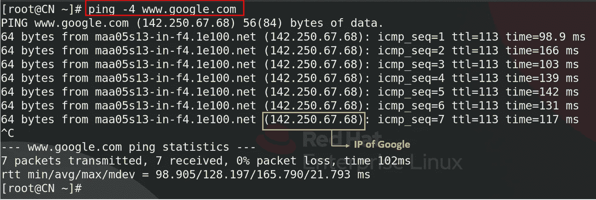

脸书也一样，

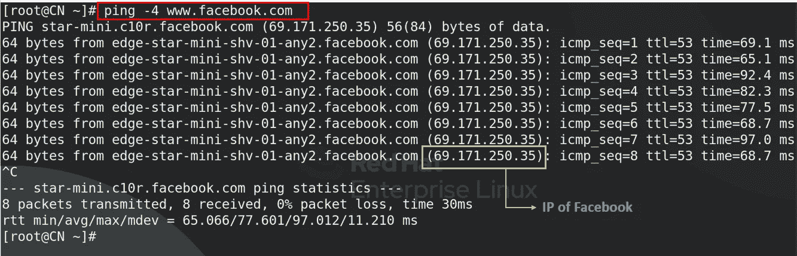

正如我们所见，系统向谷歌(IP:142.250.67.68)和脸书(IP:69.171.250.35)服务器发送数据包，我们从这两个服务器获得响应。

**步骤 3:从路由表中删除默认路由**

命令:

```
**route del -net 0.0.0.0**
```

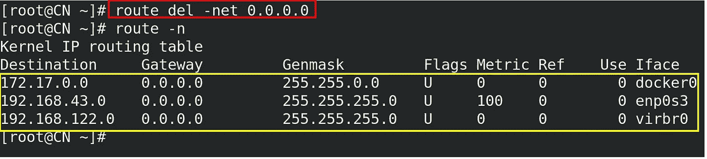

现在我们可以看到默认路由已被成功删除。

删除默认路由后，系统将不允许访问任何互联网或其他网络。

让我们检查一下…

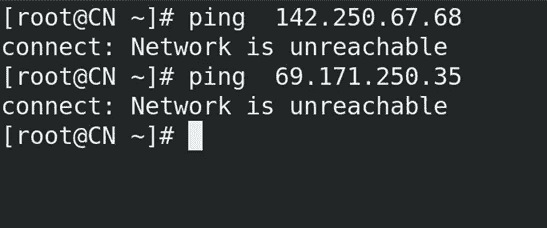

IP of Google and Facebook is Unreachable

在上图中，我们可以看到网络对于谷歌和脸书服务器都是不可达的，这意味着系统不会创建到目的地的数据包，因为我们在路由表中没有任何可用的路由/规则或范围。

**步骤 4:添加新路由，以便我们可以 Ping 到谷歌服务器**

→我的网卡(enp0s3)的 IP 地址是 192.168.43.27

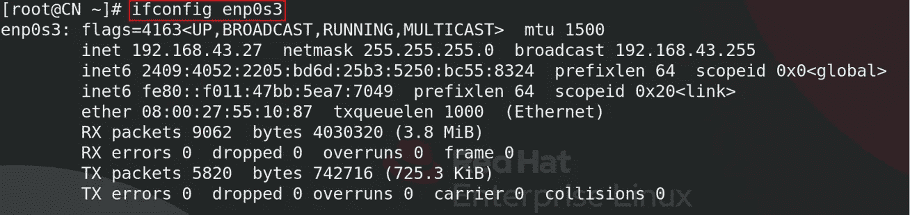

命令:

```
**route add –net 142.250.67.0 netmask 255.255.255.0 gw 192.168.43.1 enp0s3**
```

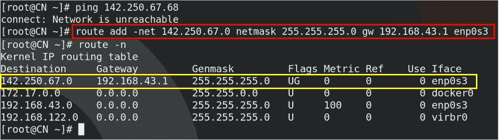

因此，新的路由被添加到路由表中，它描述了来自网络范围(**142 . 250 . 67 . 0–255**)和子网掩码/地址掩码为 **255.255.255.0** 的谷歌 Ip(**142.250.67.68**

**第五步:让我们再次尝试 Ping 谷歌和脸书服务器**

命令:

```
**ping 142.250.67.68**
```

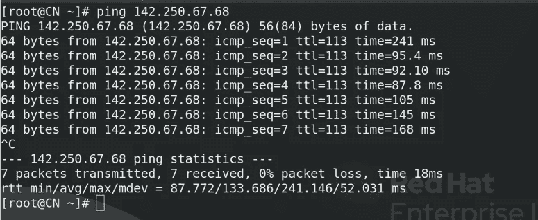

哇…现在我们可以检查谷歌的 IP 地址了。

脸书也一样，

```
**ping 67.171.250.35**
```

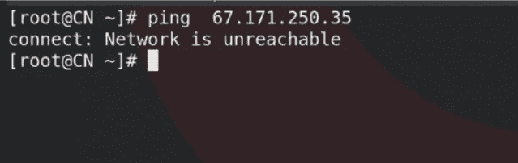

是的，脸书的 IP 地址没信号了。这就是我们为特定服务器创建路由的方式。

→让我们在浏览器上检查一下..

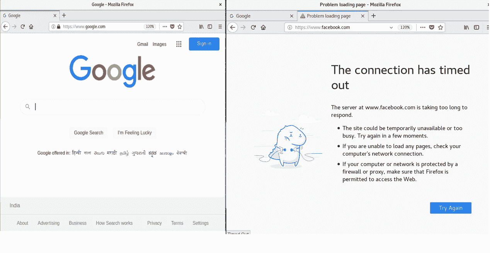

# 结论:

最后，我们成功地实现了一个设置，即**相同的系统可以 Ping Google，但不能 Ping FaceBook** 。


Photo by [Pete Pedroza](https://unsplash.com/@peet818?utm_source=medium&utm_medium=referral) on [Unsplash](https://unsplash.com?utm_source=medium&utm_medium=referral)


如果有任何需要改进的地方，请给出您的宝贵反馈。

[](https://www.linkedin.com/in/kalpit-malviya99/) [## 卡尔皮特·马尔维亚- ARTH 学习者- ARTH -技术学院| LinkedIn

### 查看 Kalpit Malviya 在全球最大的职业社区 LinkedIn 上的个人资料。Kalpit 有 3 份工作列在…

www.linkedin.com|](https://www.linkedin.com/in/kalpit-malviya99/)