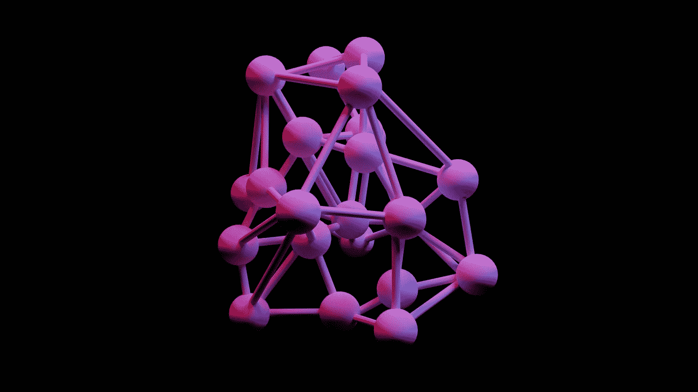

# 神经结构搜索:用神经结构搜索设计分类器

> 原文：<https://medium.com/geekculture/neural-architecture-search-design-a-classifier-with-neural-architecture-search-d7c7799ec74f?source=collection_archive---------16----------------------->

Photo by [J K](https://unsplash.com/@6690img?utm_source=medium&utm_medium=referral) on [Unsplash](https://unsplash.com?utm_source=medium&utm_medium=referral)

神经结构搜索是一种自动设计用于解决特定问题的神经网络的技术。它最初是由研究人员为特定领域的领域专家开发的，但他们很少或没有机器学习知识，并希望开发机器学习系统来解决他们的问题。