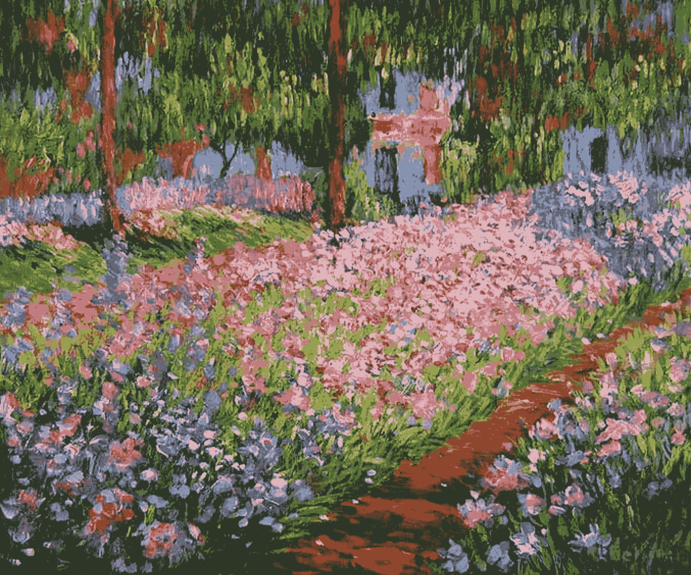
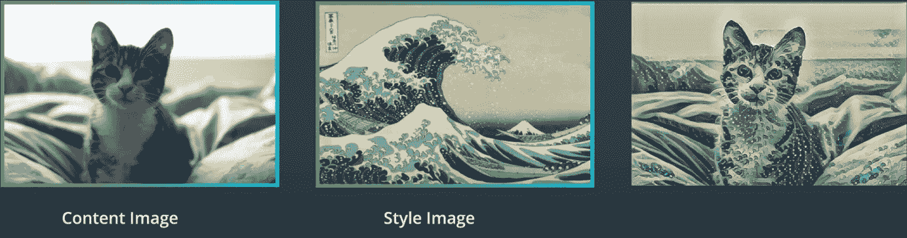
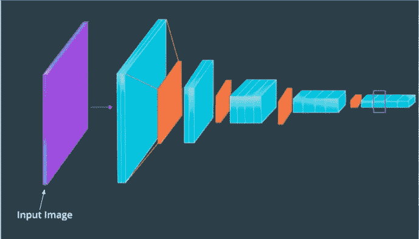
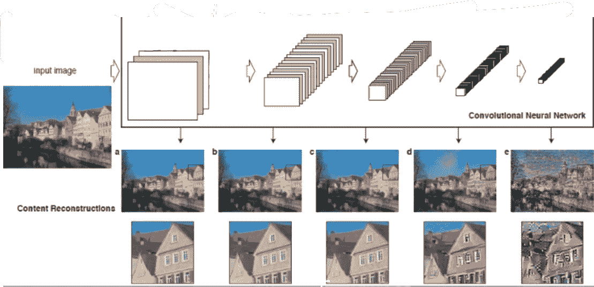
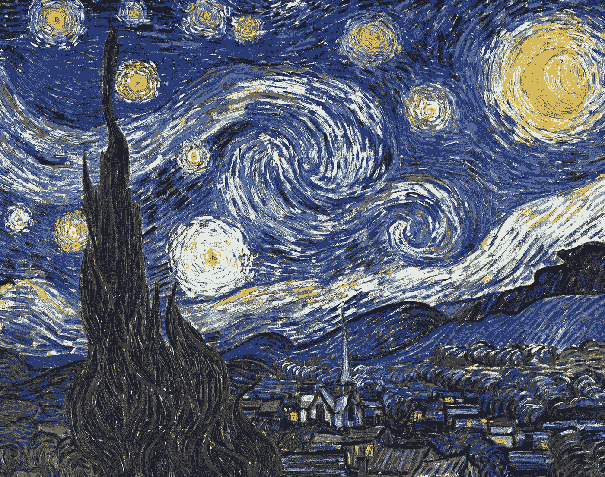
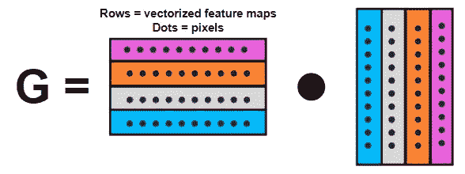
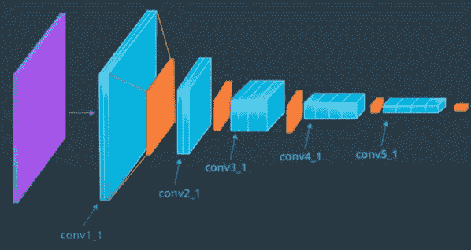
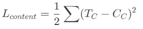
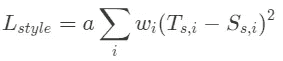
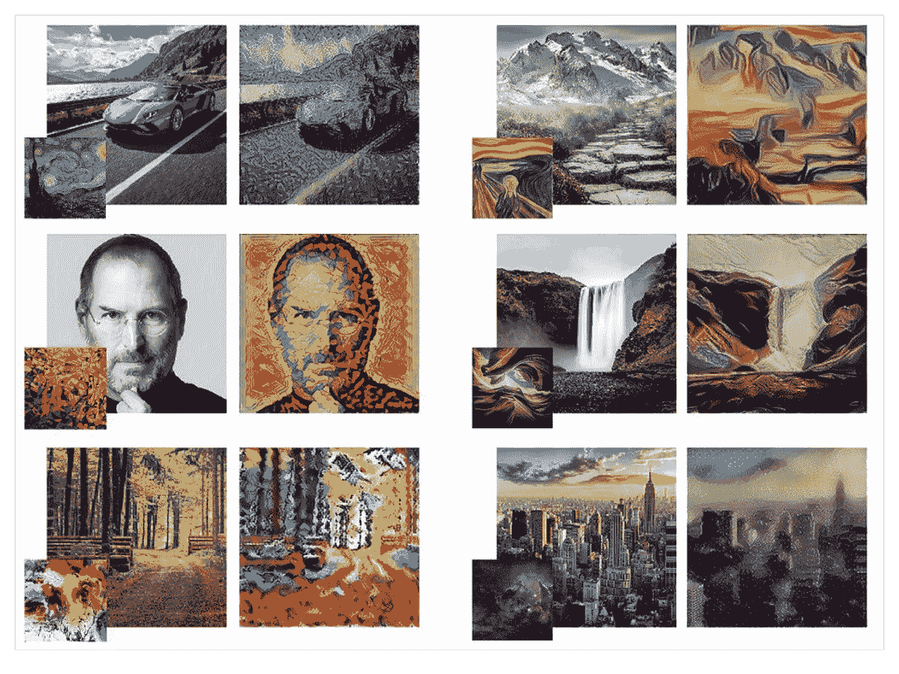

# 神经图像风格转移

> 原文：<https://medium.com/geekculture/neural-image-style-transfer-515fe09f1c0c?source=collection_archive---------11----------------------->

Claude Monet Painting

你从相机胶卷里拿出一张照片，然后选择一个设计。然后你得到一个新的图像，它包含了你的输入图像的内容和设计图像的风格。我们从棱镜中了解到这一点，但是这种技术是如何工作的呢？在机器学习中，我们把这个算法叫做“**风格转移**”。

> 风格转移是将一幅图像的风格结合到另一幅图像中。

风格转移使用预先训练好的 CNN(卷积神经网络)来寻找一幅图像的**内容**特征——物体——和另一幅图像的**风格**特征——笔刷、纹理、颜色——来混合它们。

I spent minutes on end absorbing wave cat | Source: Intro to Deep learning with Pytorch on Udacity

最好的风格转换模型可以保持图像的特征，同时改变图像的风格属性。

> 在本文中，我们将探索这种算法背后的技术过程。

# TL；速度三角形定位法(dead reckoning)

*   内容和风格表示:机器如何理解和存储图像的各个方面？什么是 VGG 19 有线电视新闻网？什么是克矩阵？
*   损失函数:我们优化什么？我们如何把风格和内容形象结合起来？什么是风格转移？

# 风格转移过程(待进一步解释)

*   **内容图像**通过 VGG-19 网络，在此**提取内容表示**。
*   **风格图像**通过 VGG-19 网络，其中**风格表示**被提取并使用 gram 矩阵存储。
*   然后，利用梯度下降和先前计算的内容和样式表示来迭代优化**原始内容图像**。

# 捕获内容和样式表示

风格转换的两个主要任务是捕获一个图像的**内容表示**和另一个图像的**风格**来组合它们。

我们分别使用 CNN——在我们的例子中是 VGG 19——和 gram 矩阵来捕捉这些表示

## CNN 综述

> 在这一节中，我回顾了 CNN 的基础知识以及它们是如何工作的。如果你知道基本知识，请随意跳过*🙂。*如果你不熟悉它，请阅读[这个深入的来源](https://e2eml.school/how_convolutional_neural_networks_work.html)来了解更多关于卷积、层和过滤器的知识。

**卷积神经网络(ConvNet/CNN)** 是一种深度学习算法，可以接受输入图像，为图像中的各个方面/对象分配重要性(可学习的权重和偏差)，并能够区分彼此。

虽然 CNN 的架构可以因其子类型而异——VGG-19、亚历克斯-Net 等——但它运行的工作过程是相同的。所有 CNN 都有两个部分:

*   卷积层
*   最大池层数

**卷积层**(蓝色)是“特征图”的容器。它们将检测到的特征(或卷积图像)存储在输入中。图层越深，要素地图或存储的要素就越多。

**池化** **层**(橙色)用于降低维度，简化卷积层。因此，要学习的参数数量将会减少。

> 当输入通过卷积层和池层时，会生成内容的更全面、更详细的表示。

notice including convolution and pooling layers there are also fully connected layers. as style transfer does not require any prediction these fully connected layers are not included in our architecture further in the blog. | VGG-19 CNN 👆

在我们的风格转换模型中，我们使用 VGG-19 CNN 框架。这个 CNN 有 19 个加权层，包括我们移除的 3 个密集层。

> 在我们的风格转换项目中，使用 VGG-19 模型对于彻底理解风格和内容图像至关重要。

## 内容表示

如你所知，VGG-19 CNN 的后续层更好地捕捉了图像的内容，因此被称为内容表示。内容表示识别线条和亮度以描绘图像对象的轮廓

content representation being created | notice the three input channels stand for the colour channels (R, G, B)

请注意，内容表示丢弃了所有不相关的细节，包括**样式**，以保留图像中的主要对象。

在我们的 VGG-19 CNN 中，我们提取第四个卷积堆栈的**第二个卷积中的内容表示——正如 Gatys L 在他的论文中所使用的。这确保了全面但不太精简的表示。**

the purple rectangle represents the content representation of the image as said in the ‘Neural Style Transfer’ paper

## 格拉姆矩阵

正如我们所知，为了获得内容表示，我们通过 CNN 传递内容图像，在本例中是 VGG19，其中后面的层具有更好的内容表示。

**提取样式出乎意料的简单。**

图像的“风格”是颜色、纹理和情感的总体主题。或者，从更理论的角度来看，《星夜》中柏树的纹理与月亮的纹理有什么关系？如果有，有何异同？

> 风格是一幅画的各个方面如何相互联系

how does the texture in the cypress tree of starry night relate with the texture of the moon?

为了找到风格，我们首先通过 VGG-19 CNN 输入风格图像，以观察卷积层中特征图之间的相关性。**换句话说，我们正在查看图像中特征之间的相似性。**这些相似点就是图像的**风格**。

> 我们可以用 **Gram 矩阵**将这些相似性存储为**样式表示**。

格拉姆矩阵是通过取卷积层的展开中间表示及其转置的点积来计算的。用程序员更简单的话来说，我们用它的转置点一个卷积层中的展平特征图列表。

and thus the Gram Matrix storing the style features in one convolutional layer is made

a flattened feature map, the random numbers represent pixel values

正如 Leon Gatys 的论文中所建议的，我们计算了 VGG-19 网络中所有卷积栈中每个第一卷积层的 gram 矩阵。**图像的风格表示是 VGG-19 网络**中的 gram 矩阵列表。

calculating the gram matrix at every first layer of each stack

—因此我们知道如何计算图像的内容和样式表示！

# 损失函数

获得内容和样式表示后，我们的下一步是创建目标图像——计算表示的组合。我们使用损失函数和[梯度下降](/geekculture/gradient-descent-simplified-631a7ce38cb6)来实现这一点。

> 损失函数告知模型的准确性。损耗越低，精度越高。

使用的损失函数是风格损失和内容损失。简单地说，他们分别找到目标图像与风格和内容图像之间的错误。目标图像首先被初始化为原始内容图像，并被迭代优化为具有最少样式和内容损失的混合图像。

## 内容损失

当我们形成目标图像时，我们比较目标图像和内容图像的内容表示。一个更好的风格转换模型使这两种表现尽可能接近，即使我们的目标图像改变了它的风格。

我们定义了一个内容损失来寻找表示之间的差异。或者计算内容和目标图像内容表示之间的对比度的损失。这里，我们使用均方差(MSE)作为损失函数。

T_C is target image content representation and C_C is content image content representation

为了逐步生成更好的目标图像，我们的目标是尽量减少这种损失。虽然这个过程类似于在优化中使用损失来确定 CNN 的权重，但是这里我们的目的不是最小化分类误差。

我们的目标是只改变目标图像，更新它的外观，直到它的内容表示与内容图像的表示相匹配。我们没有使用传统意义上的 VGG 19 网络，而是仅用于特征提取— [梯度下降](http://google.com)用于降低目标和内容图像之间的损失。

> 我们不使用 VGG-19 进行分类，而仅用于特征提取

## 风格丧失

以同样的方式，我们计算目标图像和具有风格损失的风格图像之间的差异。该功能类似于内容丢失，试图使内容和目标图像**的样式表示**尽可能接近。

T_s is the target image style representation, while S_s is the style image style representation, a is the number of values in each layer

我们找到了风格和目标图像风格表示之间的均方距离。回想一下，这两种样式表示都包含五个 gram 矩阵，它们是在 VGG-19 网络中每个卷积堆栈的每个第一层计算的。

在上面的等式中，我们称 ***Ss*** 和 ***Ts*** ， ***A*** 是一个常数，表示每一层中值的个数。我们将这五个计算的距离乘以我们指定的一些样式权重 ***w*** ，最终求和。

> 样式权重是改变目标图像上的样式表示的效果的值。重量越大，效果越好。

**我们只改变目标图像的样式表示，因为我们通过多次迭代来最小化这种损失。**

## 优化和后续步骤

既然我们理解了**表示**和**损失**的概念，下一步就是减少总损失。

> 全损简单来说就是风格损失和内容损失的相加。

我们使用典型的梯度下降和反向传播，通过迭代地改变目标图像来匹配我们想要的内容和风格，从而减少总损失。

阅读[这篇](/geekculture/gradient-descent-simplified-631a7ce38cb6)文章，了解更多关于梯度下降和优化算法的工作，阅读[这篇](https://www.tensorflow.org/tutorials/generative/style_transfer)文章，了解如何使用 TensorFlow 编写自己的代码。

希望你有一个 blast 编码自己的风格转换算法！希望您学到了一些新东西，并对自己编写这个模型感到兴奋。干杯🍻！

Some Inspiration 🙌 | Made by [Thushan Ganegedara](https://thushv89.medium.com/)

# 在你走之前…

> 通过这篇文章，你已经了解了风格转换的基本原理。🎉🎊我们探讨了特征提取、损失函数以及风格转换优化是如何工作的！祝你的机器学习之旅好运！
> 
> 机器学习一直是我的研究热点。无论是在 snapchat 过滤器还是垃圾邮件分类器中，到处都在使用**。今天，它更像是一种生活方式，而不是流行语。**
> 
> *这就是我进入数据科学领域的原因。从一开始，我就上瘾了，我希望我会一直上瘾。*
> 
> *如果你喜欢阅读这篇文章，请联系我的社交网站🤗
> [*LinkedIn*](https://www.linkedin.com/in/arjun-mahes-a46200220/)*|*[*快讯*](https://arjunmahes.substack.com/)|[*推特*](https://twitter.com/mahes_arjun)*