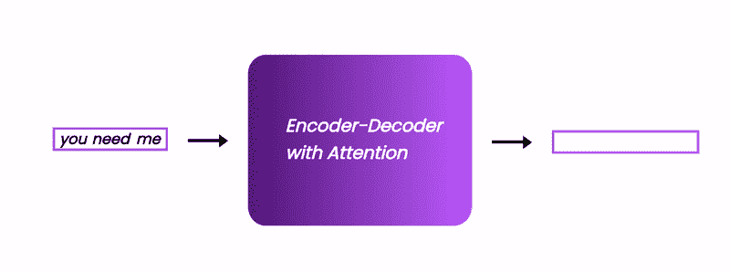
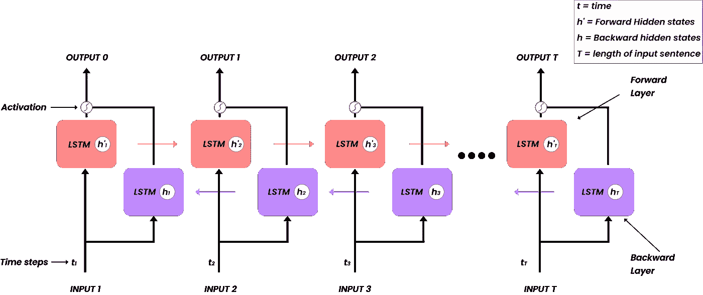
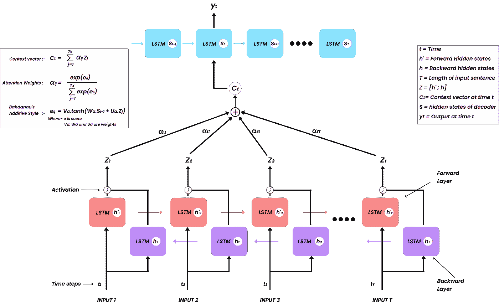
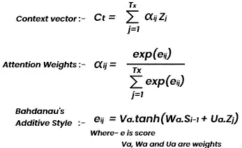
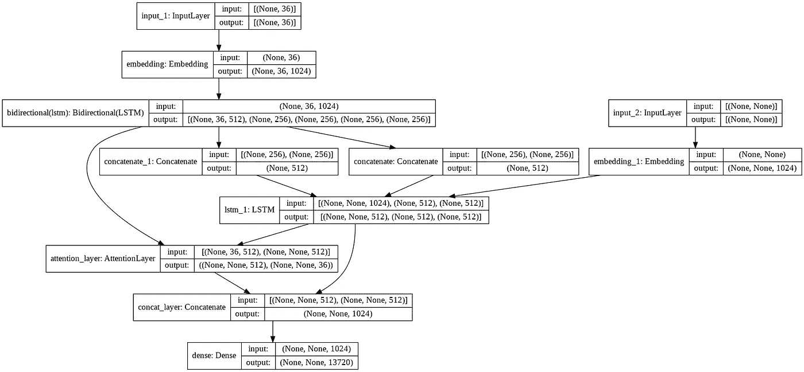
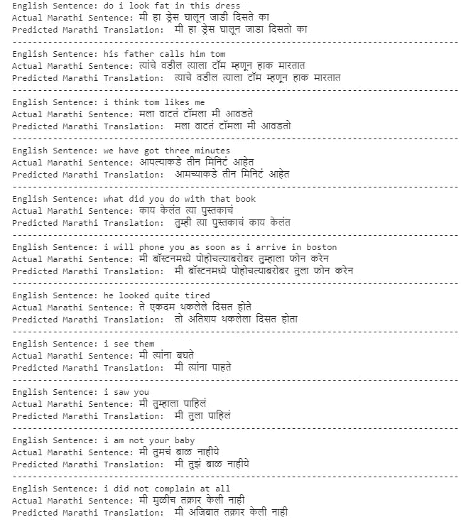

# 注意使用 seq2seq 模型的神经机器翻译。

> 原文：<https://medium.com/geekculture/neural-machine-translation-using-seq2seq-model-with-attention-9faea357d70b?source=collection_archive---------3----------------------->

## 使用具有注意机制的双向 LSTM 的单词级英语到马拉地语翻译。

(Animation source: Author)

## 简介:-

在这篇文章中，我们将讨论一个非常有趣的自然语言处理(NLP)神经机器翻译(NMT)的注意模型。机器翻译只不过是将文本从一种语言自动翻译成另一种语言。

在这里，我们将学习如何将序列对序列架构(seq2seq)与 Bahdanau 的注意力机制一起用于 NMT。

## 先决条件:-

本文假设您理解以下内容:-

*   递归神经网络(RNN)、长短期记忆()、[双向网络。](https://www.youtube.com/watch?v=D-a6dwXzJ6s&t=188s)
*   序列到序列架构[(编码器-解码器)](https://papers.nips.cc/paper/2014/file/a14ac55a4f27472c5d894ec1c3c743d2-Paper.pdf)。
*   [注意机制。](https://arxiv.org/pdf/1409.0473.pdf)

在阅读代码之前，我们将简单地讨论一下双向 LSTM 和注意力机制。

## 双向:-

如果你理解 LSTM，那么双向是相当简单的。在双向网络中，你可以使用简单 RNN(循环神经网络)、GRU(门控循环单元)或 LSTM(长短期记忆)。我将在这篇文章中使用 LSTM。

*   向前的层是我们通常的 LSTM 层，但是向后的 LSTM 是流动方向向后的层。
*   在每一个时间步长，输入在向前层和向后层传递。
*   每个时间步长的输出是两个单元输出的组合(向前和向后层)。因此，for 预测模型也将知道下一个单词。

Bidirectional LSTM (Image source: Author)

**为什么我们需要双向？**

*   在任何语言的句子中，下一个词都会对前一个词产生影响。**例-** (1)“哈利喜欢苹果，因为他工作他们的。”以及(2)“哈利喜欢苹果，它是健康的。”
*   在第一句中,“苹果”是公司的意思，在第二句中,“苹果”是水果的意思。我们可以这样说，因为我们知道接下来的话。首先，“苹果”取决于“工作”，其次取决于“健康”。现在在 RNN/LSTM，我们只有前向层，所以他们不会有下一个序列单词的信息，因此没有适当的句子模型上下文可能无法预测正确的单词。
*   在双向情况下，我们具有前向和后向层，该模型可以具有前一个和下一个单词的信息，因此具有适当上下文的句子模型将预测得更好。

## Bahdanau 的注意:-

这里我假设你已经知道了注意力。如果不通过[这张纸](https://arxiv.org/pdf/1409.0473.pdf)。如果你喜欢看视频，我推荐你在 YouTube 上看 Krish naik 的视频。

Video from [Krish Naik’s](https://www.youtube.com/channel/UCNU_lfiiWBdtULKOw6X0Dig) YouTube channel.

**现在为什么要用注意力呢？**

为了预测单词，一些前面或后面的单词是重要的。正如我们在双向讨论中所说的。但是哪个词更重要。发现我们用注意模型来赋予单词重要性。那么模型可以更集中于更重要的单词。

Attention Model(Image source: Author)(Content source: [Bahdanu’s Attention](https://arxiv.org/pdf/1409.0473.pdf))

注意力是如何工作的

*   在获得输出 Z(在注意力图像中)之后，第一步是计算注意力权重(α)，该输出 Z 是前向和后向隐藏状态[h，h`]的串联。

*   为了计算α，我们需要使用上述公式计算的分数(e)。分数基于解码器(LSTM)的隐藏状态(在预测 y 之前)和编码器 z 的输出
*   然后，上下文向量(Ct)被计算为注意力权重(α)和编码器输出(Z)的加权和。
*   解码器使用上下文向量(Ct)作为输入来生成输出 y。

## 数据集:-

从 manythings.org[下载翻译数据集](http://www.manythings.org/anki/)

我正在使用英语到马拉地语的翻译数据集。但是你可以下载任何，你只需要在代码上做一些改变。

## 预处理:-

首先，我们需要了解翻译需要什么。

*   我们需要一种语言的句子和另一种语言的句子。
*   它们可能是一些英文单词的缩写，这可能会使我们的模型混淆。它会以不同的方式看到像“不能”和“不能”这样的单词，因此我们将扩展所有的缩写。
*   像彗差、点号和数字这样的字符在翻译中没有用，所以我们将把它们都去掉。

现在，在下面的代码中，我们将完成所有的清理过程并保存数据。

*注意:-要运行收缩功能，您需要收缩-扩展字典，您可以从* [*这里*](https://github.com/AdiShirsath/Neural-Machine-Translation/tree/master/Data) *下载该文件包含 125 个以上的收缩。*

## 为模型准备数据:-

*   在目标语言的句子中添加 SOS(字符串开头)和 EOS(字符串结尾)标记。由于这个记号，我们可以有彼此不同的目标句子和输入句子的长度。这也有助于解码器开始和停止预测。
*   注意:-输入(即英语句子)的长度需要相同，目标(即马拉地语)的长度应该相同，但它们可以彼此不同。
*   神经网络不接受文本作为输入，所以我们必须将它们转换成数字。为此，我们将使用 Tensorflow 的[标记器。](https://www.tensorflow.org/api_docs/python/tf/keras/preprocessing/text/Tokenizer)
*   这个分词器非常有帮助，我们可以从中获得单词的频率、要索引的词典和单词的索引。这将用于将单词转换成数字(用于训练)以及将数字转换成单词(用于预测)
*   **填充:-** 神经网络也需要相同长度的输入(即句子),因此我们将用“0”填充英语和马拉地语的句子，以获得句子长度作为相应语言的最大长度句子。

## 构建模型:-

我们将首先建立编码器，然后解码器与关注层。

注意:-我用不同的参数做了实验，下面的参数对我来说是最好的，你可以用其他的参数做实验。尝试改变嵌入输出维度，LSTM 单位，甚至添加更多的 LSTM 层。毕竟机器学习就是要做实验。

**编码器:-**

*   正如我们之前讨论的，我们将在编码器中使用双向 LSTM
*   它将学习输入语言(即英语)的模式
*   我们将使用编码器的输出及其状态(上下文向量[h，c])。现在，在双向模式中，取状态有一点不同，因为它有前向和后向状态，所以我们必须同时考虑这两种状态。(也就是说，我们将连接它们。)

**解码器:-**

*   在解码器中，我们只使用 LSTM。
*   关注层:-我从[【此处】](https://colab.research.google.com/drive/1XrjPL3O_szhahYZW0z9yhCl9qvIcJJYW)借用了关注的代码。你可以把它放在 BahdanauAttention.py 文件中，或者直接从[这里](https://github.com/AdiShirsath/Neural-Machine-Translation/tree/master/Attention_model)下载文件。我们使用 [bahdanau 的注意力](https://arxiv.org/pdf/1409.0473.pdf)作为注意力层。

这是我们的模型图-

## 培训:-

现在，让我们开始训练我们的注意力模型。

在这里，我在验证集上获得了 95.04%的准确率，损失为 0.32。

## 推理模型:-

我们使用该模型通过使用预训练模型的权重来预测输出序列。

这里，我们不能像其他 ML 和 DL 模型一样应用 *model.predict()* ，因为在我们的情况下，编码器模型学习输入句子中的特征，而解码器只是获取编码器状态，并使用解码器输入来逐字预测。因此，对于预测，我们必须做同样的过程。

## 预测:-

我们的模型将预测数字和单词，所以我们需要函数将它们转换成目标语言的句子。

## 结果:-

最后，让我们把我们的句子从英语翻译成马拉地语。

以下是我的一些结果

**哇！！！！！** → ***我们得到了一些惊人的结果。***

## 结束注释:-

如果你还没有不加注意地使用过编码器-解码器模型，你可以看看我的文章。

 [## 使用序列到序列模型的神经机器翻译

### 使用编码器-解码器 LSTM 模型的单词级英语到马拉地语翻译。

medium.com](/geekculture/neural-machine-translation-using-sequence-to-sequence-model-164a5905bcd7) 

## **参考文献:-**

Bahdanau 的注意力研究论文[此处](https://arxiv.org/pdf/1409.0473.pdf)。

 [## 使用 Tensorflow 实现注意力神经机器翻译

### 使用 Bahdanau 注意力的神经机器翻译(NMT)的 Tensorflow 实现的逐步解释。

towardsdatascience.com](https://towardsdatascience.com/implementing-neural-machine-translation-with-attention-using-tensorflow-fc9c6f26155f)  [## 面向所有人的深度学习注意力机制综合指南

### 概述注意力机制改变了我们处理深度学习算法领域的方式，如自然语言…

www.analyticsvidhya.com](https://www.analyticsvidhya.com/blog/2019/11/comprehensive-guide-attention-mechanism-deep-learning/)  [## 具有注意机制的神经机器翻译(NMT)

### 深度学习语言翻译指南！

towardsdatascience.com](https://towardsdatascience.com/neural-machine-translation-nmt-with-attention-mechanism-5e59b57bd2ac)