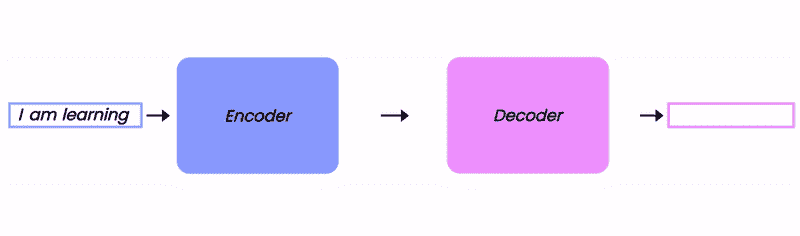
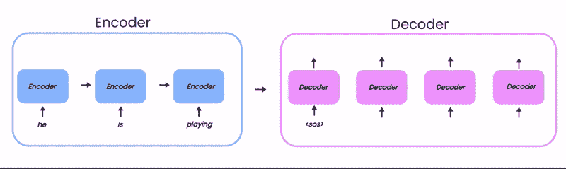
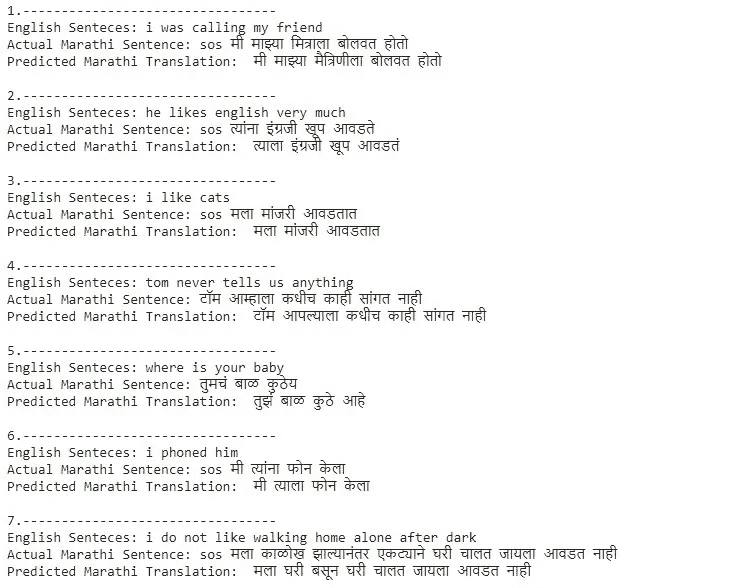

# 使用序列到序列模型的神经机器翻译

> 原文：<https://medium.com/geekculture/neural-machine-translation-using-sequence-to-sequence-model-164a5905bcd7?source=collection_archive---------16----------------------->

## 使用编码器解码器 LSTM 模型的单词级英语到马拉地语翻译。

1) Encoder-Decoder (Animation Source: Author)

## 简介:-

由于人类语言的流动性，机器翻译是计算机最早也是最具挑战性的任务之一。它只是文本从一种语言到另一种语言的自动翻译。

在这篇文章中，我们将讨论一点编码器-解码器。然后我们将演练神经机器翻译的代码。这将是一次有趣的旅程。

## 先决条件:-

在我们继续之前，你应该知道如何跟随-

*   递归神经网络(RNN)，长短期记忆( [LSTM](https://colah.github.io/posts/2015-08-Understanding-LSTMs/) )。
*   序列到序列架构[(编码器解码器)](https://papers.nips.cc/paper/2014/file/a14ac55a4f27472c5d894ec1c3c743d2-Paper.pdf)。

## 简而言之，编码器解码器

2) Working of encoder-decoder (Animation source: Author) (***Note:****-* ***SOS*** *→Start Of String,* ***EOS*** *→End Of String)*

*   顺序到顺序模型的主要部分是编码器和解码器。

> ***编码器:-***
> 
> 编码器可以是任何网络，如递归神经网络、LSTM、GRU 或卷积神经网络，但我们使用 seq2seq 模型进行语言翻译，因此编码器和解码器都应该是可以处理顺序输入的模型。我们将使用 LSTM。
> 
> 编码器在输入中学习模式，所以我们只需要学习它的隐藏状态[h，c](上面动画中的棕色矩形)，并将其作为解码器的初始状态。我们不从每个时间步中获取输出。
> 
> ***解码器:-***
> 
> 解码器将编码器的状态作为其初始状态，一次预测一个字。这里需要理解的重要部分是，与编码器不同，解码器在训练和测试期间的工作方式不同。
> 
> *在培训期间* :-我们使用一种叫做教师强制的技术，这有助于更快更有效的培训。现在什么是老师逼？
> 
> [*老师强行*](https://machinelearningmastery.com/teacher-forcing-for-recurrent-neural-networks/) *:-是一种训练神经网络的策略，用实际输出(地面真实)作为解码器每个时间步的输入，而不是用前一个时间步的输出作为输入。*
> 
> 在解码器端仔细观察动画(2 ),想象教师强迫观看。在每个时间步，我们都将实际输出作为输入，它们(预测的和实际的)在动画中看起来是一样的，因为我们的模型非常好*😆如果模型仍然预测了错误的单词，我们将传递正确的单词作为输入。*
> 
> 在测试期间:-每个时间步长的输入是解码器的前一个时间步长的预测输出。
> 
> 解码器需要一些特殊的记号来知道句子是开始还是结束。因此，我们必须在目标语言(即我们的例子中的马拉地语)的每个句子的开头和结尾添加 SOS(字符串开头)和 EOS(字符串结尾)标记。因此解码器可以比编码器处理不同长度句子。

## 数据集:-

我们有 41028 个英语句子和它们各自的马拉地语翻译。我从 manythings.org 得到了这个数据。您可以获得翻译更多语言的数据集。

## 预处理:-

首先，我们需要了解翻译需要什么。

*   我们需要一种语言的句子和另一种语言的句子。
*   它们可能是一些英文单词的缩写，这可能会使我们的模型混淆。它会以不同的方式看到像“不能”和“不能”这样的单词，因此我们将扩展所有的缩写。
*   像 coma 和 dot 这样的字符在翻译中没有用，所以我们将把它们都去掉。
*   也不需要数字。

现在，在下面的代码中，我们将完成所有的清理过程并保存数据。

*要运行收缩功能，你需要收缩-扩展字典，你可以从* [*这里*](https://github.com/AdiShirsath/Neural-Machine-Translation/tree/master/Data) *下载这个文件包含 125 个以上的收缩。*

## 为编码器解码器准备数据:-

下面是我们如何为编码器/解码器模型准备数据

*   在马拉地语句子中添加 SOS 和 EOS tokes。
*   获取英语和马拉地语的所有独特的单词，并创建各自的词汇和排序。
*   使用我们的排序单词表，我们可以给每个单词编号，并形成字典，这是非常有助于将单词转换成数字。我们必须将单词转换成数字，因为神经网络不接受文本作为输入。
*   最后将数据分为训练和测试。

## 数据生成器:-

这很重要，为什么我们需要数据生成器？

正如 keras [教程](https://blog.keras.io/a-ten-minute-introduction-to-sequence-to-sequence-learning-in-keras.html)中给出的，我们必须将数据转换成形状的 3D 张量=[批量大小，时间步长，特征]。现在，在我们的例子中，批量大小、时间步长和特征分别是句子的数量、最大长度句子和唯一单词的数量。

使用这个，对于马拉地语输入张量数组变成[41028，37，13720]这将消耗大量的内存。

为了提高工作效率，我们将以批处理的形式发送数据。所以我们将创建数据批处理生成器。该数据生成器由 [keras 团队](https://stanford.edu/~shervine/blog/keras-how-to-generate-data-on-the-fly)开发。

## 构建编码器-解码器 LSTM :-

在我们进入编码部分之前，我们必须了解一些事情

> ***嵌入:-***
> 
> 我们将首先在嵌入层传递编码器和解码器的输入，然后在 LSTM 层传递。
> 
> 这一层把数字作为输入，并把它们转换成给定的维数，但是为什么我们需要这样做呢？→答案是，利用这一点，我们可以保留单词的语义信息，这意味着相似的单词会彼此更接近。
> 
> 例如:单词“man”将更接近“women”，“dog”将更接近“cat”。这仅仅意味着男性词汇的向量在女性中的数量与狗和猫相似。
> 
> 要了解更多细节[，请查看](https://machinelearningmastery.com/use-word-embedding-layers-deep-learning-keras/)。

我实验了一些不同的嵌入和 LSTM 单位的值，对我来说，跟随是最好的，但你可以尝试不同的，机器学习就是要实验。

**编码器:-**

*   在编码器中，传递编码器输入数据，并将编码器最后一个时间步长的隐藏状态作为上下文向量[h，c]。
*   为什么在嵌入中设置掩码 zero = True 当我们在生成器中生成输入数组时，我们用零填充它们，使它们具有最大长度。这个屏蔽零将告诉模型屏蔽掉 0。

**解码器:-**

*   现在，解码器输入数据将被传递到解码器嵌入中。
*   LSTM 层的初始状态是编码器的最终状态。
*   [老师强制](https://machinelearningmastery.com/teacher-forcing-for-recurrent-neural-networks/) :-这里每一个时间步的输入都是解码器前一步的实际输出。
*   通过应用 SoftMax 获得输出，soft max 将的数字转换为概率。

## 培训:-

用 30 个时代的一些回调来训练我们的模型。不要忘记保存模型的重量。

## 推理模型:-

我们使用该模型通过使用预训练模型的权重来预测输出序列。

这里，我们不能像其他 ML 和 DL 模型一样应用 *model.predict()* ，因为在我们的情况下，编码器模型学习输入句子中的特征，而解码器只是获取编码器状态，并使用解码器输入来逐字预测。因此，对于预测，我们必须做同样的过程。

## 预测:-

最后要讨论的一件事，模型将预测数字和一个单词的向量，所以我们必须创建函数来从预测的数字创建句子。

## 结果:-

现在我们可以通过简单的 python 代码得到结果:-

以下是我的一些结果

万岁！！我们得到了一些惊人的结果。

## 结束注释:-

现在，编码器-解码器 LSTM 的准确性随着句子长度的增加而降低(参见我的结果中的最后一个预测)，因为这里我们仅使用来自编码器的最后一个 LSTM 单元的状态(上下文向量)。这就像记住整本书并翻译，所以很明显准确性会降低。

因此，在下一篇文章中，我们将尝试使用注意力模型。

## **参考资料:-**

 [## Keras 中序列对序列学习的十分钟介绍

### 我经常看到这个问题——如何在 Keras 中实现 RNN 序列对序列学习？这里有一个简短的介绍…

blog.keras.io](https://blog.keras.io/a-ten-minute-introduction-to-sequence-to-sequence-learning-in-keras.html)  [## 机器翻译(编码器-解码器模型)！！

### 理解和建立一个简单的模型，将英语翻译成印地语的指南。

medium.com](/analytics-vidhya/machine-translation-encoder-decoder-model-7e4867377161)  [## 如何用 Keras 使用单词嵌入层进行深度学习——机器学习掌握

### 单词嵌入提供了单词及其相关含义的密集表示。它们比…有所改进

machinelearningmastery.com](https://machinelearningmastery.com/use-word-embedding-layers-deep-learning-keras/)