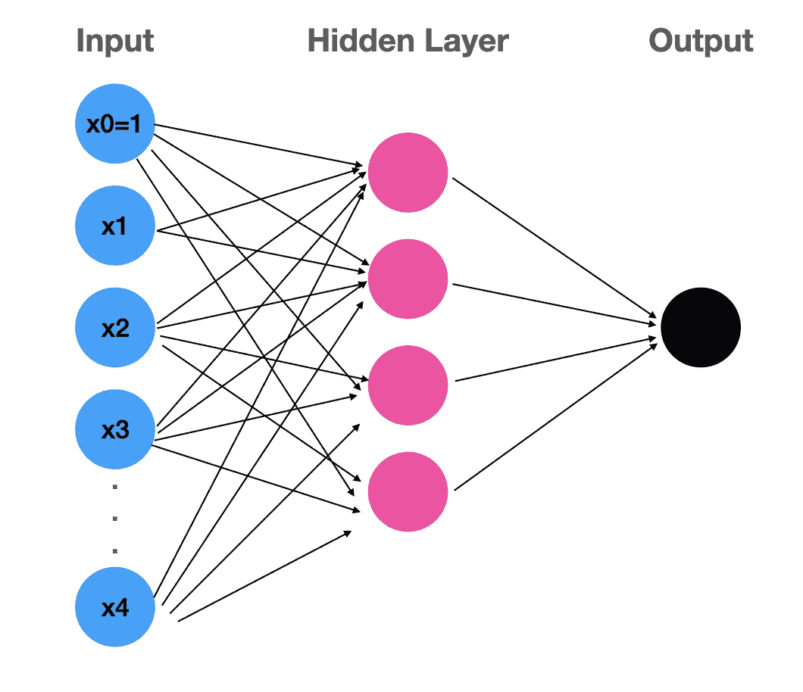

# 神经网络

> 原文：<https://medium.com/geekculture/neural-network-19b26dba9b1a?source=collection_archive---------14----------------------->

## 动机、假设和正规化

这篇文章涵盖了使用神经网络算法的动机，神经网络的基本思想，以及我们如何规范它。

# 从头开始:什么是感知器？

感知器是神经网络中的基本单元。**每个感知机都像一个有阈值的线性函数。**当…