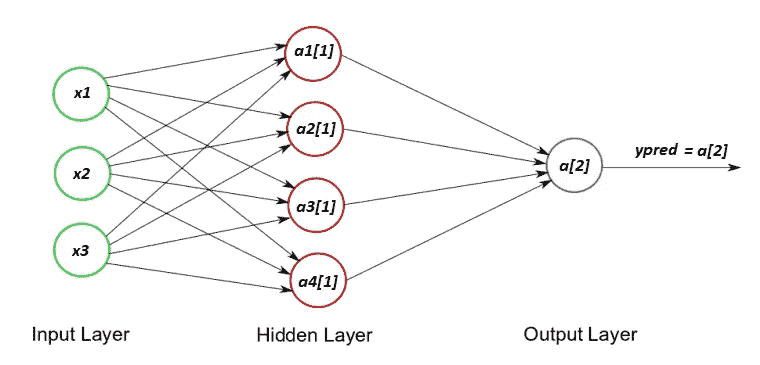
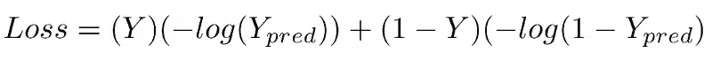
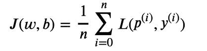
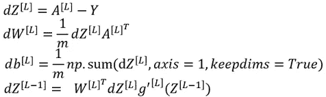
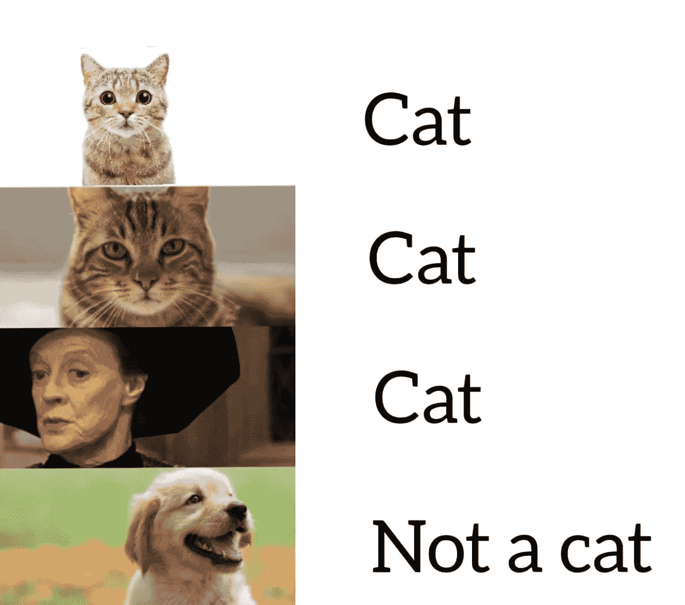

# 神经网络-简单介绍

> 原文：<https://medium.com/geekculture/neural-networks-a-simple-introduction-f4a80c26330c?source=collection_archive---------22----------------------->

Photo by [Hunter Harritt](https://unsplash.com/@hharritt?utm_source=medium&utm_medium=referral) on [Unsplash](https://unsplash.com?utm_source=medium&utm_medium=referral)

# 什么是神经网络？

神经网络是一种算法，具有从复杂数据中提取有意义信息的独特能力，这些数据对于人脑来说非常复杂。

比方说一个猫分类器，你会用什么特征来训练一个模型来分类一个给定的图像是不是一只猫？起初，这听起来很容易，你会去像大小，颜色，爪子，牙齿等特征。但是世界上有 40-70 种不同品种的猫，每一种在颜色、大小等方面都有所不同。现在这突然变成了一个乏味的过程。你不能只是手动地在每一个品种的猫身上找到独特的特征。这将成为一场噩梦！

那么，有没有一种方法可以在不做任何手工处理的情况下从输入中提取特征呢？绝对的！

深度学习最大的优势是我们不需要手动从图像中提取特征。网络在训练时学习提取特征。你只需将图像输入网络(像素值)。你需要的是定义神经网络架构和一个带标签的数据集。

我们如何“构建”一个神经网络？

# 神经网络的结构

神经网络可以分为三个部分

1.  输入层
2.  隐藏层
3.  输出层

Each circle is a node

## 输入层

顾名思义，它是我们网络的输入。在我们的例子中，它是一只猫/非猫的形象。

输入层中的每个节点包含我们图像的单个像素。因此，如果图像的尺寸是**64×64**，那么输入层中的节点总数将是**64×64×3 = 12288(x1，x2，.。。，x12288)**

3 代表图像的三个颜色通道(红、绿、蓝)。

现在我们知道输入层是什么了。让我们把它从清单上划掉。

1.  I̶n̶p̶u̶t̶ ̶l̶a̶y̶e̶r̶
2.  隐藏层
3.  输出层

## 隐藏层

我们可以有 ***n*** 个隐藏层。这就是为什么我们使用复数术语**层**。但现在，让我们使用一个单一的隐藏层，以保持简单的解释。

隐藏层中的每个节点都包含输入值和参数的给定组合的激活值。我们知道像素值是输入。那参数是什么？计算激活函数有两个参数。权重 ***w*** 和偏差 ***b.*** 正如我们在上面的图像中所看到的，输入值去往隐藏层中的所有节点，但是它们所携带的权重和偏差对于隐藏层中的每个节点将是不同的。

例如，让我们考虑上图中的网络。它有 3 个输入 ***x1、x2、x3、*** 和 4 个隐层节点 ***a1、a2、a3、*** 和 ***a4*** 。因此，4 个激活值将是:

> ***【a1[1]=σ(Z1[1])、*** *其中****Z1[1]****=***w1[1]* x1+w2[1]* x2+w3[1]* x3+b****
> 
> ****a2[1] = σ(z2[1])、*** *其中****z2[1]***=***w1[1]* x1+w2[1]* x2+w3[1]* x3+b****
> 
> ****a3[1] = σ(z3[1])，*** *其中****z3[1]***=***w1[1]* x1+w2[1]* x2+w3[1]* x3+b****
> 
> ****a4[1] = σ(z4[1])，*** *其中****Z4[1]***=***w1[1]* x1+w2[1]* x2+w3[1]* x3+b****

*这里，输入 ***x1、x2、*** 和 ***x3*** 对于所有节点都是相同的，但是权重 ***w1、w2、w3*** 和偏差 ***b*** 将是不同的。*

****σ*** 称为激活功能。它是**神经网络**中最重要的因素，决定一个神经元是否会被激活并转移到下一层。有不同类型的激活函数，但在隐藏层中广泛使用的是 ***ReLU*** 激活函数。*

*****【σ= max(0，z)*****

**如果 z > 0，则 ***σ(z) = z，*** 但如果 ***z ≤ 0，*** 则 ***σ(z) = 0*****

**上标***【1】***代表第一层。输入值 ***x1，x2，*** 和 ***x3*** 也可以表示为 ***a1[0]，a2[0]*** ，和 ***a3[0]*** 既然我们不把输入值看作一个层，就像冥王星一样，它*就是*这不公平，不是吗？**

**现在我们知道，隐藏层包含通过对权重、输入和偏差的乘积求和而获得的激活值。让我们也检查一下。**

1.  **I̶n̶p̶u̶t̶ ̶l̶a̶y̶e̶r̶**
2.  **H̶i̶d̶d̶e̶n̶ ̶l̶a̶y̶e̶r̶s**
3.  **输出层**

## **输出层**

**对于二进制分类器，在我们的例子中是猫或不是分类器，在输出层中只有一个节点。输出为 1(猫)或 0(不是猫)。**

**这里，输入是隐藏层的激活值。**

> *****a2[1] = σ(z2[1])，*** *其中****z2[1]***=***w1[2]* a1[1]+w2[2]* a2[1]+w3[2]* a3[1]+w4[2]* a4[1]+b*****

**激活函数 ***σ*** 通常是二进制分类器输出节点**中的 sigmoid 函数。****

1.  **I̶n̶p̶u̶t̶ ̶l̶a̶y̶e̶r̶**
2.  **H̶i̶d̶d̶e̶n̶ ̶l̶a̶y̶e̶r̶s**
3.  **O̶u̶t̶p̶u̶t̶ ̶l̶a̶y̶e̶r̶**

# **记号**

**由于上面的符号有点混乱，让我解释清楚每一个符号**

*****L =*** 网络的总层数。**

*****【l】=***我就用这个来提节点的图层。**

*****n【l】=***层中的节点数 ***l*****

*****一个[0]或 x =*** 向量包含输入值 ***x1，x2，.。。*、xn【l】****

*****【l】***=包含层权重的矩阵 ***l*****

*****b【l】***=包含图层偏差值的矢量 ***l*****

*****z[l] =*** 矢量包含层的非线性值 ***l*****

*****一个【l】=***矢量包含层 ***l*** 的激活值**

# **算法**

**我们仍然没有看到神经网络如何预测输出。我只解释了网络中每一层包含的内容。现在让我们看看整个算法。**

****第一步**:正向传播。**

****第二步**:计算成本。**

****第三步**:反向传播。**

****步骤 4:** 更新参数**

****第五步**:重复直到成本收敛。**

# **正向传播**

**在前向传播中，分类器**预测输出**。输入数据通过网络在**正向**方向馈送。每个隐藏层接受输入数据，按照激活函数对其进行处理，并将其传递给后续层。**

*****z[1]= w1[1]* x1+w2[1]* x2+w3[1]* x3+。。。+wn[1]*xn[l] + b[1]*****

*****a[1] = σ(z[1])*****

*****z[2]= w1[2]* a1[1]+w2[2]* a2[1]+w3[2]* a3[1]+。。。+ wn[2]*an[l][1] + b[1]*****

*****a[2]=σ(z[2])= ypred*****

**这里的 ***ypred*** 是我们的预测。由于我们的神经网络仍然是一个婴儿，最初的预测会很差。为此，我们有一个函数可以告诉我们，对于我们当前设置的权重和偏差值，我们的拟合有多差。该函数称为**成本函数。****

# **计算成本**

**通常我们用大量**标注**的训练例子(猫和其他动物的不同形象)来训练模型。首先，我们需要找到每个训练示例的损失值，以计算整个训练集的成本。损失函数定义了什么是好的预测，什么不是。**

****

*****Loss = -log(ypred)，如果 y= 1*****

*****Loss = -log(1-ypred)，如果 y= 0*****

**在计算每个训练示例的损失后，我们将计算成本。也就是所有损失值的平均总和。**

****

**L(p(i), y(i)) is the loss function of the ith training example**

# ****反向传播****

**现在我们需要最小化这个成本值。为此，我们需要参数的完美组合。好吧，当然，你不能只是手动尝试所有可能的权重和偏差的每个组合，以找到最适合的组合。那将花费你永远的时间，因为你永远也不会用光所有的数字去尝试。**

**所以我们用一种叫做**梯度下降**的方法。该算法的主要目的是找到一个微分函数的局部/全局最小值。你可以在我以前的文章中了解更多关于成本函数和梯度下降算法的信息。**

** [## 机器学习-简单介绍

### 关于机器学习的一点想法

becominghuman.ai](https://becominghuman.ai/machine-learning-a-simple-introduction-5b79a3de802f)  [## 梯度下降——到达山脚的路线图

### 我们将看到这个算法是如何工作的，它背后的数学，以及梯度下降的类型。

medium.com](/nerd-for-tech/gradient-descent-a-roadmap-to-the-bottom-of-the-hill-b054de1175ce) 

为了计算梯度下降，我们需要参数对损失函数的导数( ***dw[1]，db[1]，dw[2]，db[2])。。。，dw[L]，db[L]*** )。所以我们通过网络反向传播来寻找导数。

我将在另一篇文章中解释反向传播，因为在这一步中进行了很多工作。但是反向传播的主要目的是找到参数对损失函数的导数。

# 梯度下降/更新参数

通过适当调整权重，您可以降低错误率，并通过提高模型的泛化能力来提高模型的可靠性。

Gradient descent algorithm

**α** 称为学习率。我们通常将学习率设置为一个小值，否则成本将会迈很大的一步，并最终向顶部发散。

现在，使用这些新参数，我们将一次又一次地重复整个过程，直到成本收敛并变得更接近于 0，因此预测更好的输出。

Pun intended

# 大局

希望现在你已经对神经网络有了一个简单的概念。如果你不明白我解释的每一点也没关系。即使是深度学习领域的先驱吴恩达教授也表示，有时他也不清楚神经网络是如何做到这一点的。

尽管如此，还有很多概念我们没有在这个博客中涉及，因为这只是一个介绍。我在这篇文章中解释了一个 2 层神经网络，但是也有深度神经网络，它有两个以上的隐藏层，用于更复杂的问题。

我们在这篇博客中看到的四个主要步骤是:

1.  输入图像并执行前向传播以预测输出
2.  计算成本函数，检查我们的预测有多错误
3.  执行反向传播以获得参数相对于损失函数的导数
4.  使用导数执行梯度下降并更新参数。

# 谢谢大家！！

我希望你喜欢它！感谢您花时间阅读到这里。有什么建议请留言评论。

访问我的 L [inkedIn](https://www.linkedin.com/in/hrithick-gokul-307b1619b/) 了解更多关于我和我的工作。**