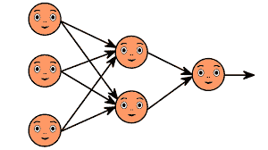

# 神经网络和深度学习

> 原文：<https://medium.com/geekculture/neural-networks-and-deep-learning-67930e829915?source=collection_archive---------57----------------------->

## *在*近年来，人工智能和大数据为企业带来了大量优势，同时也带来了一些新术语，每个有抱负的技术爱好者都应该清楚地了解这些术语。**深度学习**和**神经网络**是两个这样的术语，很多人经常互换使用。但事实上，它们不是一回事。在本帖中，我们将仔细看看这两个，以帮助你对它们有一个正确的理解。

*在*近年来，人工智能和大数据为企业带来了大量优势，同时也带来了一些新术语，每个有抱负的技术爱好者都应该清楚地了解这些术语。**深度学习**和**神经网络**就是这样两个术语，经常被很多人互换使用。但事实上，它们不是一回事。在本帖中，我们将仔细看看这两个，以帮助你对它们有一个正确的理解。

# 1-什么是神经网络？

*简而言之，**神经网络**可以被认为是对人脑松散建模的数学模型。**神经网络**参与两个不同的阶段。首先，进入学习阶段，模型被训练来执行特定的任务。这些可能是如何进行语言翻译或如何向盲人描述图像。第二步是应用阶段，在此阶段使用经过训练的模型。你可以想象 Spotify 通过分析你的音乐品味，每周给你发送一个播放列表。*

> **神经网络**带有一些基本的构建模块，包括神经元、输入、输出、权重和偏差。这里，每个神经元都有一个或多个输入和一个输出。

您可以将此输出用作一个或多个神经元的输入，或者用作整个网络的输出。**神经网络**最聪明的地方在于模型训练期间的自我学习。在这里，给神经网络一个输入数据集(可以是文本、语音或图像，但一切都必须转化为数字)和伴随每个观察集的真实答案。现在，模型学会了根据提供给它的输入找出真实的答案。在整个学习过程中，该模型将不断估计二手价值，并将其与真实价值进行比较。如果有很大的差异，模型参数会自动更新，使这些估计值更接近真实的二手值。重复这个过程，直到真实值和指定值之间的平均差值变得足够小。

# 2-什么是深度学习？

*你*可以认为**深度学习**是 AI(人工智能)的绝对前沿。在这里，机器训练自己处理和学习数据。有了**深度学习**，你不需要教机器处理和学习数据，这就是机器学习的工作方法。

# 离别的思绪

***深度学习**和**神经网络**之间的*差异仍然存在于模型的深度中，其中前者用于提及复杂的**神经网络**。深度学习系统只是一个自学系统，通过多个隐藏层过滤信息来保持学习，就像人类大脑的工作方式一样。一些人认为**深度学习**将使大量任务自动化，并可能在未来取代许多人类工人。但是，理解**深度学习**的实现可能会取代从事重复性手动任务的人，但它不能取代开发和维护**深度学习**应用的工程师或科学家，这一点也很重要。

> 在此订阅接收[我们的头条新闻。](http://eepurl.com/gjDwwP?source=post_page---------------------------)
> 
> 加入我们新的 Slack 社区:[AI-ML-data science-Lovers](https://datasciencelovers.slack.com/)