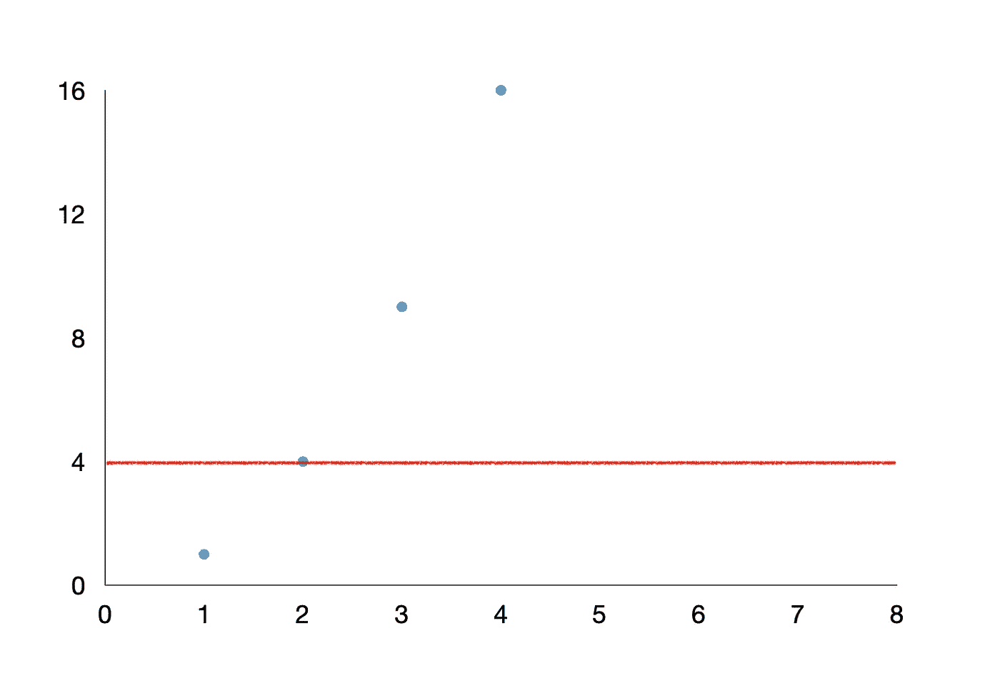
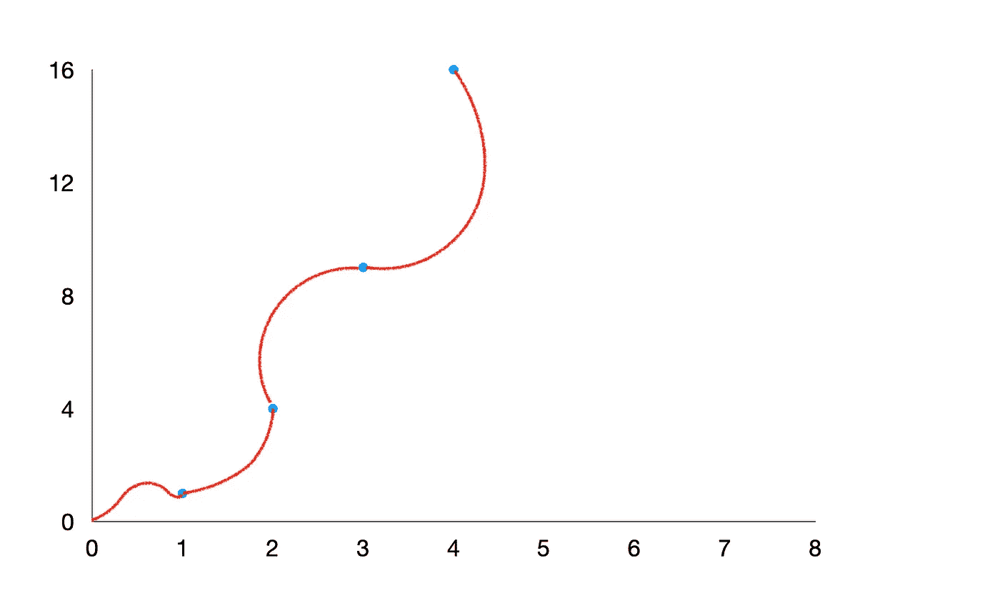

# 没有任何复杂数学的神经网络和自动驾驶汽车。

> 原文：<https://medium.com/geekculture/neural-networks-and-self-driving-car-without-any-complex-mathematics-f8dcde56441c?source=collection_archive---------33----------------------->

*神经网络是推动令人惊叹的深度学习领域的算法。在本文中，我将解释训练神经网络中的一些概念，采用任何人都可以轻松理解的方式，无需任何数学术语。*

Photo by [Roberto Nickson](https://unsplash.com/@rpnickson?utm_source=medium&utm_medium=referral) on [Unsplash](https://unsplash.com?utm_source=medium&utm_medium=referral)

**首先，我必须回答这个问题——为什么要深度学习？**

你想亲自试试这个标志性的憨豆先生的场景吗？如果你答应了，太好了！你将了解在深度学习中，神经网络如何自动驾驶汽车。

[https://giphy.com/gifs/cars-hit-driverless-j6cvcVqIpekW4](https://giphy.com/gifs/cars-hit-driverless-j6cvcVqIpekW4)

**但是如何？**为了正确起见，你需要学习如何让机器*(例如:可以控制自动驾驶汽车的计算机)*通过深度学习来学习驾驶汽车。特斯拉做到了这一点，Waymo、优步等也在实现这一点。

How Tesla’s Autopilot works [https://vimeo.com/192179726](https://vimeo.com/192179726)

现在你可能想知道为什么你首先要学习它？因为这是未来。它在几乎每个领域都有广泛的应用。创作音乐、预测天气预报、在你键入句子时建议下一个要键入的单词等等。

我在这篇文章中的策略是向你提供构建神经网络的基本步骤，以便解决我们感兴趣的任务。放心，不会涉及到数学！！！

# **一切都始于数据和大量的数据…..**

深度学习技术要求我们训练一个神经网络，这是一种从数据中学习的算法(通常数据越多，学习越好)。原则是提供大量带标签的数据。嘿！等一下，我将解释标记数据的含义，但让我先熟悉一下我们将用来揭穿神经网络工作的类比。

这里，我们将考虑学校数学课的场景。我知道数学对大多数人来说并不令人兴奋，这就是为什么我选择了数学课来使数学更有趣。

*   这里的学生是试图学习的神经网络，就像学校里的学生一样。
*   老师是机器学习工程师，他/她尽最大努力让学生取得好成绩。
*   把好成绩想象成准确性，这通常是每个神经网络试图最大化的。
*   这里与真实学校的唯一区别是，老师不会给学生上任何课，而只是提供问题的答案，并试图偶尔提高学生的成绩。

## **训练神经网络:**

正如我前面提到的，神经网络从数据中学习。在我们的数学课上，类比数据仅仅意味着数学问题。这个过程被称为训练 NN *(为了方便起见，我将 NN 用于神经网络)*。在训练阶段，它将从标记的数据(即有正确解答的数学题)。考虑一下，老师希望学生学习乘法，学生将被提供如下内容:

1 x 1 = 1
2 x 2 = 4
3 x 3 = 9
4 x 4 = 16

上面是一个标记数据的例子，如果我们没有提供像 1，4，9，16 这样的答案，它就不会被认为是标记数据(也称为训练集)。现在，学生(NN)将尝试自己学习，例如 2 x 2 = 4 或 4 x 4 = 16。稍后，它会被测试之前没有学过的问题，比如 5 x 5 =？。如果学生(NN)给出了正确的答案，他将得到好成绩(良好的准确性)，这意味着学生已经学会了解决问题。**耶！！！！**

## 进行预测的时间(检查时间)和分级标准(欠拟合、过拟合或理想拟合) :

在学生从标记的数据中学习了模式之后。现在，我们通过向学生提供一些数学问题(特征或输入)来进行测试，并告诉学生提出正确的解决方案(标签或输出)。

根据学生的表现，可能有三个不同的等级:

**i)欠配合等级:**

假设，学生不能从数据中学习模式，并试图在考试中想出一个策略。该学生认为，如果他用一个相同的答案来回答问题，他可能会答对一些问题，他采用这种策略，对每个问题回答 7 个:

1 x 1 = 7
6 x 6 = 7
5 x 5 = 7
4 x 4 = 7

嗯，老师发现学生没有掌握乘法知识，表现很差。这就是**“不适合”**的情况，因为学生显然无法正确回答在培训期间学到的问题。

> 因此，学生(NN)得到了**“不合格”**的成绩。

**ii)过拟合等级:**

假设，学生发现很容易记住训练中遇到的问题的解决方案。这个学生认为现在他已经记住了答案，没有必要担心，他会得到高分。好吧，让我们来测试一下这个学生。

1 x 1 = 1
6 x 6 = 66
9 x 9 = 99
4 x 4 = 16
8 x 8 = 33

有趣的是，这个学生正确地回答了在训练中所学的问题，但显然没有找到以前没有遇到的问题的解决方案。这是“过度拟合”的情况，因为学生了解到，模式完全代表了训练示例中的问题，但未能概括实现所有问题的通用解决方案。

> 因此，该学生获得了**【超额】**的成绩。

**三)理想契合度:**

现在，学生决定以一种抓住他在训练中遇到的问题的本质的方式来学习这些模式，以及可以概括看不见的问题的模式。例如，学生了解到，如果我们将 2 加两次(2 + 2)，我们得到 4，类似地，3×3 = 9 是 3 加三次的结果，等等。现在来测试一下学生(NN)，

3 x 3 = 9
11 x 11 = 121
5 x 5 = 27
1 x 1 = 2
10 x 10 = 100
7 x 7 = 49
9 x 9 = 81

虽然，有一些神经网络预测不正确的例子，但我们可以说它完成了一项非常伟大的任务。漂亮！！这就是所谓的**“ideal fit”**作为学生学习乘法运算的通用算法。

> 因此，学生获得了完美的“理想”成绩。

让我们从视觉上来看这些。图中的蓝点代表在学习模式的训练集中提供给学生的问题。红线代表学生从这些点学到的模式。

1.  欠拟合

2.理想匹配

3.过度拟合

## 欠适还是过适？？老师来救了！！！！

对于欠拟合，教师尝试提供更多的示例，以便学生可以学习映射，并通过提供正确的输出来提出一些解决问题的函数。因此，学生将尝试学习更多由于数据有限而未能学到的模式。

类似地，在实际神经网络的情况下，也有几种其他方法来减少“欠拟合”:

1.增加模型复杂性
2。增加特征数量，执行特征工程
3。去除数据中的噪声。
4。增加历元数或增加训练持续时间，以获得更好的效果。
*(上述减少欠拟合步骤的来源:*[*https://www . geeks forgeeks . org/under fitting-and-over fitting-in-machine-learning/*](https://www.geeksforgeeks.org/underfitting-and-overfitting-in-machine-learning/))

***规则化:*** 为了减少过度拟合，教师可能会因为学生记住了每个问题的解决方案而惩罚他，而不是学习给出问题解决方案的基础函数(我们乘法示例中的数学步骤)。正规化程度越高，惩罚力度越大。最终，学生将捕获一般模式，而不是记忆训练集解决方案。

在神经网络中还有其他处理“过拟合”的方法。

1.增加训练数据。
2。降低模型复杂性。
3。在训练阶段尽早停止(注意训练期间的损失，一旦损失开始增加就停止训练)。
4。脊正则化和套索正则化。
5。使用神经网络的辍学来解决过度拟合。
*(上述减少过拟合步骤的来源:*[*https://www . geeksforgeeks . org/under fitting-and-over fitting-in-machine-learning/)*](https://www.geeksforgeeks.org/underfitting-and-overfitting-in-machine-learning/)

万岁！！！我们只是学习神经网络的训练是如何发生的，会发生什么问题(欠拟合或过拟合)以及如何解决它们。

# 自动驾驶汽车高级概述:

类似的过程也发生在借助神经网络建造自动驾驶汽车的过程中。首先，网络在人类的帮助下被训练。人类驾驶汽车，网络学习它在观察人类驾驶时识别的模式。它知道汽车必须在红灯或斑马线前停下来，不要超速，在正确的车道上行驶，等等。最终，经过大量的训练，它可以通过学习驾驶车辆的模式来学习驾驶。

类似地，如果对大量音乐作品进行训练，神经网络可以学习如何演奏音乐，当对大量对话进行训练时如何交谈，以及许多类似的任务。

请注意，建造自动驾驶汽车并不容易，在建立神经网络方面还有很多事情要做，非常复杂，需要注意超参数调整、设置学习率等等……

谢谢大家！！！认为这篇文章值得一读。如果你喜欢它，请给它一个掌声，这样我就可以想出一些简单易懂的文章。