# 从零开始的神经网络:一个简单的 C++全连接前馈网络

> 原文：<https://medium.com/geekculture/neural-networks-from-scratch-a-simple-fully-connected-feed-forward-network-in-c-29e9542bcdef?source=collection_archive---------2----------------------->

Source: Cognitive Science Program — Indiana University Bloomington

# 介绍

神经网络是现代机器学习的基石。但是很容易放弃对神经网络的实际理解，因为有大量的工具可以让你用几行代码创建和训练一个模型。因此，在这个系列中，我希望通过从头开始创建不同种类的神经网络来提供一个基础的、实用的理解。我们将从最简单的一种开始:完全连接的前馈神经网络。理解这些是如何工作的，并且能够从零开始创造，对于发展到更复杂的网络(例如卷积、循环、对抗)是至关重要的。要完成这个过程，您只需要具备 C++的基础知识，并对神经网络的工作原理有所了解。最后，你将拥有一个可以随意摆弄的前馈神经网络。

# 结构

我们的网络将有两部分:一个线性层和一个 sigmoid 激活函数。

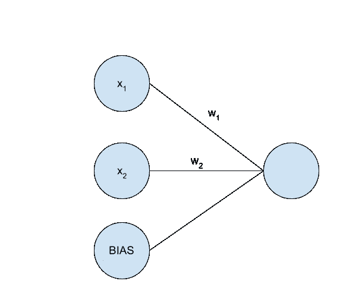

Linear Layer

上图描绘了一个非常简单的线性图层，它接受两个输入并产生一个输出。sigmoid 层要简单得多，因为它只对每个输出应用 sigmoid 函数。我将在各自的章节中详细阐述这两个组件。一旦我们完成了这两个部分，我们就可以将它们结合起来创建不同的神经网络架构。

# 线性层

典型的神经网络由多个线性层组成。每一层执行输入向量的线性变换。

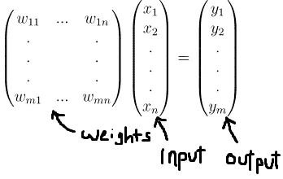

Linear Layer Math

我们可以将线性层所做的工作分解为两部分:前馈和反向传播。前馈时，我们将权重矩阵乘以一个输入向量来产生一个输出(如上图所示)。反向传播是我们的网络如何“学习”输出什么。更具体地说，反向传播改变了网络中的权重，以最小化网络输出和预期输出之间的差异。我将在这里简要解释反向传播背后的数学原理，但是为了更深入地探索这个主题，我建议您使用我在最后链接的资源。

**设置**

最后，经过深思熟虑，我们可以开始编码我们的线性层。加载您选择的编辑器，让我们开始吧。

创建一个新文件，命名为“LinearLayer.h”。我们将在这里创建我们的线性图层类。首先在文件中写入以下内容:

我们的层将需要另一个指定输入和输出大小的构造函数。在这个构造函数中，我们还将设置一个学习率并初始化我们的权重。

现在设置已经完成，我们可以写线性层的前馈部分了。

## **前馈**

我们的前馈方法将需要做三件事:接受一个输入向量，将输入向量与我们的权重矩阵相乘，并输出乘积向量。我们还需要存储输入和输出向量，因为我们稍后在反向传播期间需要它们。

## **反向传播**

在我们进入代码之前，这被证明是非常简单的，我将简单地回顾一下反向传播背后的数学。考虑前面描述的简单线性层。

该网络的输出计算如下:

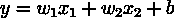

现在假设对于任何给定的两个输入，我们的预期输出由以下函数决定:

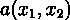

我们的网络输出和预期输出之间的误差可以计算为

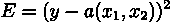

这是我们的误差函数。现在，我们面临一个最优化问题。我们希望设置权重，使误差函数 E 最小。为此，我们将使用一种称为梯度下降的常用方法。从广义上讲，梯度下降包括在给定当前权重的情况下，确定误差函数的最陡下降方向。然后我们改变我们的权重，使我们在给定的方向上移动，从而减少误差。为了确定最陡下降的方向，我们需要计算误差函数的梯度。如下所示:

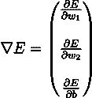

为我们的样本线性图层计算这个值，我们得到

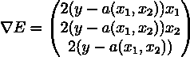

梯度会给我们最陡上升的方向，所以我们只需要取向量的负值就可以得到最陡下降的方向。然后我们会相应地改变我们的权重。

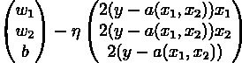

注意，我们将梯度乘以 eta，这就是我们的学习速率。

我们刚刚讨论的是梯度下降的一个具体而简单的应用。通常情况下，我们的线性层会堆叠在许多其他线性层的后面，因此它的输出不会是整个网络的输出。但是不管网络的结构如何，以下用于改变给定权重的等式将成立:

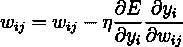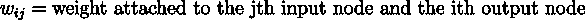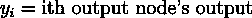

因此，为了执行反向传播，我们将期望我们的线性层接收关于每个层的输出的误差的偏导数。反过来，我们还将计算误差相对于每一层输入的偏导数，然后将其发送给前一层。你现在可能开始明白为什么这叫做反向传播了。

如果大部分内容超出了你的理解范围，请不要担心。我在这里没有深入探讨，为了更好地理解，我建议使用我在最后链接的资源。

现在让我们来看看代码。

幸运的是，尽管梯度下降背后的数学看起来很复杂，但代码非常简单。这样，我们就完成了我们的线性层。现在我们继续讨论乙状结肠激活函数。

# Sigmoid 激活函数

sigmoid 激活函数是一个有用的工具，它允许我们将输出压缩到 0 到 1 之间。

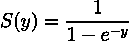

上面显示的是 sigmoid 函数。回想一下之前描述的简单线性层。它的输出是

注意 S(0) = 0.5，y > 0 时 S(y) > 0.5，S(y) < 0.5 when y < 0\. From this, we can say that if our input lies on the line y = 0, then our output will be 0.5, and otherwise, it will be greater than or less than 0.5 depending on whether our output is above or below the line.

Again we will start with some basic setup. Begin by creating a “Sigmoid.h” file.

## **前馈**

用我们的乙状结肠向前输送非常简单。我们只需要将我们的函数应用于给定输入向量中的每个值。

## **反向传播**

反向传播又有点令人毛骨悚然。但是因为没有权重需要改变，我们需要做的就是确定关于输入的偏导数。请注意，sigmoid 函数的导数为

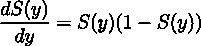

利用这一点，我们可以编写反向传播方法。

# 组合成分:模型

我们拥有网络所需的所有部件。但是在你开始混合线性层和 sigmoid 层之前，我们需要考虑一些细节。为了涵盖这些细节，我将创建一个非常简单的模型，其中包括一个具有两个输入值和一个输出值的线性图层，以及一个位于末端的 sigmoid 图层。

创建一个. cpp 文件，并随意命名。在这个文件中，我们将创建一个模型类，它创建了我们的模型，并详细说明了它的组件如何协同工作。代码如下:

注意，在我们的反向传播方法中，我们计算误差函数相对于网络输出的导数。然后传递到我们的乙状结肠层。其他一切都很简单。我们的构造函数创建了两层，前馈方法规定了这些层对输入进行操作的顺序

# 线性分离任务

现在，我们可以使用上一节中的模型来执行线性分离任务。下面的代码演示了如何使用 5x + 7y = 0 这一行来训练模型以分离数据点。

最佳做法是使用未用于训练的数据集子集来测试模型。但是对于这个相对琐碎的例子，我刚刚使用了相同的数据。

# 结束了

这就是了。你可以使用我上两节的代码来掌握如何使用线性层和 sigmoid 层。有了这两个组件，你可以做出一些非常酷的东西。你可能会感兴趣的一个项目是使用 MNIST 数据集训练一个模型来识别手写数字。以后我会详细介绍如何用我们在本文中创建的组件制作这个项目。但在那之前，继续玩不同的模型，找点乐子。

关于神经网络的更多信息:【http://neuralnetworksanddeeplearning.com/chap1.html】T4。