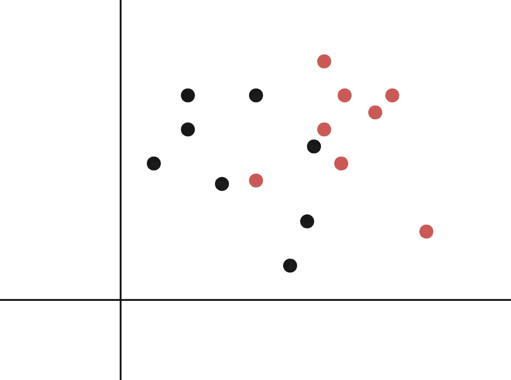
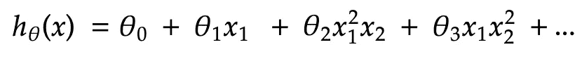
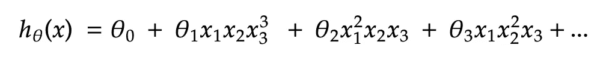
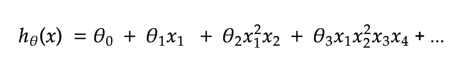
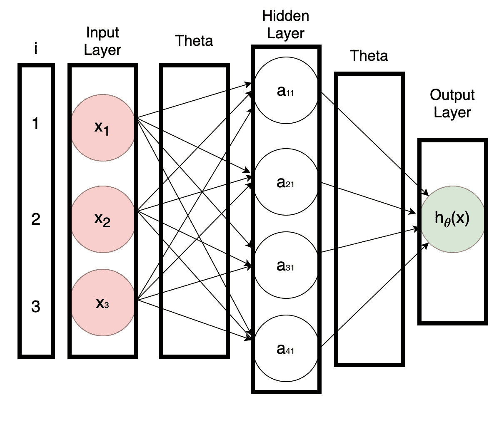
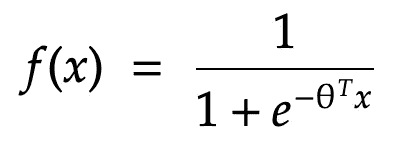
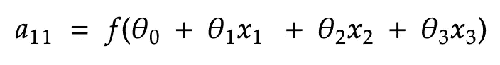

# 神经网络第 1 部分:术语、动机和直觉

> 原文：<https://medium.com/geekculture/neural-networks-part-1-terminology-motivation-and-intuition-73675fc43947?source=collection_archive---------56----------------------->

Photo by [Alina Grubnyak](https://unsplash.com/@alinnnaaaa?utm_source=medium&utm_medium=referral) on [Unsplash](https://unsplash.com?utm_source=medium&utm_medium=referral)

这是我正在从事的系列文章的第四部分，其中我们将讨论和定义介绍性的机器学习算法和概念。在这篇文章的最后，你会找到这个系列的所有前几篇文章。我建议你按顺序读这些。仅仅因为我在那里介绍了一些概念，这些概念是理解神经网络的关键，我将在许多场合引用它们。

在本文中，我们将介绍神经网络背后的理论，以及这种模型背后的动机和一些定义。在下一部分，我们将更多地关注梯度下降和反向传播算法。

让我们开始吧。

# 神经网络

你有没有想过你的大脑是如何如此无缝高效地运转的？你身体运动背后的所有物理原理是如何瞬间计算出来的，甚至不费吹灰之力？没有吗？我也没有。关键是，令人印象深刻。令人印象深刻。如此令人印象深刻，以至于人类花了无数时间试图理解和模仿它。这就是神经网络的由来。

你的大脑充满了一堆[神经元](https://en.wikipedia.org/wiki/Neuron)。每个神经元接收一个电脉冲作为输入，并输出一个可以被另一个神经元接收以进行进一步处理的响应。神经网络旨在复制这种行为。网络的输入将通过许多层，每一层输出新的信息，由下一层接收，直到我们得出结论(预测)。

## 动机

我们旨在回答以下问题:**我们为什么需要神经网络？**

我们在很多场合都见过下面的等式:

**Equation 1:** Multivariate Linear Regression

其中`{x_0,x_1,...,x_j}`代表我们的特征，`{Theta_0,Theta_1,...,Theta_j}`是最小化我们的成本函数的权重。讨论线性回归时，我们说过该方程适用于线性相关的要素。对于一类逻辑回归，我们必须压缩由`h`输出的值，以便它给出一个介于零和一之间的值。那么，如果我们有一个因变量和自变量之间的关系不是线性相关的问题，会发生什么？例如，考虑下图:

**Figure 1:** Non-Linear Graph

我们可以使用上面显示的精确形式的**等式 1** ，来拟合一条可以用来做出好的预测的线吗？技术上来说，是的。会产生有价值的结果吗？显然不是。关于这是分类问题还是回归问题，我们还没有说一句*的话*。没关系。显然，一条直线不适合这个数据集。它不会将数据点分为一组红色和另一组黑色。那么我们有什么解决办法呢？

一种解决方案是增加**等式 1** 的阶数。以下是一些例子:

**Equation 2:** Equation To The Second Order With Two Features

**Equation 3:** Equation To The Third Order with Three Features

**Equation 4:** Equation To The Second Order with Four Features

随着我们增加要素及其顺序的数量，我们可以开始绘制一些非常有创意的线条，从而更好地描述我们的数据集。

然而，想象一下，如果我们有一个包含数百个特征的问题，并且我们想要在我们的方程中包括所有的二阶值。你可以想象我们的方程，以及我们的特征空间会变得有多大。我们实际上可以得出结论，特性的数量以`O(n^2)`的速度增长。我们可以对三次方程进行同样的分析，比如**方程 3** 。在这种情况下，特征空间以`O(n^3)`的速率增长。

另一个更有效的解决方案是使用神经网络。

## 网络表示

在深入研究这个理论之前，让我们看看我们是如何表示神经网络的。考虑下图:

**Figure 2:** Basic Neural Network Representation

让我们详细看看不同的部分:

1.  **激活节点:**圆圈被称为激活节点。除了输入和输出层中的那些之外，激活节点的目标是对接收到的输入运行某种计算，并将输出发送到下一层中的激活节点的输入。
2.  **输入层:**神经网络的输入。这些等同于输入到**等式 1** 中的特征。输入层通常被称为第 0 层，第 1 层之后的层，以此类推。
3.  **输出层:**最终结果。请注意，`h`不一定要和我们在**等式 1** 中的相等。取决于你使用的模型(逻辑回归，线性回归等。)`h`会不一样。另外，请注意，输出层可以有多个激活节点。例如，在多类分类问题中，我们在输出层有不止一个激活节点。
4.  **隐藏层:**输入层和输出层之间的所有层，都是隐藏层。请注意，可以有多个隐藏层。所用的指数代表激活节点数和层数。例如`a_11`是第一层中的第一个激活节点。
5.  **Theta:** 所有激活节点的输出作为下一层的`Theta`向量。每个θ由一个箭头单独表示，并且在激活节点中使用的θ的向量是由指向该激活节点的箭头的所有θ创建的向量。一旦我们开始研究神经网络背后的直觉，这将变得更加清楚。

## 直觉

在理解了神经网络的基本表示之后，理解它是如何工作的就没那么难了。复杂之处主要在于理解梯度下降是如何工作的，我们将在下一部分看到。

在本系列的第 3 部分中，我们看到了用于逻辑回归的方程:

**Equation 5:** Equation ForLogistic Regression

这是隐藏层中每个激活节点正在计算的内容。唯一不同的是`Theta`向量是由前面几层的激活节点提供的。这里有一个在`a_11`使用的等式的例子:

**Equation 6:** a_11

其中`f`是**等式 5** 所示的逻辑函数，`{Theta_0, Theta_1, Theta_2,Theta_3}`是随机选择的，`{x_1,x_2,x_3}`是输入。请注意，上面绘制的图像没有显示`Theta_0`和`x_0`。这些通常都被认为是包括在内的。`Theta_0`是随机选择的，而`x_0`总是假设为 1(称为**偏差项)。**

像往常一样，现在剩下要做的就是找到将最小化我们模型的成本函数的`Theta`向量。怎么会？你猜对了，梯度下降。

# 结论

在本文中，我们介绍了神经网络的基础知识。我们看到了使用更简单的模型来解决具有大特征空间的问题的低效率，以及我们如何使用神经网络来解决这样的问题。最后，我们看了神经网络背后的理论，以及一些基本术语。

在下一篇文章中，我们将详细讨论如何使用梯度下降和反向传播算法来为我们的网络寻找最佳的`Theta`向量。在此之前，我会让您思考以下几点:

*   为什么我们需要一个新的神经网络成本函数？
*   我们看到线性和逻辑回归的特征空间可以以`O(n^2)`或`O(n^3)`的速率增长。神经网络的表现好多少？
*   我们如何选择我们的问题所需的隐藏层数？我们如何选择输入层中激活节点的数量？我们如何选择输出层中激活节点的数量？

# 过去的文章

1.  **第一部分:** [数据预处理](https://ali-h-khanafer.medium.com/data-pre-processing-ee81bbe5cc77)
2.  **第二部分:** [使用梯度下降的线性回归:直觉和实现](https://ali-h-khanafer.medium.com/linear-regression-using-gradient-descent-intuition-and-implementation-522d43453fc3)
3.  **第三部分:** [使用梯度下降的逻辑回归:直觉和实现](/geekculture/logistic-regression-using-gradient-descent-intuition-and-implementation-36a8498afdcb)

# 参考

1.  [吴恩达的机器学习 Coursera 课程](https://www.coursera.org/learn/machine-learning?page=1)