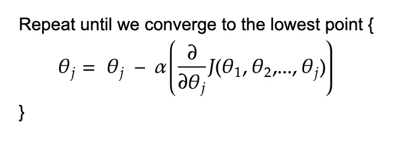
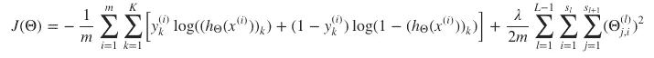
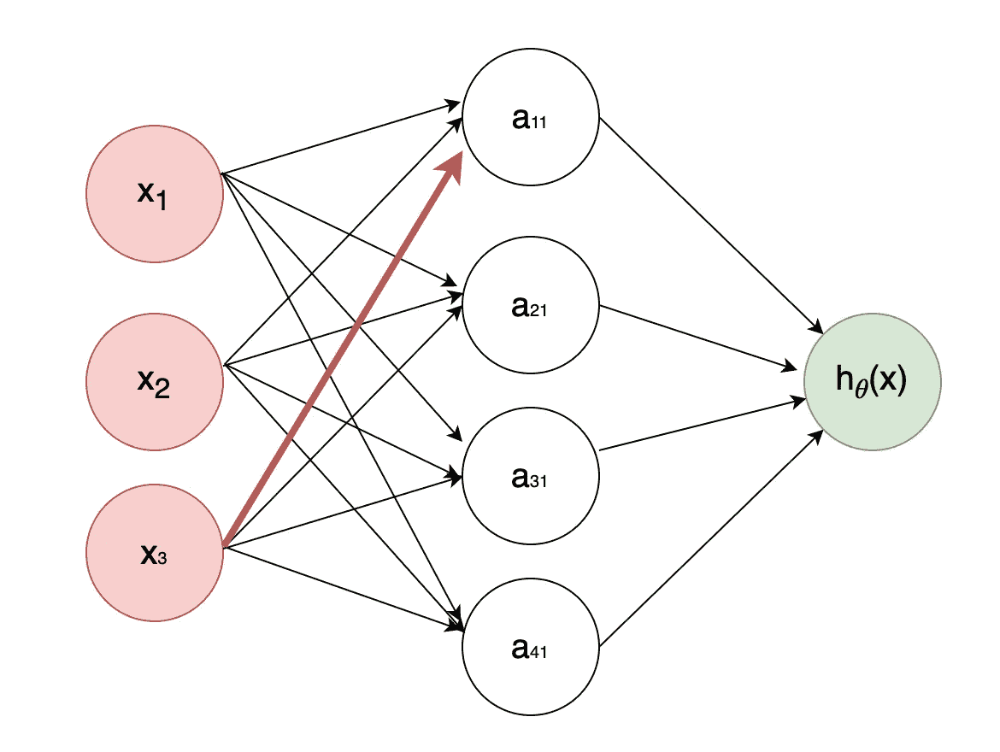
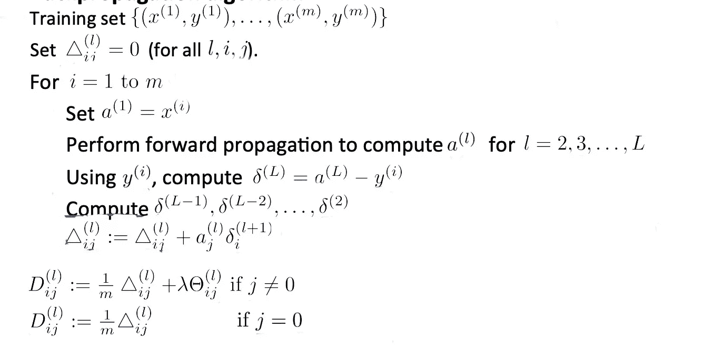
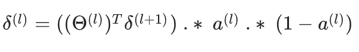
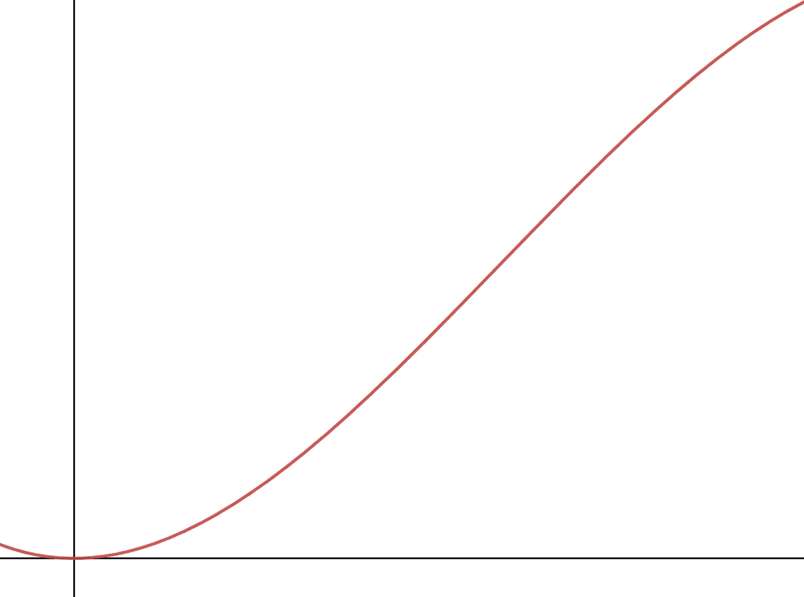
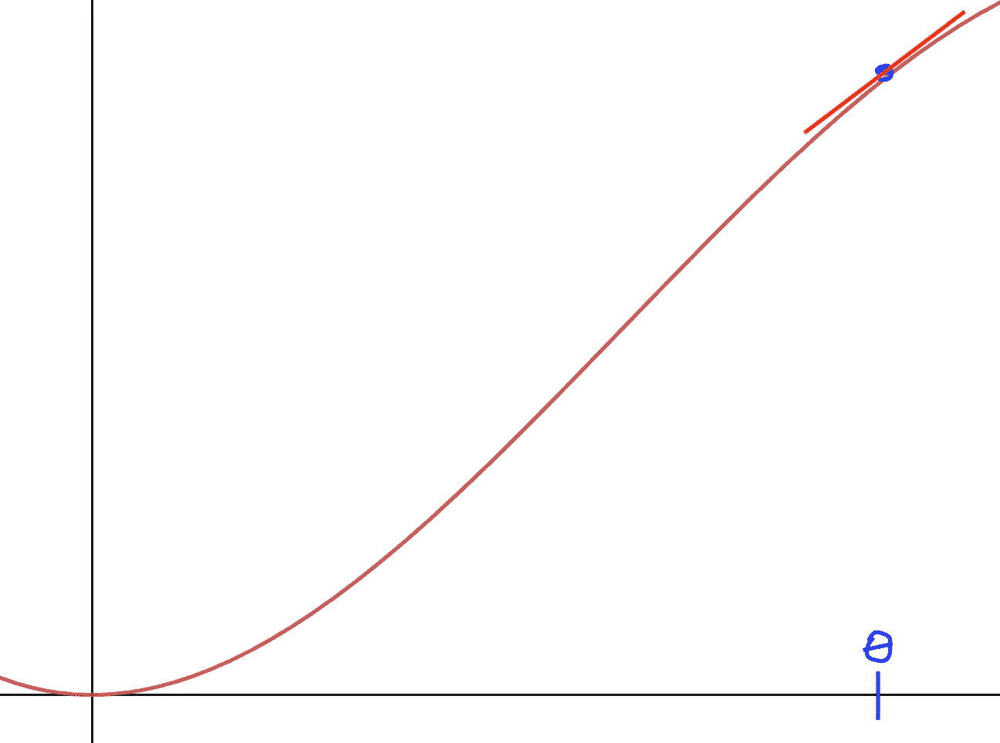
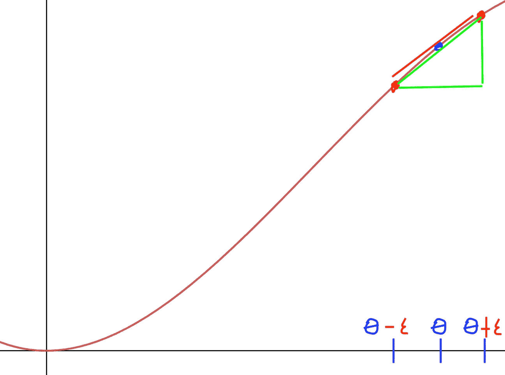
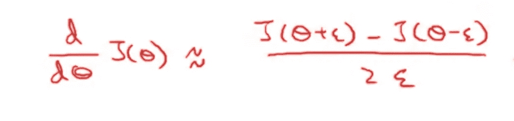
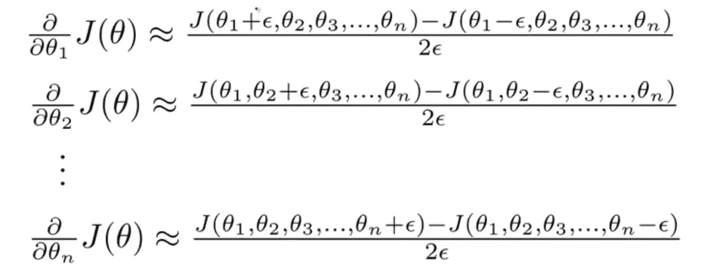

# 神经网络第 2 部分:反向传播和梯度检验

> 原文：<https://medium.com/geekculture/neural-networks-part-2-backpropagation-and-gradient-checking-4f8d1350fb0b?source=collection_archive---------33----------------------->

Photo by [Munro Studio](https://unsplash.com/@universaleye?utm_source=medium&utm_medium=referral) on [Unsplash](https://unsplash.com?utm_source=medium&utm_medium=referral)

这是我正在从事的系列的第五部分，其中我们将讨论和定义介绍性的机器学习算法和概念。在这篇文章的最后，你会找到这个系列的所有前几篇文章。我建议你按顺序读这些。原因很简单，因为我在以前的文章中介绍了一些对理解神经网络至关重要的概念，我将在许多场合引用它们。

在上一篇文章中，我们介绍了神经网络的基础知识。我们看了理论，以及一些基本术语。

在本文中，我们继续相同的主题，除了这一次，我们更多地研究如何使用梯度下降和反向传播算法来找到正确的`Theta`向量。

让我们开始吧。

# 反向传播

在我们之前看到的所有算法中，梯度下降被用来寻找最小化我们的成本函数的`Theta`向量。为此，我们遵循以下算法:

**Figure 1:** Gradient Descent Algorithm

算法的主要部分在于寻找成本函数`J`的导数。这个任务的难度取决于我们的成本函数有多复杂。我们看到，对于线性和逻辑回归，成本函数的导数只需要基本的求导法则。当谈到我们将使用的神经网络的成本函数时，部分微分的任务变得更加困难。这就是反向传播算法发挥作用的地方。该算法用于区分神经网络的成本函数。

在给出成本函数之前，让我们定义几个变量:

1.  `L`是网络的总层数
2.  `s_l`是`l`层的激活单元数。这不包括偏置单元
3.  `K`是输出单位的数量

我们现在可以给出成本函数:

**Equation 1:** Neural Network Cost Function

我知道看起来很吓人。但是，实际上，这并不多。将此与逻辑回归模型的成本函数进行比较，您会注意到相似之处:

**Equation 2:** Logistic Regression Cost Function

对于一个输出，两个成本函数是等价的。只有当我们的神经网络中有一个以上的输出时，我们才开始看到功能上的差异。从 1 到`K`的总和被相加，以说明多个输出节点。因此，`h_theta(x^(i))_k`代表在第 k 个输出节点使用的`h`函数。在我们的例子中，使用了逻辑函数。成本函数中的第二项(以ƛ/2m 开始的项)被称为[正则化项](https://en.wikipedia.org/wiki/Regularization_(mathematics))，用于成本函数中以防止过拟合。我以前没有——也不会在本文中——谈到正则化术语。在我们的例子中需要注意的是，这个术语适用于所有的`Theta`。也就是说，在我们的神经网络的不同层定义的`Theta`向量中的所有值将被平方、求和，并且最终乘以ƛ/2m.因子

既然已经解决了这个问题，让我们来看看反向传播算法。

## 直觉

算法本身并不难理解。然而，理解*如何*和*为什么*能给出我们正在寻找的偏导数，是事情变得稍微复杂的地方。我们的目的是给出一个基本的直觉。我们不会看到任何复杂的数学和证明。但是，如果你对算法所做的一切背后的深入解释感兴趣，我会让你参考迈克尔·尼尔森关于神经网络和深度学习的书的第二章。此外，请记住，你很可能不会从一开始就理解它的全部要旨。不要让那打击你的士气。它需要大量的时间和算法的实际操作，才能开始得到它为什么以这种方式工作的最细微的想法。

考虑具有三个输入、一个隐藏层和一个输出的神经网络:

**Figure 2:** Neural Network with Three Inputs and One Output

想象一下，我们有三个不同的神经网络，每个都具有与图 2 所示网络完全相同的属性。假设我们正在检查的数据集对于所有网络都是相同的。我们如何比较一个神经网络和另外两个神经网络的性能？我们可以计算一个简单的值，如*期望值*和*输出值*(**误差**)之间的差值。为了减少网络中的误差，我们可以改变哪些值？肯定不是输入，因为那些是提供给我们的。我们也不能**直接**改变由我们的激活节点计算的值，但是我们可以通过改变我们的`Thetas`间接地**这样做。考虑图 2** 中**的红色箭头。对该箭头的权重(该箭头的θ)的任何改变被传播到`a_11`、输出节点**以及错误**。想象一下，如果我们有一个以上的隐藏层。对红色箭头的权重所做的更改也会传播到新层中的激活节点。这意味着所有使用的砝码都会影响我们的误差。如果我们可以找到每个θ对误差的影响，那么我们真正要做的就是找到这些θ操纵成本函数的方向和影响。如果你读了这个系列的第二部分，[使用梯度下降的线性回归:直觉和实现](https://ali-h-khanafer.medium.com/linear-regression-using-gradient-descent-intuition-and-implementation-522d43453fc3)，那么你就会知道这是对我们的成本函数进行微分的定义。为了找到由我们的`Thetas`引起的影响，我们需要从我们的输出节点向后移动，在计算它和我们的误差之后。这就是“反向传播”这个术语的由来。同样，这可能很难让你理解。重读这一节，回顾你关于偏导数的笔记，对这个算法有一个好的感觉。**

让我们看看完整算法的伪代码:

**Figure 3:** Back Propagation Algorithm

在最后计算的是最终结果，即我们的成本函数的导数。`delta^(l)_ij`(第二行的三角形)是我们初始化为 0 的矩阵。这将被更新，并将在最后用于计算我们的成本函数的偏导数。`a^(1)`被设置为`x^(i)`，因为它是我们的输入层。**前向传播**是使用我们的输入变量实际计算我们的激活和输出节点的值的行为。执行正向传播后，我们使用第 6 行中描述的公式计算输出端的误差。其余层(第 7 行)的所有误差使用以下公式计算:

**Figure 4:** Calculating Delta for l = L-1, L-2,…, 2

其中`Theta^(l)`是层`l`处的`Theta`向量，`Delta^(l+1)`(第 1 行使用大写 delta 代替小写)是前一层的误差，`.*`是逐元素的向量乘法，`a^(l)`是层`l`的激活值的向量。从那里，我们可以像在第 8 行那样更新我们的`delta^(j)_ij`矩阵，最后，在第 9 行和第 10 行计算我们的导数。

## 梯度检查

正如您在上一节中可能注意到的那样，反向传播算法有很多工作要做。由于它的复杂性，有许多可能出错的情况。有时候，看起来你的梯度下降工作得很好，你的成本随着每次迭代而降低，但实际上并不是这样。因此，我们需要一种方法来检查我们在运行带有反向传播的梯度下降后得到的成本是正确的。本节介绍的方法称为**梯度检查**。

考虑`J(theta)`的下图:

**Figure 5:** Random Cost Function Graph

现在，假设我希望估计随机点θ处的偏导数，其中θ是一个实数，即我希望计算以下切线的斜率:

**Figure 6:** Random Cost Function Graph With Random Tangent Line

我怎样才能做出这个近似值呢？这里有一个建议:我们可以挑两个点，`theta + epsilon`和`theta — epsilon`，用一条线把这两个点连接起来，假设这条连接线是θ点切线的一个很好的近似。ε是我们选择的随机阈值:

来计算

**Figure 7:** Random Cost Function Graph With Line Tangent Approximation

为了计算两点之间的直线(绿色斜边),我们简单地将垂直距离除以水平距离:

**Equation 3:** Partial Derivative Approximation When Theta is A Real Number

**等式 3** 是当θ为实数时。到目前为止，在大多数情况下，`Theta`是一个向量。这个方程更一般的情况变成:

**Equation 4:** Generalized Partial Derivative Approximation When Theta is A Vector of Thetas

这里需要注意的是，这种逼近`Theta`导数的数值方法用于检查反向传播是否正确计算了导数。所以你可能会问自己*为什么我不用这个简单的公式来代替令人头疼的反向传播算法呢？答案很简单:这种用数字来计算事物的方式是非常低效的。因此，反向传播已经成为使用神经网络时最小化成本函数的主要方式。*

# 结论

在本文中，我们研究了一种用于最小化神经网络成本函数的重要算法:**反向传播**。我们还寻找了一种方法来测试我们的算法是否正确地计算导数，称为梯度检查。

如果你不理解我们谈论的大部分内容，没关系。重要的是你要继续使用这个算法，这样你才能更好地理解它在做什么。在我们谈论的所有事情中，有一个关键点你**必须**带走:反向传播**不是**对梯度下降的替代。这是一种用来计算我们的成本函数相对于`Theta`的偏导数的方法。算法输出的值随后被用于梯度下降中的**以最小化我们的成本函数。**

# 过去的文章

1.  **第一部分:** [数据预处理](https://ali-h-khanafer.medium.com/data-pre-processing-ee81bbe5cc77)
2.  **第二部分:** [使用梯度下降的线性回归:直觉和实现](https://ali-h-khanafer.medium.com/linear-regression-using-gradient-descent-intuition-and-implementation-522d43453fc3)
3.  **第三部分:** [使用梯度下降的逻辑回归:直觉和实现](/geekculture/logistic-regression-using-gradient-descent-intuition-and-implementation-36a8498afdcb)
4.  **第四部分— 1:** [神经网络第一部分:术语、动机和直觉](/geekculture/neural-networks-part-1-terminology-motivation-and-intuition-73675fc43947)

# 无耻的插头

*   **推特:**twitter.com/ali_khanafer2
*   **LinkedIn**:【www.linkedin.com/in/ali-khanafer-319382152/ 

# 参考

1.  [吴恩达的机器学习 Coursera 课程](https://www.coursera.org/learn/machine-learning?page=1)
2.  [神经网络和深度学习第二章:反向传播算法如何工作](http://neuralnetworksanddeeplearning.com/chap2.html)