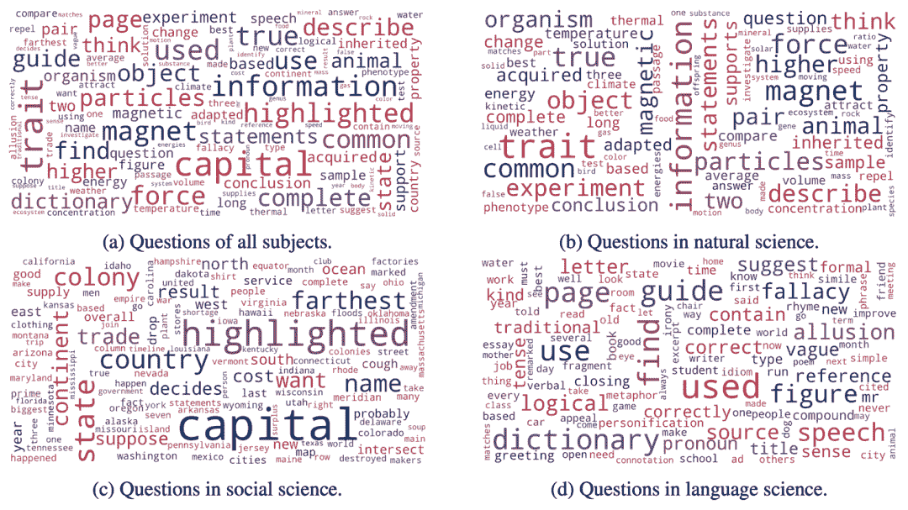

# NeurIPS 2022 |第一个多模态科学问答(Science QA)数据集，有详细的解释深度学习模型推理有一个思想链

> 原文：<https://medium.com/geekculture/neurips-2022-the-first-multi-modal-science-question-answering-science-qa-dataset-with-detailed-45b8d628b301?source=collection_archive---------3----------------------->

像人类一样高效地学习和完成复杂任务，是人工智能追求的长期目标之一。人类可以遵循一个完整的思维链(CoT)推理过程