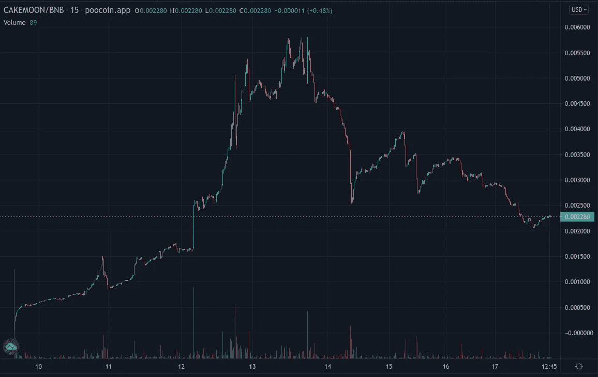

# 永远不要相信加密影响者

> 原文：<https://medium.com/geekculture/never-trust-a-crypto-influencer-8aca167492c4?source=collection_archive---------21----------------------->

Photo by [Diggity Marketing](https://unsplash.com/@diggitymarketing?utm_source=medium&utm_medium=referral) on [Unsplash](https://unsplash.com?utm_source=medium&utm_medium=referral)

这篇文章是双重的。第一部分处理 Twitter 上的加密影响者，第二部分更仔细地研究给出的一个建议。它特别展示了一些发现潜在不安全投资的工具。

声明:对第一部分持保留态度，因为它包含一些猜测。

如果你对加密感兴趣并使用 Twitter，你可能已经遇到过这样一条推文:

Tweet taken directly from Twitter. Author remains anonymous.

这条推文明显是给 CakeMoon 做广告，建议现在购买。无论是底部的#dyor 标签还是个人资料中的#nofinancialadvice。

我通常容易受骗，喜欢相信我在网上看到的每一个推荐。然而，这一次有所不同。事实上，它建议我买一些即将获得 ATH 奖的东西，这让我很不爽。你不应该那样做。这可能是最糟糕的购买时机。因为所有目前的持有者都会积累一些回报。当他们服用时，会导致价格立即下跌。

对硬币的进一步检查揭示了许多危险信号。在我看来，这显然是一个骗局，我不明白怎么会有人宣传这个。细节稍后再说，因为我想先说说推文的作者。

# 作者

这是来自一个自称“加密货币交易和商业专家”。“真奇怪！”，我想。"一个专家怎么会推荐这么结实的硬币呢？"。

最后，这实际上是专家还是“专家”可能并不太重要。我猜，这只是我的推测，他是因为发微博而得到报酬的。

这可能就是为什么你会看到影响者在评论中伸手要硬币，提议“合作”。或者为什么有时会发生完全相同的推文由多个作者发布的情况。顺便说一下，这枚硬币就是这种情况。

幕后有一个机器在工作。大账户在他们的 feed 上出售曝光率，小账户希望他们的 tweets 被看到。这绝不是加密领域独有的。这种情况在 Twitter 上随处可见，甚至可能在所有社交媒体上都有发生。

# 这些账户如何变大

让我们把锡纸帽子戴得再久一点，因为还有更多的阴谋要来。

我发现非常奇怪的是，这些有影响力的人并没有提供“高质量的内容”。他们所做的只是宣传未知的项目，对未来进行毫无根据的价格预测，并制造炒作。

那他们怎么会有这么多追随者呢？

诚然，我认为一个人必须提供“质量”才能获得名声，这可能是一种幼稚的理想化。

除此之外，我相信一个自动推进系统在这里工作。让我解释一下。

影响者愿意充当“广告牌”。一旦他们在推特上发布了一枚特定的硬币，硬币背后的社区就会被动员起来。任务:喜欢并转发这条推文，写一条正面评论并喜欢其他正面评论。有时，他们甚至可能自己跟踪账户。最重要的是，所有这些曝光将增加影响者的影响力。他的推文将会呈现给更多可能会关注他的用户。

这是基于我在密码社区的经验。每当一个有影响力的人发微博时，就会有人呼吁采取行动来“推”这条微博。

# 结束语

请随意拿掉锡纸盖。阴谋论说够了(目前)。

有人可能会说，每个投资者都有责任研究可能的投资。这是我自己的观点。所以当他们在网上听信一个随机的男孩或女孩，那么很明显是他们自己的错。

我想说的是一个不同的观点。加密技术仍处于起步阶段。为了增加采用率，进入加密世界的第一步应该尽可能的简单和无缝。当大客户为了自己的利益愿意“牺牲”易受骗的用户时，这一点将受到阻碍。当他们的推文通过传播 FOMO 或炒作来针对情绪时，这就更加危险了。

在之前的一篇文章中，我已经提到了如何识别不可信硬币的话题。让我们把这些建议付诸行动吧。

为了轻松进入，我们将从[网站](https://cakemoon.fun/)开始。为什么？因为已经满是红旗了。

我的整体印象…缺乏内容。最大和最详细的部分是——哦，多么令人惊讶——如何购买代币的解释。但是祝你好运，找到白皮书或令牌组学的细节。只有一个细节被披露。每笔交易都有 12%的税。
*讥讽上*你还会在意什么？其余的只是讨厌的细节。*讥讽关*

他们列出了社交活动中常见的嫌疑人。有趣的细节。尽管“介质”列在那里，但链接实际上没有指向任何地方。在我看来，那将是最值得尊敬的平台。但这也需要一些工作。*讽刺*所以我能理解你为什么不想为此费心。*讥讽关*

再往下是路线图。这让这个团队看起来雄心勃勃。如果不是因为这个路线图过于普通。他们计划有一个游戏，一个自己的交易所，一个商店，当然也不应该忘记 NFTs。这既缺乏细节，也缺乏创新。

但是坚持住！商店可能不会太远。至少在页面底部有样本 merch。但是寻找购买这些东西的方法是徒劳的。第二次检查显示，样本 merch 只是一对标志，被匆忙地添加到一件黑色衬衫的图像上。

我甚至在这一页的页脚发现了一个复活节彩蛋。它链接到该项目的 github 简介。这就是他们的可取之处吗？幕后真的有辛勤工作的开发者与世界分享他们的创作吗？如果是的话，他们肯定不会让你知道，因为他们没有任何公共捐款。

# 令牌

让我们暂时离开这个网站——它已经充满了危险信号，任何公牛都会发狂。但是我们还没有完成。远非如此！我们现在将深入探究这个兔子洞。为此，我们将使用由 poocoin 提供的见解。

Graph taken from poocoin

在推文中提到的 ATH 被淘汰后，我并不惊讶地看到很多红色。因此，潜在的情况是，在看到这条推文后购买它的人已经损失了一些钱。在这里你可以找到最新的[图](https://poocoin.app/tokens/0x1659b9f69406f6224d84c9e22a482ad2f2f50f3a)。

更有趣的是[开发钱包检查器](https://poocoin.app/rugcheck/0x1659b9f69406f6224d84c9e22a482ad2f2f50f3a/dev-activity)。这个工具显示所有的交易都是用开发者的钱包完成的。

还记得记号组学的细节是如何丢失的吗？现在我们可以明白为什么这是一件坏事了。因为总的流通供应量是未知的。

总供应量达到 10 亿代币，其中只有 13%用于泛交换的流动性。其余的在哪里？

[顶部支架](https://poocoin.app/rugcheck/0x1659b9f69406f6224d84c9e22a482ad2f2f50f3a/top-holders)部分可以回答这个问题。惊人的 75%被分配到不同的钱包中，其中单个钱包占 41%。

当然，我不知道任何细节，也许这是球队的营销钱包。但我不禁认为这是悬在所有当前令牌持有者头上的达摩克利斯之剑。因为如果这款钱包售出，将会对价格产生重大负面影响。

写完这篇文章，我感到有些崩溃。我希望 crypto 蓬勃发展，成为主流。但感觉要实现这一目标还有很长的路要走。

希望这篇文章能教会你一些东西。扩大了您的反诈骗工具库，让您对影响者的建议更有弹性。

但是没有时间闷闷不乐。这不会是我关于这个话题的最后一篇文章。

欢迎在评论中分享你的故事。你有没有听了一个影响者的话，事后后悔的时候？

另外，如果你想了解关于我和我的写作的最新消息，那么考虑加入我的**。**