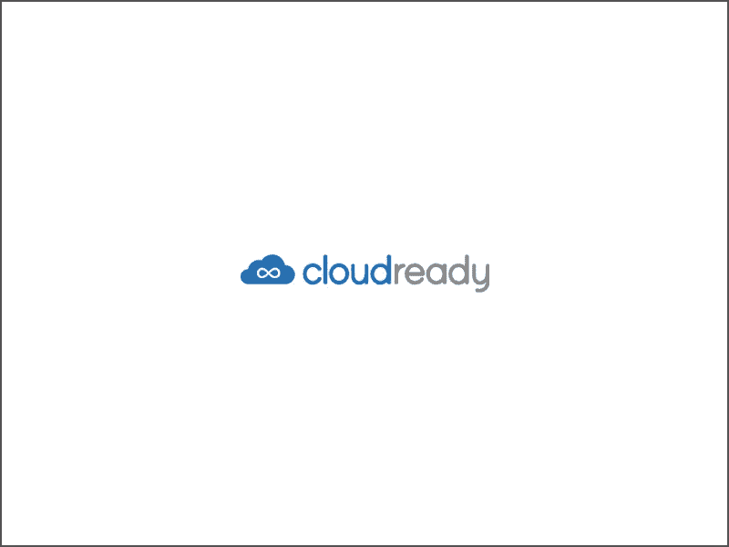

# never ware CloudReadyOS——一个以浏览器为中心的操作系统

> 原文：<https://medium.com/geekculture/neverware-cloudreadyos-a-browser-focused-operating-system-dbd2ef8db8a2?source=collection_archive---------20----------------------->

From [Neverware’s Installation Instruction Page](https://guide.neverware.com/install-and-setup/boot-usb/).

## 告别原生应用。在一个标签中运行一切。

说到电脑，我渴望简单。我喜欢简单的界面，它能让我轻松完成工作。我喜欢键盘导航。我喜欢安全感。我不是 Windows 的粉丝，因为他们的安全问题，他们庞大的安装基础，巨大的…