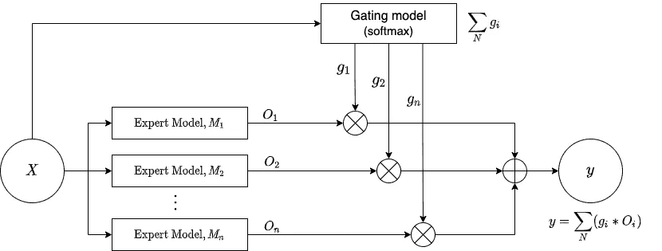

# 万亿参数模型竞赛中的新竞争者

> 原文：<https://medium.com/geekculture/new-contender-in-trillion-parameter-model-race-6ef0675ddd46?source=collection_archive---------35----------------------->

悟道 2.0 — GPT-3 破碎机

Photo by [Andrea De Santis](https://unsplash.com/@santesson89?utm_source=unsplash&utm_medium=referral&utm_content=creditCopyText) on [Unsplash](https://unsplash.com/s/photos/ai?utm_source=unsplash&utm_medium=referral&utm_content=creditCopyText)

我们都记得 GPT-3 在 2020 年首次亮相时是如何打破人工智能世界的，它在 NLP/NLU/NLG 以其最先进的(SOTA)性能亮相，甚至在零到几个镜头的学习中展示了神奇的能力。到处都有人声称这是实现人工智能的开始(AGI)。GPT-3 是迄今为止用 1750 亿个参数训练的最大模型(比其前身 GPT-2 大 100 倍)，它是在 570GB 的训练数据上训练的(OpenAI 研究人员策划了 45TB 的数据来提取这 570GB 的干净数据)。它为基于深度学习的人工智能模型设定了新的标准。

# 武道 2.0 的崛起

经常观察到，在一定数量的参数之后，神经网络架构趋于饱和，即可学习性不随着参数数量的增加而增加。然而，在 GPT-3 的情况下，从其[结果](https://arxiv.org/pdf/2005.14165.pdf)中可以观察到，GPT-3 在参数数量方面的性能仍然呈上升趋势。与 GPT-3 合作的研究人员进一步表示，他们还没有接近饱和，未来可以在更大的模型中看到性能的进一步改善。

人工智能的发展如此之快，以至于不到一年，GPT 3 就被超越了。来自北京人工智能研究院(BAAI)的研究人员于 2021 年 6 月 1 日宣布发布他们自己的生成式深度学习模型“悟道 2.0”，可以说这是一个大的发明。悟道 2.0(在今年 3 月发布其 1.0 版本仅三个月后发布)非常庞大。[据副主任、BAAI 学者、清华大学教授唐杰](http://www.xinhuanet.com/english/2021-06/06/c_139992397.htm)介绍，悟道 2.0 经过 1.75 万亿个参数的训练，是 GPT 3(1750 亿个参数)的 10 倍，比谷歌的开关变压器(1.6 万亿个参数)多 1500 亿个参数。Coco Feng 在她为《南华早报》撰写的[文章](https://www.scmp.com/tech/tech-war/article/3135764/us-china-tech-war-beijing-funded-ai-researchers-surpass-google-and)中进一步报道，悟道 2.0 是在高质量的 4.9TB 文本和图像数据上进行训练的。这个训练数据在悟道语料库中分为 1.2TB 的中文文本数据，在 Pile 数据集中分为 2.5TB 的中文图形数据和 1.2TB 的英文文本数据。根据 BAAI 在推特上分享的一篇*同步* [文章](https://syncedreview.com/2021/03/23/chinas-gpt-3-baai-introduces-superscale-intelligence-model-wu-dao-1-0/)，悟道 1.0 的工作由唐杰领导，来自北京大学、清华大学、中国人民大学、中国科学院和其他研究所的 100 多名人工智能科学家团队做出了贡献。

# 驯服巨人

训练这种具有数十亿和数万亿参数的庞大模型本身就是一种挑战，因为如此大量的参数增加了模型的复杂性(自由度)，使其难以训练。这种巨大的模型还需要大量的计算和内存资源，并且可能需要几天到几周的时间来训练。文献表明，混合专家(MoE)技术在将语言模型带到数万亿个参数方面表现出强大的潜力。简单介绍一下 MoE，它是一种在神经网络领域开发的集成学习技术。MoE 背后的想法是，它将一个复杂的任务分解成更小的子任务，在每个子任务上训练一个专家模型，开发一个概率门控模型，该模型基于输入学习哪个专家模型值得信任，并组合预测。然而，在万亿参数的规模上训练 MoE 需要协同设计算法和系统，用于良好调整的高性能分布式训练系统。唯一能够令人满意地满足这些要求的现有平台强烈依赖于 Google 的硬件和软件堆栈(TPU 和 Mesh Tensorflow ),该堆栈不公开，尤其是对于 GPU 和 PyTorch 社区。为了克服这一限制，BAAI 的研究人员开发了 [FastMoE](https://arxiv.org/pdf/2103.13262.pdf) (类似于谷歌的 MoE)，这是一个基于 PyTorch 的分布式 MoE 训练系统，使模型既可以在超级计算机集群上训练，也可以在传统的 GPU 上训练。该系统还支持在跨多个节点的多个 GPU 上部署不同的专家模型用于训练，从而能够相对于 GPU 的数量线性地扩大专家的数量。在前面提到的*同步*文章中，报道了使用 FastMoE，训练速度比传统 PyTorch 实现提高了 47 倍。

Typical Mixture of Experts architechture

# 武道 2.0 的功能

与大多数执行单一任务(人工狭义智能或 ANI)的深度学习模型相比，悟道 2.0 是一个多模态人工智能系统，它在文本和图像上进行训练，可以处理涉及这两种类型数据的任务。

Andrew Tarantola 在他为 [Engadget](https://www.engadget.com/chinas-gigantic-multi-modal-ai-is-no-one-trick-pony-211414388.html) 撰写的文章中写道“在实验室年会期间，BAAI 的研究人员展示了吴导执行自然语言处理、文本生成、图像识别和图像生成任务的能力”。这篇文章进一步报道说，吴导展示了其预测蛋白质 3D 结构的能力，如 [AlphaFold](https://deepmind.com/blog/article/AlphaFold-Using-AI-for-scientific-discovery) 。

## 成就

据新华网[文章](http://www.xinhuanet.com/english/2021-06/06/c_139992397.htm)报道，唐杰强调，吴导在诗词楹联创作、文字总结、回答问题和绘画方面都差点打破图灵测试。Tang Jei 还报告说，他们的人工智能模型在 9 个基准任务中达到/超过了谷歌、微软和 OpenAI 等机构的 SOTA 模型。这些基准测试任务包括从文本中生成图像，从图像中提取 alt 文本，测试事实和常识知识，以及零镜头和少量镜头学习。

为了强调从少量新数据中学习的能力，来自北京的人工智能研究员 Blake Yan 对 Coco Feng 说，“这些在庞大数据集上训练的复杂模型，在用于特定功能时只需要少量新数据，因为它们可以像人类一样，将已经学习的知识转移到新的任务中”。

为了让机器能够像人类一样思考，并走向通用人工智能，BAAI 和科技公司智普一起。艾和小冰训练了中国第一个虚拟学生华.华已经正式成为北京清华大学计算机科学与技术系的一名学生。新华网[文章](http://www.xinhuanet.com/english/2021-06/06/c_139992397.htm)报道称，在她的视频博客中，华说，“我对自己的出生产生了兴趣”，问“我是怎么出生的？我能理解自己吗？”

陈郁为《中国日报》写道:“华，能写诗和音乐，并有一定的推理和情感互动能力。”。

新华网[文章](http://www.xinhuanet.com/english/2021-06/06/c_139992397.htm)提到“华说她将在唐杰的指导下学习，每天都在争分夺秒地学习和提高自己的逻辑推理能力等方面”，文章进一步指出“根据唐杰的说法，他的虚拟学生将比一般真实的人成长和学习得更快。如果她今年开始以 6 岁的水平学习，一年后她将达到 12 岁的水平。”

我们周围的世界有各种类型的数据，无论是视觉、听觉还是语言形式，我们人类是多感官动物。如果人工智能系统必须模仿人类，那么考虑它也需要是多模态的也是合理的。因此，你可以考虑悟道——多模态多任务模式，这是实现 AGI 的一步。没有人知道悟道会把我们带到 AGI 多远，但这种在人工智能中建立大规模深度学习模型的日益增长的趋势无疑提出了关于训练如此庞大的模型的影响和反响的问题。Rob Toews 在他为《福布斯》撰写的[文章](https://www.forbes.com/sites/robtoews/2020/06/17/deep-learnings-climate-change-problem/?sh=230948076b43)中谈到了深度学习导致的巨大碳排放问题。根据 Toews 的说法，我们需要重新评估、修改和改进今天人工智能研究的方式，否则人工智能领域可能成为对抗气候变化的对手。来自马萨诸塞大学阿姆赫斯特分校的研究人员进行的一项 [2019 年研究](https://arxiv.org/pdf/1906.02243.pdf)显示，在 GPU 上用神经架构搜索训练一个 Transformer big (213M 参数)模型的 CO₂排放量大约相当于五辆汽车的总寿命碳足迹。

人们需要问的另一个重要问题是，如此庞大的深度学习模型的商业化以及少数技术力量垄断人工智能。这主要是由于训练如此巨大的模型所需的硬件和资源需要大量的资本，或者是因为使用这些模型的高溢价。这种垄断的一个例子可能是[微软在 OpenAI 投资数十亿美元后获得了 GPT-3](https://blogs.microsoft.com/blog/2020/09/22/microsoft-teams-up-with-openai-to-exclusively-license-gpt-3-language-model/) 的产品和服务的独家许可。根据这项协议，OpenAI 被允许提供一个面向公众的 API，这样用户可以向 GPT 3 号发送文本以接收模型的输出，但只有微软才能访问 GPT 3 号的源代码。

任何人工智能模型都和它接受训练的数据一样好。因此，模型很容易产生偏差，有时这些偏差会非常有害。对于具有如此高的生成能力的模型来说，这可能更加有害，因为这些模型会产生具有破坏性和伤害性的文本或图像。

> 如果一个人工智能系统可以做一些事情，它真的应该在实践中做那些事情吗？

因此，人工智能领域的任何发展和商业化都需要牢记其对[伦理](/fair-bytes/how-biased-is-gpt-3-5b2b91f1177)、[经济](https://bdtechtalks.com/2020/09/21/gpt-3-economy-business-model/)和[环境](https://www.forbes.com/sites/robtoews/2020/06/17/deep-learnings-climate-change-problem/?sh=29e08c756b43)的影响。在我们考虑让这些模型进入现实世界之前，我们需要在负责任的人工智能方面取得进展，我们必须理解“可能”和“应该”之间的区别。

# 参考和进一步阅读:

1.[美中科技大战:北京资助的人工智能研究人员用新的语言处理模型超越谷歌和 OpenAI】，南华早报。](https://www.scmp.com/tech/tech-war/article/3135764/us-china-tech-war-beijing-funded-ai-researchers-surpass-google-and)

2.[中国的 GPT-3？BAAI 推出超级智能模型'悟道 1.0'](https://syncedreview.com/2021/03/23/chinas-gpt-3-baai-introduces-superscale-intelligence-model-wu-dao-1-0/) ，同步评论。

3.[中国庞大的多模态人工智能可不是只会一招的小马](https://www.engadget.com/chinas-gigantic-multi-modal-ai-is-no-one-trick-pony-211414388.html)，engadget。

4.[中国聚焦:认识中国首个人工智能虚拟学生](http://www.xinhuanet.com/english/2021-06/06/c_139992397.htm)，新华网。

5.第一个虚拟学生在清华大学入学。

6. [GPT-3 吓到你了？遇见武道 2.0:1.75 万亿参数的怪兽](https://towardsdatascience.com/gpt-3-scared-you-meet-wu-dao-2-0-a-monster-of-1-75-trillion-parameters-832cd83db484)，走向数据科学。

7. [AI 周刊:中国海量多模态模型凸显 AI 研究空白](https://venturebeat.com/2021/06/04/ai-weekly-chinas-massive-multimodal-model-highlights-ai-research-gap/)，VentureBeat。

8.[深度学习的碳排放问题](https://www.forbes.com/sites/robtoews/2020/06/17/deep-learnings-climate-change-problem/?sh=230948076b43)，福布斯。

9.微软独家 GPT-3 许可证的含义，技术讲座。

10.[微软，GPT-3，以及 OpenAI 的未来](https://venturebeat.com/2021/06/01/microsoft-gpt-3-and-the-future-of-openai/)，VentureBeat。