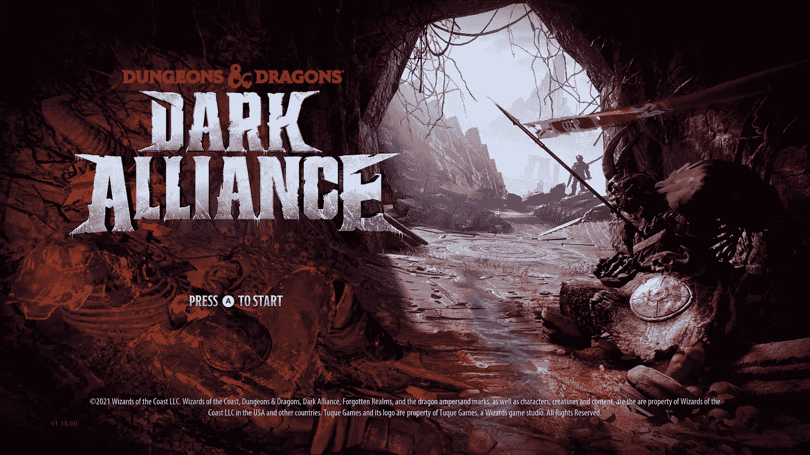
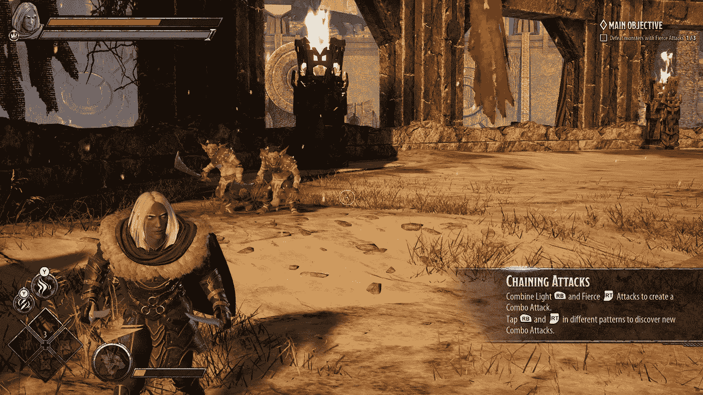
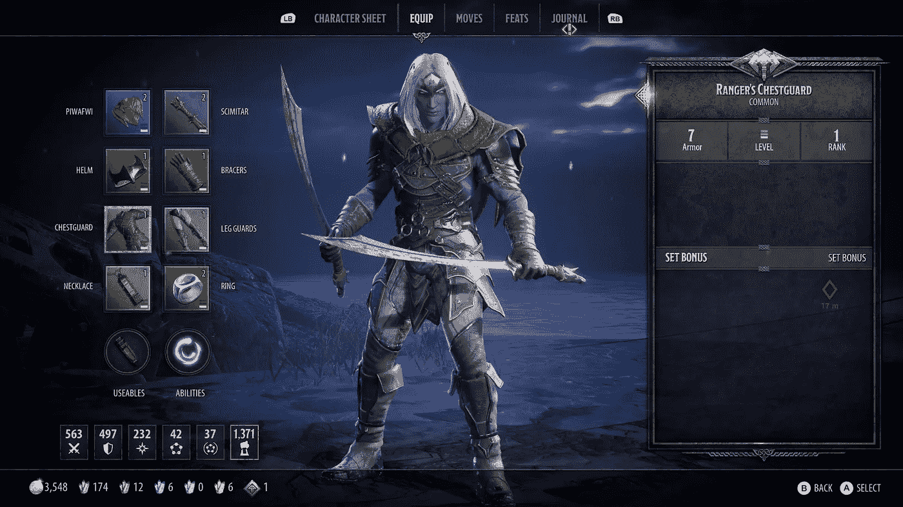

# 新的黑暗联盟游戏立即落在脸上

> 原文：<https://medium.com/geekculture/new-dark-alliance-game-immediately-falls-on-face-f4a8cacc38ea?source=collection_archive---------15----------------------->

## 不幸的是，这种利用 PS2 和被遗忘国度怀旧情绪的尝试还没有完成

Xbox Series S screenshot taken by the author.

昂吉斯和龙:黑暗联盟似乎是一个显而易见的游戏系列复兴，可能是四年前《海岸巫师》轻松获得批准的一次尝试。传奇*保德之门:黑暗联盟*动作 RPG 的伪续作，也以 R.A. Salvatore 的经典系列搭配小说的故事联系为特色？怎么会出错呢？

所以，*所以*很多方面。

这里的前提很棒。粉丝最喜欢的卓尔精灵崔斯特·杜·垩登和他的朋友们必须立即开始另一场冒险，以拯救冰风谷周围的土地。邪恶的名义碎片又一次引起了混乱，吸引了来自 D & D 宇宙的不同怪物组成的军队，他们在那里组成了*黑暗联盟*来…与好人战斗。看，这不是有史以来最复杂的故事，但它是经典的 PlayStation 2 时代视频游戏和小说的真实后续。

可惜游戏设计很快就失去了剧情，程序代码是*赛博朋克*发射关卡的破碎。在开始游戏的 40 秒内，我所有的攻击按钮都停止了工作，我只能慢慢地移动和挪动相机。我不得不重新开始整个游戏，让它再次运行。敌人定期飞离游戏世界，有时在死亡之前，有时在死亡之后。不可见的几何图形边缘无处不在，即使在最好的情况下也使得遍历变得笨拙。我的角色经常沿着一个略高于地面的平面奔跑。动画有时播放流畅，看起来很棒，但其他时候会丢失帧，无缘无故地断断续续。

即使你只玩游戏几分钟，你也会看到明显的 bug。如果游戏好玩的话，这是可以原谅的，但是这个设计是一堆想法的混合，从来没有结合成任何固体。是等份*黑暗灵魂，王朝战士*，通用移动 RPG。这个游戏分为几个等级，你会收集随机的战利品…但是你实际上并没有得到这些物品，直到你回到营地并从战利品箱中收集它们。这是非常移动游戏 y，虽然这工作时，水平是短期事务，在这里他们是相当长的。在我寻求享受缓慢，呆滞的战斗中，能马上使用一把新剑是很好的。

Here, my combat controls stopped working while it was teaching me the combat controls. Xbox Series S screenshot taken by the author.

战斗尴尬地夹在一个*灵魂*或*怪物猎人*游戏的有条不紊的体力消耗动作和更休闲的动作 RPG 的基于部落的按钮捣碎之间。耐力条补充得太快，不会像软件流行的*灵魂*系列那样成为负担，但游戏仍然希望你通过一次单独锁定一个敌人并进行攻击来小心翼翼地对抗其庞大的敌人群。而不是感觉有价值，这是笨拙和糟糕的。《黑暗联盟》没有任何让它的许多灵感变得好玩的东西，相反，感觉战斗设计总是在两种相反的风格之间徘徊，游戏导演从未下定决心。

除了 janky 战斗，游戏也有一些 janky 平台，你永远不知道你的角色是否会抓住一个窗台和地幔。我可以说，设计者*知道*这是不好的，因为掉进坑里只会让你重新回到陆地上，健康损失很小。在我看来，平台化在这些游戏中没有太大的地位。即使是*灵魂*系列也知道更多地将遍历作为偶尔的扭曲玩笑而不是游戏的主要部分。

我还没有完成整个游戏，但它会在开始的 30 分钟里向你展示它的每一个技巧，然后一遍又一遍地重复。每一关都有过场动画，一场穿越敌人的苦战，然后结束。唯一聪明的设计是独特的*灵魂*营火，在那里你可以选择将重生点移到当前的营地并拿回你的生命药剂，或者冒着被抛弃的风险回到更好的随机战利品乘数。当然，如果你能马上拿到战利品，那就更好了。

The entire UI and loot system feels like it fell out of a mobile game. Xbox Series S screenshot taken by the author.

这个故事对被遗忘的领域设定和传说做了大量的点头，当你接近敌人时，他们经常谈论这个世界，这是一个很好的接触。但是如果你已经非常熟悉原始材料，你会从这些材料中得到最大的乐趣。我已经读过*水晶碎片*，但如果我没有读过，游戏开始时微薄的微风般的摘要也不会很好地把我拉进故事。

除了剪辑和动画错误，视听包是非常令人印象深刻的。游戏运行在虚幻引擎 4 上，在我的 Xbox 系列 S 上，它有着清晰的分辨率和流畅的性能。艺术和声音团队显然是在漫长的开发周期中完成的。这些层次是繁茂和详细的，充满了足够的环境氛围，他们觉得活着。音乐也很棒，有令人振奋的主题和详细的混音，我希望在一个更好的游戏中。

我完全迷上了这种类型的游戏，我仍然会花时间来完成这款游戏，但感觉更像是工作而不是娱乐。为什么他们把一个糟糕的*灵魂*战斗实现和这么多敌人配对？为什么我不能在这个战利品游戏中马上得到我的战利品？这个游戏最初是为移动设备设计的吗？

为什么我不只是扮演*戈弗尔？*去年被忽略的游戏完全做到了这里所做的一切，但执行得更好。它在融合*灵魂-* 方面也有独特之处，比如用动作 RPG 进行战斗，但它快速而有趣，你实际上可以一次击中多个敌人。它也有漂亮的图形。它能让我马上看到我的战利品。

Here, you can see Drizzt’s feet hovering over the ground. This is a regular problem. Xbox Series S screenshot taken by the author.

一个关于崔斯特的新*黑暗联盟*游戏应该很容易被列入我今年最喜欢的游戏。它甚至出现在一个很好的安静的时间，那里很难有新的发布，如果你想尝试一下而不支付全价，它就在游戏通行证上。如果你在非游戏通行证平台上，它的起价为 40 美元，也有 60 美元的版本。我可能会等到 20 美元或更少。以这个价格，如果你已经沉浸在遗忘国度的传说中，我仍然只能推荐它。

即使游戏有一个更加一致的设计，这个游戏仍然感觉离完成还有几个月。我知道这种情况最近发生得越来越频繁，但这是一个基于线性水平的事情，没有任何复杂的开放世界模拟系统。它不应该在如此混乱的状态下发布。除非你是这个场景的铁杆粉丝，否则我不认为你会玩得开心。如果你怀念这个动作 RPG 系列曾经的样子，我建议你选择上个月发布的《博德之门:黑暗联盟》的重作。

***如果你喜欢这个故事，你可以直接在 Ko-Fi*** ***或*** [***上关注我的推特***](http://www.twitter.com/Xander51) ***。***