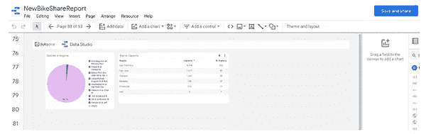
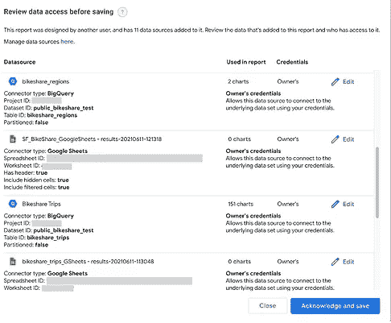
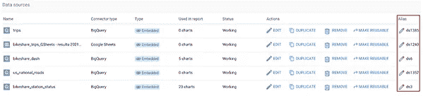
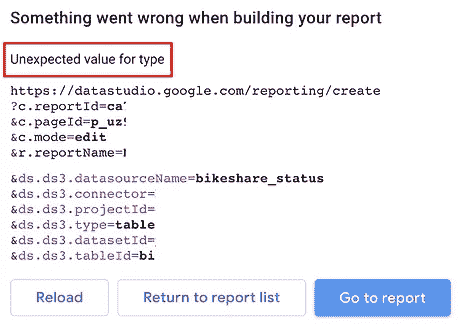

# 新的 Looker Studio 特性:链接 API

> 原文：<https://medium.com/geekculture/new-data-studio-feature-linking-api-98b307a63661?source=collection_archive---------4----------------------->

## 仪表板的新管理可能性。亚历山大·柯俊

Photo by [Fahrul Azmi](https://unsplash.com/@fahrulazmi) on [Unsplash](https://unsplash.com/)

我们总觉得 Looker Studio(以前叫 Google Data Studio)真的缺乏设置自动化的可能性。Looker Studio(以前称为 Google Data Studio)只有一个 API 来处理报表和数据源的权限，但没有额外的 API 来直接与仪表板交互。

谷歌为 Looker Studio 发布了一个新的 API，以改善编辑和观众对仪表盘的处理。在这篇文章中，我们想要研究链接 API 和提供的可能性。

每个对新的 Looker Studio 功能感兴趣的人都必须阅读这篇文章。

# URL 结构

链接 API 可以通过构建一个 URL 来管理。URL 总是具有相同的路径，并且所有的定制都是在参数中进行的。

路径总是:

*https://data studio . Google . com/reporting/create*

在路径之后，您可以添加参数来定制仪表板用户的体验或更改仪表板本身。

# 更改报告设置

您可以将一些标准参数添加到链接 URL 中。这些也称为控制参数:

*   c.reportId:您要处理的报告的 Id。加粗的部分是一个平时 Looker Studio 报道链接中的 report id:【https://datastudio.google.com/reporting/】T4***ca 5902 da-ad31-1z 34-13 F8-98e C5 F3 ad 950****/page/p _ Xu 283 kdkwl*
*   c.pageId:您要寻址的页面的 Id。粗体部分是一个常见的 Looker Studio 报告链接中的 pageId:*https://data Studio . Google . com/reporting/ca 5902 da-ad31-1z 34-13 F8-98 ec5 F3 ad 950/page/****p _ Xu 283 kdkwl***(如未注明:首页)
*   c.mode:用户启动的模式。可能的值为查看和编辑(如果未指定:查看模式)

因此，一个可能的 URL 是:

*https://datastudio.google.com/reporting/create?c.reportId=*[*ca 5902 da-ad31-1z 34-13 F8-98 C5 F3 ad 950*](https://datastudio.google.com/reporting/ca5902da-ad31-1z34-13f8-98ec5f3ad950/page/p_xu283kdkwl)*&c . pageid =*[*p _ Xu 283 kdkwl*](https://datastudio.google.com/reporting/ca5902da-ad31-1z34-13f8-98ec5f3ad950/page/p_xu283kdkwl)*&c . mode = edit*

您正在共享的报告当前有一个设置:

*   r.reportName:设置报告的名称(如果未指定:模板报告名称-日期、时间)

# 链接 API 的工作流程

当您单击其中一个准备好的链接时，首先您会看到带有选定页面的报告，处于选定模式，并且您已经可以使用仪表板了。此外，在右上角是一个“保存和共享”按钮。

点击此按钮后，会出现一个设置数据源的新菜单。

您将看到连接的数据源和关于不同连接器设置的更多信息(例如，对于 BigQuery 数据:项目、数据集、表等)。此外，您可以编辑数据源、更改字段、重新连接到另一个数据源等等。

当您点击“确认并保存”按钮时，将会创建一个包含您选择的所有设置的新报告。

# 切换数据源

## 设置数据源

您可以通过从模板创建新仪表板来更改数据源设置。但是也可以用“已编程”的 URL 进行调整。

对于共享仪表板，您还可以替换或更新连接的数据源。不同连接器类型的设置差别很大。因此，我们把重点放在我们最有经验的连接器 Google BigQuery 上。

可以添加到 URL 的 BigQuery 源的数据源参数如下:

*   ds。*别名*。datasourceName:数据源的名称
*   ds。*别名*。连接器:您想要使用的连接器(在我们的例子中是 BigQuery)
*   ds。*别名*。projectId:您要连接的 GCP 项目的 Id
*   ds。*别名*。类型:数据的类型(如表格)
*   ds。*别名*。datasetId:要连接的数据集的 id/名称
*   ds。*别名*。tableId:要连接的表的 id/名称

链接 API 当前支持以下连接器:

*   BigQuery
*   云扳手
*   谷歌分析
*   谷歌云存储
*   谷歌工作表
*   谷歌调查
*   搜索控制台

## 数据源别名

缺少的部分是数据源的别名。在前几周，您可能已经认出了数据源旁边的别名。

Alias of the data sources

每个数据源都有一个 id，它总是以“ds”开头，后面是一个随机数。要更改新报告的数据源设置，您必须在最终 URL 中使用模板数据源的别名。

更改数据源的 URL 示例如下:

*https://datastudio.google.com/reporting/create?c . report id = ca 5902 da-ad31-1z 34-13 F8-98e C5 F3 ad 950&c . pageid = p _ Xu 283 kdkwl&c . mode = edit&ds . ds 334 . data source name = changed data source&ds . ds 334 . connector = big query&ds . ds 334 . project id = project-123&ds . ds 334 . type*

## 配置中的错误

如果您的 URL 中有错误，您也会收到一条错误消息。

在这种情况下，类型参数的值是错误的。应该是表。

# 结论

Google 用这个 API 改进了复制和共享仪表板的方式，并在这个过程中改变了最重要的配置。其想法是构建模板报告，并使用它们自己的报告设置和其他数据源连接创建自定义报告。

# 本月即将发布的 datadice 博客文章

*   [谷歌数据分析的最新更新(2022 年 8 月)](/geekculture/latest-updates-on-google-data-analytics-august-2022-5be3c178a75a?source=your_stories_page-------------------------------------)
*   [通用分析与谷歌分析 4(第一部分)](/nerd-for-tech/universal-analytics-vs-google-analytics-4-part-1-dc1134d89e82?source=your_stories_page-------------------------------------)

# 更多链接

这篇文章是来自 [datadice](https://www.datadice.io/) 的谷歌云系列的新功能的一部分，并给你关于 BigQuery 或 Looker Studio 的新功能的详细见解。

查看我们的 [LinkedIn](https://www.linkedin.com/company/datadice) 账户，深入了解我们的日常工作生活，并获得关于 BigQuery、Looker Studio 和营销分析的重要更新

我们也从我们自己的 YouTube 频道开始。我们谈论重要的 DWH，BigQuery，Looker Studio 和更多的话题。点击查看频道[。](https://www.youtube.com/channel/UCpyCm0Pb2fqu5XnaiflrWDg)

如果你想了解更多关于如何使用 Google Looker Studio 并结合 BigQuery 更上一层楼，请查看我们的 Udemy 课程[这里](https://www.udemy.com/course/bigquery-data-studio-grundlagen/)。

如果您正在寻求帮助，以建立一个现代化的、经济高效的数据仓库或分析仪表板，请发送电子邮件至 hello@datadice.io，我们将安排一次通话。

*最初发布于*[*https://www . data dice . io*](https://www.datadice.io/new-linking-api)*。*