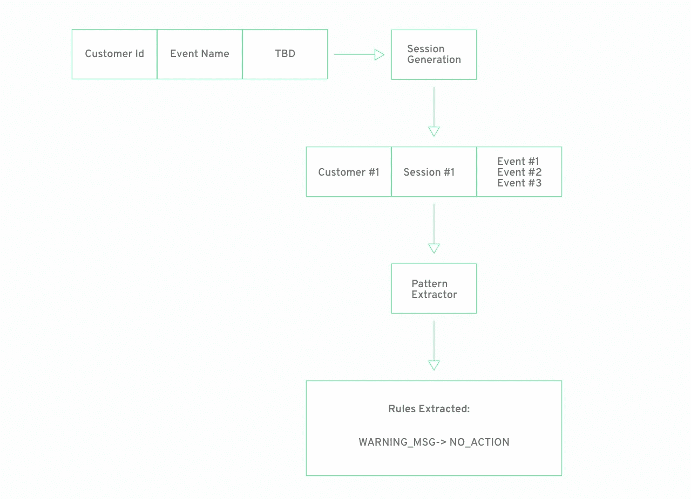
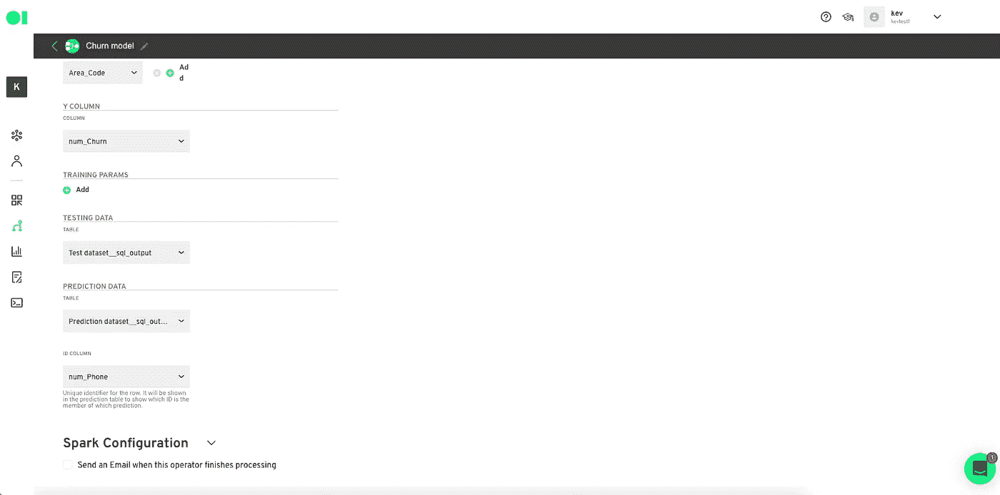
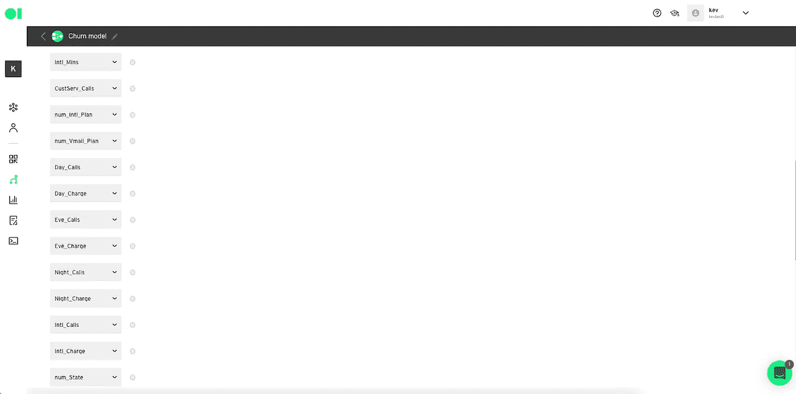
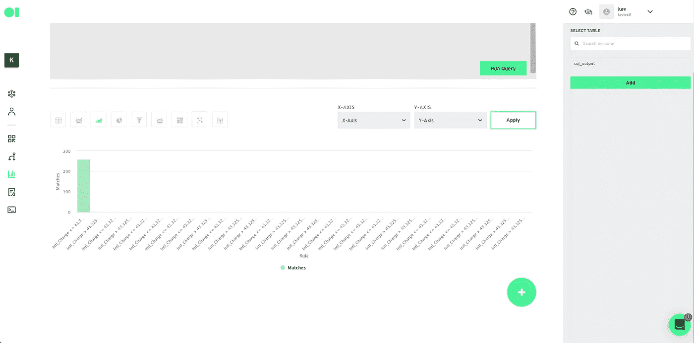
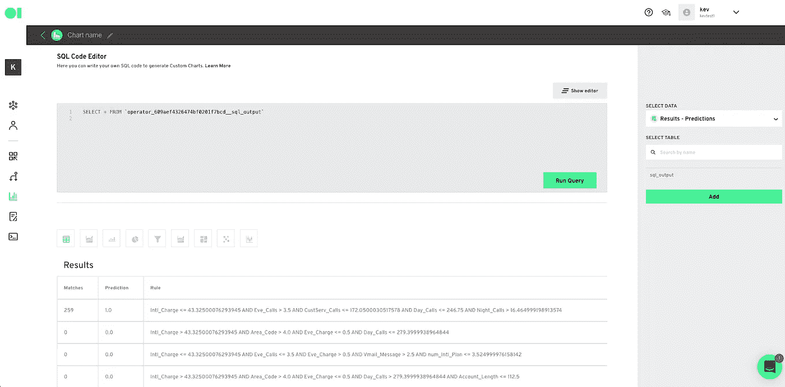
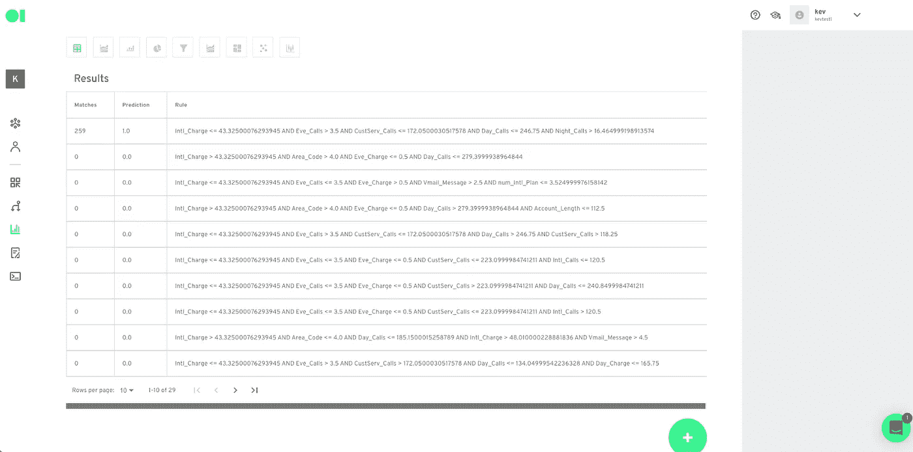

# 新功能警报🚨机器学习模型的规则提取

> 原文：<https://medium.com/geekculture/new-feature-alert-rule-extraction-for-machine-learning-models-d7bd376e5b1c?source=collection_archive---------54----------------------->

据数据科学行业所知，创建 ML 模型相对较快且较容易，但将其投入生产却很困难且成本高昂。你会惊讶地发现只有很小比例的 ML 项目进入生产——只有大约 12%。([来源](https://www.gartner.com/en/newsroom/press-releases/2018-02-13-gartner-says-nearly-half-of-cios-are-planning-to-deploy-artificial-intelligence#:~:text=Gartner%20predicts%20that%20through%202022,teams%20responsible%20for%20managing%20them.))

这就是为什么，在仔细观察了客户用 Datagran 的管道构建的东西之后，我们认为规则提取是朝着正确方向迈出的一步，可以减轻一些痛苦。

从本质上说，规则提取帮助公司连接他们的数据，运行算法，并自动检测事件，然后将输出发送到业务应用程序。这种模式的最佳用例之一是在电子商务行业。让我们来看一个例子:

拥有超过 700 万用户、价值 10 亿美元的送货应用 Rappi 希望了解为什么他们的用户在几乎完成订单后放弃购物车。

首先，他们集成了 Datagran 的 SDK，从他们的 IOs 和 Android 应用程序中提取客户行为。

然后他们选择了一种算法。因为规则提取只能应用于分类或回归模型，以提取在模型中找到的一组规则和属于每个规则的数据，所以他们选择了分类算法。

同样值得注意的是，规则提取*专门*在决策树算法上工作——它们可以在两种类型的模型中找到:

*   [分类](https://blog.datagran.io/posts/how-to-predict-customer-churn-rate-with-classification-algorithm)
*   [回归](https://blog.datagran.io/posts/how-to-run-a-regression-model)

一旦他们运行该算法，其中一个发现是一个标记为 WARNING_MSG-> **的事件，该事件导致 70%的用户放弃了他们的移动应用程序订单**。

这一发现使该团队在顾客进入购物车之前就查明了顾客下车的确切原因，并输入了他们的送货地址。该消息通过显示一个弹出窗口来警告用户，询问他们是否确定地址是正确的，因为他们似乎离餐馆太远了。

因此，该团队重新设计了警告弹出窗口，因此该消息不是警告，而是整个结账过程中的又一个问题。

然而事情并没有就此结束，Rappi 的团队利用这些预测让聊天机器人为用户提供替代方案和建议，以防止用户流失。

考虑到公司可以在几分钟内建立这样的管道，测试和迭代而没有高度的复杂性，规则提取可能是非常强大和有用的，因为像 Datagran 这样的低代码平台。没有 ML OPs 的团队可以追求这样的项目，或者有强大团队的团队现在可以在投入资源构建复杂管道之前进行测试和迭代。

# 使用规则提取的流失教程

在本教程中，您将使用电信公司的数据预测导致客户流失的事件，使用规则提取，您将从他们的客户服务日志中提取数据。

1.  首先，您必须创建一个新的数据集成。点击了解更多关于集成的信息[。然后，您将通过转到管道来构建分类模型。命名您的模型，然后通过从右侧菜单中选择它并将其拖到画布中来拖放您的集成。](https://www.youtube.com/watch?v=p4G6UfukDwM&t=1s)
2.  通过拖放 SQL 操作符并将其连接到集成来处理数据。将鼠标悬停在元素上并单击编辑图标以打开查询画布。使用下面的示例查询并替换这些值。完成后，运行查询并保存表。进入画布后，将鼠标悬停在操作员上方，然后按播放。

‍

SELECT CAST(Account _ Length AS float 64)Account _ Length，CAST(Vmail _ Message AS float 64)Vmail _ Message，CAST(Day _ Mins AS float 64)Day _ Mins，CAST(Eve _ Mins AS float 64)Eve _ Mins，CAST(Night _ Mins AS float 64)Night _ Mins，CAST(Intl _ Mins AS float 64)Intl _ Mins，CAST(CustServ _ Calls AS float 64)CustServ _ Calls，CASE Intl_Plan '否'时，EN 0 '是' CAST(Night _ Charge AS float 64)Night _ Charge，CAST(Intl _ Calls AS float 64)Intl _ Calls，CAST(Intl _ Charge AS float 64)Intl _ Charge，ABS(FARM _ FINGERPRINT(State))num _ State，State，CAST(Area _ Code AS float 64)Area _ Code，CAST(REPLACE(TRIM(Phone)，"-"，" ")AS INT64) num_Phone，Phone，CASE Churn 当'否'时，EN 0 当'是'时，否则 0END AS num _ Churn，chur

‍

1.  现在，您将训练您的模型。拖放三个 SQL 操作符，一个用于训练，一个用于测试，一个用于预测。重复步骤 2，并对每个操作符使用以下示例查询。

*确保运行查询，保存表，然后在输入每个查询后运行运算符。

**训练数据集:**

‍

选择 dat。*来自` operator _ 609 AE 007079 b46d 760 F9 bb1b _ _ SQL _ output ` dat where churn = ' yes ' AND RAND()< 0.8UNION ALLSELECT dat.*FROM `operator_609ae007079b46d760f9bb1b__sql_output` datWHERE churn = ‘no’ AND RAND() < 0.68

**测试数据集:**

‍

选择 dat。*来自` operator _ 609 AE 007079 b46d 760 F9 bb1b _ _ SQL _ output ` dat where churn = ' yes ' AND RAND()< 0.2UNION ALLSELECT dat.*FROM `operator_609ae007079b46d760f9bb1b__sql_output` datWHERE churn = ‘no’ AND RAND() < 0.32

**预测数据集:**

‍

选择 dat。* FROM ` operator _ 609 AE 007079 b46d 760 F9 bb1b _ _ SQL _ output ` dat where churn = ' yes ' AND RAND()< 0.2UNION ALLSELECT dat.*FROM `operator_609ae007079b46d760f9bb1b__sql_output` datWHERE churn = ‘no’ AND RAND() < 0.06

1.  Now, you will add the Classification operator to the pipeline. Drag and drop the Classification Operator from the right-hand side menu and connect it to the last three training operators you just set up. Then, press edit and set up the type of algorithm you will be using along with the Rule Extraction. Choose the Decision Tree algorithm and follow the instructions below. When you’re done, hit Save and press play on the element to run the operator.

1.  You will now visualize the model’s output with a chart. At the bottom of the Operator, select ‘Send to Charts’. This will make your data available in the Charts section.

Once all the operators are ready to go, press the plus sign located on the canvas and click Run to begin running your model.

**提示:**管道可以运行、保存或调度。

1.  然后，转到图表，创建一个新的图表，并选择您想要可视化的操作员数据。

**可视化格式:**

**表格格式:**

该模型发现了 29 条规则，其中 1 条符合 259 人，由于以下变量的组合，有可能发生流失:

*   国际收费价值少于 43 美元
*   少于 3 次夜间通话
*   不到 172 个支持电话
*   每天不到 246 个电话

有了这些数据，公司可以重新评估支持票和流程、产品谬误、不满原因，然后制定策略以避免客户流失。

规则提取可以在多种情况下使用，以找到导致公司内特定问题的模式。通常，数据量太大而无法理解挑战背后的原因，因此拥有正确的工具来理解原因是快速行动的关键。